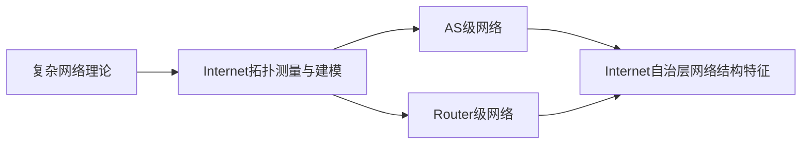

# Internet自治层网络的重要结构特征研究

## 1. 背景介绍

### 1.1 互联网的发展历程
#### 1.1.1 互联网的起源与早期发展
#### 1.1.2 互联网的商业化与普及
#### 1.1.3 互联网的全球化与未来趋势

### 1.2 自治系统(AS)的概念与作用
#### 1.2.1 自治系统的定义
#### 1.2.2 自治系统在互联网中的重要性
#### 1.2.3 自治系统的分类与特点

### 1.3 研究Internet自治层网络结构特征的意义
#### 1.3.1 优化网络拓扑结构,提升网络性能
#### 1.3.2 增强网络安全性与抗毁性
#### 1.3.3 为未来网络架构设计提供理论基础

## 2. 核心概念与联系

### 2.1 复杂网络理论
#### 2.1.1 复杂网络的定义与特点
#### 2.1.2 复杂网络的基本度量指标
#### 2.1.3 复杂网络的经典模型

### 2.2 Internet拓扑测量与建模
#### 2.2.1 Internet拓扑测量的主要方法
#### 2.2.2 Internet拓扑数据集介绍
#### 2.2.3 Internet拓扑建模的主要方法

### 2.3 AS级网络与Router级网络的关系
#### 2.3.1 AS级网络的定义与特点
#### 2.3.2 Router级网络的定义与特点
#### 2.3.3 两者之间的映射关系与相互影响

## 3. 核心算法原理具体操作步骤

### 3.1 网络拓扑特征参数计算
#### 3.1.1 度分布与度相关性计算
#### 3.1.2 聚类系数计算
#### 3.1.3 平均路径长度计算

### 3.2 社区发现算法
#### 3.2.1 模块度优化算法
#### 3.2.2 谱聚类算法
#### 3.2.3 标签传播算法

### 3.3 中心性分析方法
#### 3.3.1 度中心性计算
#### 3.3.2 紧密中心性计算
#### 3.3.3 中介中心性计算

## 4. 数学模型和公式详细讲解举例说明

### 4.1 幂律分布模型
#### 4.1.1 幂律分布的数学定义
$$ P(k) \sim k^{-\gamma} $$
其中$k$为节点度,$\gamma$为幂指数。
#### 4.1.2 幂律分布在AS级网络中的体现
#### 4.1.3 幂律分布对网络鲁棒性的影响

### 4.2 BA无标度网络模型
#### 4.2.1 BA模型的生长与优先连接机制
$$\prod_{i}^{t}=\frac{k_i}{\sum_{j}k_j}$$
其中$\prod_{i}^{t}$为在$t$时刻新节点与节点$i$相连的概率,$k_i$为节点$i$的度。
#### 4.2.2 BA模型生成网络的幂律度分布特性
#### 4.2.3 BA模型在AS级网络演化中的应用

### 4.3 模块度量化社区结构
#### 4.3.1 模块度的定义与计算公式
$$Q=\frac{1}{2m}\sum_{i,j}(A_{ij}-\frac{k_ik_j}{2m})\delta(c_i,c_j)$$
其中$m$为网络总连边数,$A_{ij}$为邻接矩阵元素,$k_i$为节点$i$的度,$c_i$为节点$i$所属社区,$\delta$为克罗内克delta函数。
#### 4.3.2 模块度值的意义与取值范围
#### 4.3.3 基于模块度优化的社区发现过程

## 5. 项目实践：代码实例和详细解释说明

### 5.1 使用Python分析AS级网络拓扑数据
#### 5.1.1 数据读取与预处理
#### 5.1.2 网络基本特征参数计算
#### 5.1.3 度分布拟合与可视化

### 5.2 使用NetworkX进行社区发现
#### 5.2.1 网络数据加载与图构建
#### 5.2.2 Louvain模块度优化算法实现
#### 5.2.3 社区划分结果分析与可视化

### 5.3 使用Gephi进行网络中心性分析
#### 5.3.1 Gephi软件简介与数据导入
#### 5.3.2 计算不同中心性指标
#### 5.3.3 中心节点识别与子图提取

## 6. 实际应用场景

### 6.1 网络优化与流量工程
#### 6.1.1 基于度分布特性的网络扩展策略
#### 6.1.2 考虑社区结构的流量调度方案
#### 6.1.3 中心节点的负载均衡与备份措施

### 6.2 网络安全与异常检测
#### 6.2.1 基于拓扑结构的网络脆弱性分析
#### 6.2.2 社区结构突变与网络异常的关联
#### 6.2.3 中心节点的攻击检测与防护

### 6.3 内容分发与信息传播
#### 6.3.1 利用度分布设计高效内容分发策略
#### 6.3.2 基于社区结构的个性化推荐
#### 6.3.3 中心节点在viral marketing中的应用

## 7. 工具和资源推荐

### 7.1 网络分析工具
#### 7.1.1 Python中的NetworkX, igraph, graph-tool等
#### 7.1.2 Gephi, Cytoscape等网络可视化软件
#### 7.1.3 Pajek, UCINET等社会网络分析工具

### 7.2 网络数据集资源
#### 7.2.1 CAIDA AS Relationship Dataset
#### 7.2.2 Route Views BGP数据
#### 7.2.3 Internet Topology Zoo

### 7.3 相关领域学习资料
#### 7.3.1 复杂网络理论经典教材与论文
#### 7.3.2 图论算法与社交网络分析课程
#### 7.3.3 网络科学研究机构与学术会议

## 8. 总结：未来发展趋势与挑战

### 8.1 Internet规模与复杂度的持续增长
#### 8.1.1 IPv6的广泛部署对网络拓扑的影响
#### 8.1.2 海量网络数据采集与处理技术亟待突破
#### 8.1.3 多层次、多粒度的网络表示与建模

### 8.2 新型网络架构与技术的出现
#### 8.2.1 软件定义网络(SDN)对网络拓扑的重塑
#### 8.2.2 内容中心网络(ICN)对传统互联模式的挑战
#### 8.2.3 卫星互联网等非地面网络的兴起

### 8.3 网络空间安全形势日益严峻
#### 8.3.1 日益频发的大规模网络攻击事件
#### 8.3.2 基于AI与大数据的网络异常检测
#### 8.3.3 主动防御下的网络韧性与自愈能力

## 9. 附录：常见问题与解答

### 9.1 AS级拓扑与Router级拓扑的异同？
AS级拓扑反映AS间的互联关系,粒度较粗;Router级拓扑反映Router间的互联,粒度更细。两者在度分布、平均路径长度等统计特性上存在一定差异,但整体上都呈现出小世界与幂律特性。

### 9.2 AS级网络的幂律度分布是如何形成的？
早期研究认为,网络的优先连接生长机制是导致幂律分布的主要原因。但近年来有学者提出,由于经济利益、地理位置、业务关系等多重因素的综合作用,AS间的互联更加复杂,不能简单地用BA模型来解释。

### 9.3 网络结构特征分析对现实有何指导意义？
掌握AS级网络的拓扑结构特征,有助于我们从全局视角审视当前互联网体系,理解其脆弱性与潜在风险,优化网络部署与资源调度,提升系统性能与服务质量。同时这也为新型网络架构的设计提供重要参考。

作者：禅与计算机程序设计艺术 / Zen and the Art of Computer Programming