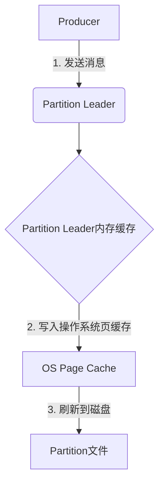
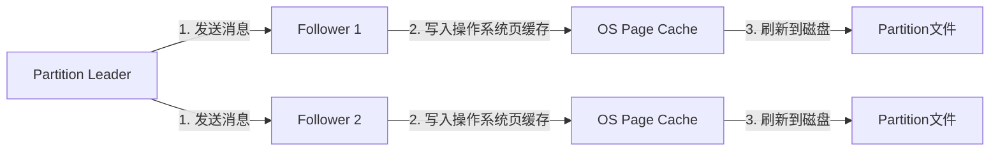

# Kafka存储机制：数据如何持久化-深入解析存储机制

## 1.背景介绍

Apache Kafka是一个分布式流处理平台,被广泛应用于大数据领域。它能够可靠地在系统或应用程序之间传递消息。作为一个分布式系统,Kafka需要持久化数据以确保容错性和可靠性。本文将深入探讨Kafka的存储机制,揭示数据是如何被持久化并保证高效访问的。

## 2.核心概念与联系

### 2.1 Topic和Partition

Kafka中的消息以Topic进行分类,一个Topic可以分为多个Partition。每个Partition中的消息是有序的,并通过offset进行寻址。

### 2.2 Broker和Cluster

Kafka集群由多个Broker(服务实例)组成,每个Broker可以存储部分或全部Partition。

### 2.3 Replication和Leader

为了容错,Kafka采用了Replication机制,每个Partition都有多个副本,其中一个作为Leader,其他作为Follower。所有的生产和消费操作都是通过Leader进行的。

## 3.核心算法原理具体操作步骤

### 3.1 写入流程



1. Producer向Partition的Leader发送消息
2. Leader先将消息存入内存缓存
3. 消息在内存缓存达到一定条件后,Leader将其写入操作系统的页缓存
4. 操作系统按照调度策略,将页缓存中的数据刷新到磁盘上的Partition文件

### 3.2 复制流程



1. Leader将写入内存的消息发送给所有Follower
2. Follower将消息写入操作系统的页缓存
3. 操作系统按照调度策略,将页缓存中的数据刷新到磁盘上的Partition文件

## 4.数学模型和公式详细讲解举例说明

### 4.1 写入吞吐量模型

Kafka的写入吞吐量与多个因素有关,包括网络带宽、磁盘吞吐量、文件系统效率等。我们可以建立一个简化的数学模型:

$$
吞吐量 = \min(\frac{网络带宽}{消息大小}, \frac{磁盘吞吐量}{消息大小}, \frac{文件系统效率}{消息大小})
$$

其中,网络带宽、磁盘吞吐量和文件系统效率都是系统的硬件限制。

例如,假设网络带宽为1Gb/s,磁盘吞吐量为100MB/s,文件系统效率为80%,消息大小为1KB。则写入吞吐量约为:

$$
吞吐量 = \min(\frac{1 \times 10^9\text{bit/s}}{1 \times 10^3 \times 8\text{bit}}, \frac{100 \times 10^6\text{B/s}}{1 \times 10^3\text{B}}, \frac{0.8}{1}) \approx 80,000\text{消息/秒}
$$

可见,在这种情况下,文件系统效率是吞吐量的瓶颈。

### 4.2 复制延迟模型

复制延迟指Leader将消息发送给所有Follower所需的时间。假设集群中有N个Broker,复制因子为R,则复制延迟可以用下式近似:

$$
复制延迟 \approx \frac{消息大小}{最小(\text{Broker到Broker带宽})} \times \frac{R-1}{N-1}
$$

例如,假设消息大小为1KB,最小Broker到Broker带宽为1Gb/s,复制因子R=3,集群中有6个Broker,则复制延迟约为:

$$
复制延迟 \approx \frac{1 \times 10^3 \times 8\text{bit}}{1 \times 10^9\text{bit/s}} \times \frac{3-1}{6-1} \approx 2.67\mu\text{s}
$$

## 5.项目实践：代码实例和详细解释说明

下面是一个使用Java编写的简单Kafka Producer示例:

```java
Properties props = new Properties();
props.put("bootstrap.servers", "broker1:9092,broker2:9092");
props.put("key.serializer", "org.apache.kafka.common.serialization.StringSerializer");
props.put("value.serializer", "org.apache.kafka.common.serialization.StringSerializer");

Producer<String, String> producer = new KafkaProducer<>(props);

for (int i = 0; i < 100; i++) {
    String message = "Message " + i;
    producer.send(new ProducerRecord<>("topic1", message));
}

producer.flush();
producer.close();
```

1. 首先设置Kafka Broker的地址和序列化器
2. 创建一个Producer实例
3. 使用循环发送100条消息到"topic1"
4. 调用flush()方法来确保所有消息都被发送
5. 最后关闭Producer

## 6.实际应用场景

Kafka的存储机制使其能够广泛应用于各种场景:

- 消息队列: Kafka可以作为分布式消息队列使用,确保消息可靠传递
- 日志收集: 通过Kafka收集分布式系统的日志,用于监控和故障排除
- 数据管道: Kafka可以作为数据管道,在不同系统之间传输数据
- 流处理: 利用Kafka的高吞吐特性进行实时流处理
- 事件源: Kafka可以作为事件源,记录系统的所有变更

## 7.工具和资源推荐

- Kafka Tool: 一个开源的Kafka监控和运维工具
- Kafka Manager: 一个功能丰富的Kafka集群管理工具
- Kafka Streams: Kafka自带的流处理库
- Confluent: 提供Kafka的商业支持和工具

## 8.总结:未来发展趋势与挑战

Kafka已经成为事件驱动架构和流处理领域的事实标准。未来,Kafka可能会在以下几个方面持续发展:

- 云原生支持: 更好地支持云环境和Kubernetes
- 性能优化: 提高吞吐量和降低延迟
- 安全增强: 加强数据加密和访问控制
- 流处理集成: 与更多流处理框架深度集成

同时,Kafka也面临一些挑战:

- 运维复杂性: 管理大规模Kafka集群的复杂性
- 数据治理: 如何对Kafka中的海量数据进行治理
- 资源效率: 提高资源利用率,降低成本

## 9.附录:常见问题与解答

1. Kafka是如何保证消息的顺序性的?

Kafka通过在单个Partition内维护消息的顺序来保证顺序性。同一个Partition内的消息是按照发送顺序被追加的,消费者也按照这个顺序消费消息。

2. Kafka是否支持事务?

从0.11版本开始,Kafka支持跨分区的事务。生产者可以将多个消息打包为一个原子批次,要么全部写入成功,要么全部失败。

3. Kafka的吞吐量瓶颈在哪里?

Kafka的吞吐量瓶颈主要有三个:网络带宽、磁盘吞吐量和文件系统效率。通过优化这三个方面可以提高Kafka的吞吐量。

作者: 禅与计算机程序设计艺术 / Zen and the Art of Computer Programming