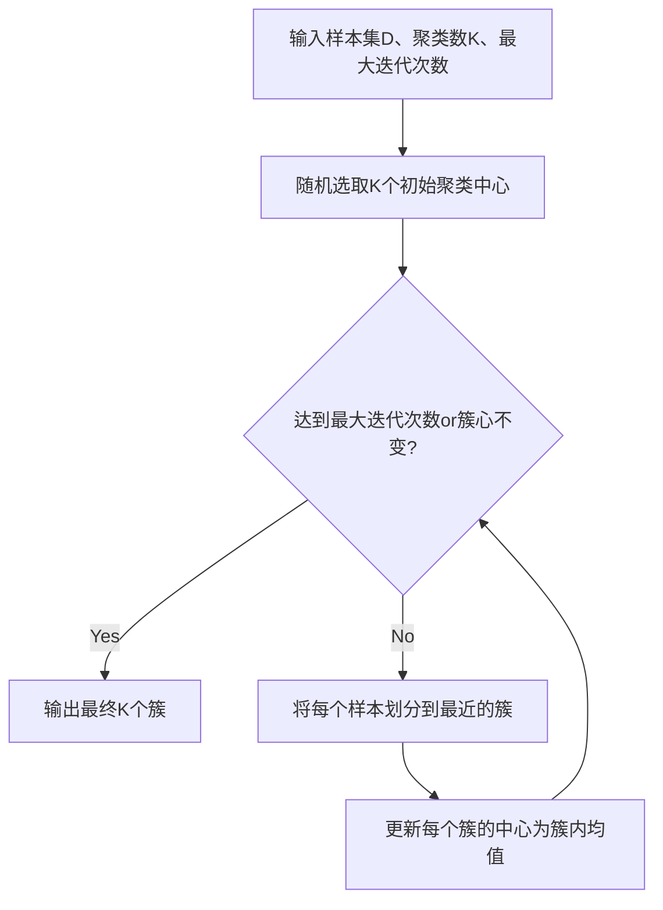

# K-均值聚类K-means原理与代码实例讲解

## 1. 背景介绍
### 1.1 聚类分析概述
#### 1.1.1 聚类的定义与目的
聚类分析是一种无监督学习方法,旨在将相似的对象归为一组,形成多个类别。聚类的目的是在保证类内相似度最大化的同时,也使得类间差异最大化。
#### 1.1.2 聚类的应用领域
聚类分析被广泛应用于数据挖掘、模式识别、图像分析、信息检索等领域。一些典型的应用包括:
- 客户细分:根据客户属性、购买行为等特征将客户划分为不同群体,实现精准营销。
- 文本聚类:对文本数据进行主题划分,方便信息组织与检索。
- 基因表达数据分析:对基因表达谱数据进行聚类,发现具有相似表达模式的基因。

### 1.2 K-means聚类算法
#### 1.2.1 K-means的起源与发展
K-means算法最早由MacQueen在1967年提出,是一种基于划分的聚类算法。后经Hartigan和Wong等人的不断改进,成为最流行的聚类算法之一。
#### 1.2.2 K-means的基本思想
K-means通过迭代的方式将数据划分为K个簇。其基本思想是:随机选取K个初始聚类中心,根据样本与各中心的距离将其划分到最近的簇。然后更新每个簇的中心,重复上述过程直至收敛。

## 2. 核心概念与联系
### 2.1 相似度度量
聚类的本质是将相似的样本聚合在一起,因此需要度量样本间的相似程度。常见的相似度度量包括:
- 欧氏距离:用于连续属性,表示两个样本各维度差值的平方和的平方根。
- 余弦相似度:用于文本等稀疏高维数据,表示两个向量夹角的余弦值。
- Jaccard相似系数:用于0-1属性,表示两个集合交集元素数与并集元素数的比值。

### 2.2 样本与簇心
K-means中的两个核心概念是样本和簇心:
- 样本:数据集中的每个实例,通常表示为一个特征向量。
- 簇心:每个簇的中心点,通常取该簇所有样本在各维度上的均值。

### 2.3 目标函数
K-means的优化目标是最小化所有样本与其所属簇心间距离的平方和,即:

$$
\min J=\sum_{i=1}^K\sum_{x\in C_i} ||x-\mu_i||^2
$$

其中$C_i$表示第$i$个簇,$\mu_i$为其簇心,$x$为簇内样本。通过迭代优化的方式求解上述目标函数。

## 3. 核心算法原理具体操作步骤
### 3.1 算法输入
- 样本集 $D=\{x_1,x_2,...,x_N\}, x_i \in R^n$
- 聚类数 $K$
- 最大迭代次数 $Max\_Iterations$

### 3.2 算法步骤
1. 随机选取$K$个样本作为初始聚类中心$\{\mu_1,\mu_2,...,\mu_K\}$
2. repeat
3.    将每个样本$x_i$划分到与其最近的簇$C_{j^*}$:
      $j^* = \arg \min_j ||x_i-\mu_j||^2$
4.    更新每个簇的中心$\mu_j$为簇内样本的均值:
      $\mu_j = \frac{1}{|C_j|} \sum_{x\in C_j} x$
5. until 达到最大迭代次数或簇心不再变化
6. 输出最终的$K$个簇$\{C_1,C_2,...,C_K\}$

### 3.3 算法流程图


## 4. 数学模型和公式详细讲解举例说明
### 4.1 样本间距离计算
假设有两个$n$维样本$x_i=(x_{i1},x_{i2},...,x_{in})$和$x_j=(x_{j1},x_{j2},...,x_{jn})$,其欧氏距离为:

$$
d(x_i,x_j)=\sqrt{\sum_{k=1}^n (x_{ik}-x_{jk})^2}
$$

例如,二维平面上的两点$(1,2)$和$(4,6)$间的欧氏距离为:$\sqrt{(1-4)^2+(2-6)^2}=5$。

### 4.2 簇心更新
假设簇$C_j$包含$m$个样本$\{x_1,x_2,...,x_m\}$,其簇心$\mu_j=(\mu_{j1},\mu_{j2},...,\mu_{jn})$更新公式为:

$$
\mu_{jk} = \frac{1}{m}\sum_{i=1}^m x_{ik}, k=1,2,...,n
$$

即簇心的各维度分量等于簇内所有样本在该维度上的均值。例如,对于二维簇$C=\{(1,2),(3,5),(2,3)\}$,其簇心为$(\frac{1+3+2}{3},\frac{2+5+3}{3})=(2,\frac{10}{3})$。

## 5. 项目实践:代码实例和详细解释说明
下面给出Python中使用K-means进行聚类的示例代码:

```python
from sklearn.cluster import KMeans
from sklearn.datasets import make_blobs

# 生成随机数据
X, _ = make_blobs(n_samples=100, centers=4, random_state=0)

# 构建K-means模型
kmeans = KMeans(n_clusters=4)
kmeans.fit(X)

# 获取聚类结果
labels = kmeans.labels_
centers = kmeans.cluster_centers_

# 输出结果
print("Cluster Labels:", labels)
print("Cluster Centers:", centers)
```

代码说明:
1. 首先从sklearn.cluster中导入KMeans类,用于构建K-means模型。
2. 使用make_blobs函数随机生成一个包含4个簇的二维数据集X。
3. 创建一个KMeans实例,设置聚类数n_clusters为4。
4. 调用fit方法对数据X进行聚类,模型会自动执行K-means算法步骤。
5. 通过labels_属性获取每个样本的簇标签,通过cluster_centers_属性获取最终的簇心。
6. 输出聚类结果,包括每个样本的簇标签和4个簇心的坐标。

## 6. 实际应用场景
K-means聚类在实际中有广泛的应用,下面列举几个典型场景:
### 6.1 客户细分
电商平台可以对用户的属性特征(如年龄、性别、消费水平等)进行聚类分析,将用户划分为不同的群体,实现个性化推荐和精准营销。
### 6.2 图像分割
对图像的像素点按照颜色、纹理等特征进行聚类,可以实现图像分割,即将图像划分为若干个区域,每个区域内的像素点具有相似的视觉属性。
### 6.3 社交网络社团发现
通过对社交网络中的用户进行聚类,可以发现具有相似兴趣爱好的用户社团,为用户推荐感兴趣的社团或好友。

## 7. 工具和资源推荐
### 7.1 常用数据挖掘工具
- Weka:基于Java的开源机器学习平台,提供了包括K-means在内的多种聚类算法实现。
- MATLAB:提供了丰富的聚类分析工具箱,如Statistics and Machine Learning Toolbox。
- Python:sklearn库中提供了K-means等常用聚类算法的高效实现。
### 7.2 相关学习资源
- 《数据挖掘:概念与技术》:经典的数据挖掘教材,对聚类分析有深入讲解。
- Andrew Ng的机器学习课程:Coursera上的免费课程,包含聚类分析的相关内容。
- scikit-learn官方文档:提供了K-means的API说明和使用示例。

## 8. 总结:未来发展趋势与挑战
### 8.1 算法改进方向
- 初始聚类中心的选择:K-means对初始聚类中心敏感,需要探索更好的初始化策略如K-means++。
- 聚类数K的确定:传统K-means需要预先指定聚类数,而在实际任务中K难以确定,需要研究自适应确定K的方法。
- 处理高维数据:对于高维数据,直接使用欧氏距离度量相似度可能带来维度灾难,需要引入降维等技术。
### 8.2 大数据场景下的聚类
互联网时代的海量数据对聚类算法提出了新的挑战,需要研究并行化、增量式的聚类算法,提高聚类效率和实时性。基于MapReduce、Spark等分布式计算框架实现的K-means改进算法将是大数据聚类的重要方向。

## 9. 附录:常见问题与解答
### 9.1 K-means如何选择初始聚类中心?
常见的做法是从数据集中随机选取K个样本作为初始聚类中心。为了减少随机性的影响,可以进行多次随机初始化,选择能得到最优目标函数值的初始中心。此外,K-means++等启发式方法能更好地选择初始聚类中心。
### 9.2 K-means能否发现非球形的簇?
K-means假设簇是球形的,即各向同性的高斯分布。对于非球形的簇如椭圆形,K-means的聚类效果较差。此时可以考虑其他聚类算法如高斯混合模型、谱聚类等。
### 9.3 K-means能否处理类别属性?
传统的K-means只能处理数值属性,对于类别属性需要进行特殊处理。常见的做法是将类别属性转化为哑变量(即0-1编码),再将其视为数值属性输入K-means算法。

作者:禅与计算机程序设计艺术 / Zen and the Art of Computer Programming