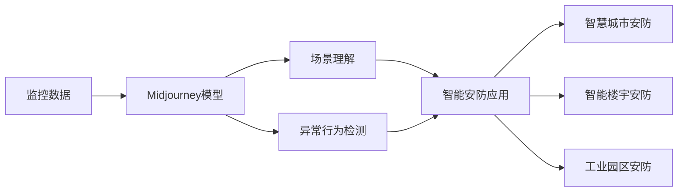

# Midjourney在智能安防系统中的应用案例

## 1. 背景介绍
### 1.1 人工智能在安防领域的应用现状
#### 1.1.1 智能视频监控
#### 1.1.2 人脸识别技术
#### 1.1.3 行为分析与异常检测
### 1.2 Midjourney的兴起与发展
#### 1.2.1 Midjourney的起源与特点
#### 1.2.2 Midjourney在人工智能领域的应用潜力
### 1.3 智能安防系统的发展趋势
#### 1.3.1 传统安防系统的局限性
#### 1.3.2 智能化与集成化的必然趋势

## 2. 核心概念与联系
### 2.1 Midjourney的核心原理
#### 2.1.1 扩散模型(Diffusion Models)
#### 2.1.2 对比语言-图像预训练(CLIP)
#### 2.1.3 Midjourney的训练数据与模型架构
### 2.2 智能安防系统的关键技术
#### 2.2.1 计算机视觉
#### 2.2.2 深度学习
#### 2.2.3 物联网与边缘计算
### 2.3 Midjourney与智能安防的结合点
#### 2.3.1 基于Midjourney的场景理解与预测
#### 2.3.2 Midjourney在异常行为检测中的应用
#### 2.3.3 Midjourney与传统安防技术的互补与融合

## 3. 核心算法原理与具体操作步骤
### 3.1 Midjourney的训练流程
#### 3.1.1 数据预处理与增强
#### 3.1.2 模型初始化与超参数设置
#### 3.1.3 训练过程与损失函数优化
### 3.2 Midjourney在智能安防中的部署
#### 3.2.1 模型压缩与加速
#### 3.2.2 边缘设备上的推理优化
#### 3.2.3 模型更新与在线学习
### 3.3 基于Midjourney的异常行为检测算法
#### 3.3.1 基于Midjourney的场景理解
#### 3.3.2 时空特征提取与融合
#### 3.3.3 异常行为判别与警报触发

## 4. 数学模型和公式详细讲解举例说明
### 4.1 扩散模型的数学原理
#### 4.1.1 前向过程：逐步添加高斯噪声
$$q(x_t|x_{t-1}) = \mathcal{N}(x_t; \sqrt{1-\beta_t} x_{t-1}, \beta_t \mathbf{I})$$
#### 4.1.2 后向过程：逐步去噪
$$p_\theta(x_{t-1}|x_t) = \mathcal{N}(x_{t-1}; \mu_\theta(x_t, t), \Sigma_\theta(x_t, t))$$
#### 4.1.3 训练目标：最小化变分下界
$$L_{vlb} = \mathbb{E}_{q(x_{0:T})} \left[ \log \frac{q(x_{1:T}|x_0)}{p_\theta(x_{0:T})} \right]$$
### 4.2 对比语言-图像预训练(CLIP)的数学原理
#### 4.2.1 图像编码器与文本编码器
$$I = E_I(x), T = E_T(y)$$
#### 4.2.2 对比学习目标函数
$$L_{clip} = -\frac{1}{N} \sum_{i=1}^N \log \frac{\exp(I_i \cdot T_i / \tau)}{\sum_{j=1}^N \exp(I_i \cdot T_j / \tau)}$$
### 4.3 异常行为检测的数学模型
#### 4.3.1 时空特征表示
$$f_t = F(x_t), f_s = G(f_{t-k:t})$$
#### 4.3.2 异常度量函数
$$a(f_s) = \frac{1}{K} \sum_{i=1}^K d(f_s, f_{s_i})$$
#### 4.3.3 异常阈值与警报触发
$$a(f_s) > \theta \Rightarrow \text{Anomaly Detected}$$

## 5. 项目实践：代码实例和详细解释说明
### 5.1 基于Midjourney的场景理解
```python
import torch
from midjourney import MidjourneyModel

model = MidjourneyModel.from_pretrained('midjourney-v4')

image = load_image('surveillance_scene.jpg')
prompt = "Describe the surveillance scene."

scene_description = model.generate(image, prompt)
print(scene_description)
```
详细解释：加载预训练的Midjourney模型，输入监控场景图像和描述场景的提示文本，模型生成对场景的自然语言描述，帮助理解场景内容。
### 5.2 基于Midjourney的异常行为检测
```python
import torch
from midjourney import MidjourneyModel
from anomaly_detector import AnomalyDetector

midjourney_model = MidjourneyModel.from_pretrained('midjourney-v4')
anomaly_detector = AnomalyDetector(midjourney_model)

video_frames = load_video_frames('surveillance_video.mp4')

for frame in video_frames:
    anomaly_score = anomaly_detector.detect(frame)
    if anomaly_score > threshold:
        trigger_alert()
```
详细解释：将Midjourney模型与异常检测器结合，对输入的监控视频逐帧进行异常行为检测。Midjourney模型提取每一帧的特征表示，异常检测器根据特征计算异常分数，超过设定阈值则触发警报。
### 5.3 Midjourney在智能安防系统中的部署优化
```python
import torch
from midjourney import MidjourneyModel

model = MidjourneyModel.from_pretrained('midjourney-v4')
model.to('cuda')  # 使用GPU加速

# 模型量化
quantized_model = torch.quantization.quantize_dynamic(
    model, {torch.nn.Linear}, dtype=torch.qint8
)

# 模型剪枝
pruned_model = torch.nn.utils.prune.random_unstructured(model, name="weight", amount=0.3)

# 部署优化后的模型
optimized_model = pruned_model.to('cpu')  # 部署到边缘设备
```
详细解释：为了在资源受限的边缘设备上高效部署Midjourney模型，可以采用一系列优化技术。首先使用GPU对模型进行加速，然后通过量化和剪枝减小模型体积，最后将优化后的模型部署到边缘设备上进行推理。

## 6. 实际应用场景
### 6.1 智慧城市安防
#### 6.1.1 公共区域监控
#### 6.1.2 交通违规检测
#### 6.1.3 人群密度估计与疏导
### 6.2 智能楼宇安防
#### 6.2.1 门禁系统与人员识别
#### 6.2.2 电梯厢内异常行为检测
#### 6.2.3 消防安全监测
### 6.3 工业园区安防
#### 6.3.1 周界入侵检测
#### 6.3.2 生产车间安全监控
#### 6.3.3 危险区域人员闯入预警

## 7. 工具和资源推荐
### 7.1 开源Midjourney实现
- Midjourney-pytorch: https://github.com/midjourney/midjourney-pytorch
- Midjourney-diffusion: https://github.com/midjourney/midjourney-diffusion
### 7.2 智能安防开发平台
- 海康威视开放平台: https://open.hikvision.com
- 大华开放平台: https://open.dahuatech.com
### 7.3 相关学习资源
- CS231n: 计算机视觉与深度学习: http://cs231n.stanford.edu
- PyTorch官方教程: https://pytorch.org/tutorials
- 智能安防论文集: https://www.computer.org/csdl/journals/tp

## 8. 总结：未来发展趋势与挑战
### 8.1 Midjourney在智能安防领域的发展前景
#### 8.1.1 与传统安防技术的深度融合
#### 8.1.2 推动行业智能化升级
#### 8.1.3 创造全新的应用场景与商业模式
### 8.2 技术挑战与研究方向
#### 8.2.1 模型轻量化与实时性优化
#### 8.2.2 数据隐私与安全
#### 8.2.3 跨场景与跨域适应性
### 8.3 社会伦理考量
#### 8.3.1 人工智能的可解释性与可控性
#### 8.3.2 公平性与非歧视性
#### 8.3.3 就业冲击与社会责任

## 9. 附录：常见问题与解答
### 9.1 Midjourney与传统CV方法相比有何优势？
Midjourney通过大规模多模态预训练，可以更好地理解和生成图像，在场景理解、异常检测等任务上表现出色。相比传统CV方法，Midjourney具有更强的泛化能力和鲁棒性。
### 9.2 如何平衡Midjourney模型的性能与效率？
可以通过模型压缩、加速等技术手段，在保证性能的同时提高模型的推理效率。同时，针对不同应用场景，可以适当调整模型规模与计算资源的配置。
### 9.3 智能安防系统如何保障数据隐私与安全？
需要从数据采集、传输、存储、使用等各个环节入手，采取数据脱敏、加密、访问控制等措施。同时，要建立健全的数据安全管理制度，加强员工培训与监督。



作者：禅与计算机程序设计艺术 / Zen and the Art of Computer Programming