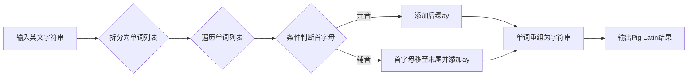

# Pig Latin脚本原理与代码实例讲解

## 1.背景介绍
### 1.1 Pig Latin的起源与发展
Pig Latin是一种英语语言游戏,起源于19世纪。它通过将英语单词的首字母移到单词末尾,并在末尾添加"ay"来创建一种新的"语言"。Pig Latin最初是儿童之间流行的游戏,后来逐渐被广泛使用,甚至出现在流行文化中。

### 1.2 Pig Latin的应用场景
- 儿童语言游戏:Pig Latin最初就是作为儿童游戏出现的,通过改变单词发音,增加了趣味性。
- 保密通信:有时人们会使用Pig Latin来进行"加密"通信,防止旁人轻易理解。
- 自然语言处理:Pig Latin也被用于自然语言处理领域,用于研究词形变化和语言游戏等。
- 流行文化:Pig Latin在影视、文学等流行文化中时有出现,展现了其广泛流传度。

### 1.3 Pig Latin脚本的意义
编写Pig Latin脚本有助于加深对字符串操作和算法的理解。通过将Pig Latin翻译规则转化为代码逻辑,能够锻炼编程思维和实现能力。同时,这也展现了计算机程序在处理类似语言游戏方面的应用前景。

## 2.核心概念与联系
### 2.1 字符串操作
Pig Latin的实现需要大量的字符串操作,主要涉及以下几个方面:

- 字符串拆分:将字符串按照空格拆分成单词列表。
- 字符串切片:提取单词的首字母、其余部分等。
- 字符串拼接:将字母、后缀等元素重新组合成Pig Latin单词。

### 2.2 条件判断
由于Pig Latin的翻译规则需要根据单词的首字母是否为元音来区分,因此需要使用条件判断语句进行检查和分支处理。

### 2.3 循环遍历
对于多个单词组成的句子,需要通过循环遍历的方式,逐个处理每个单词,将其转化为Pig Latin形式。

### 2.4 核心概念间的联系
下图展示了Pig Latin翻译过程中涉及的核心概念以及它们之间的联系:



## 3.核心算法原理具体操作步骤
Pig Latin的核心算法可以分为以下几个步骤:

1. 将输入的英文字符串按照空格拆分为单词列表。
2. 遍历单词列表中的每个单词:
   - 判断单词的首字母是否为元音(a, e, i, o, u)。
   - 如果首字母是元音,直接在单词末尾添加"ay"。
   - 如果首字母是辅音,将首字母移动到单词末尾,再添加"ay"。
3. 将转化后的单词重新组合成Pig Latin字符串,单词之间用空格分隔。
4. 输出转化后的Pig Latin结果。

## 4.数学模型和公式详细讲解举例说明
Pig Latin的实现主要是基于字符串操作和条件判断,并没有涉及复杂的数学模型和公式。下面通过一个简单的例子来说明Pig Latin的转化过程:

假设输入字符串为:"hello world"

1. 拆分为单词列表:["hello", "world"]
2. 遍历单词列表:
   - 对于单词"hello",首字母为辅音"h",将其移至末尾,添加"ay",得到"ellohay"。
   - 对于单词"world",首字母为辅音"w",将其移至末尾,添加"ay",得到"orldway"。
3. 重组为Pig Latin字符串:"ellohay orldway"
4. 输出结果:"ellohay orldway"

整个过程可以用以下公式表示:

$PigLatin(word) = \begin{cases}
word + "ay", & \text{if } word[0] \in \{"a", "e", "i", "o", "u"\} \\
word[1:] + word[0] + "ay", & \text{otherwise}
\end{cases}$

其中,$word$表示输入的单词,$word[0]$表示单词的首字母,$word[1:]$表示单词的其余部分。

## 5.项目实践:代码实例和详细解释说明
下面是使用Python实现Pig Latin翻译的代码示例:

```python
def pig_latin(word):
    vowels = ['a', 'e', 'i', 'o', 'u']
    if word[0].lower() in vowels:
        return word + 'ay'
    else:
        return word[1:] + word[0] + 'ay'

def translate(sentence):
    words = sentence.split()
    pig_latin_words = [pig_latin(word) for word in words]
    return ' '.join(pig_latin_words)

# 测试代码
sentence = "hello world"
print(translate(sentence))  # 输出: ellohay orldway
```

代码解释:

- `pig_latin`函数接受一个单词作为参数,判断单词首字母是否为元音,根据不同情况返回转化后的Pig Latin单词。
- `translate`函数接受一个完整的句子作为参数,将句子拆分为单词列表,然后使用列表推导式对每个单词调用`pig_latin`函数进行转化,最后将转化后的单词重新组合为Pig Latin句子。
- 在测试代码中,我们输入了一个示例句子"hello world",调用`translate`函数进行翻译,得到了预期的Pig Latin结果"ellohay orldway"。

通过这个简单的代码示例,我们实现了将英文句子转化为Pig Latin的功能。你可以尝试输入不同的句子,观察转化结果。

## 6.实际应用场景
Pig Latin作为一种语言游戏,其实际应用场景主要体现在以下几个方面:

### 6.1 儿童语言教育
Pig Latin可以作为一种有趣的语言游戏,帮助儿童理解单词结构和发音规则。通过将单词转化为Pig Latin,儿童可以更好地认识单词的组成部分,提高语言敏感性和创造力。

### 6.2 自然语言处理研究
Pig Latin作为一种简单的词形变化规则,可以用于研究自然语言处理中的词形还原、词干提取等问题。通过分析Pig Latin的转化过程,可以探索语言游戏和词形变化的一般规律。

### 6.3 密码学与信息隐藏
Pig Latin有时被用作一种简单的"加密"方式,通过将单词转化为Pig Latin,可以在一定程度上隐藏原始信息。虽然这种方法并不安全,但它展示了语言变换在信息隐藏方面的潜在应用。

### 6.4 娱乐与社交
Pig Latin作为一种有趣的语言游戏,可以在社交场合增添乐趣。人们可以相互挑战,用Pig Latin进行对话,增进互动和友谊。

## 7.工具和资源推荐
如果你对Pig Latin和相关话题感兴趣,以下是一些有用的工具和资源:

- Pig Latin Translator:一个在线的Pig Latin翻译器,可以快速将英文转化为Pig Latin。
- Pig Latin Wikipedia:维基百科关于Pig Latin的详细介绍,包括其历史、规则和变体。
- Natural Language Toolkit (NLTK):一个强大的Python自然语言处理库,提供了丰富的语言处理工具和资源。
- "The Art of Readable Code":一本关于编写可读代码的优秀书籍,对于提高代码质量和可维护性很有帮助。

## 8.总结:未来发展趋势与挑战
Pig Latin作为一种简单的语言游戏,其未来发展趋势主要体现在教育和娱乐领域。随着人们对创新性语言学习方法的需求不断增长,Pig Latin可以作为一种有趣的教学工具,帮助学生理解语言结构和规则。

同时,Pig Latin也面临一些挑战。随着自然语言处理技术的不断发展,更复杂、更智能的语言游戏和变换方法可能会出现。Pig Latin需要与时俱进,结合新技术和创意,才能保持其独特的魅力。

总的来说,Pig Latin作为一种简单而有趣的语言游戏,其价值不仅仅在于娱乐,更在于启发人们对语言的好奇心和探索精神。通过学习Pig Latin,我们可以更好地理解语言的奥秘,激发创新思维,并在编程实践中锻炼问题解决能力。

## 9.附录:常见问题与解答
1. Q:Pig Latin的基本规则是什么?
   A:Pig Latin的基本规则如下:
   - 如果单词以元音开头,直接在单词末尾添加"ay"。
   - 如果单词以辅音开头,将首字母移到单词末尾,再添加"ay"。

2. Q:Pig Latin是否区分大小写?
   A:传统的Pig Latin游戏通常不区分大小写。但在实际编程实现中,可以根据需求决定是否保留单词的大小写。

3. Q:Pig Latin能否处理标点符号?
   A:原始的Pig Latin游戏主要针对单词进行转化,并未对标点符号做特殊处理。在编程实现中,可以根据需求决定是否保留或特殊处理标点符号。

4. Q:Pig Latin转化后的单词是否还有意义?
   A:Pig Latin转化后的单词通常没有实际意义,其主要目的是作为一种有趣的语言游戏,而不是用于正式交流。

5. Q:学习Pig Latin有什么好处?
   A:学习Pig Latin可以帮助提高语言敏感性,理解单词结构和发音规则。同时,通过将Pig Latin规则转化为代码,还能锻炼编程思维和问题解决能力。

作者:禅与计算机程序设计艺术 / Zen and the Art of Computer Programming