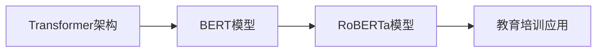

# RoBERTa在教育培训中的应用:智慧教育的新引擎

## 1. 背景介绍
### 1.1 人工智能在教育领域的发展现状
#### 1.1.1 智慧教育的兴起
#### 1.1.2 AI技术在教育中的应用现状
#### 1.1.3 当前智慧教育面临的挑战

### 1.2 RoBERTa模型简介
#### 1.2.1 RoBERTa的起源与发展
#### 1.2.2 RoBERTa的技术特点
#### 1.2.3 RoBERTa在NLP领域的应用现状

## 2. 核心概念与联系
### 2.1 Transformer架构
#### 2.1.1 Transformer的提出背景
#### 2.1.2 Transformer的核心思想
#### 2.1.3 Transformer的技术优势

### 2.2 BERT模型
#### 2.2.1 BERT的网络结构
#### 2.2.2 BERT的预训练任务
#### 2.2.3 BERT的局限性

### 2.3 RoBERTa对BERT的改进
#### 2.3.1 动态Masking
#### 2.3.2 去除NSP任务
#### 2.3.3 更大的Batch Size和训练步数

### 2.4 RoBERTa与教育培训的结合点
#### 2.4.1 自然语言处理在教育中的应用场景
#### 2.4.2 RoBERTa在知识表示与推理方面的优势
#### 2.4.3 RoBERTa赋能智慧教育的潜力



## 3. 核心算法原理具体操作步骤
### 3.1 RoBERTa的预训练
#### 3.1.1 语料库的选择与处理
#### 3.1.2 Byte Pair Encoding (BPE)分词
#### 3.1.3 动态Masking策略

### 3.2 RoBERTa的微调
#### 3.2.1 下游任务的数据准备
#### 3.2.2 微调的超参数设置
#### 3.2.3 微调的训练过程

### 3.3 RoBERTa在教育领域的应用流程
#### 3.3.1 教育数据的收集与标注
#### 3.3.2 基于RoBERTa的知识表示
#### 3.3.3 RoBERTa在教育任务中的推理与预测

## 4. 数学模型和公式详细讲解举例说明
### 4.1 Transformer的数学原理
#### 4.1.1 Self-Attention机制
$Attention(Q,K,V) = softmax(\frac{QK^T}{\sqrt{d_k}})V$
#### 4.1.2 Multi-Head Attention
$MultiHead(Q,K,V) = Concat(head_1,...,head_h)W^O$
#### 4.1.3 Position-wise Feed-Forward Networks
$FFN(x) = max(0,xW_1+b_1)W_2+b_2$

### 4.2 BERT的数学原理
#### 4.2.1 Masked Language Model (MLM)
$p(w_i|w_{1:i-1},w_{i+1:n}) = softmax(h_iW_e+b_e)$
#### 4.2.2 Next Sentence Prediction (NSP)
$p(IsNext|s_1,s_2) = sigmoid(h_{cls}W_{nsp}+b_{nsp})$

### 4.3 RoBERTa的数学原理
#### 4.3.1 动态Masking的数学表示
$p(w_i|w_{1:i-1},w_{i+1:n}) = softmax(h_iW_e+b_e)$
#### 4.3.2 更大Batch Size的数学影响
$\theta_{t+1} = \theta_t - \eta \cdot \frac{1}{|B|} \cdot \sum_{i \in B} \nabla_{\theta} \mathcal{L}(\theta,x_i,y_i)$

## 5. 项目实践：代码实例和详细解释说明
### 5.1 使用RoBERTa进行文本分类
#### 5.1.1 数据准备与预处理
```python
from datasets import load_dataset

dataset = load_dataset('glue', 'sst2')
```
#### 5.1.2 加载预训练的RoBERTa模型
```python
from transformers import RobertaTokenizer, RobertaForSequenceClassification

tokenizer = RobertaTokenizer.from_pretrained('roberta-base')
model = RobertaForSequenceClassification.from_pretrained('roberta-base')
```
#### 5.1.3 微调与训练
```python
from transformers import TrainingArguments, Trainer

training_args = TrainingArguments(
    output_dir='./results',
    num_train_epochs=3,
    per_device_train_batch_size=16,
    per_device_eval_batch_size=64,
    warmup_steps=500,
    weight_decay=0.01,
    logging_dir='./logs',
)

trainer = Trainer(
    model=model,
    args=training_args,
    train_dataset=dataset['train'],
    eval_dataset=dataset['validation']
)

trainer.train()
```

### 5.2 使用RoBERTa进行阅读理解
#### 5.2.1 数据准备与预处理
```python
from datasets import load_dataset

dataset = load_dataset('squad')
```
#### 5.2.2 加载预训练的RoBERTa模型
```python
from transformers import RobertaTokenizer, RobertaForQuestionAnswering

tokenizer = RobertaTokenizer.from_pretrained('roberta-base')
model = RobertaForQuestionAnswering.from_pretrained('roberta-base')
```
#### 5.2.3 微调与训练
```python
from transformers import TrainingArguments, Trainer

training_args = TrainingArguments(
    output_dir='./results',
    num_train_epochs=2,
    per_device_train_batch_size=12,
    per_device_eval_batch_size=64,
    warmup_steps=500,
    weight_decay=0.01,
    logging_dir='./logs',
)

trainer = Trainer(
    model=model,
    args=training_args,
    train_dataset=dataset['train'],
    eval_dataset=dataset['validation']
)

trainer.train()
```

## 6. 实际应用场景
### 6.1 个性化学习路径推荐
#### 6.1.1 基于RoBERTa的学生画像构建
#### 6.1.2 个性化学习资源匹配算法
#### 6.1.3 学习路径的动态优化

### 6.2 智能作业批改与反馈
#### 6.2.1 基于RoBERTa的作业自动评分
#### 6.2.2 学生薄弱知识点诊断
#### 6.2.3 个性化学习反馈生成

### 6.3 教育智能助理
#### 6.3.1 基于RoBERTa的问答系统
#### 6.3.2 教育知识图谱的构建
#### 6.3.3 多轮对话与知识推理

## 7. 工具和资源推荐
### 7.1 RoBERTa的开源实现
#### 7.1.1 Transformers库
#### 7.1.2 Fairseq工具包
#### 7.1.3 Hugging Face社区

### 7.2 教育领域的数据集
#### 7.2.1 RACE阅读理解数据集
#### 7.2.2 EdNet教育知识图谱
#### 7.2.3 NAEP学生作答数据集

### 7.3 相关论文与资源
#### 7.3.1 RoBERTa论文解读
#### 7.3.2 教育人工智能相关综述
#### 7.3.3 教育NLP研究前沿动态

## 8. 总结：未来发展趋势与挑战
### 8.1 RoBERTa在教育领域的发展前景
#### 8.1.1 个性化自适应学习
#### 8.1.2 智能教学辅助系统
#### 8.1.3 教育大数据分析

### 8.2 RoBERTa面临的技术挑战
#### 8.2.1 模型的解释性与可解释性
#### 8.2.2 数据隐私与安全问题
#### 8.2.3 模型的公平性与偏见问题

### 8.3 未来研究方向展望
#### 8.3.1 教育领域特定的预训练模型
#### 8.3.2 多模态教育智能系统
#### 8.3.3 终身学习与知识增量学习

## 9. 附录：常见问题与解答
### 9.1 RoBERTa与BERT的区别是什么？
### 9.2 RoBERTa在教育领域应用的优势有哪些？
### 9.3 如何利用RoBERTa构建个性化学习系统？
### 9.4 RoBERTa在教育公平方面有哪些潜在风险？
### 9.5 未来教育人工智能的发展趋势如何？

作者：禅与计算机程序设计艺术 / Zen and the Art of Computer Programming