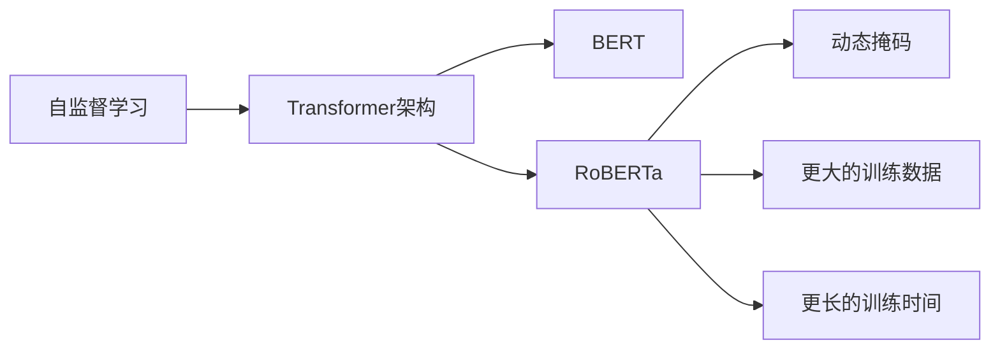

# RoBERTa的未来展望:更大、更强、更通用

## 1.背景介绍
### 1.1 自然语言处理的发展历程
#### 1.1.1 早期的规则和统计方法
#### 1.1.2 深度学习的兴起
#### 1.1.3 Transformer架构的革命

### 1.2 预训练语言模型的崛起
#### 1.2.1 BERT的开创性工作
#### 1.2.2 BERT的局限性
#### 1.2.3 RoBERTa的诞生

### 1.3 RoBERTa的优势
#### 1.3.1 更大的训练数据
#### 1.3.2 更长的训练时间
#### 1.3.3 改进的训练方法

## 2.核心概念与联系
### 2.1 自监督学习
#### 2.1.1 定义与原理
#### 2.1.2 在NLP中的应用
#### 2.1.3 与RoBERTa的关系

### 2.2 Transformer架构
#### 2.2.1 自注意力机制
#### 2.2.2 编码器-解码器结构
#### 2.2.3 在RoBERTa中的应用

### 2.3 动态掩码
#### 2.3.1 传统静态掩码的局限
#### 2.3.2 动态掩码的优势
#### 2.3.3 在RoBERTa训练中的实现

### 2.4 RoBERTa与BERT的异同
#### 2.4.1 架构上的相似性
#### 2.4.2 训练方法的差异
#### 2.4.3 性能表现的比较

## 3.核心算法原理具体操作步骤
### 3.1 预训练阶段
#### 3.1.1 数据准备与预处理
#### 3.1.2 动态掩码的实现
#### 3.1.3 Next Sentence Prediction任务的移除
#### 3.1.4 训练过程与优化策略

### 3.2 微调阶段
#### 3.2.1 下游任务的数据准备
#### 3.2.2 模型架构的调整
#### 3.2.3 微调过程与超参数选择
#### 3.2.4 模型评估与结果分析

### 3.3 推理阶段
#### 3.3.1 模型部署与加速
#### 3.3.2 输入数据的处理
#### 3.3.3 输出结果的后处理
#### 3.3.4 实时推理的挑战与优化

## 4.数学模型和公式详细讲解举例说明
### 4.1 Transformer的数学表示
#### 4.1.1 自注意力机制的数学推导
$Attention(Q,K,V) = softmax(\frac{QK^T}{\sqrt{d_k}})V$
#### 4.1.2 多头注意力的数学表示
$MultiHead(Q,K,V) = Concat(head_1,...,head_h)W^O$
#### 4.1.3 前馈神经网络的数学表示
$FFN(x) = max(0, xW_1 + b_1)W_2 + b_2$

### 4.2 RoBERTa的损失函数
#### 4.2.1 掩码语言模型的损失函数
$L_{MLM}(\theta) = -\sum_{i=1}^{n}log P(w_i|w_{/i},\theta)$
#### 4.2.2 动态掩码的数学表示
$m_t \sim Bernoulli(p)$
#### 4.2.3 总损失函数的构建
$L(\theta) = L_{MLM}(\theta)$

### 4.3 优化算法
#### 4.3.1 AdamW优化器
$m_t = \beta_1 m_{t-1} + (1 - \beta_1) g_t$
$v_t = \beta_2 v_{t-1} + (1 - \beta_2) g_t^2$
$\hat{m}_t = \frac{m_t}{1 - \beta_1^t}$
$\hat{v}_t = \frac{v_t}{1 - \beta_2^t}$
$\theta_t = \theta_{t-1} - \frac{\eta}{\sqrt{\hat{v}_t} + \epsilon} \hat{m}_t$
#### 4.3.2 学习率调度策略
$lrate = d_{model}^{-0.5} · min(step_num^{-0.5}, step_num · warmup_steps^{-1.5})$
#### 4.3.3 梯度裁剪与正则化
$g_t = \nabla_\theta L(\theta)$
$\hat{g}_t = \frac{g_t}{max(1, \frac{||g_t||_2}{clip_norm})}$
$\theta_t = \theta_{t-1} - \eta \hat{g}_t$

## 5.项目实践：代码实例和详细解释说明
### 5.1 数据准备
#### 5.1.1 数据集的选择与下载
#### 5.1.2 数据清洗与预处理
#### 5.1.3 数据格式转换与存储

### 5.2 模型构建
#### 5.2.1 RoBERTa模型的代码实现
#### 5.2.2 动态掩码的代码实现
#### 5.2.3 模型参数的初始化

### 5.3 模型训练
#### 5.3.1 训练数据的加载与批处理
#### 5.3.2 训练循环的代码实现
#### 5.3.3 损失函数与优化器的设置
#### 5.3.4 模型保存与断点续训

### 5.4 模型评估
#### 5.4.1 评估数据集的准备
#### 5.4.2 评估指标的选择与计算
#### 5.4.3 评估结果的可视化与分析

### 5.5 模型部署
#### 5.5.1 模型导出与转换
#### 5.5.2 推理引擎的选择与优化
#### 5.5.3 Web服务的搭建与API设计
#### 5.5.4 推理性能的评测与优化

## 6.实际应用场景
### 6.1 情感分析
#### 6.1.1 应用背景与挑战
#### 6.1.2 RoBERTa在情感分析中的优势
#### 6.1.3 实际案例与效果展示

### 6.2 问答系统
#### 6.2.1 应用背景与挑战
#### 6.2.2 RoBERTa在问答系统中的优势
#### 6.2.3 实际案例与效果展示

### 6.3 文本分类
#### 6.3.1 应用背景与挑战
#### 6.3.2 RoBERTa在文本分类中的优势
#### 6.3.3 实际案例与效果展示

### 6.4 命名实体识别
#### 6.4.1 应用背景与挑战
#### 6.4.2 RoBERTa在命名实体识别中的优势
#### 6.4.3 实际案例与效果展示

## 7.工具和资源推荐
### 7.1 开源实现
#### 7.1.1 Hugging Face Transformers库
#### 7.1.2 Fairseq工具包
#### 7.1.3 Google Research的RoBERTa实现

### 7.2 预训练模型
#### 7.2.1 RoBERTa-base与RoBERTa-large
#### 7.2.2 RoBERTa-wwm与RoBERTa-wwm-ext
#### 7.2.3 多语言RoBERTa模型

### 7.3 数据集资源
#### 7.3.1 GLUE基准测试
#### 7.3.2 SQuAD问答数据集
#### 7.3.3 MultiNLI自然语言推理数据集

### 7.4 学习资料
#### 7.4.1 RoBERTa论文解读
#### 7.4.2 RoBERTa源码分析
#### 7.4.3 相关博客与教程

## 8.总结：未来发展趋势与挑战
### 8.1 模型的进一步优化
#### 8.1.1 更大规模的预训练
#### 8.1.2 更高效的训练方法
#### 8.1.3 更强大的模型架构

### 8.2 多模态学习的融合
#### 8.2.1 文本-图像的跨模态表示学习
#### 8.2.2 文本-语音的跨模态表示学习
#### 8.2.3 多模态预训练模型的探索

### 8.3 知识增强的语言模型
#### 8.3.1 结构化知识的融入
#### 8.3.2 常识推理能力的提升
#### 8.3.3 知识图谱与语言模型的结合

### 8.4 低资源场景下的应用
#### 8.4.1 少样本学习的探索
#### 8.4.2 跨语言迁移学习的研究
#### 8.4.3 无监督领域自适应的尝试

## 9.附录：常见问题与解答
### 9.1 RoBERTa与BERT的区别是什么？
### 9.2 RoBERTa能否支持中文等其他语言？
### 9.3 RoBERTa在实际应用中需要注意哪些问题？
### 9.4 如何高效地微调RoBERTa模型？
### 9.5 RoBERTa的推理速度如何优化？

作者：禅与计算机程序设计艺术 / Zen and the Art of Computer Programming