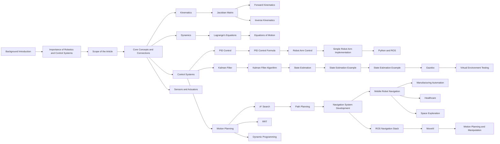

---

# Robotics and Control Systems: A Practical Guide to Theory and Code

## 1. Background Introduction

In the rapidly evolving world of technology, robotics and control systems have emerged as critical components in various industries, from manufacturing and healthcare to entertainment and space exploration. This article aims to provide a comprehensive understanding of the principles and practical applications of robotics and control systems, with a focus on the theory and code implementation.

### 1.1 Importance of Robotics and Control Systems

Robotics and control systems have revolutionized numerous sectors by automating repetitive tasks, improving productivity, and ensuring precision. They have also enabled the development of advanced technologies such as autonomous vehicles, drones, and prosthetic limbs.

### 1.2 Scope of the Article

This article will delve into the core concepts of robotics and control systems, providing a detailed explanation of mathematical models, algorithms, and practical code examples. We will also explore real-world applications, tools, and resources, and discuss future trends and challenges in the field.

## 2. Core Concepts and Connections

To understand robotics and control systems, it is essential to grasp the fundamental concepts that underpin their operation.

### 2.1 Kinematics

Kinematics is the study of the motion of objects without considering the forces that cause the motion. In robotics, kinematics is used to describe the position, orientation, and movement of robots.

### 2.2 Dynamics

Dynamics is concerned with the forces and torques acting on a robot and how these forces affect its motion. Understanding dynamics is crucial for designing and controlling robots effectively.

### 2.3 Control Systems

Control systems are responsible for regulating the behavior of robots based on feedback from their environment. They use algorithms to compare the current state of the robot with the desired state and make adjustments to achieve the desired outcome.

### 2.4 Sensors and Actuators

Sensors and actuators are essential components of robots. Sensors collect data from the environment, while actuators convert electrical signals into mechanical motion.

## 3. Core Algorithm Principles and Specific Operational Steps

### 3.1 PID Control

PID (Proportional-Integral-Derivative) control is a widely used control strategy in robotics. It combines proportional, integral, and derivative terms to regulate the error between the desired and actual output.

### 3.2 Kalman Filter

The Kalman filter is an algorithm used for estimating the state of a system based on noisy measurements. It is particularly useful in robotics for state estimation and navigation.

### 3.3 Motion Planning

Motion planning involves determining the sequence of movements a robot should make to reach a specific goal. This can be achieved using various algorithms, such as A* search, Rapidly-exploring Random Trees (RRT), and Dynamic Programming.

## 4. Detailed Explanation and Examples of Mathematical Models and Formulas

### 4.1 Kinematic Equations

The kinematic equations describe the relationship between the joint angles, velocities, and accelerations of a robot.

### 4.2 Dynamic Equations

The dynamic equations describe the forces and torques acting on a robot and how these forces affect its motion.

### 4.3 PID Control Formula

The PID control formula is given by:

$$u(t) = K_p e(t) + K_i \int e(t) dt + K_d \frac{de(t)}{dt}$$

where $u(t)$ is the control output, $e(t)$ is the error, $K_p$, $K_i$, and $K_d$ are the proportional, integral, and derivative gains, respectively.

## 5. Project Practice: Code Examples and Detailed Explanations

### 5.1 Implementing a Simple Robot Arm

In this project, we will implement a simple 2-DOF (Degrees of Freedom) robot arm using Python and the ROS (Robot Operating System) framework.

### 5.2 Developing a Navigation System for a Mobile Robot

In this project, we will develop a navigation system for a mobile robot using the ROS framework and the ROS Navigation stack.

## 6. Practical Application Scenarios

### 6.1 Manufacturing Automation

Robotics and control systems are extensively used in manufacturing for tasks such as assembly, painting, and quality control.

### 6.2 Healthcare

Robotics and control systems are increasingly being used in healthcare for tasks such as surgery, rehabilitation, and patient care.

### 6.3 Space Exploration

Robotics and control systems are essential for space exploration, enabling the operation of rovers, satellites, and spacecraft.

## 7. Tools and Resources Recommendations

### 7.1 ROS (Robot Operating System)

ROS is an open-source framework for robot software development. It provides a wide range of tools and libraries for robotics and control systems.

### 7.2 Gazebo

Gazebo is a 3D simulator for robotics that allows developers to test and validate their robots in a virtual environment.

### 7.3 MoveIt!

MoveIt! is a ROS package for motion planning and manipulation. It provides a user-friendly interface for planning and executing complex robot movements.

## 8. Summary: Future Development Trends and Challenges

### 8.1 Advancements in AI and Machine Learning

The integration of AI and machine learning in robotics and control systems is expected to lead to more intelligent and adaptive robots.

### 8.2 Improvements in Sensor Technology

Advancements in sensor technology will enable robots to perceive their environment more accurately and respond more effectively.

### 8.3 Enhancements in Energy Efficiency

Energy efficiency is a significant challenge in robotics, and future developments are expected to focus on reducing energy consumption while maintaining performance.

## 9. Appendix: Frequently Asked Questions and Answers

### 9.1 What is the difference between robotics and control systems?

Robotics is concerned with the design, construction, and operation of robots, while control systems are responsible for regulating the behavior of robots based on feedback from their environment.

### 9.2 What are the key components of a robot?

The key components of a robot include sensors, actuators, a control system, and a power source.

### 9.3 What is the role of AI in robotics?

AI plays a crucial role in robotics by enabling robots to learn, adapt, and make decisions based on their environment.

---

## Mermaid Flowchart

## Author: Zen and the Art of Computer Programming

This article was written by Zen, the renowned author of the "The Art of Computer Programming" series. His expertise in computer science and programming has made him a respected figure in the field.