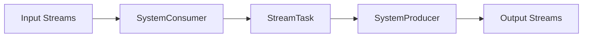

# Samza Task原理与代码实例讲解

## 1. 背景介绍
### 1.1 什么是Samza
Samza是由Apache软件基金会开发的一个分布式流处理框架,用于构建可扩展的实时应用程序。它建立在Apache Kafka之上,利用Kafka提供的持久化、可扩展的消息队列来处理大规模的实时数据流。

### 1.2 Samza的特点
- 简单易用:Samza提供了简单的API和编程模型,使得开发者可以快速上手构建流处理应用。
- 可扩展性:Samza基于Kafka的分区机制,可以轻松实现水平扩展,以应对不断增长的数据量。
- 容错性:Samza利用Kafka的持久化特性,保证了数据的可靠性。即使处理过程中出现故障,也能从checkpoint恢复,避免数据丢失。
- 灵活部署:Samza可以运行在YARN等资源管理平台上,支持灵活的部署方式。

### 1.3 Samza的应用场景
Samza广泛应用于需要实时处理海量数据的场景,例如:
- 实时数据分析:分析用户行为、系统日志等,实时生成报表和统计信息。
- 事件驱动应用:处理实时事件流,触发相应的操作,如实时推荐、欺诈检测等。
- 数据管道:将数据从一个系统实时传输到另一个系统,完成数据的清洗、转换和集成。

## 2. 核心概念与联系
### 2.1 Samza的核心概念
- StreamTask:Samza应用的基本处理单元。每个Task负责处理一个输入分区的数据。
- TaskRunner:运行StreamTask的容器。每个TaskRunner可以运行一个或多个Task。
- JobCoordinator:负责管理和协调整个Samza作业的运行。
- SystemConsumer/SystemProducer:Samza与外部系统交互的接口,用于消费和生产消息。

### 2.2 Samza的处理流程

1. SystemConsumer从输入流(如Kafka)读取消息。
2. SystemConsumer将消息传递给StreamTask处理。
3. StreamTask执行用户定义的处理逻辑,转换消息。
4. SystemProducer将处理后的消息写入输出流。

## 3. 核心算法原理具体操作步骤
### 3.1 Samza的任务分配算法
Samza采用了基于Kafka分区的任务分配机制:
1. 每个Kafka分区对应一个StreamTask。
2. 通过Hash算法将消息均匀分配到各个分区。
3. 每个TaskRunner根据分配策略选择要执行的Task。
4. 当TaskRunner出现故障时,其Task会迁移到其他TaskRunner执行。

### 3.2 Samza的状态管理
Samza提供了状态存储API,用于管理Task的状态:
1. 定义状态存储的数据结构(如Map、List等)。
2. 在处理消息时,通过API读写状态。
3. Samza会定期将状态持久化到外部存储(如RocksDB)。
4. 当Task失败恢复时,状态会从快照中加载。

## 4. 数学模型和公式详细讲解举例说明
### 4.1 数据流模型
Samza基于数据流模型,将数据抽象为一系列的消息流:

$S = \{s_1, s_2, ..., s_n\}$

其中,$s_i$表示一个输入流,包含了一系列的消息$m_j$:

$s_i = \{m_1, m_2, ..., m_k\}$

StreamTask的处理可以表示为一个函数$f$,将输入消息映射到输出消息:

$f(m_i) \rightarrow m_o$

### 4.2 水印(Watermark)
Samza引入了水印机制来处理乱序消息。水印是一种特殊的消息,用于表示某个时间点之前的消息都已到达。

假设消息的时间戳为$t$,水印的时间为$w$,则有:

$\forall m_i, \, t(m_i) \leq w$

当StreamTask收到一个水印消息时,就可以触发针对该时间窗口的计算和状态清理操作。

## 5. 项目实践：代码实例和详细解释说明
下面通过一个简单的WordCount示例,展示如何使用Samza进行流处理:

```java
public class WordCountTask implements StreamTask, InitableTask, WindowableTask {

  private static final SystemStream OUTPUT_STREAM = new SystemStream("kafka", "word-count-output");

  private int maxMsgInFlight = 1; // 最大处理中消息数

  private IncomingMessageEnvelope envelope; // 输入消息

  @Override
  public void init(Config config, TaskContext context) {
    this.maxMsgInFlight = config.getInt("task.max.concurrency", 1);
  }

  @Override
  public void process(IncomingMessageEnvelope envelope, MessageCollector collector, TaskCoordinator coordinator) {
    this.envelope = envelope; // 缓存消息

    String[] tokens = ((String) envelope.getMessage()).split(" ");
    for (String word : tokens) {
      collector.send(new OutgoingMessageEnvelope(OUTPUT_STREAM, word, 1)); // 输出单词计数
    }
  }

  @Override
  public void window(MessageCollector collector, TaskCoordinator coordinator) {
    // 定期提交偏移量,标记消息已处理
    coordinator.commit(TaskCoordinator.RequestScope.CURRENT_TASK, envelope);
  }
}
```

说明:
1. 实现`StreamTask`接口,定义`process`方法处理输入消息。
2. 实现`InitableTask`接口,在`init`方法中读取配置。
3. 实现`WindowableTask`接口,定期提交偏移量。
4. 在`process`方法中,将输入字符串按空格拆分,输出每个单词的计数。
5. 使用`MessageCollector`发送输出消息到Kafka。

## 6. 实际应用场景
Samza在实际场景中有广泛的应用,例如:

### 6.1 日志处理
将分布在不同服务器上的日志实时收集到Kafka,然后使用Samza进行解析、过滤、统计等处理,生成报表或告警。

### 6.2 用户行为分析
收集用户的浏览、点击等行为数据,利用Samza进行实时的统计分析,对用户进行画像,为个性化推荐等应用提供支持。

### 6.3 金融风控
对交易数据流进行实时检测,根据规则识别出欺诈、洗钱等异常行为,及时预警和处置。

## 7. 工具和资源推荐
- Samza官方文档:https://samza.apache.org/learn/documentation/latest/
- Samza Github仓库:https://github.com/apache/samza
- Kafka官网:https://kafka.apache.org/
- Confluent Samza教程:https://www.confluent.io/blog/real-time-stream-processing-using-apache-samza/

## 8. 总结：未来发展趋势与挑战
Samza作为一个成熟的分布式流处理框架,在实时数据处理领域有着广阔的应用前景。未来Samza的发展趋势和面临的挑战包括:

### 8.1 与其他生态系统的集成
Samza需要与Flink、Spark等其他流处理框架以及Hadoop生态系统进行更紧密的集成,提供统一的API和编程模型,方便用户进行开发和迁移。

### 8.2 支持更多的数据源和下游系统
除了Kafka,Samza还需要支持更多的数据源如Kinesis、RabbitMQ等,以及与HBase、Elasticsearch等下游存储系统的对接,扩展其应用场景。

### 8.3 流批一体化
Samza需要在流处理的基础上,提供批处理的能力,实现流批一体化,简化Lambda架构的开发和维护。

### 8.4 性能优化
Samza需要在吞吐量、延迟、资源利用率等方面进一步优化,以应对海量数据和实时性要求。优化的方向包括增量checkpointing、并行度自适应、智能任务调度等。

## 9. 附录：常见问题与解答
### 9.1 Samza与Kafka Streams的区别?
- Samza是一个完整的流处理框架,提供了任务调度、状态管理等功能,而Kafka Streams是一个库,专注于流处理领域。
- Samza可以与YARN等资源管理系统集成,而Kafka Streams依赖Kafka的协调功能。
- Samza支持多种数据源和下游系统,而Kafka Streams只能与Kafka集成。

### 9.2 Samza是否支持Exactly-Once语义?
Samza支持端到端的Exactly-Once语义。通过以下机制保证:
- 利用Kafka的幂等生产者,保证每条消息只被处理一次。
- 将偏移量、状态存储等元数据原子提交,保证故障恢复时的一致性。
- 将输出结果事务性地写入下游系统。

### 9.3 如何监控Samza作业的运行状态?
Samza提供了丰富的度量指标,包括吞吐量、延迟、错误率等,可以通过JMX、HTTP API等方式暴露出来。此外,还可以与Grafana、Prometheus等监控系统集成,实现实时监控和告警。

作者：禅与计算机程序设计艺术 / Zen and the Art of Computer Programming