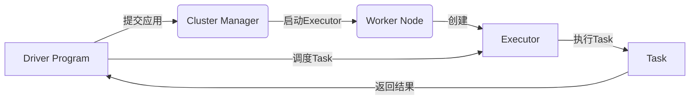

# Spark Executor原理与代码实例讲解

## 1. 背景介绍
### 1.1 大数据处理的挑战
在当今大数据时代,海量数据的高效处理已成为企业和组织面临的重大挑战。传统的数据处理方式难以满足实时性、并行性等方面的要求。Spark作为一个快速、通用的大数据处理引擎,为大规模数据处理提供了高效、易用的解决方案。
### 1.2 Spark的优势
Spark凭借其高性能、易用性和通用性等优势,已成为大数据处理领域的佼佼者。Spark基于内存计算,处理速度比Hadoop MapReduce快100倍以上。同时Spark提供了丰富的API和类库,支持多种编程语言,使开发人员能够快速构建大数据应用。
### 1.3 Executor在Spark中的地位
在Spark的架构中,Executor扮演着至关重要的角色。Executor是Spark分布式计算的基本单元,负责执行具体的计算任务。深入理解Executor的工作原理,对于优化Spark作业性能、开发高效的Spark应用至关重要。

## 2. 核心概念与联系
### 2.1 Spark基本概念
- **Application:** Spark应用程序,由Driver Program和一系列Executor组成。
- **Driver Program:** Spark应用程序的主程序,负责任务的调度和分发。
- **Executor:** 运行在工作节点上的进程,负责执行计算任务。
- **Task:** Spark中的最小计算单元,由Executor执行。
- **Stage:** 一组可以一起执行的Task,代表了Job的一个计算阶段。
### 2.2 Executor与其他组件的关系
下面是Spark核心组件之间关系的Mermaid流程图:


## 3. 核心算法原理具体操作步骤
### 3.1 Executor的启动流程
1. Driver Program向Cluster Manager申请资源,提交应用程序。
2. Cluster Manager在Worker Node上启动Executor进程。
3. Executor向Driver Program注册,建立通信连接。
4. Driver Program将应用程序代码发送给Executor。
5. Executor加载应用程序代码,准备执行任务。
### 3.2 Executor执行任务的流程
1. Driver Program将Task以序列化的形式发送给Executor。
2. Executor反序列化Task,创建Task对象。
3. Executor执行Task的计算逻辑。
4. Executor将Task的执行结果回传给Driver Program。
5. 所有Task执行完毕后,Executor进程退出。

## 4. 数学模型和公式详细讲解举例说明
### 4.1 Spark Shuffle过程中的排序
在Spark Shuffle过程中,Executor需要对中间结果按Key进行排序。假设有$N$个Key,每个Key对应$M$个Value,Shuffle排序时间复杂度为:

$$O(N \log N + M)$$

其中,$N \log N$表示对Key进行排序的时间复杂度,$M$表示对Value进行排序的时间复杂度。

### 4.2 数据本地性优化
Spark通过数据本地性优化来减少网络传输开销。数据本地性分为三个级别:
- PROCESS_LOCAL: 数据和Executor在同一个JVM进程中。
- NODE_LOCAL: 数据和Executor在同一个节点上。
- ANY: 数据和Executor在不同节点上。

Spark会尽可能地将Task调度到数据所在的节点上执行,提高数据本地性。假设一个Task需要处理大小为$S$的数据,网络传输速率为$V$,则数据本地性带来的性能提升为:

$$\frac{S}{V}$$

## 5. 项目实践：代码实例和详细解释说明
下面是一个使用Spark Executor执行WordCount的Scala代码示例:

```scala
val conf = new SparkConf().setAppName("WordCount")
val sc = new SparkContext(conf)

val textFile = sc.textFile("hdfs://input/file.txt")
val counts = textFile.flatMap(line => line.split(" "))
                 .map(word => (word, 1))
                 .reduceByKey(_ + _)
counts.saveAsTextFile("hdfs://output/dir")
```

代码解释:
1. 创建SparkConf对象,设置应用程序名称。
2. 创建SparkContext对象,作为Spark应用程序的入口。
3. 使用textFile方法读取HDFS上的文本文件。
4. 使用flatMap对每一行文本进行分词,将每个单词映射成(word, 1)的形式。
5. 使用reduceByKey对每个单词的计数进行累加。
6. 使用saveAsTextFile将结果保存到HDFS。

在执行过程中,Spark会自动将计算任务分发给Executor执行。Executor在处理数据时,会优先访问本地数据,减少网络传输开销。

## 6. 实际应用场景
Spark Executor在多个实际场景中发挥着重要作用,例如:
### 6.1 日志处理
Spark可以对海量日志数据进行实时处理和分析。Executor并行处理日志数据,从中提取有价值的信息,如用户行为、系统性能等。
### 6.2 机器学习
Spark MLlib提供了丰富的机器学习算法库。Executor可以并行训练机器学习模型,加速模型的收敛速度。
### 6.3 图计算
Spark GraphX是一个图计算框架。Executor可以并行执行图的遍历、聚合等操作,支持大规模图数据的处理。

## 7. 工具和资源推荐
- **Spark官方文档:** https://spark.apache.org/docs/latest/
- **Spark源码:** https://github.com/apache/spark
- **Spark社区:** https://spark.apache.org/community.html
- **Spark Summit大会:** https://spark-summit.org/
- **Databricks博客:** https://databricks.com/blog

## 8. 总结：未来发展趋势与挑战
### 8.1 Spark的未来发展趋势
- 与云计算平台深度集成,提供无缝的云端大数据处理能力。
- 支持更多的数据源和存储系统,如Kafka、Cassandra等。
- 引入更高级的DAG优化技术,进一步提升性能。
- 与深度学习框架(如TensorFlow)结合,支持大规模分布式深度学习。
### 8.2 面临的挑战
- 内存管理和优化仍然是一个挑战,需要更智能的内存调度策略。
- 数据倾斜问题影响Spark作业的性能,需要更好的数据分区和负载均衡机制。
- 容错和故障恢复机制有待完善,确保Spark作业的高可用性。
- 安全性和权限管理也是不容忽视的问题,需要提供细粒度的访问控制。

## 9. 附录：常见问题与解答
### 9.1 如何设置Executor的内存大小?
可以通过`spark.executor.memory`参数设置Executor的内存大小,例如:
```scala
val conf = new SparkConf().set("spark.executor.memory", "4g")
```
这将设置每个Executor的内存大小为4GB。

### 9.2 如何增加Executor的并行度?
可以通过`spark.executor.cores`参数设置每个Executor的CPU核心数,例如:
```scala
val conf = new SparkConf().set("spark.executor.cores", "4")
```
这将设置每个Executor使用4个CPU核心,提高并行处理能力。

### 9.3 如何监控Executor的运行状态?
Spark提供了Web UI界面,可以实时监控Executor的运行状态,包括执行进度、资源使用情况等。可以通过`spark.ui.port`参数设置Web UI的端口号。

---

作者：禅与计算机程序设计艺术 / Zen and the Art of Computer Programming