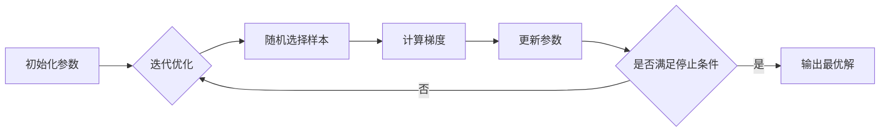

# Stochastic Gradient Descent (SGD) 原理与代码实战案例讲解

## 1. 背景介绍
### 1.1 机器学习中的优化问题
#### 1.1.1 机器学习的目标函数
#### 1.1.2 损失函数与风险函数
#### 1.1.3 优化算法的重要性
### 1.2 梯度下降法
#### 1.2.1 梯度的概念
#### 1.2.2 梯度下降的基本原理
#### 1.2.3 批量梯度下降(BGD)

## 2. 核心概念与联系
### 2.1 随机梯度下降(SGD)
#### 2.1.1 SGD的定义
#### 2.1.2 SGD与BGD的区别
#### 2.1.3 SGD的优缺点
### 2.2 小批量随机梯度下降(Mini-batch SGD)
#### 2.2.1 Mini-batch SGD的定义
#### 2.2.2 Mini-batch size的选择
#### 2.2.3 Mini-batch SGD的优缺点
### 2.3 SGD与其他优化算法的联系
#### 2.3.1 动量法(Momentum)
#### 2.3.2 自适应学习率算法(AdaGrad、RMSProp)
#### 2.3.3 自适应矩估计算法(Adam)

## 3. 核心算法原理具体操作步骤
### 3.1 SGD算法流程
#### 3.1.1 初始化参数
#### 3.1.2 迭代过程
#### 3.1.3 停止条件
### 3.2 学习率的选择
#### 3.2.1 学习率对优化的影响
#### 3.2.2 学习率调整策略
#### 3.2.3 学习率衰减方法
### 3.3 SGD的改进方法
#### 3.3.1 Shuffling
#### 3.3.2 Curriculum Learning
#### 3.3.3 Batch Normalization

## 4. 数学模型和公式详细讲解举例说明
### 4.1 SGD的数学表达
#### 4.1.1 目标函数与梯度
#### 4.1.2 参数更新公式
#### 4.1.3 收敛性分析
### 4.2 Mini-batch SGD的数学表达
#### 4.2.1 Mini-batch的梯度估计
#### 4.2.2 参数更新公式
#### 4.2.3 收敛性分析
### 4.3 SGD与凸优化
#### 4.3.1 凸函数的定义
#### 4.3.2 SGD在凸优化中的应用
#### 4.3.3 非凸优化中的SGD

## 5. 项目实践：代码实例和详细解释说明
### 5.1 使用SGD训练逻辑回归模型
#### 5.1.1 数据集准备
#### 5.1.2 模型定义
#### 5.1.3 使用SGD优化器
### 5.2 使用SGD训练神经网络
#### 5.2.1 数据集准备
#### 5.2.2 模型定义
#### 5.2.3 使用SGD优化器
### 5.3 使用Mini-batch SGD训练模型
#### 5.3.1 数据集准备
#### 5.3.2 模型定义
#### 5.3.3 使用Mini-batch SGD优化器

## 6. 实际应用场景
### 6.1 推荐系统中的SGD应用
#### 6.1.1 矩阵分解
#### 6.1.2 因子分解机(FFM)
#### 6.1.3 深度学习推荐模型
### 6.2 自然语言处理中的SGD应用
#### 6.2.1 word2vec
#### 6.2.2 语言模型
#### 6.2.3 机器翻译
### 6.3 计算机视觉中的SGD应用
#### 6.3.1 图像分类
#### 6.3.2 目标检测
#### 6.3.3 语义分割

## 7. 工具和资源推荐
### 7.1 深度学习框架
#### 7.1.1 TensorFlow
#### 7.1.2 PyTorch
#### 7.1.3 Keras
### 7.2 SGD相关的开源库
#### 7.2.1 scikit-learn
#### 7.2.2 Theano
#### 7.2.3 Caffe
### 7.3 推荐学习资源
#### 7.3.1 在线课程
#### 7.3.2 书籍推荐
#### 7.3.3 论文推荐

## 8. 总结：未来发展趋势与挑战
### 8.1 SGD的局限性
#### 8.1.1 鞍点问题
#### 8.1.2 梯度消失与梯度爆炸
#### 8.1.3 超参数调优的困难
### 8.2 SGD的改进方向
#### 8.2.1 自适应学习率方法
#### 8.2.2 二阶优化方法
#### 8.2.3 分布式与并行SGD
### 8.3 SGD在未来的应用前景
#### 8.3.1 大规模机器学习
#### 8.3.2 在线学习与增量学习
#### 8.3.3 元学习与自动机器学习

## 9. 附录：常见问题与解答
### 9.1 如何选择合适的学习率？
### 9.2 如何处理过拟合问题？
### 9.3 SGD对数据的scale敏感吗？
### 9.4 如何加速SGD的收敛？
### 9.5 SGD对batch size的选择有什么要求？



随机梯度下降(Stochastic Gradient Descent, SGD)是机器学习和深度学习中应用最广泛的优化算法之一。与传统的批量梯度下降(Batch Gradient Descent, BGD)不同，SGD通过每次随机选择一个样本来计算梯度并更新模型参数，从而大大加快了优化速度。本文将从背景介绍、核心概念、算法原理、数学模型、代码实践、应用场景等方面对SGD进行全面讲解，帮助读者深入理解并掌握这一重要算法。

SGD的基本思想非常简单：每次迭代时，随机选择一个样本，计算其损失函数关于模型参数的梯度，然后沿着负梯度方向更新参数。设$\theta$为模型参数，$J(\theta)$为损失函数，$\eta$为学习率，则SGD的参数更新公式为：

$$
\theta = \theta - \eta \nabla_\theta J(\theta; x^{(i)}, y^{(i)})
$$

其中，$(x^{(i)}, y^{(i)})$为随机选择的第$i$个样本。与BGD相比，SGD每次只使用一个样本来更新参数，因此每一步的计算量大大减小，但同时也引入了更大的随机噪声。为了减小噪声的影响，可以使用Mini-batch SGD，即每次随机选择一个小批量(mini-batch)的样本来计算梯度。

SGD虽然简单，但在实践中需要注意许多问题，如学习率的选择、初始化策略、batch size的设置等。为了进一步提高SGD的性能，研究者提出了许多改进方法，如Momentum、AdaGrad、RMSProp、Adam等。这些方法通过引入一些自适应机制，可以自动调整学习率，加速收敛。

下面是一个使用PyTorch实现SGD的简单示例，用于训练一个逻辑回归模型：

```python
import torch
import torch.nn as nn
import torch.optim as optim

# 定义模型
class LogisticRegression(nn.Module):
    def __init__(self, input_size):
        super(LogisticRegression, self).__init__()
        self.linear = nn.Linear(input_size, 1)

    def forward(self, x):
        out = torch.sigmoid(self.linear(x))
        return out

# 定义数据
X = torch.randn(100, 10)
y = torch.randint(0, 2, (100,)).float().unsqueeze(1)

# 初始化模型和优化器
model = LogisticRegression(10)
criterion = nn.BCELoss()
optimizer = optim.SGD(model.parameters(), lr=0.01)

# 训练模型
for epoch in range(100):
    y_pred = model(X)
    loss = criterion(y_pred, y)

    optimizer.zero_grad()
    loss.backward()
    optimizer.step()

    if (epoch+1) % 10 == 0:
        print(f'Epoch [{epoch+1}/100], Loss: {loss.item():.4f}')
```

在实际应用中，SGD被广泛用于各种机器学习任务，如推荐系统、自然语言处理、计算机视觉等。以推荐系统为例，SGD可以用于优化矩阵分解模型，如SVD++、NFM等，通过最小化重构误差来学习用户和物品的隐向量。在自然语言处理领域，word2vec、语言模型等都是使用SGD进行优化的。在计算机视觉领域，SGD是训练各种深度神经网络(如CNN、ResNet等)的标配优化算法。

展望未来，随着数据规模和模型复杂度的不断增长，SGD仍然面临着诸多挑战，如陷入鞍点、梯度消失与爆炸等。为了进一步提升SGD的性能，需要在自适应学习率、二阶优化、分布式计算等方面进行更多探索。同时，SGD在元学习、自动机器学习等新兴领域也有广阔的应用前景。

总之，SGD是一个简单而强大的优化算法，在过去几十年中对机器学习的发展做出了巨大贡献。尽管仍有许多问题有待解决，但SGD作为一个基础算法，必将在未来的机器学习研究和应用中继续发挥重要作用。

作者：禅与计算机程序设计艺术 / Zen and the Art of Computer Programming