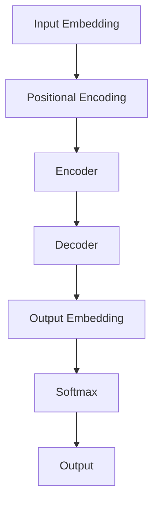

# T5(Text-to-Text Transfer Transformer) - 原理与代码实例讲解

## 1. 背景介绍
### 1.1 Transformer模型的发展历程
#### 1.1.1 Transformer的提出
#### 1.1.2 BERT等预训练语言模型的发展
#### 1.1.3 T5的诞生
### 1.2 T5的创新点
#### 1.2.1 统一的文本到文本框架
#### 1.2.2 多任务学习能力
#### 1.2.3 更大规模的预训练语料库

## 2. 核心概念与联系
### 2.1 Transformer架构回顾
#### 2.1.1 Encoder-Decoder结构
#### 2.1.2 Multi-Head Attention
#### 2.1.3 位置编码
### 2.2 预训练-微调(Pre-train & Fine-tune)范式
#### 2.2.1 无监督预训练
#### 2.2.2 有监督微调
### 2.3 迁移学习(Transfer Learning)思想
#### 2.3.1 跨任务知识迁移
#### 2.3.2 跨领域知识迁移

## 3. 核心算法原理具体操作步骤
### 3.1 T5模型结构
#### 3.1.1 编码器(Encoder)
#### 3.1.2 解码器(Decoder)
#### 3.1.3 模型参数规模
### 3.2 预训练目标与过程
#### 3.2.1 去噪自编码预训练目标
#### 3.2.2 带掩码的语言建模
#### 3.2.3 多任务混合预训练
### 3.3 微调与推理
#### 3.3.1 Prefix-Tuning
#### 3.3.2 基于Prompt的微调
#### 3.3.3 推理(Inference)过程

## 4. 数学模型和公式详细讲解举例说明
### 4.1 Scaled Dot-Product Attention
$$Attention(Q,K,V) = softmax(\frac{QK^T}{\sqrt{d_k}})V$$
其中，$Q$是查询(Query)，$K$是键(Key)，$V$是值(Value)，$d_k$是$K$的维度。
### 4.2 Multi-Head Attention
$$MultiHead(Q,K,V) = Concat(head_1,...,head_h)W^O$$
$$head_i = Attention(QW^Q_i, KW^K_i, VW^V_i)$$
其中，$W^Q_i$,$W^K_i$,$W^V_i$,$W^O$都是可学习的权重矩阵。
### 4.3 前馈神经网络(Feed Forward)
$$FFN(x) = max(0, xW_1 + b_1)W_2 + b_2$$
这里使用的是两层的前馈神经网络，$W_1,W_2,b_1,b_2$都是可学习的参数。

## 5. 项目实践：代码实例和详细解释说明
### 5.1 使用Hugging Face的Transformers库
#### 5.1.1 安装依赖
```bash
pip install transformers
```
#### 5.1.2 加载预训练模型
```python
from transformers import T5ForConditionalGeneration, T5Tokenizer

model = T5ForConditionalGeneration.from_pretrained('t5-base')
tokenizer = T5Tokenizer.from_pretrained('t5-base')
```
#### 5.1.3 执行推理
```python
input_text = "translate English to French: Hello, how are you?"
input_ids = tokenizer.encode(input_text, return_tensors='pt')

outputs = model.generate(input_ids)
print(tokenizer.decode(outputs[0]))
```
输出结果:
```
"Bonjour, comment allez-vous ?"
```
### 5.2 使用PyTorch从头开始实现
#### 5.2.1 定义模型结构
```python
import torch
import torch.nn as nn

class T5Model(nn.Module):
    def __init__(self, vocab_size, d_model, nhead, num_layers):
        super().__init__()

        self.embedding = nn.Embedding(vocab_size, d_model)
        self.pos_encoder = PositionalEncoding(d_model)

        encoder_layer = nn.TransformerEncoderLayer(d_model, nhead)
        self.encoder = nn.TransformerEncoder(encoder_layer, num_layers)

        decoder_layer = nn.TransformerDecoderLayer(d_model, nhead)
        self.decoder = nn.TransformerDecoder(decoder_layer, num_layers)

        self.fc = nn.Linear(d_model, vocab_size)

    def forward(self, src, tgt, src_mask, tgt_mask):
        src = self.embedding(src) * math.sqrt(d_model)
        src = self.pos_encoder(src)

        tgt = self.embedding(tgt) * math.sqrt(d_model)
        tgt = self.pos_encoder(tgt)

        memory = self.encoder(src, src_mask)
        output = self.decoder(tgt, memory, tgt_mask, None)

        output = self.fc(output)
        return output
```
#### 5.2.2 训练模型
```python
model = T5Model(vocab_size, d_model, nhead, num_layers)
criterion = nn.CrossEntropyLoss()
optimizer = torch.optim.Adam(model.parameters(), lr=0.0001)

for epoch in range(num_epochs):
    for batch in data_loader:
        src, tgt = batch
        src_mask, tgt_mask = create_masks(src, tgt)

        outputs = model(src, tgt, src_mask, tgt_mask)
        loss = criterion(outputs.reshape(-1, vocab_size), tgt.reshape(-1))

        optimizer.zero_grad()
        loss.backward()
        optimizer.step()
```

## 6. 实际应用场景
### 6.1 机器翻译
T5可以用于多语言机器翻译任务，通过预训练和微调，实现高质量的翻译效果。
### 6.2 文本摘要
通过对T5进行微调，可以实现从长文本中自动提取关键信息生成摘要的功能。
### 6.3 问答系统
利用T5强大的语言理解和生成能力，可以构建端到端的问答系统，根据给定问题生成准确答案。
### 6.4 对话生成
T5可用于构建对话系统，通过学习大规模对话语料，生成流畅自然的对话回复。

## 7. 工具和资源推荐
### 7.1 Hugging Face Transformers库
提供了T5在内的主流Transformer模型的实现，API简单易用。
### 7.2 Google T5官方代码仓库
包含了原论文的代码实现，可供参考学习。
### 7.3 PyTorch官方教程
PyTorch官网提供了Transformer和T5相关的教程和示例代码。
### 7.4 Paperswithcode
收录了T5相关的论文和开源项目，是了解最新研究进展的好去处。

## 8. 总结：未来发展趋势与挑战
### 8.1 模型参数量级继续增大
未来预训练语言模型的参数量级可能会进一步增加到万亿甚至更大，带来性能的进一步提升。
### 8.2 训练数据的多样性和质量
覆盖更广泛领域和任务的高质量训练数据，对于提升模型效果至关重要。
### 8.3 推理速度与效率
如何在保证效果的同时提高推理速度，减小模型体积，是一个需要攻克的难题。
### 8.4 小样本学习
如何利用预训练模型在小样本场景下快速适应新任务，是一个有价值的研究方向。
### 8.5 知识的显式建模
如何将显式的知识库与语言模型相结合，赋予模型可解释的知识，是未来的一个重要探索方向。

## 9. 附录：常见问题与解答
### 9.1 T5相比BERT有什么优势？
T5采用了更大规模的预训练数据和更统一的文本到文本框架，具有更强的迁移学习和多任务学习能力。
### 9.2 T5可以处理中文吗？
T5有多语言版本，支持包括中文在内的100多种语言，经过微调可以很好地处理中文任务。
### 9.3 在小数据集上如何利用T5？
可以使用T5的预训练模型作为基础，在小数据集上进行Prompt Tuning或Prefix Tuning，快速适应新任务。
### 9.4 T5的训练需要什么硬件条件？
训练T5对计算资源要求较高，一般需要多块高端GPU，同时需要大内存。但推理则相对容易。
### 9.5 T5适合哪些任务？
T5是一个通用的语言模型，适合大多数自然语言处理任务，如机器翻译、摘要、问答、对话等。

作者：禅与计算机程序设计艺术 / Zen and the Art of Computer Programming

