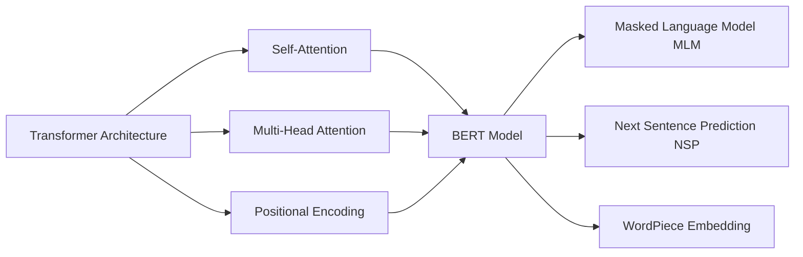

# Transformer大模型实战 将BERT 模型应用于其他语言

## 1. 背景介绍

### 1.1 Transformer模型的发展历程

#### 1.1.1 Transformer模型的起源与突破
#### 1.1.2 Transformer模型的优势与局限性
#### 1.1.3 Transformer模型的应用现状

### 1.2 BERT模型的诞生

#### 1.2.1 BERT模型的创新点
#### 1.2.2 BERT模型的架构与原理
#### 1.2.3 BERT模型的预训练与微调

### 1.3 BERT模型在自然语言处理中的应用

#### 1.3.1 BERT在文本分类任务中的应用
#### 1.3.2 BERT在命名实体识别任务中的应用
#### 1.3.3 BERT在问答系统中的应用

## 2. 核心概念与联系

### 2.1 Transformer的核心概念

#### 2.1.1 Self-Attention机制
#### 2.1.2 Multi-Head Attention
#### 2.1.3 Positional Encoding

### 2.2 BERT的核心概念

#### 2.2.1 Masked Language Model(MLM)
#### 2.2.2 Next Sentence Prediction(NSP)
#### 2.2.3 WordPiece Embedding

### 2.3 Transformer与BERT的关系

#### 2.3.1 BERT是基于Transformer架构的预训练模型
#### 2.3.2 BERT继承了Transformer的优势
#### 2.3.3 BERT在Transformer基础上的创新

## 3. 核心算法原理具体操作步骤

### 3.1 BERT的预训练过程

#### 3.1.1 构建大规模无监督语料库
#### 3.1.2 WordPiece分词
#### 3.1.3 Masked Language Model预训练
#### 3.1.4 Next Sentence Prediction预训练

### 3.2 BERT的微调过程

#### 3.2.1 针对下游任务修改输入输出层
#### 3.2.2 在下游任务数据集上进行微调
#### 3.2.3 微调过程中的优化策略

### 3.3 将BERT应用于其他语言的步骤

#### 3.3.1 构建目标语言的大规模无监督语料库
#### 3.3.2 对语料进行预处理和分词
#### 3.3.3 在目标语言上预训练BERT模型
#### 3.3.4 在目标语言的下游任务上微调BERT模型

## 4. 数学模型和公式详细讲解举例说明

### 4.1 Self-Attention的数学原理

#### 4.1.1 Query、Key、Value的计算
$$Attention(Q,K,V) = softmax(\frac{QK^T}{\sqrt{d_k}})V$$
其中，$Q$是查询矩阵，$K$是键矩阵，$V$是值矩阵，$d_k$是键向量的维度。

#### 4.1.2 Scaled Dot-Product Attention
#### 4.1.3 Self-Attention的矩阵计算过程

### 4.2 Multi-Head Attention的数学原理

#### 4.2.1 多头注意力机制的并行计算
$$MultiHead(Q,K,V) = Concat(head_1, ..., head_h)W^O$$
其中，$head_i = Attention(QW_i^Q, KW_i^K, VW_i^V)$，$W_i^Q, W_i^K, W_i^V$和$W^O$是可学习的权重矩阵。

#### 4.2.2 多头注意力的优势
#### 4.2.3 Multi-Head Attention的矩阵计算过程

### 4.3 Masked Language Model的数学原理

#### 4.3.1 Masked Language Model的目标函数
$$\mathcal{L}_{MLM} = -\sum_{i=1}^{n}log P(w_i|w_{\backslash i})$$
其中，$w_i$是被遮挡的单词，$w_{\backslash i}$是上下文单词。

#### 4.3.2 Masked Language Model的采样策略
#### 4.3.3 Masked Language Model的损失函数计算

## 5. 项目实践：代码实例和详细解释说明

### 5.1 使用BERT进行中文文本分类

#### 5.1.1 数据集准备与预处理
#### 5.1.2 加载预训练的中文BERT模型
#### 5.1.3 定义微调的网络结构
#### 5.1.4 训练与评估
#### 5.1.5 代码实例与解释

### 5.2 使用BERT进行中文命名实体识别

#### 5.2.1 数据集准备与预处理
#### 5.2.2 加载预训练的中文BERT模型
#### 5.2.3 定义微调的网络结构
#### 5.2.4 训练与评估
#### 5.2.5 代码实例与解释

### 5.3 使用BERT进行中文问答系统

#### 5.3.1 数据集准备与预处理
#### 5.3.2 加载预训练的中文BERT模型
#### 5.3.3 定义微调的网络结构
#### 5.3.4 训练与评估
#### 5.3.5 代码实例与解释

## 6. 实际应用场景

### 6.1 智能客服系统

#### 6.1.1 基于BERT的客户意图识别
#### 6.1.2 基于BERT的客户问题自动答复
#### 6.1.3 案例分析

### 6.2 舆情监控系统

#### 6.2.1 基于BERT的舆情文本分类
#### 6.2.2 基于BERT的舆情关键词提取
#### 6.2.3 案例分析

### 6.3 个性化推荐系统

#### 6.3.1 基于BERT的用户画像构建
#### 6.3.2 基于BERT的物品描述信息提取
#### 6.3.3 案例分析

## 7. 工具和资源推荐

### 7.1 预训练模型资源

#### 7.1.1 Google的BERT多语言预训练模型
#### 7.1.2 哈工大讯飞联合实验室的中文BERT预训练模型
#### 7.1.3 其他优质的BERT预训练模型资源

### 7.2 开源工具与框架

#### 7.2.1 Transformers库
#### 7.2.2 Keras-Bert
#### 7.2.3 FastBERT

### 7.3 数据集资源

#### 7.3.1 中文文本分类数据集
#### 7.3.2 中文命名实体识别数据集
#### 7.3.3 中文问答系统数据集

## 8. 总结：未来发展趋势与挑战

### 8.1 BERT模型的发展趋势

#### 8.1.1 模型的轻量化与压缩
#### 8.1.2 模型的多语言与多任务学习
#### 8.1.3 模型的可解释性研究

### 8.2 BERT在其他语言上应用的挑战

#### 8.2.1 语言资源的稀缺性
#### 8.2.2 语言特性的差异性
#### 8.2.3 评估标准的多样性

### 8.3 未来研究方向与展望

#### 8.3.1 融合知识图谱的BERT模型
#### 8.3.2 结合对比学习的BERT模型
#### 8.3.3 基于BERT的few-shot与zero-shot学习

## 9. 附录：常见问题与解答

### 9.1 如何选择合适的BERT预训练模型？
### 9.2 BERT模型的训练需要什么样的硬件配置？
### 9.3 如何处理BERT模型的过拟合问题？
### 9.4 BERT模型在实际应用中的推理速度如何优化？
### 9.5 如何平衡BERT模型的性能和计算资源消耗？

作者：禅与计算机程序设计艺术 / Zen and the Art of Computer Programming