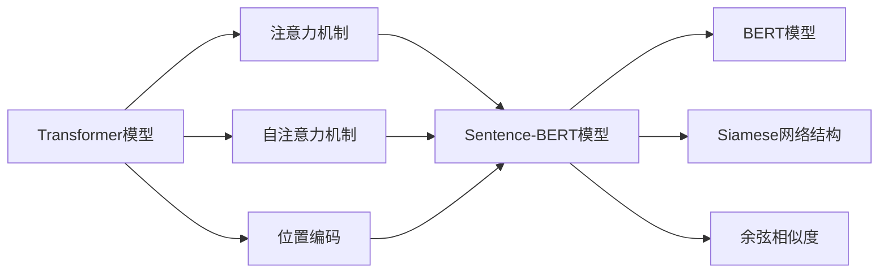

# Transformer大模型实战 用Sentence-BERT模型寻找类似句子

## 1. 背景介绍
### 1.1 Transformer模型的发展历程
#### 1.1.1 Transformer模型的起源
#### 1.1.2 Transformer模型的演进
#### 1.1.3 Transformer模型的应用

### 1.2 Sentence-BERT模型的诞生
#### 1.2.1 Sentence-BERT模型的创新点
#### 1.2.2 Sentence-BERT模型的优势
#### 1.2.3 Sentence-BERT模型的应用场景

### 1.3 寻找类似句子任务的重要性
#### 1.3.1 信息检索中的应用
#### 1.3.2 文本聚类中的应用
#### 1.3.3 推荐系统中的应用

## 2. 核心概念与联系
### 2.1 Transformer模型的核心概念
#### 2.1.1 注意力机制(Attention Mechanism)
#### 2.1.2 自注意力机制(Self-Attention)
#### 2.1.3 位置编码(Positional Encoding)

### 2.2 Sentence-BERT模型的核心概念
#### 2.2.1 BERT模型
#### 2.2.2 Siamese网络结构
#### 2.2.3 余弦相似度(Cosine Similarity)

### 2.3 Transformer与Sentence-BERT的联系
#### 2.3.1 Sentence-BERT基于Transformer架构
#### 2.3.2 Sentence-BERT利用BERT预训练模型
#### 2.3.3 Transformer中的注意力机制在Sentence-BERT中的应用



## 3. 核心算法原理具体操作步骤
### 3.1 BERT模型的预训练
#### 3.1.1 Masked Language Model(MLM)任务
#### 3.1.2 Next Sentence Prediction(NSP)任务
#### 3.1.3 BERT模型的微调

### 3.2 Sentence-BERT模型的训练
#### 3.2.1 数据准备与预处理
#### 3.2.2 构建Siamese BERT网络
#### 3.2.3 定义损失函数与优化器
#### 3.2.4 模型训练与评估

### 3.3 Sentence-BERT模型的推理
#### 3.3.1 提取句子特征向量
#### 3.3.2 计算句子之间的余弦相似度
#### 3.3.3 根据相似度得分排序并返回结果

## 4. 数学模型和公式详细讲解举例说明
### 4.1 注意力机制的数学表示
#### 4.1.1 查询(Query)、键(Key)、值(Value)的计算
#### 4.1.2 注意力权重的计算
#### 4.1.3 注意力输出的计算

注意力机制可以用下面的公式表示：

$Attention(Q,K,V) = softmax(\frac{QK^T}{\sqrt{d_k}})V$

其中，$Q$表示查询矩阵，$K$表示键矩阵，$V$表示值矩阵，$d_k$表示键向量的维度。

### 4.2 余弦相似度的数学表示
#### 4.2.1 余弦相似度的定义
#### 4.2.2 余弦相似度的计算公式
#### 4.2.3 余弦相似度的取值范围

两个向量$a$和$b$的余弦相似度可以用下面的公式计算：

$similarity = cos(\theta) = \frac{a \cdot b}{||a|| \times ||b||} = \frac{\sum_{i=1}^{n} a_i b_i}{\sqrt{\sum_{i=1}^{n} a_i^2} \sqrt{\sum_{i=1}^{n} b_i^2}}$

其中，$a_i$和$b_i$分别表示向量$a$和$b$的第$i$个元素，$n$表示向量的维度。余弦相似度的取值范围为$[-1,1]$，值越大表示两个向量越相似。

### 4.3 Siamese网络的数学表示
#### 4.3.1 Siamese网络的结构
#### 4.3.2 Siamese网络的损失函数
#### 4.3.3 Siamese网络的梯度计算

Siamese网络常用的损失函数是对比损失(Contrastive Loss)，定义如下：

$$L(x_1,x_2,y) = (1-y) \frac{1}{2} (d)^2 + (y) \frac{1}{2} \{max(0, m-d)\}^2$$

其中，$x_1$和$x_2$是一对输入样本，$y$表示它们是否属于同一类（$y=0$表示同类，$y=1$表示不同类），$d$表示两个样本映射到特征空间后的欧氏距离，$m$是一个margin超参数。

## 5. 项目实践：代码实例和详细解释说明
### 5.1 环境准备与数据预处理
#### 5.1.1 安装必要的库和依赖
#### 5.1.2 加载和预处理数据集
#### 5.1.3 数据增强与批处理

### 5.2 构建Sentence-BERT模型
#### 5.2.1 加载预训练的BERT模型
#### 5.2.2 定义Siamese BERT网络结构
#### 5.2.3 定义损失函数和优化器

```python
from sentence_transformers import SentenceTransformer, InputExample, losses
from torch.utils.data import DataLoader

# 加载预训练的BERT模型
model = SentenceTransformer('bert-base-uncased')

# 定义训练数据
train_examples = [InputExample(texts=['句子1', '句子2'], label=1.0),
                  InputExample(texts=['句子3', '句子4'], label=0.0)]
train_dataloader = DataLoader(train_examples, shuffle=True, batch_size=16)

# 定义损失函数和优化器
train_loss = losses.CosineSimilarityLoss(model)
optimizer = torch.optim.Adam(model.parameters(), lr=2e-5)
```

### 5.3 训练Sentence-BERT模型
#### 5.3.1 设置训练参数和超参数
#### 5.3.2 定义训练循环和评估函数
#### 5.3.3 模型训练与性能评估

```python
from sentence_transformers import evaluation

# 设置训练参数
num_epochs = 3
warmup_steps = int(len(train_dataloader) * num_epochs * 0.1)

# 定义评估器
evaluator = evaluation.EmbeddingSimilarityEvaluator(sentences1, sentences2, scores)

# 训练模型
model.fit(train_objectives=[(train_dataloader, train_loss)],
          evaluator=evaluator,
          epochs=num_epochs,
          warmup_steps=warmup_steps,
          output_path='output/sbert_model')
```

### 5.4 使用Sentence-BERT模型寻找类似句子
#### 5.4.1 加载训练好的Sentence-BERT模型
#### 5.4.2 提取句子特征向量
#### 5.4.3 计算句子之间的相似度并返回结果

```python
from sentence_transformers import SentenceTransformer, util

# 加载训练好的模型
model = SentenceTransformer('output/sbert_model')

# 提取句子特征向量
sentences = ['句子1', '句子2', '句子3', '句子4']
sentence_embeddings = model.encode(sentences)

# 计算句子之间的相似度
query_embedding = model.encode('查询句子')
cos_scores = util.pytorch_cos_sim(query_embedding, sentence_embeddings)[0]

# 根据相似度排序并返回结果
top_results = torch.topk(cos_scores, k=3)
print(f"Query: 查询句子")
for score, idx in zip(top_results[0], top_results[1]):
    print(f"Score: {score:.4f}, Sentence: {sentences[idx]}")
```

## 6. 实际应用场景
### 6.1 文本搜索与信息检索
#### 6.1.1 基于语义的文档检索
#### 6.1.2 相似问题匹配与问答系统
#### 6.1.3 智能客服中的自动回复

### 6.2 文本聚类与主题发现
#### 6.2.1 短文本聚类
#### 6.2.2 话题检测与跟踪
#### 6.2.3 社交媒体中的舆情分析

### 6.3 推荐系统中的应用
#### 6.3.1 基于内容的商品推荐
#### 6.3.2 相似新闻与文章推荐
#### 6.3.3 个性化的广告推荐

## 7. 工具和资源推荐
### 7.1 Sentence-BERT的官方资源
#### 7.1.1 Sentence-BERT的GitHub仓库
#### 7.1.2 Sentence-BERT的官方文档
#### 7.1.3 Sentence-BERT的预训练模型

### 7.2 相关的开源库和工具
#### 7.2.1 Transformers库
#### 7.2.2 Faiss:高效的相似度搜索库
#### 7.2.3 Annoy:近似最近邻搜索库

### 7.3 推荐的数据集和基准测试
#### 7.3.1 STS基准测试
#### 7.3.2 SNLI和MultiNLI数据集
#### 7.3.3 Quora Question Pairs数据集

## 8. 总结：未来发展趋势与挑战
### 8.1 Sentence-BERT模型的优化方向
#### 8.1.1 更大规模的预训练模型
#### 8.1.2 更有效的迁移学习方法
#### 8.1.3 更轻量化的模型设计

### 8.2 面临的挑战和问题
#### 8.2.1 缺乏高质量的标注数据
#### 8.2.2 跨语言和多语言设置下的表现
#### 8.2.3 模型的可解释性和稳定性

### 8.3 未来的研究方向
#### 8.3.1 结合知识图谱的语义表示学习
#### 8.3.2 无监督和自监督的句子表示学习
#### 8.3.3 结合对比学习的句子表示增强

## 9. 附录：常见问题与解答
### 9.1 Sentence-BERT与BERT的区别是什么？
### 9.2 Sentence-BERT可以用于非英语语言吗？
### 9.3 Sentence-BERT在长文本上的表现如何？
### 9.4 如何选择合适的Sentence-BERT预训练模型？
### 9.5 Sentence-BERT可以用于文本生成任务吗？

作者：禅与计算机程序设计艺术 / Zen and the Art of Computer Programming