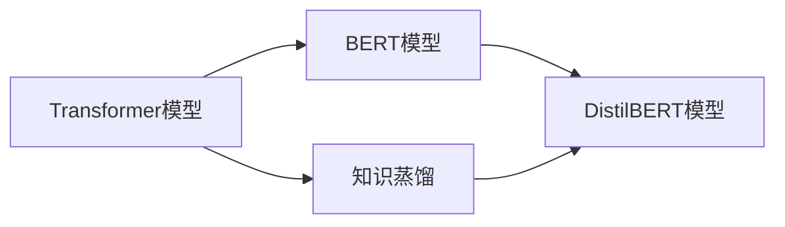

# Transformer大模型实战 训练学生BERT 模型（DistilBERT 模型）

## 1. 背景介绍
### 1.1 Transformer模型的发展历程
#### 1.1.1 Transformer模型的提出
#### 1.1.2 Transformer模型的优势
#### 1.1.3 Transformer模型的应用

### 1.2 BERT模型的诞生
#### 1.2.1 BERT模型的创新点
#### 1.2.2 BERT模型的架构
#### 1.2.3 BERT模型的预训练方法

### 1.3 知识蒸馏技术
#### 1.3.1 知识蒸馏的概念
#### 1.3.2 知识蒸馏的优势
#### 1.3.3 知识蒸馏在NLP中的应用

## 2. 核心概念与联系
### 2.1 Transformer模型
#### 2.1.1 Self-Attention机制
#### 2.1.2 Multi-Head Attention
#### 2.1.3 位置编码
#### 2.1.4 残差连接与Layer Normalization

### 2.2 BERT模型
#### 2.2.1 Masked Language Model(MLM)
#### 2.2.2 Next Sentence Prediction(NSP)
#### 2.2.3 BERT的输入表示
#### 2.2.4 BERT的微调与应用

### 2.3 知识蒸馏
#### 2.3.1 Teacher-Student框架
#### 2.3.2 软标签与硬标签
#### 2.3.3 蒸馏损失函数

### 2.4 DistilBERT模型
#### 2.4.1 DistilBERT的提出背景
#### 2.4.2 DistilBERT的架构设计
#### 2.4.3 DistilBERT的蒸馏训练过程



## 3. 核心算法原理具体操作步骤
### 3.1 DistilBERT的训练流程
#### 3.1.1 数据准备
#### 3.1.2 Teacher模型的选择与训练
#### 3.1.3 Student模型的初始化
#### 3.1.4 蒸馏损失函数的设计
#### 3.1.5 Student模型的训练

### 3.2 DistilBERT的推理过程
#### 3.2.1 输入编码
#### 3.2.2 Transformer编码器计算
#### 3.2.3 输出层计算
#### 3.2.4 预测结果解码

## 4. 数学模型和公式详细讲解举例说明
### 4.1 Self-Attention计算公式
$$Attention(Q,K,V) = softmax(\frac{QK^T}{\sqrt{d_k}})V$$

其中，$Q$,$K$,$V$ 分别表示Query,Key,Value矩阵，$d_k$为Key的维度。

### 4.2 Transformer的编码器结构
$$Encoder(x) = LayerNorm(x + MHSelfAttention(x)) \\
MHSelfAttention(x) = Concat(head_1, ..., head_h)W^O \\
head_i = Attention(xW_i^Q, xW_i^K, xW_i^V)
$$

其中，$x$为输入序列，$W^Q,W^K,W^V$为注意力机制的权重矩阵，$h$为注意力头的数量。

### 4.3 蒸馏损失函数
$$L_{distil} = \alpha L_{CE}(y_{true}, p_{student}) + (1-\alpha)L_{KL}(p_{teacher}, p_{student})$$

其中，$L_{CE}$为交叉熵损失，$L_{KL}$为KL散度损失，$\alpha$为平衡因子，$y_{true}$为真实标签，$p_{teacher}$和$p_{student}$分别为教师模型和学生模型的预测概率分布。

## 5. 项目实践：代码实例和详细解释说明
### 5.1 环境准备
```python
!pip install transformers
from transformers import BertForSequenceClassification, BertTokenizer, AdamW, get_linear_schedule_with_warmup
import torch
```

### 5.2 加载预训练的BERT模型作为Teacher
```python
teacher_model = BertForSequenceClassification.from_pretrained('bert-base-uncased')
tokenizer = BertTokenizer.from_pretrained('bert-base-uncased')
```

### 5.3 初始化Student模型
```python
from transformers import DistilBertConfig, DistilBertForSequenceClassification

student_config = DistilBertConfig(num_labels=2)
student_model = DistilBertForSequenceClassification(student_config)
```

### 5.4 设计蒸馏损失函数
```python
def distillation_loss(student_logits, teacher_logits, labels, alpha=0.5, T=1.0):
    hard_loss = F.cross_entropy(student_logits, labels)
    soft_loss = F.kl_div(F.log_softmax(student_logits/T, dim=1),
                         F.softmax(teacher_logits/T, dim=1))
    return alpha*hard_loss + (1-alpha)*soft_loss
```

### 5.5 训练Student模型
```python
epochs = 3
batch_size = 16
optimizer = AdamW(student_model.parameters(), lr=2e-5)
scheduler = get_linear_schedule_with_warmup(optimizer, num_warmup_steps=0, num_training_steps=len(train_dataloader)*epochs)

for epoch in range(epochs):
    for batch in train_dataloader:
        input_ids = batch['input_ids'].to(device)
        attention_mask = batch['attention_mask'].to(device)
        labels = batch['labels'].to(device)

        teacher_model.eval()
        with torch.no_grad():
            teacher_outputs = teacher_model(input_ids, attention_mask=attention_mask)

        student_model.train()
        student_outputs = student_model(input_ids, attention_mask=attention_mask)

        loss = distillation_loss(student_outputs.logits, teacher_outputs.logits, labels)

        loss.backward()
        optimizer.step()
        scheduler.step()
        optimizer.zero_grad()
```

## 6. 实际应用场景
### 6.1 情感分析
利用DistilBERT模型对文本进行情感极性分类，判断文本情感是积极还是消极。

### 6.2 文本分类
使用DistilBERT模型对新闻文章进行主题分类，如体育、娱乐、科技等。

### 6.3 问答系统
基于DistilBERT模型构建问答系统，对给定问题在大规模文档中寻找最相关的答案。

### 6.4 语义搜索
将DistilBERT作为语义编码器，将查询和文档映射到同一语义空间，实现基于语义相似度的搜索。

## 7. 工具和资源推荐
### 7.1 Hugging Face Transformers库
提供了DistilBERT等主流NLP模型的开源实现，API简单易用。

### 7.2 Hugging Face Model Hub
包含大量预训练的DistilBERT模型，可直接下载使用。

### 7.3 FastDistill
一个知识蒸馏工具包，支持多种蒸馏方法，可用于训练DistilBERT等学生模型。

### 7.4 TextBrewer
一个灵活的知识蒸馏工具包，提供多种蒸馏技术和丰富的API，适用于NLP任务。

## 8. 总结：未来发展趋势与挑战
### 8.1 模型压缩技术的发展
随着预训练语言模型的规模不断增大，模型压缩技术如知识蒸馏、模型剪枝、量化等将得到更广泛的应用，以平衡模型性能和效率。

### 8.2 更高效的蒸馏方法
探索更高效的蒸馏方法，如渐进式蒸馏、数据增强蒸馏等，进一步提升学生模型的性能。

### 8.3 跨模态知识蒸馏
利用知识蒸馏技术实现跨模态知识迁移，如将视觉模型的知识蒸馏到语言模型中，实现多模态理解。

### 8.4 模型安全与隐私
在知识蒸馏过程中，如何保护教师模型的知识产权，防止敏感信息泄露，是亟待解决的问题。

## 9. 附录：常见问题与解答
### 9.1 DistilBERT相比BERT的优势是什么？
DistilBERT在保持较高性能的同时，大大减小了模型体积和推理时间，更适合部署在资源受限的环境中。

### 9.2 如何选择合适的教师模型？
教师模型的选择需要考虑任务类型、数据领域、模型性能等因素。一般选择在目标任务上表现优异的大模型作为教师。

### 9.3 蒸馏过程中的超参数如何设置？
蒸馏温度、蒸馏损失的权重、学习率等超参数需要根据具体任务和数据集进行调优，可以通过网格搜索等方法找到最优组合。

### 9.4 蒸馏得到的DistilBERT在下游任务上的表现如何？
DistilBERT在多个NLP任务上展现出与BERT相近的性能，但参数量和推理时间大幅减少，在实际应用中具有较大优势。

作者：禅与计算机程序设计艺术 / Zen and the Art of Computer Programming