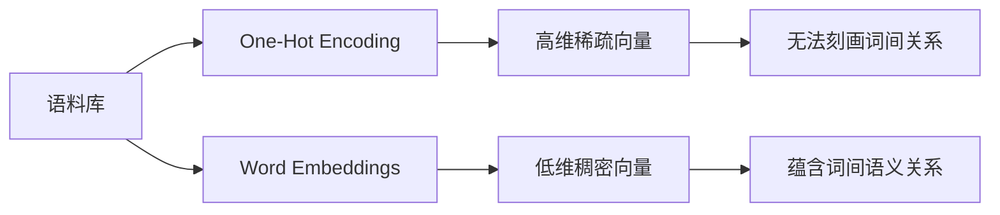
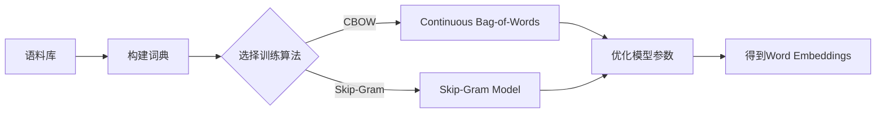

# Word Embeddings 原理与代码实战案例讲解

## 1. 背景介绍

### 1.1 词向量的起源与发展
#### 1.1.1 早期的词表示方法
#### 1.1.2 Word Embeddings的诞生
#### 1.1.3 Word Embeddings的优势

### 1.2 Word Embeddings在自然语言处理中的应用
#### 1.2.1 文本分类
#### 1.2.2 情感分析
#### 1.2.3 机器翻译
#### 1.2.4 问答系统

## 2. 核心概念与联系

### 2.1 One-Hot Encoding
#### 2.1.1 One-Hot Encoding的定义
#### 2.1.2 One-Hot Encoding的局限性

### 2.2 Distributional Hypothesis
#### 2.2.1 Distributional Hypothesis的内涵
#### 2.2.2 Distributional Hypothesis与Word Embeddings的关系

### 2.3 Word Embeddings
#### 2.3.1 Word Embeddings的定义
#### 2.3.2 Word Embeddings的特点
#### 2.3.3 Word Embeddings的表示方式

### 2.4 Word Embeddings与One-Hot Encoding的区别

## 3. 核心算法原理具体操作步骤

### 3.1 基于矩阵分解的方法
#### 3.1.1 LSA Latent Semantic Analysis
#### 3.1.2 GloVe Global Vectors for Word Representation

### 3.2 基于神经网络的方法
#### 3.2.1 NNLM Neural Network Language Model
#### 3.2.2 RNNLM Recurrent Neural Network Language Model
#### 3.2.3 Word2Vec
##### 3.2.3.1 CBOW Continuous Bag-of-Words
##### 3.2.3.2 Skip-Gram

## 4. 数学模型和公式详细讲解举例说明

### 4.1 Word2Vec中的CBOW模型
#### 4.1.1 模型结构
#### 4.1.2 目标函数:
$$J_\theta = \frac{1}{T}\sum^T_{t=1} \log p(w_t | w_{t-c},...,w_{t-1},w_{t+1},...,w_{t+c}) $$
#### 4.1.3 优化方法

### 4.2 Word2Vec中的Skip-Gram模型
#### 4.2.1 模型结构
#### 4.2.2 目标函数:
$$J_\theta = \frac{1}{T}\sum^T_{t=1} \sum_{-c \leq j \leq c, j \neq 0} \log p(w_{t+j}|w_t)$$
#### 4.2.3 优化方法

### 4.3 GloVe模型
#### 4.3.1 共现矩阵
#### 4.3.2 目标函数:
$$J = \sum_{i,j=1}^V f(X_{ij})(w_i^T\tilde w_j+b_i+\tilde b_j-\log X_{ij})^2$$
#### 4.3.3 优化方法

## 5. 项目实践:代码实例和详细解释说明

### 5.1 基于Gensim库训练Word2Vec模型
#### 5.1.1 安装Gensim
#### 5.1.2 准备语料
#### 5.1.3 训练Word2Vec模型
#### 5.1.4 模型的保存与加载
#### 5.1.5 利用训练好的模型进行相关度计算与词语推断

### 5.2 基于TensorFlow实现Skip-Gram模型
#### 5.2.1 Skip-Gram模型的TensorFlow实现
#### 5.2.2 数据预处理
#### 5.2.3 构建计算图
#### 5.2.4 模型训练
#### 5.2.5 可视化词向量

### 5.3 FastText模型的训练与应用
#### 5.3.1 FastText原理简介
#### 5.3.2 利用FastText训练词向量
#### 5.3.3 FastText在文本分类任务中的应用

## 6. 实际应用场景

### 6.1 推荐系统中的应用
#### 6.1.1 利用Word Embeddings提取物品特征
#### 6.1.2 构建物品的语义相似度计算

### 6.2 问答系统中的应用
#### 6.2.1 基于Word Embeddings的问题语义表示
#### 6.2.2 问题-答案相似度匹配

### 6.3 机器翻译中的应用
#### 6.3.1 基于Word Embeddings的编码器-解码器框架
#### 6.3.2 利用双语词向量实现无监督机器翻译

### 6.4 文本分类中的应用
#### 6.4.1 基于词向量的文本表示
#### 6.4.2 结合CNN/RNN进行文本分类

## 7. 工具和资源推荐

### 7.1 常用的Word Embeddings训练工具
#### 7.1.1 Gensim
#### 7.1.2 FastText
#### 7.1.3 TensorFlow/Keras Embedding层

### 7.2 预训练的Word Embeddings资源
#### 7.2.1 Google News Word2Vec
#### 7.2.2 GloVe
#### 7.2.3 FastText Pre-trained Vectors

### 7.3 词向量可视化工具
#### 7.3.1 TensorBoard Embedding Projector
#### 7.3.2 Gensim的可视化接口

## 8. 总结:未来发展趋势与挑战

### 8.1 Word Embeddings的局限性
#### 8.1.1 词义的多样性与复杂性
#### 8.1.2 词语组合语义的缺失

### 8.2 Contextualized Word Embeddings
#### 8.2.1 ELMo Embeddings from Language Models
#### 8.2.2 BERT Bidirectional Encoder Representations from Transformers

### 8.3 融合知识图谱的Word Embeddings
#### 8.3.1 利用知识图谱信息增强词向量
#### 8.3.2 知识图谱嵌入

### 8.4 多语言/跨语言Word Embeddings
#### 8.4.1 多语言词向量对齐
#### 8.4.2 无监督跨语言词向量映射

## 9. 附录:常见问题与解答

### 9.1 Word Embeddings和One-Hot Encoding的区别是什么?
### 9.2 Word2Vec中CBOW和Skip-Gram模型的区别与联系?
### 9.3 如何评估Word Embeddings的质量?
### 9.4 Word Embeddings能否解决一词多义的问题?
### 9.5 如何将Word Embeddings用于下游的自然语言处理任务?

作者:禅与计算机程序设计艺术 / Zen and the Art of Computer Programming