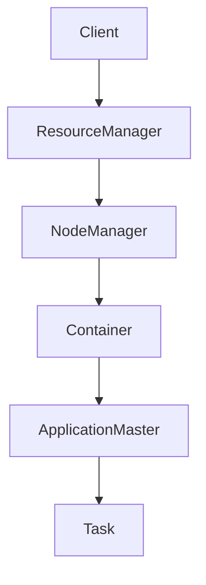

# Yarn资源管理和任务调度原理与代码实例讲解

## 1. 背景介绍
### 1.1 大数据计算平台的发展历程
#### 1.1.1 传统数据处理方式的局限性
#### 1.1.2 Hadoop的诞生与发展
#### 1.1.3 资源管理和任务调度的重要性
### 1.2 Yarn的产生背景
#### 1.2.1 MapReduce 1.0的不足之处
#### 1.2.2 资源利用率低下问题
#### 1.2.3 可扩展性和兼容性差

## 2. 核心概念与联系
### 2.1 Yarn的架构设计
#### 2.1.1 ResourceManager
#### 2.1.2 NodeManager
#### 2.1.3 ApplicationMaster
#### 2.1.4 Container
### 2.2 资源管理模型
#### 2.2.1 资源请求和分配机制
#### 2.2.2 资源隔离与多租户
#### 2.2.3 资源调度策略
### 2.3 任务调度流程
#### 2.3.1 应用提交与初始化
#### 2.3.2 任务分配与执行
#### 2.3.3 进度监控和容错处理



## 3. 核心算法原理具体操作步骤
### 3.1 资源调度算法
#### 3.1.1 FIFO调度器
#### 3.1.2 Capacity调度器
#### 3.1.3 Fair调度器
### 3.2 任务调度优化技术
#### 3.2.1 数据本地性优化
#### 3.2.2 推测执行
#### 3.2.3 任务倾斜处理
### 3.3 资源动态分配
#### 3.3.1 弹性资源分配
#### 3.3.2 动态资源请求与释放
#### 3.3.3 资源超卖与回收

## 4. 数学模型和公式详细讲解举例说明
### 4.1 资源需求估算模型
#### 4.1.1 基于历史数据的预测
#### 4.1.2 在线资源需求预测
### 4.2 任务执行时间预估
#### 4.2.1 基于任务复杂度的预估
#### 4.2.2 考虑数据倾斜的预估模型
### 4.3 资源利用率优化模型
#### 4.3.1 多目标优化问题建模
#### 4.3.2 启发式算法求解

资源需求可以用以下公式估算：

$ResourceDemand = \sum_{i=1}^{n} (TaskExecTime_i * TaskResource_i)$

其中，$TaskExecTime_i$ 表示第 $i$ 个任务的执行时间，$TaskResource_i$ 表示第 $i$ 个任务所需的资源量。

## 5. 项目实践：代码实例和详细解释说明
### 5.1 Yarn集群环境搭建
#### 5.1.1 前置条件与依赖安装
#### 5.1.2 ResourceManager与NodeManager部署
#### 5.1.3 调度器配置与优化
### 5.2 提交Yarn应用程序
#### 5.2.1 编写Yarn应用程序
#### 5.2.2 打包与提交应用
#### 5.2.3 监控应用执行进度
### 5.3 自定义调度器开发
#### 5.3.1 实现AbstractYarnScheduler接口
#### 5.3.2 资源分配算法设计
#### 5.3.3 调度器部署与测试

下面是一个简单的Yarn应用程序示例：

```java
public class YarnExample {
    public static void main(String[] args) throws Exception {
        Configuration conf = new Configuration();
        String[] otherArgs = new GenericOptionsParser(conf, args).getRemainingArgs();

        // 创建Yarn客户端
        YarnClient yarnClient = YarnClient.createYarnClient();
        yarnClient.init(conf);
        yarnClient.start();

        // 创建应用程序提交上下文
        ApplicationSubmissionContext appContext = yarnClient.createApplication().getApplicationSubmissionContext();
        appContext.setApplicationName("Yarn Example");

        // 设置ApplicationMaster的资源需求
        Resource capability = Resource.newInstance(1024, 1);
        appContext.setResource(capability);

        // 设置ApplicationMaster的启动命令
        ContainerLaunchContext amContainer = ContainerLaunchContext.newInstance(
            Collections.<String, LocalResource>emptyMap(),
            new HashMap<String, String>(),
            Arrays.asList("java", "-Xmx1024M", "YarnApplicationMaster"),
            null,
            null,
            null
        );
        appContext.setAMContainerSpec(amContainer);

        // 提交应用程序
        yarnClient.submitApplication(appContext);

        yarnClient.close();
    }
}
```

## 6. 实际应用场景
### 6.1 大规模数据处理
#### 6.1.1 日志分析
#### 6.1.2 用户行为分析
#### 6.1.3 推荐系统
### 6.2 机器学习与数据挖掘
#### 6.2.1 分布式机器学习训练
#### 6.2.2 特征工程与数据预处理
#### 6.2.3 模型评估与优化
### 6.3 流式数据处理
#### 6.3.1 实时日志分析
#### 6.3.2 流式ETL
#### 6.3.3 实时异常检测

## 7. 工具和资源推荐
### 7.1 Yarn生态系统
#### 7.1.1 Hadoop MapReduce
#### 7.1.2 Spark on Yarn
#### 7.1.3 Flink on Yarn
### 7.2 资源管理与任务调度工具
#### 7.2.1 Azkaban
#### 7.2.2 Oozie
#### 7.2.3 Airflow
### 7.3 性能监控与诊断工具
#### 7.3.1 Ganglia
#### 7.3.2 Grafana
#### 7.3.3 Dr. Elephant

## 8. 总结：未来发展趋势与挑战
### 8.1 Yarn的优势与不足
#### 8.1.1 灵活的资源管理
#### 8.1.2 丰富的生态系统
#### 8.1.3 可扩展性挑战
### 8.2 资源管理与任务调度的发展趋势
#### 8.2.1 智能化与自适应调度
#### 8.2.2 异构资源管理
#### 8.2.3 云原生架构融合
### 8.3 面临的挑战与机遇
#### 8.3.1 大规模集群的管理复杂度
#### 8.3.2 新兴计算框架的兼容性
#### 8.3.3 数据安全与隐私保护

## 9. 附录：常见问题与解答
### 9.1 Yarn的容错机制是如何实现的？
### 9.2 如何对Yarn集群进行性能调优？
### 9.3 Yarn与Kubernetes的区别与联系是什么？
### 9.4 如何基于Yarn构建机器学习平台？
### 9.5 Yarn在多租户环境下如何实现资源隔离？

Yarn作为一个通用的资源管理和任务调度平台，在大数据处理领域发挥着至关重要的作用。它提供了灵活的资源分配机制、丰富的调度策略以及可扩展的架构设计，使得各种计算框架能够高效地运行在同一个集群之上。

随着数据规模的不断增长和计算需求的日益多样化，Yarn面临着新的挑战和机遇。未来，Yarn需要在智能化调度、异构资源管理、云原生架构融合等方面不断创新，以满足日益复杂的大数据应用场景。同时，如何在保证性能和可扩展性的同时，兼顾数据安全与隐私保护，也是Yarn需要重点关注的问题。

总之，Yarn已经成为大数据处理领域的核心基础设施，它的发展与演进将持续推动整个大数据生态系统的进步。作为开发者和使用者，我们应该深入理解Yarn的原理，积极参与到社区的建设中来，共同推动大数据技术的发展，让它更好地服务于各行各业的数字化转型。

作者：禅与计算机程序设计艺术 / Zen and the Art of Computer Programming