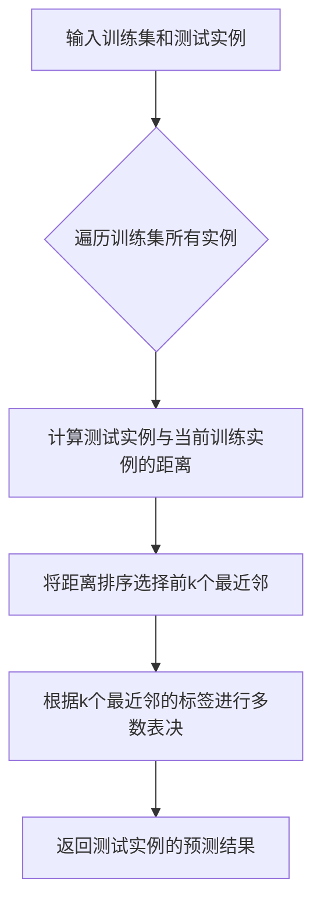

# k近邻算法 原理与代码实例讲解

## 1. 背景介绍
### 1.1 k近邻算法的起源与发展
k近邻(k-Nearest Neighbor,简称kNN)算法是一种基本的分类和回归方法。它最早由Cover和Hart在1968年提出,是一种基于实例的机器学习算法。kNN算法的基本思想非常简单直观:如果一个样本在特征空间中的k个最相似(即特征空间中最邻近)的样本中的大多数属于某一个类别,则该样本也属于这个类别。

### 1.2 k近邻算法的应用场景
k近邻算法是机器学习领域的一种常用算法,在模式识别、数据挖掘、推荐系统等领域有着广泛的应用。比如可以用于图像分类、手写数字识别、文本分类等。kNN算法的优点是思想简单、理论成熟、既可以用来做分类也可以用来做回归。缺点是计算量大,对数据的要求比较高。

## 2. 核心概念与联系
### 2.1 k近邻算法的核心思想
k近邻算法没有显式的学习过程,实际上是利用训练数据集对特征向量空间进行划分,并作为其分类的模型。当新的测试数据出现时,根据其k个最近邻的训练数据的类别,通过多数表决等方式进行预测。因此,kNN算法不具有显式的学习过程。

### 2.2 k近邻算法的三个基本要素
- k值的选择
- 距离度量
- 分类决策规则

### 2.3 k值的选择对算法的影响
k值的选择会对kNN算法的结果产生重大影响:
- 如果选择较小的k值,就相当于用较小的邻域中的训练实例进行预测,"学习"的近似误差(approximation error)会减小,只有与输入实例较近的(相似的)训练实例才会对预测结果起作用。但缺点是"学习"的估计误差(estimation error)会增大,预测结果会对近邻的实例点非常敏感。如果邻近的实例点恰巧是噪声,预测就会出错。换句话说,k值的减小就意味着整体模型变得复杂,容易发生过拟合。
- 如果选择较大的k值,就相当于用较大邻域中的训练实例进行预测。其优点是可以减少学习的估计误差。但缺点是学习的近似误差会增大。这时与输入实例较远的(不相似的)训练实例也会对预测起作用,使预测发生错误。k值的增大就意味着整体的模型变得简单。
- 如果k=N,那么就是用全部的训练实例进行预测,此时kNN算法就退化为简单的多数表决,完全忽略训练实例的空间分布信息。

## 3. 核心算法原理具体操作步骤
### 3.1 算法流程图


### 3.2 算法步骤
1. 准备数据,对数据进行预处理
2. 选择合适的k值
3. 计算测试数据与各个训练数据之间的距离
4. 对距离进行排序,选择出前k个最近邻
5. 根据k个最近邻的标签,通过多数表决等方式进行预测
6. 返回测试数据的预测结果

## 4. 数学模型和公式详细讲解举例说明
### 4.1 距离度量
特征空间中两个实例点的距离是两个实例点相似程度的反映。kNN算法使用的距离度量一般是欧氏距离,也可以是其他距离,如曼哈顿距离等。

设特征空间 $\mathcal{X}$ 是 $n$ 维实数向量空间 $\mathbf{R}^{n}$,$x_{i}, x_{j} \in \mathcal{X}$,$x_{i}=\left(x_{i}^{(1)}, x_{i}^{(2)}, \cdots, x_{i}^{(n)}\right)^{\mathrm{T}}$,$x_{j}=\left(x_{j}^{(1)}, x_{j}^{(2)}, \cdots, x_{j}^{(n)}\right)^{\mathrm{T}}$,则:

- 欧氏距离:
$$L_{2}\left(x_{i}, x_{j}\right)=\sqrt{\sum_{l=1}^{n}\left|x_{i}^{(l)}-x_{j}^{(l)}\right|^{2}}$$

- 曼哈顿距离:
$$L_{1}\left(x_{i}, x_{j}\right)=\sum_{l=1}^{n}\left|x_{i}^{(l)}-x_{j}^{(l)}\right|$$

### 4.2 分类决策规则
kNN算法中的分类决策规则往往是多数表决,即由输入实例的k个邻近的训练实例中的多数类决定输入实例的类。

设输入实例 $x$ 的k个邻近的训练实例的类别标记集合为 $N_{k}(x)$,则 $x$ 的类别 $y$ 可以表示为:
$$y=\arg \max _{c_{j}} \sum_{x_{i} \in N_{k}(x)} I\left(y_{i}=c_{j}\right), i=1,2, \cdots, k$$

其中, $I$ 为指示函数,即当 $y_{i}=c_{j}$ 时 $I$ 为1,否则 $I$ 为0。

## 5. 项目实践：代码实例和详细解释说明
下面以Python语言为例,给出kNN算法的简单实现:

```python
import numpy as np
from collections import Counter

class KNN:
    def __init__(self, k=3):
        self.k = k

    def fit(self, X, y):
        self.X_train = X
        self.y_train = y

    def predict(self, X):
        predictions = [self._predict(x) for x in X]
        return predictions

    def _predict(self, x):
        # 计算距离
        distances = [np.sqrt(np.sum((x_train - x)**2)) for x_train in self.X_train]
        # 获取最近的k个索引
        indices = np.argsort(distances)[:self.k]
        # 获取最近的k个标签
        k_nearest_labels = [self.y_train[i] for i in indices]
        # 多数表决
        most_common = Counter(k_nearest_labels).most_common()
        return most_common[0][0]
```

代码解释:
- 首先定义了一个KNN类,初始化参数k,默认值为3。
- fit方法用于训练模型,将训练数据保存下来。
- predict方法用于预测,对每个测试实例调用_predict方法。
- _predict方法是预测的核心,先计算测试实例与所有训练实例的距离,然后选择最近的k个,根据它们的标签进行多数表决,返回最终的预测结果。

## 6. 实际应用场景
kNN算法在实际中有很多应用,比如:
- 推荐系统:可以用kNN算法找到与当前用户最相似的k个用户,然后基于他们的偏好为当前用户做推荐。
- 图像识别:可以用kNN算法对图像的特征向量进行分类,实现图像识别。
- 文本分类:可以用kNN算法对文本的词频向量进行分类,实现文本分类。
- 异常检测:可以用kNN算法检测数据中的异常点。

## 7. 工具和资源推荐
- scikit-learn库:scikit-learn是Python的一个机器学习库,提供了kNN算法的高效实现。
- MATLAB:MATLAB中也提供了kNN算法的实现。
- OpenCV:OpenCV是一个计算机视觉库,其中也包含了kNN算法的实现,可以用于图像分类等任务。

## 8. 总结：未来发展趋势与挑战
### 8.1 kNN算法的优缺点
优点:
- 思想简单,理论成熟,既可以用来做分类也可以用来做回归
- 训练时间复杂度为O(n),n为训练实例数,可以很好地适应大数据场景
- 对异常值不敏感

缺点:
- 计算量大,尤其是特征空间维度高时,计算量会很大
- 需要大量的内存
- 对数据的要求比较高,数据的分布会严重影响kNN算法的效果

### 8.2 kNN算法的改进方向
- 特征权重:可以对不同的特征赋予不同的权重,提高算法的性能
- k值的选择:可以使用交叉验证等方法来选择最优的k值
- 距离度量的选择:可以根据数据的特点选择不同的距离度量方式
- 数据预处理:对数据进行归一化、特征选择等预处理操作,可以提高算法的效果

## 9. 附录：常见问题与解答
### 9.1 kNN算法适用于哪些场景?
kNN算法适用于分类和回归任务,尤其适合于样本容量比较小、空间维度比较低的数据集。对于样本容量很大或者空间维度很高的数据,使用kNN算法的计算量会很大。

### 9.2 如何选择k值?
k值的选择很重要,会影响算法的性能。一般可以通过交叉验证的方式来选择最优的k值。此外,k值的选择也要考虑数据的分布情况,一般k值选择得较小一些,因为k值较大时,模型的复杂度就会降低,容易欠拟合。

### 9.3 kNN算法的时间复杂度是多少?
kNN算法的训练时间复杂度是O(n),n为训练实例数。而预测时间复杂度是O(n×k),n为训练实例数,k为最近邻的数目。可以看出,当训练实例数量很大时,预测的计算量会很大。

### 9.4 如何提高kNN算法的效率?
可以采取以下措施来提高kNN算法的效率:
- 使用kd树、球树等数据结构来存储训练数据,可以大大减少搜索时间
- 对数据进行特征选择,降低特征空间的维度
- 使用近似最近邻搜索算法,如Locality Sensitive Hashing等

作者：禅与计算机程序设计艺术 / Zen and the Art of Computer Programming