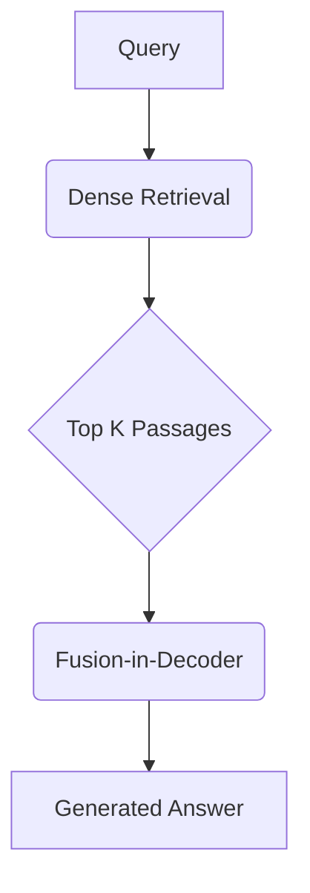

# 【LangChain编程：从入门到实践】RAG技术概述

## 1. 背景介绍
### 1.1 大语言模型的发展历程
#### 1.1.1 早期的语言模型
#### 1.1.2 Transformer的出现
#### 1.1.3 预训练语言模型的崛起

### 1.2 知识增强的需求
#### 1.2.1 大语言模型的局限性
#### 1.2.2 知识获取和融合的重要性
#### 1.2.3 RAG技术的提出

## 2. 核心概念与联系
### 2.1 RAG的定义与特点
#### 2.1.1 RAG的基本概念
#### 2.1.2 RAG与传统知识库问答的区别
#### 2.1.3 RAG的优势与局限

### 2.2 RAG的核心组件
#### 2.2.1 文档检索模块
#### 2.2.2 阅读理解模块
#### 2.2.3 生成模块

### 2.3 RAG与相关技术的联系
#### 2.3.1 RAG与信息检索的关系
#### 2.3.2 RAG与机器阅读理解的关系
#### 2.3.3 RAG与知识图谱的结合

## 3. 核心算法原理与具体操作步骤
### 3.1 Dense Passage Retrieval (DPR)
#### 3.1.1 DPR的基本原理
#### 3.1.2 正负样本对的构建
#### 3.1.3 双塔式模型的训练

### 3.2 Fusion-in-Decoder (FiD)
#### 3.2.1 FiD的动机与思路
#### 3.2.2 将检索结果融入解码器
#### 3.2.3 端到端的训练方法

### 3.3 Retrieval-Augmented Generation (RAG)
#### 3.3.1 RAG的整体架构
#### 3.3.2 检索与生成的迭代优化
#### 3.3.3 无监督与半监督设置下的RAG训练

### 3.4 RAG算法的具体操作步骤
#### 3.4.1 构建文档库与索引
#### 3.4.2 fine-tune检索器与生成器
#### 3.4.3 推理阶段的检索-生成流程

## 4. 数学模型和公式详细讲解举例说明
### 4.1 Dense Passage Retrieval的数学建模
#### 4.1.1 query和passage的编码
#### 4.1.2 相似度计算与损失函数
#### 4.1.3 负采样策略的数学分析

### 4.2 Fusion-in-Decoder的数学原理
#### 4.2.1 将passage表示融入解码器
#### 4.2.2 attention机制的数学推导
#### 4.2.3 端到端训练的目标函数设计

举例说明：假设我们有一个query $q$，和一个passage集合$P=\{p_1,p_2,...,p_n\}$。我们的目标是从$P$中检索出与$q$最相关的$k$个passage $\{p_{i_1},p_{i_2},...,p_{i_k}\}$，然后基于这$k$个passage生成最终的答案$a$。

首先，我们通过双塔式的检索器对query和passage进行编码：

$\mathbf{q} = \text{Encoder}_q(q)$

$\mathbf{p}_i = \text{Encoder}_p(p_i), i=1,2,...,n$

然后，我们计算query和每个passage的相似度，通常使用内积或cosine相似度：

$\text{sim}(\mathbf{q},\mathbf{p}_i) = \mathbf{q}^\top \mathbf{p}_i$

我们选取相似度最高的$k$个passage $\{p_{i_1},p_{i_2},...,p_{i_k}\}$，将其编码后的向量表示记为$\{\mathbf{p}_{i_1},\mathbf{p}_{i_2},...,\mathbf{p}_{i_k}\}$。

接下来，我们使用Fusion-in-Decoder的方法，将这$k$个passage的表示融合到解码器中。在生成答案的每一步，解码器都会attend到这$k$个passage表示上：

$\mathbf{h}_t = \text{Decoder}(\mathbf{h}_{t-1}, \mathbf{y}_{t-1}, \mathbf{c}_t)$

其中$\mathbf{c}_t$是通过attention机制得到的context向量：

$\mathbf{c}_t = \sum_{j=1}^k \alpha_{tj} \mathbf{p}_{i_j}$

$\alpha_{tj} = \frac{\exp(e_{tj})}{\sum_{l=1}^k \exp(e_{tl})}$

$e_{tj} = \mathbf{v}^\top \tanh(\mathbf{W}_1 \mathbf{h}_{t-1} + \mathbf{W}_2 \mathbf{p}_{i_j})$

最后，我们基于解码器的输出$\mathbf{h}_t$来预测下一个单词的概率分布，直到生成完整的答案$a$。

## 5. 项目实践：代码实例和详细解释说明
### 5.1 环境准备与数据集介绍
#### 5.1.1 安装必要的库和工具
#### 5.1.2 数据集的格式和预处理

### 5.2 Dense Retrieval的实现
#### 5.2.1 定义query和passage编码器
#### 5.2.2 构建训练数据与损失函数
#### 5.2.3 训练与评估检索器

### 5.3 Fusion-in-Decoder的实现
#### 5.3.1 定义RAG模型结构
#### 5.3.2 实现将passage融入解码器
#### 5.3.3 端到端训练RAG模型

### 5.4 使用RAG模型进行问答
#### 5.4.1 加载预训练的检索器和RAG模型
#### 5.4.2 给定问题进行检索与答案生成
#### 5.4.3 评估生成答案的质量

## 6. 实际应用场景
### 6.1 智能客服与对话系统
#### 6.1.1 利用RAG构建知识增强的聊天机器人
#### 6.1.2 结合领域知识库的客服问答系统

### 6.2 搜索引擎与信息检索
#### 6.2.1 基于RAG的开放域问答搜索引擎
#### 6.2.2 利用RAG优化搜索结果的多样性

### 6.3 教育与智能辅导
#### 6.3.1 RAG在智能教育助手中的应用
#### 6.3.2 构建个性化的知识推荐与解释系统

## 7. 工具和资源推荐
### 7.1 开源实现与代码库
#### 7.1.1 Facebook的DPR实现
#### 7.1.2 Hugging Face的RAG实现
#### 7.1.3 Pyserini工具包

### 7.2 相关论文与学习资源
#### 7.2.1 RAG相关的重要论文列表
#### 7.2.2 RAG技术的教程与博客
#### 7.2.3 相关的学术会议与研讨会

## 8. 总结：未来发展趋势与挑战
### 8.1 RAG技术的优势与局限
#### 8.1.1 RAG在知识密集型任务上的优势
#### 8.1.2 RAG面临的挑战与问题

### 8.2 结合领域知识的RAG模型
#### 8.2.1 将结构化知识引入RAG框架
#### 8.2.2 领域自适应的RAG模型

### 8.3 探索RAG的可解释性
#### 8.3.1 理解RAG的决策过程
#### 8.3.2 提高RAG输出的可解释性

### 8.4 面向少样本学习的RAG
#### 8.4.1 元学习在RAG中的应用
#### 8.4.2 探索无监督与半监督的RAG训练范式

## 9. 附录：常见问题与解答
### 9.1 RAG与REALM的区别与联系
### 9.2 如何选择合适的文档粒度进行检索
### 9.3 引入知识蒸馏提高RAG的效率
### 9.4 多轮对话中的RAG应用
### 9.5 评估RAG模型的指标与方法

作者：禅与计算机程序设计艺术 / Zen and the Art of Computer Programming