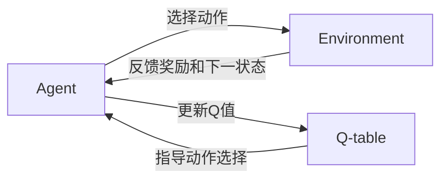

# 一切皆是映射：AI Q-learning在复杂系统中的挑战

## 1. 背景介绍
### 1.1 人工智能的发展历程
#### 1.1.1 人工智能的起源与定义
#### 1.1.2 人工智能的三次浪潮
#### 1.1.3 当前人工智能的发展现状

### 1.2 强化学习的兴起
#### 1.2.1 强化学习的基本概念
#### 1.2.2 强化学习的发展历程
#### 1.2.3 强化学习的优势与挑战

### 1.3 Q-learning算法简介
#### 1.3.1 Q-learning的基本原理
#### 1.3.2 Q-learning的优缺点分析
#### 1.3.3 Q-learning在复杂系统中的应用前景

## 2. 核心概念与联系
### 2.1 马尔可夫决策过程(MDP)
#### 2.1.1 MDP的定义与组成要素
#### 2.1.2 MDP的贝尔曼方程
#### 2.1.3 MDP与强化学习的关系

### 2.2 状态、动作与奖励
#### 2.2.1 状态空间与状态转移概率
#### 2.2.2 动作空间与策略函数
#### 2.2.3 即时奖励与累积奖励

### 2.3 探索与利用的平衡
#### 2.3.1 探索与利用的概念
#### 2.3.2 ε-贪婪策略
#### 2.3.3 软性最大化策略

### 2.4 值函数与策略函数
#### 2.4.1 状态值函数与动作值函数
#### 2.4.2 确定性策略与随机性策略
#### 2.4.3 值函数与策略函数的关系

## 3. 核心算法原理具体操作步骤
### 3.1 Q-learning算法流程
#### 3.1.1 算法伪代码
#### 3.1.2 算法步骤详解
#### 3.1.3 算法收敛性证明

### 3.2 Q值表的更新
#### 3.2.1 Q值表的定义
#### 3.2.2 Q值表的初始化方法
#### 3.2.3 Q值表的更新公式

### 3.3 行动策略的选择
#### 3.3.1 ε-贪婪策略的实现
#### 3.3.2 软性最大化策略的实现
#### 3.3.3 两种策略的比较

### 3.4 Q-learning算法的改进
#### 3.4.1 Double Q-learning
#### 3.4.2 Prioritized Experience Replay
#### 3.4.3 Dueling Network Architecture

## 4. 数学模型和公式详细讲解举例说明
### 4.1 Q值更新公式推导
#### 4.1.1 贝尔曼最优方程
#### 4.1.2 时间差分学习
#### 4.1.3 Q-learning更新公式

### 4.2 ε-贪婪策略的数学表示
#### 4.2.1 ε-贪婪策略的概率分布
#### 4.2.2 ε值的选择对算法性能的影响
#### 4.2.3 数值模拟与可视化结果

### 4.3 软性最大化策略的数学表示
#### 4.3.1 Softmax函数与Boltzmann分布
#### 4.3.2 温度参数对策略的影响
#### 4.3.3 数值模拟与可视化结果

### 4.4 Q值收敛性证明
#### 4.4.1 收敛性定义
#### 4.4.2 收敛性证明的数学推导
#### 4.4.3 收敛速度分析

## 5. 项目实践：代码实例和详细解释说明
### 5.1 简单的网格世界环境
#### 5.1.1 环境设置与状态空间定义
#### 5.1.2 Q-learning算法实现
#### 5.1.3 训练过程与结果分析

### 5.2 经典控制问题：倒立摆
#### 5.2.1 倒立摆系统建模
#### 5.2.2 状态与动作空间设计
#### 5.2.3 Q-learning算法求解

### 5.3 Atari游戏：Breakout
#### 5.3.1 游戏环境介绍
#### 5.3.2 卷积神经网络结构设计
#### 5.3.3 Deep Q-Network算法实现

### 5.4 自动驾驶中的应用
#### 5.4.1 自动驾驶决策系统概述
#### 5.4.2 状态空间与动作空间设计
#### 5.4.3 Deep Q-learning算法实现

## 6. 实际应用场景
### 6.1 智能交通系统
#### 6.1.1 交通信号控制
#### 6.1.2 拥堵路段预测与规避
#### 6.1.3 车流量预测与调度

### 6.2 智能电网调度
#### 6.2.1 电力负荷预测
#### 6.2.2 可再生能源发电调度
#### 6.2.3 需求侧响应管理

### 6.3 金融量化交易
#### 6.3.1 股票市场预测
#### 6.3.2 投资组合优化
#### 6.3.3 高频交易策略

### 6.4 智能推荐系统
#### 6.4.1 用户行为建模
#### 6.4.2 个性化推荐策略
#### 6.4.3 在线学习与实时反馈

## 7. 工具和资源推荐
### 7.1 强化学习框架
#### 7.1.1 OpenAI Gym
#### 7.1.2 TensorFlow Agents
#### 7.1.3 PyTorch RL

### 7.2 开源项目与教程
#### 7.2.1 DeepMind强化学习课程
#### 7.2.2 Denny Britz的强化学习实现
#### 7.2.3 OpenAI Spinning Up

### 7.3 学术论文与书籍
#### 7.3.1 经典论文推荐
#### 7.3.2 强化学习教材
#### 7.3.3 前沿研究方向

## 8. 总结：未来发展趋势与挑战
### 8.1 Q-learning算法的局限性
#### 8.1.1 维度灾难问题
#### 8.1.2 样本效率低下
#### 8.1.3 探索策略的选择困境

### 8.2 结合深度学习的发展方向
#### 8.2.1 Deep Q-Network及其变体
#### 8.2.2 策略梯度方法
#### 8.2.3 Actor-Critic架构

### 8.3 多智能体强化学习
#### 8.3.1 博弈论与纳什均衡
#### 8.3.2 合作与竞争机制设计
#### 8.3.3 群体智能涌现

### 8.4 强化学习的可解释性
#### 8.4.1 可解释性的重要性
#### 8.4.2 基于因果推理的可解释性
#### 8.4.3 层次化强化学习

## 9. 附录：常见问题与解答
### 9.1 Q-learning与Sarsa的区别
### 9.2 如何设计合适的奖励函数
### 9.3 探索率ε的调整策略
### 9.4 Q值表过大时的处理方法
### 9.5 如何评估强化学习算法的性能

Q-learning算法作为一种经典的强化学习算法，通过智能体（Agent）与环境（Environment）的交互，不断更新Q值表，最终学习到最优策略。在这个过程中，智能体根据当前状态选择一个动作，环境接收动作后反馈给智能体一个即时奖励和下一个状态，智能体再利用这些信息更新Q值表。更新后的Q值表将指导智能体在下一次决策中选择更优的动作。这个循环往复的过程使得智能体能够在未知环境中通过自主学习来优化自身的决策能力。

Q-learning的核心是价值函数的更新，即Q值表的更新。Q值表是一个二维表格，行表示状态，列表示动作，每个元素$Q(s,a)$表示在状态$s$下采取动作$a$的长期累积奖励的期望值。Q值的更新公式为：

$$Q(s_t,a_t) \leftarrow Q(s_t,a_t)+\alpha[r_{t+1}+\gamma \max_a Q(s_{t+1},a)-Q(s_t,a_t)]$$

其中，$s_t$和$a_t$分别表示当前状态和动作，$r_{t+1}$表示采取动作$a_t$后获得的即时奖励，$s_{t+1}$表示下一个状态，$\alpha$是学习率，$\gamma$是折扣因子。这个公式的含义是，将当前Q值朝着目标Q值的方向进行更新，目标Q值由即时奖励和下一状态的最大Q值来确定，体现了贝尔曼最优方程的思想。

在实际应用中，Q-learning算法已经被广泛应用于各个领域。以智能交通系统为例，Q-learning可以用于优化交通信号灯的控制策略。通过将交通流量、车辆排队长度等信息作为状态，将信号灯的配时方案作为动作，并以交通流量的通过效率作为奖励，Q-learning算法可以自主学习出最优的信号配时策略，从而缓解交通拥堵，提高通行效率。

类似地，在智能电网调度、金融量化交易、智能推荐系统等领域，Q-learning算法也能够发挥其自主学习和优化决策的优势，为复杂系统的智能化控制提供新的思路和方法。

然而，Q-learning算法也存在一些局限性，如维度灾难问题、样本效率低下、探索策略选择困境等。为了克服这些局限性，研究者们提出了多种改进方法，如Double Q-learning、Prioritized Experience Replay、Dueling Network等。此外，将Q-learning与深度学习相结合，发展出了Deep Q-Network等算法，进一步提升了Q-learning在高维状态空间下的表现。

未来，Q-learning算法的发展方向可能包括与深度学习的进一步融合、多智能体强化学习、强化学习的可解释性等。通过借鉴博弈论、因果推理、层次化学习等理论，Q-learning有望在更加复杂的现实场景中发挥更大的作用，推动人工智能在各个领域的应用和发展。

总之，Q-learning作为一种简单而有效的强化学习算法，为我们理解和解决复杂系统中的决策优化问题提供了重要的工具和视角。通过不断探索Q-learning的改进方向和应用场景，我们有望在构建更加智能、高效、可解释的决策系统方面取得更大的突破，为人工智能的发展贡献力量。

作者：禅与计算机程序设计艺术 / Zen and the Art of Computer Programming