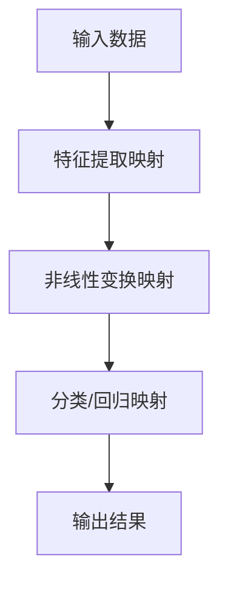

# 一切皆是映射：深度学习优化技术概览

## 1. 背景介绍
### 1.1 深度学习的发展历程
#### 1.1.1 人工智能的起源与演变
#### 1.1.2 深度学习的兴起
#### 1.1.3 深度学习的应用领域

### 1.2 深度学习面临的挑战
#### 1.2.1 模型复杂度不断增加
#### 1.2.2 计算资源需求巨大
#### 1.2.3 训练时间长、效率低

### 1.3 深度学习优化技术的重要性
#### 1.3.1 提升模型训练效率
#### 1.3.2 降低计算资源消耗
#### 1.3.3 加速模型收敛速度

## 2. 核心概念与联系
### 2.1 映射的概念
#### 2.1.1 数学中的映射定义
#### 2.1.2 深度学习中的映射
#### 2.1.3 映射与函数的关系

### 2.2 深度学习中的关键映射
#### 2.2.1 特征提取映射
#### 2.2.2 非线性变换映射
#### 2.2.3 分类/回归映射

### 2.3 映射与深度学习优化的关系
#### 2.3.1 优化目标：寻找最优映射
#### 2.3.2 优化过程：调整映射参数
#### 2.3.3 优化结果：获得性能更优的映射

## 3. 核心算法原理与具体操作步骤
### 3.1 梯度下降法
#### 3.1.1 梯度的概念与计算
#### 3.1.2 学习率的选择
#### 3.1.3 批量梯度下降、随机梯度下降与小批量梯度下降

### 3.2 反向传播算法
#### 3.2.1 前向传播与损失函数
#### 3.2.2 反向传播的链式法则
#### 3.2.3 权重更新与梯度清零

### 3.3 优化算法
#### 3.3.1 动量法(Momentum)
#### 3.3.2 自适应学习率方法(AdaGrad、RMSprop)
#### 3.3.3 自适应矩估计方法(Adam、Nadam)

## 4. 数学模型和公式详细讲解举例说明
### 4.1 损失函数
#### 4.1.1 均方误差损失(MSE)
$$L(y, \hat{y}) = \frac{1}{n} \sum_{i=1}^{n} (y_i - \hat{y}_i)^2$$
#### 4.1.2 交叉熵损失(Cross-entropy)
$$L(y, \hat{y}) = -\sum_{i=1}^{n} y_i \log(\hat{y}_i)$$

### 4.2 激活函数
#### 4.2.1 Sigmoid函数
$$\sigma(x) = \frac{1}{1 + e^{-x}}$$
#### 4.2.2 ReLU函数
$$f(x) = max(0, x)$$

### 4.3 正则化方法
#### 4.3.1 L1正则化
$$L(w) = \lambda \sum_{i=1}^{n} |w_i|$$
#### 4.3.2 L2正则化
$$L(w) = \lambda \sum_{i=1}^{n} w_i^2$$

## 5. 项目实践：代码实例和详细解释说明
### 5.1 基于TensorFlow的实现
#### 5.1.1 数据准备与预处理
#### 5.1.2 模型构建与编译
#### 5.1.3 模型训练与评估

### 5.2 基于PyTorch的实现
#### 5.2.1 数据加载与转换
#### 5.2.2 模型定义与初始化
#### 5.2.3 训练循环与测试

### 5.3 超参数调优与模型优化
#### 5.3.1 学习率与批量大小的选择
#### 5.3.2 正则化与Dropout的使用
#### 5.3.3 模型集成与知识蒸馏

## 6. 实际应用场景
### 6.1 计算机视觉
#### 6.1.1 图像分类与目标检测
#### 6.1.2 语义分割与实例分割
#### 6.1.3 人脸识别与属性分析

### 6.2 自然语言处理
#### 6.2.1 文本分类与情感分析
#### 6.2.2 命名实体识别与关系抽取
#### 6.2.3 机器翻译与文本生成

### 6.3 语音识别与合成
#### 6.3.1 声学模型与语言模型
#### 6.3.2 端到端语音识别
#### 6.3.3 语音合成与声音克隆

## 7. 工具和资源推荐
### 7.1 深度学习框架
#### 7.1.1 TensorFlow
#### 7.1.2 PyTorch
#### 7.1.3 Keras

### 7.2 可视化工具
#### 7.2.1 TensorBoard
#### 7.2.2 Visdom
#### 7.2.3 Matplotlib

### 7.3 预训练模型与数据集
#### 7.3.1 ImageNet与COCO
#### 7.3.2 BERT与GPT
#### 7.3.3 LibriSpeech与VoxCeleb

## 8. 总结：未来发展趋势与挑战
### 8.1 模型轻量化与移动端部署
#### 8.1.1 模型压缩与剪枝
#### 8.1.2 量化与低精度计算
#### 8.1.3 硬件加速与专用芯片

### 8.2 自监督学习与无监督学习
#### 8.2.1 对比学习与聚类
#### 8.2.2 生成对抗网络(GAN)
#### 8.2.3 自回归模型与变分自编码器(VAE)

### 8.3 跨模态学习与迁移学习
#### 8.3.1 视觉-语言预训练模型
#### 8.3.2 语音-文本对齐与融合
#### 8.3.3 领域自适应与Few-shot学习

## 9. 附录：常见问题与解答
### 9.1 如何选择合适的优化算法？
### 9.2 如何避免过拟合与欠拟合？
### 9.3 如何加速模型收敛？
### 9.4 如何处理梯度消失与梯度爆炸问题？
### 9.5 如何平衡模型性能与计算效率？

深度学习作为人工智能的核心驱动力,在计算机视觉、自然语言处理、语音识别等领域取得了突破性进展。然而,随着模型复杂度的不断提升,深度学习面临着计算资源需求巨大、训练时间长、效率低下等挑战。优化技术成为了深度学习发展的关键。

本文从"一切皆是映射"的角度出发,对深度学习优化技术进行了系统性的概览。我们首先介绍了深度学习的发展历程与面临的挑战,阐述了优化技术的重要性。接着,我们重点探讨了映射的概念及其与深度学习的关系,并给出了直观的流程图展示。

在算法原理部分,我们详细讲解了梯度下降法、反向传播算法以及各种优化算法的原理与操作步骤。同时,我们还从数学角度对损失函数、激活函数、正则化方法等进行了推导与分析。

为了加深读者理解,我们提供了基于TensorFlow和PyTorch的代码实例,并就超参数调优、模型优化等实践问题给出了指导意见。此外,我们还列举了深度学习在计算机视觉、自然语言处理、语音识别等领域的实际应用场景,展示了优化技术的威力。

在工具和资源推荐部分,我们介绍了主流的深度学习框架、可视化工具以及常用的预训练模型与数据集,为读者提供了丰富的参考资源。

展望未来,深度学习优化技术还面临着诸多挑战和机遇。模型轻量化、自监督学习、跨模态学习等前沿方向值得持续关注。我们相信,随着优化技术的不断创新,深度学习必将在更广阔的领域释放出巨大的潜力,推动人工智能迈向新的高度。

作者：禅与计算机程序设计艺术 / Zen and the Art of Computer Programming