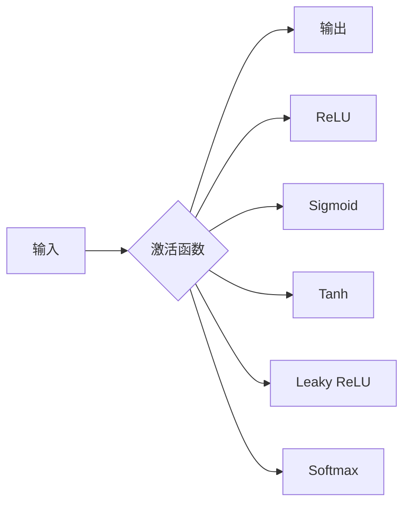

# 一切皆是映射：激活函数的选择与影响

## 1. 背景介绍
在人工神经网络中,激活函数扮演着至关重要的角色。它们决定了每个神经元的输出,进而影响整个网络的性能。激活函数的选择直接关系到模型的表达能力、收敛速度以及泛化能力。因此,深入理解不同激活函数的特点,并根据具体任务来选择合适的激活函数,对于构建高效的神经网络模型至关重要。

### 1.1 神经网络中的信息传递
#### 1.1.1 神经元的数学模型
#### 1.1.2 激活函数的作用
#### 1.1.3 激活函数与生物神经元的类比

### 1.2 激活函数的发展历程
#### 1.2.1 早期的阶跃函数
#### 1.2.2 Sigmoid函数的兴起
#### 1.2.3 ReLU函数的广泛应用
#### 1.2.4 新兴激活函数的探索

## 2. 核心概念与联系
### 2.1 激活函数的数学定义
#### 2.1.1 映射的概念
#### 2.1.2 激活函数的一般形式
#### 2.1.3 常见激活函数的数学表达式

### 2.2 激活函数的性质
#### 2.2.1 非线性
#### 2.2.2 可微性
#### 2.2.3 单调性
#### 2.2.4 有界性

### 2.3 激活函数与神经网络的关系
#### 2.3.1 前向传播中的作用
#### 2.3.2 反向传播中的梯度计算
#### 2.3.3 激活函数对网络容量的影响

## 3. 核心算法原理具体操作步骤
### 3.1 Sigmoid函数
#### 3.1.1 数学定义与图像
#### 3.1.2 优缺点分析
#### 3.1.3 在神经网络中的应用

### 3.2 Tanh函数
#### 3.2.1 数学定义与图像
#### 3.2.2 与Sigmoid函数的比较
#### 3.2.3 在神经网络中的应用

### 3.3 ReLU函数
#### 3.3.1 数学定义与图像
#### 3.3.2 优缺点分析
#### 3.3.3 在深度神经网络中的广泛应用

### 3.4 Leaky ReLU与Parametric ReLU
#### 3.4.1 数学定义与图像
#### 3.4.2 解决"死亡ReLU"问题
#### 3.4.3 超参数的选择

### 3.5 Softmax函数
#### 3.5.1 数学定义
#### 3.5.2 在多分类任务中的应用
#### 3.5.3 与交叉熵损失函数的结合

## 4. 数学模型和公式详细讲解举例说明
### 4.1 Sigmoid函数的推导
#### 4.1.1 指数函数与Logistic函数
#### 4.1.2 Sigmoid函数的导数计算
#### 4.1.3 Sigmoid函数的饱和性问题

### 4.2 ReLU函数的数学分析
#### 4.2.1 ReLU函数的分段线性特点
#### 4.2.2 ReLU函数在 $x=0$ 处的不可微性
#### 4.2.3 ReLU函数的梯度消失问题

### 4.3 Softmax函数的概率解释
#### 4.3.1 Softmax函数与指数函数族的关系
#### 4.3.2 Softmax函数的归一化性质
#### 4.3.3 Softmax函数与最大似然估计的联系

## 5. 项目实践：代码实例和详细解释说明
### 5.1 在Keras中使用内置的激活函数
#### 5.1.1 Sequential模型的构建
#### 5.1.2 Dense层中激活函数的指定
#### 5.1.3 训练与评估

### 5.2 自定义激活函数
#### 5.2.1 继承Layer类
#### 5.2.2 实现`__init__`与`call`方法
#### 5.2.3 在模型中使用自定义激活函数

### 5.3 激活函数对模型性能的影响
#### 5.3.1 搭建多个模型进行对比
#### 5.3.2 不同激活函数下的训练曲线
#### 5.3.3 激活函数的选择策略

## 6. 实际应用场景
### 6.1 图像分类任务
#### 6.1.1 卷积神经网络的构建
#### 6.1.2 ReLU函数在卷积层中的应用
#### 6.1.3 Softmax函数在输出层中的应用

### 6.2 自然语言处理任务
#### 6.2.1 循环神经网络的构建
#### 6.2.2 Tanh函数在LSTM/GRU中的应用
#### 6.2.3 语言模型的训练与评估

### 6.3 生成对抗网络（GAN）
#### 6.3.1 生成器与判别器的设计
#### 6.3.2 Leaky ReLU在生成器中的应用
#### 6.3.3 Sigmoid函数在判别器中的应用

## 7. 工具和资源推荐
### 7.1 深度学习框架
#### 7.1.1 TensorFlow
#### 7.1.2 PyTorch
#### 7.1.3 Keras

### 7.2 可视化工具
#### 7.2.1 TensorBoard
#### 7.2.2 Matplotlib
#### 7.2.3 Seaborn

### 7.3 学习资源
#### 7.3.1 在线课程
#### 7.3.2 经典书籍
#### 7.3.3 研究论文

## 8. 总结：未来发展趋势与挑战
### 8.1 新型激活函数的探索
#### 8.1.1 Swish函数
#### 8.1.2 Mish函数
#### 8.1.3 自适应激活函数

### 8.2 激活函数的自动搜索
#### 8.2.1 神经架构搜索（NAS）
#### 8.2.2 进化算法
#### 8.2.3 强化学习

### 8.3 激活函数在更广泛领域的应用
#### 8.3.1 图神经网络
#### 8.3.2 强化学习
#### 8.3.3 元学习

## 9. 附录：常见问题与解答
### 9.1 如何选择适合的激活函数？
### 9.2 激活函数会导致梯度消失吗？如何解决？
### 9.3 为什么ReLU函数如此受欢迎？
### 9.4 Softmax函数与Sigmoid函数有何区别？
### 9.5 自定义激活函数需要注意哪些问题？

以上是关于激活函数选择与影响的技术博客文章的主要结构和内容。激活函数是神经网络中的关键组件,它们将线性变换后的结果转化为非线性输出,赋予网络强大的表达能力。不同的激活函数有着不同的数学性质和适用场景,深入理解它们的原理并根据具体任务进行选择,是设计高效神经网络模型的重要一环。

随着深度学习的不断发展,新的激活函数不断涌现,它们在不同的应用领域展现出独特的优势。同时,自动化搜索激活函数的技术也在不断进步,为我们提供了更多的可能性。激活函数的研究还将继续深入,不断拓展其在更广泛领域的应用。

作为人工智能领域的从业者,我们应该对激活函数保持持续的关注,跟踪最新的研究进展,并将其应用到实践中去。只有不断学习和探索,我们才能设计出更加智能、高效的神经网络模型,推动人工智能技术的发展。

作者：禅与计算机程序设计艺术 / Zen and the Art of Computer Programming