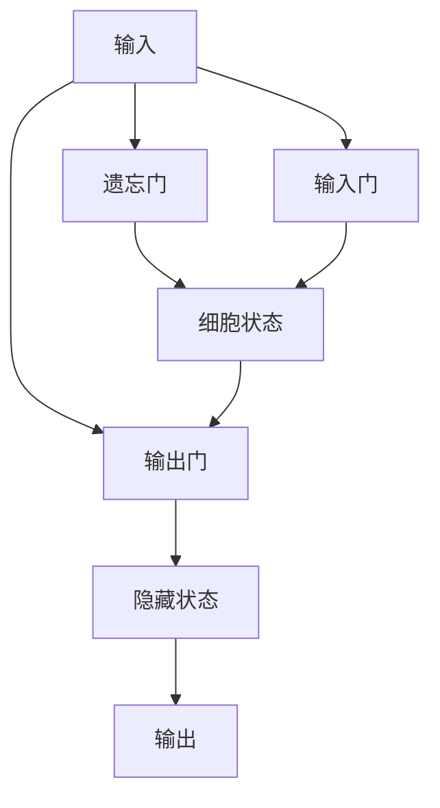

# 一切皆是映射：长短时记忆网络(LSTM)与文本生成

## 1. 背景介绍

### 1.1 人工智能与自然语言处理
人工智能(Artificial Intelligence, AI)是计算机科学的一个分支,旨在创造能够执行通常需要人类智能的任务的智能机器。自然语言处理(Natural Language Processing, NLP)是人工智能的一个重要分支,专注于计算机与人类语言之间的交互。NLP 涉及机器翻译、情感分析、文本摘要、问答系统等广泛的应用。

### 1.2 深度学习与循环神经网络
近年来,深度学习技术的发展极大地推动了 NLP 的进步。深度学习模型能够学习文本数据中的复杂模式和语义信息。循环神经网络(Recurrent Neural Network, RNN)是深度学习中的一类重要模型,特别适用于处理序列数据如文本。RNN 能够维护一个隐藏状态来存储过去的信息,从而更好地捕捉序列的长距离依赖关系。

### 1.3 LSTM 的优势与应用
传统的 RNN 存在梯度消失和梯度爆炸的问题,限制了其学习长期依赖的能力。长短时记忆网络(Long Short-Term Memory, LSTM)是一种改进的 RNN 变体,通过引入门控机制来缓解这些问题。LSTM 在许多 NLP 任务上取得了突破性的进展,如机器翻译、语言模型、文本生成等。本文将深入探讨 LSTM 的核心概念、内部原理以及在文本生成中的应用。

## 2. 核心概念与联系

### 2.1 RNN 的局限性
- 2.1.1 梯度消失与梯度爆炸
- 2.1.2 难以捕捉长期依赖

### 2.2 LSTM 的关键组件
- 2.2.1 细胞状态(Cell State)
- 2.2.2 遗忘门(Forget Gate)
- 2.2.3 输入门(Input Gate)
- 2.2.4 输出门(Output Gate)

### 2.3 LSTM 解决 RNN 问题的方式
- 2.3.1 门控机制控制信息流
- 2.3.2 细胞状态传递长期记忆
- 2.3.3 多个非线性层的组合

### 2.4 LSTM 与文本生成的关系
- 2.4.1 语言模型与概率预测
- 2.4.2 LSTM 建模文本序列
- 2.4.3 基于 LSTM 的文本生成过程

## 3. 核心算法原理具体操作步骤

### 3.1 LSTM 前向传播
- 3.1.1 遗忘门
- 3.1.2 输入门
- 3.1.3 细胞状态更新
- 3.1.4 输出门
- 3.1.5 隐藏状态计算

### 3.2 LSTM 反向传播与参数更新
- 3.2.1 损失函数定义
- 3.2.2 时间反向传播(BPTT)
- 3.2.3 门控单元梯度计算
- 3.2.4 参数更新

### 3.3 LSTM 变体与改进
- 3.3.1 Peephole Connection
- 3.3.2 Coupled Input and Forget Gates
- 3.3.3 Gated Recurrent Unit (GRU)

## 4. 数学模型和公式详细讲解举例说明

### 4.1 LSTM 数学符号定义
- 4.1.1 输入、隐藏状态、细胞状态
- 4.1.2 权重矩阵与偏置向量

### 4.2 门控单元计算公式
- 4.2.1 遗忘门
$$f_t = \sigma(W_f \cdot [h_{t-1}, x_t] + b_f)$$
- 4.2.2 输入门
$$i_t = \sigma(W_i \cdot [h_{t-1}, x_t] + b_i)$$
$$\tilde{C}_t = \tanh(W_C \cdot [h_{t-1}, x_t] + b_C)$$
- 4.2.3 细胞状态更新
$$C_t = f_t * C_{t-1} + i_t * \tilde{C}_t$$
- 4.2.4 输出门
$$o_t = \sigma(W_o \cdot [h_{t-1}, x_t] + b_o)$$
$$h_t = o_t * \tanh(C_t)$$

### 4.3 BPTT 公式推导
- 4.3.1 损失函数对隐藏状态的梯度
- 4.3.2 隐藏状态对细胞状态和门的梯度
- 4.3.3 门对权重矩阵和偏置向量的梯度

### 4.4 数值示例演示
- 4.4.1 前向传播计算步骤
- 4.4.2 反向传播梯度计算步骤
- 4.4.3 参数更新过程

## 5. 项目实践：代码实例和详细解释说明

### 5.1 数据准备与预处理
- 5.1.1 文本数据集介绍
- 5.1.2 文本序列化与向量化
- 5.1.3 构建训练集和验证集

### 5.2 LSTM 模型构建
- 5.2.1 定义 LSTM 层
- 5.2.2 设计模型架构
- 5.2.3 模型参数初始化

### 5.3 模型训练与优化
- 5.3.1 定义损失函数和优化器
- 5.3.2 训练循环与反向传播
- 5.3.3 模型评估与超参数调优

### 5.4 文本生成实现
- 5.4.1 生成过程概述
- 5.4.2 采样策略选择
- 5.4.3 生成结果示例与分析

## 6. 实际应用场景

### 6.1 机器翻译
- 6.1.1 Seq2Seq 模型与 LSTM
- 6.1.2 Attention 机制

### 6.2 情感分析
- 6.2.1 基于 LSTM 的情感分类
- 6.2.2 注意力机制与层次结构

### 6.3 文本摘要
- 6.3.1 抽取式摘要
- 6.3.2 生成式摘要与 LSTM

### 6.4 对话系统
- 6.4.1 LSTM 在对话生成中的应用
- 6.4.2 个性化与上下文感知

## 7. 工具和资源推荐

### 7.1 深度学习框架
- 7.1.1 TensorFlow
- 7.1.2 PyTorch
- 7.1.3 Keras

### 7.2 NLP 工具包
- 7.2.1 NLTK
- 7.2.2 SpaCy
- 7.2.3 Gensim

### 7.3 预训练模型与数据集
- 7.3.1 Word2Vec
- 7.3.2 GloVe
- 7.3.3 WikiText
- 7.3.4 Penn Treebank

### 7.4 学习资源
- 7.4.1 在线课程
- 7.4.2 教程与博客
- 7.4.3 论文与书籍

## 8. 总结：未来发展趋势与挑战

### 8.1 LSTM 的局限性
- 8.1.1 计算复杂度高
- 8.1.2 并行化效率低

### 8.2 注意力机制与 Transformer
- 8.2.1 从 RNN 到 Self-Attention
- 8.2.2 Transformer 架构与优势

### 8.3 预训练语言模型
- 8.3.1 BERT 与双向编码器
- 8.3.2 GPT 与自回归语言模型

### 8.4 可解释性与模型压缩
- 8.4.1 LSTM 的黑盒特性
- 8.4.2 模型蒸馏与剪枝

### 8.5 多模态学习与跨语言建模
- 8.5.1 文本-图像-视频关联
- 8.5.2 多语言 LSTM 模型

## 9. 附录：常见问题与解答

### 9.1 LSTM 如何避免梯度消失和梯度爆炸？
LSTM 通过门控机制控制信息流,允许梯度在很长的序列中稳定传播。细胞状态作为"高速公路",使梯度能够在时间步之间流动而不会快速消失或爆炸。

### 9.2 LSTM 与传统 RNN 相比有哪些优势？
与传统 RNN 相比,LSTM 能够更好地捕捉长期依赖关系,缓解了梯度消失和梯度爆炸问题。LSTM 的门控机制使其能够选择性地记忆和遗忘信息,从而更好地建模复杂的序列模式。

### 9.3 LSTM 的主要应用场景有哪些？
LSTM 广泛应用于各种 NLP 任务,如机器翻译、情感分析、文本摘要、对话系统等。此外,LSTM 还用于时间序列预测、语音识别、图像描述生成等领域。

### 9.4 LSTM 的训练有哪些技巧和注意事项？
训练 LSTM 时,可以使用梯度裁剪来防止梯度爆炸。合适的学习率、正则化技术以及 Dropout 可以提高模型的泛化能力。此外,还需注意数据预处理、批次大小、序列长度等超参数的选择。

### 9.5 LSTM 是否适用于所有类型的序列建模任务？
尽管 LSTM 在许多序列建模任务上表现出色,但它并非万能的。对于某些不需要捕捉长期依赖的简单任务,传统 RNN 或前馈神经网络可能更高效。此外,注意力机制和 Transformer 等新架构在某些任务上展现了优于 LSTM 的性能。

作者：禅与计算机程序设计艺术 / Zen and the Art of Computer Programming

