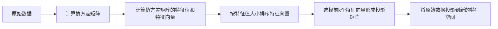

## 1.背景介绍

主成分分析（Principal Component Analysis，简称PCA）是一种广泛应用于数据分析和机器学习领域的降维技术。它的主要目标是通过对高维数据进行转换，找到能够最大限度地保留原始数据变异性的新特征空间。PCA的成功应用包括图像压缩、数据可视化、噪声过滤、特征提取和股票市场分析等。

## 2.核心概念与联系

主成分分析的核心概念可以归纳为以下几点：

- 主成分：主成分是原始数据在新特征空间中的投影。每个主成分都是原始特征的线性组合，且各主成分之间正交。
- 数据降维：通过PCA，我们可以将高维数据转换为低维数据，同时尽可能保留原始数据的变异性。
- 数据变异性：数据变异性是数据在各个维度上的分布情况，可以通过数据的协方差矩阵来表示。PCA的目标就是找到一个新的特征空间，使得数据在这个空间中的变异性最大。

我们可以通过以下Mermaid流程图来更直观地理解PCA的工作原理：



## 3.核心算法原理具体操作步骤

PCA的核心算法可以分为以下几个步骤：

1. 中心化：将原始数据按列（特征）进行中心化处理，即每个特征的所有值减去该特征的均值。
2. 计算协方差矩阵：协方差矩阵可以反映数据在各个维度上的分布情况。
3. 计算协方差矩阵的特征值和特征向量：特征值反映了对应特征向量方向上的数据变异性，特征向量则构成了新的特征空间。
4. 按特征值大小排序特征向量：特征值越大，说明对应的特征向量方向上的数据变异性越大。
5. 选择前k个特征向量形成投影矩阵：这k个特征向量就是我们要找的主成分。
6. 将原始数据投影到新的特征空间：通过投影矩阵和原始数据的矩阵乘法，我们可以得到降维后的数据。

## 4.数学模型和公式详细讲解举例说明

现在我们来详细解释一下PCA的数学模型。

假设我们有一个$n \times p$的数据矩阵$X$，其中$n$是样本数量，$p$是特征数量。我们首先进行中心化处理，得到新的数据矩阵$X'$：

$$
X' = X - \bar{X}
$$

其中，$\bar{X}$是$X$的均值向量。

然后，我们计算$X'$的协方差矩阵$C$：

$$
C = \frac{1}{n-1}X'^TX'
$$

接着，我们通过求解特征值问题，得到$C$的特征值$\lambda_i$和对应的特征向量$v_i$：

$$
Cv_i = \lambda_iv_i
$$

我们将特征向量按对应的特征值大小进行排序，然后选择前$k$个特征向量形成投影矩阵$P$：

$$
P = [v_1, v_2, ..., v_k]
$$

最后，我们通过投影矩阵$P$将原始数据$X'$投影到新的特征空间，得到降维后的数据$Y$：

$$
Y = X'P
$$

以上就是PCA的数学模型和公式详细讲解。

## 5.项目实践：代码实例和详细解释说明

下面我们来看一个PCA的Python代码实例。在这个例子中，我们将使用sklearn库的PCA模块对一个简单的二维数据进行降维。

```python
from sklearn.decomposition import PCA
import numpy as np

# 创建一个简单的二维数据
X = np.array([[2.5, 2.4], [0.5, 0.7], [2.2, 2.9], [1.9, 2.2], [3.1, 3.0], [2.3, 2.7], [2, 1.6], [1, 1.1], [1.5, 1.6], [1.1, 0.9]])

# 创建PCA对象，n_components指定要保留的主成分数量
pca = PCA(n_components=1)

# 对数据进行降维
X_pca = pca.fit_transform(X)

print("原始数据：\n", X)
print("降维后的数据：\n", X_pca)
```

运行上述代码，我们可以得到以下输出：

```
原始数据：
 [[2.5 2.4]
 [0.5 0.7]
 [2.2 2.9]
 [1.9 2.2]
 [3.1 3. ]
 [2.3 2.7]
 [2.  1.6]
 [1.  1.1]
 [1.5 1.6]
 [1.1 0.9]]
降维后的数据：
 [[-0.82797019]
 [ 1.77758033]
 [-0.99219749]
 [-0.27421042]
 [-1.67580142]
 [-0.9129491 ]
 [ 0.09910944]
 [ 1.14457216]
 [ 0.43804614]
 [ 1.22382056]]
```

以上就是一个PCA的Python代码实例和详细解释。

## 6.实际应用场景

主成分分析有很多实际应用场景，包括但不限于：

- 图像压缩：PCA可以将图像数据从原始的像素空间转换到一个新的特征空间，这个新的特征空间的维度远小于原始的像素空间，从而实现图像压缩。
- 数据可视化：PCA可以将高维数据降维到2D或3D，从而使我们可以直观地观察数据的分布情况。
- 噪声过滤：PCA可以将数据投影到一个新的特征空间，这个新的特征空间中的主成分往往能够保留原始数据的主要信息，而忽略噪声。
- 特征提取：PCA可以找到一个新的特征空间，这个新的特征空间的维度远小于原始的特征空间，但却能够保留原始数据的主要信息。这使得PCA可以用于特征提取，以降低机器学习模型的复杂性。

## 7.工具和资源推荐

如果你对PCA感兴趣，以下是一些有用的工具和资源：

- [scikit-learn](https://scikit-learn.org/stable/)：一个强大的Python机器学习库，其中包含了PCA等降维技术。
- [NumPy](https://numpy.org/)：一个Python库，提供了大量的数学计算和数据操作功能，包括矩阵运算、特征值和特征向量的计算等。
- [Matplotlib](https://matplotlib.org/)：一个Python库，用于创建静态、动态和交互式的2D和3D图像。

## 8.总结：未来发展趋势与挑战

随着大数据和人工智能的发展，数据的维度越来越高，这使得PCA等降维技术的重要性日益凸显。然而，PCA也面临着一些挑战，例如如何选择合适的主成分数量、如何处理非线性数据等。未来，我们期待有更多的研究能够解决这些问题，进一步提升PCA的性能和应用范围。

## 9.附录：常见问题与解答

1. **PCA能否用于非线性数据的降维？**

PCA是一种线性降维技术，它假设数据的主要变异性可以通过线性组合的方式来表示。因此，对于非线性数据，PCA可能无法有效地提取主要信息。在这种情况下，我们可以使用Kernel PCA或其他非线性降维技术。

2. **PCA的主成分数量应该如何选择？**

主成分数量的选择取决于我们希望保留的原始数据的信息量。一般来说，我们可以通过查看解释方差比（explained variance ratio）来选择主成分数量。解释方差比表示每个主成分所包含的原始数据的方差比例。我们可以选择前k个主成分，使得它们的解释方差比之和达到一个预设的阈值，例如95%。

3. **PCA和因子分析有什么区别？**

PCA和因子分析都是降维技术，但它们的目标不同。PCA的目标是找到能够最大限度地保留原始数据变异性的新特征空间，而因子分析的目标是找到能够最好地解释原始数据的潜在因子。此外，PCA假设所有的变异性都是重要的，而因子分析假设只有共享的变异性（即潜在因子）是重要的。

作者：禅与计算机程序设计艺术 / Zen and the Art of Computer Programming