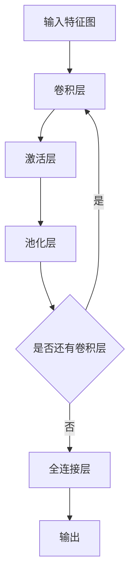

# 从零开始大模型开发与微调：PyTorch中的卷积函数实现详解

## 1. 背景介绍
### 1.1 大模型开发的意义
### 1.2 卷积神经网络在大模型中的应用
### 1.3 PyTorch框架简介

## 2. 核心概念与联系
### 2.1 卷积的数学定义
### 2.2 卷积神经网络的组成
#### 2.2.1 卷积层
#### 2.2.2 池化层
#### 2.2.3 全连接层
### 2.3 卷积与大模型的关系

## 3. 核心算法原理具体操作步骤
### 3.1 卷积的前向传播
### 3.2 卷积的反向传播
### 3.3 卷积的优化策略
#### 3.3.1 卷积核大小的选择
#### 3.3.2 填充与步长的设置
#### 3.3.3 激活函数的选择

## 4. 数学模型和公式详细讲解举例说明
### 4.1 二维卷积的数学表达
### 4.2 多通道卷积的数学表达
### 4.3 转置卷积的数学表达
### 4.4 卷积的矩阵表示

## 5. 项目实践：代码实例和详细解释说明
### 5.1 利用PyTorch实现卷积层
#### 5.1.1 nn.Conv2d类详解
#### 5.1.2 卷积层前向传播的代码实现
#### 5.1.3 卷积层反向传播的代码实现
### 5.2 搭建卷积神经网络完成图像分类任务
#### 5.2.1 数据集的准备
#### 5.2.2 模型构建
#### 5.2.3 模型训练与测试

## 6. 实际应用场景
### 6.1 计算机视觉
#### 6.1.1 图像分类
#### 6.1.2 目标检测
#### 6.1.3 语义分割
### 6.2 自然语言处理
#### 6.2.1 文本分类
#### 6.2.2 情感分析
#### 6.2.3 机器翻译

## 7. 工具和资源推荐
### 7.1 深度学习框架
#### 7.1.1 PyTorch
#### 7.1.2 TensorFlow
#### 7.1.3 Keras
### 7.2 开源大模型
#### 7.2.1 BERT
#### 7.2.2 GPT系列
#### 7.2.3 DALL·E

## 8. 总结：未来发展趋势与挑战
### 8.1 轻量化卷积神经网络的设计
### 8.2 卷积神经网络的可解释性研究
### 8.3 图卷积神经网络的发展

## 9. 附录：常见问题与解答
### 9.1 卷积核大小如何选择？
### 9.2 卷积步长设置多少合适？
### 9.3 如何避免卷积神经网络过拟合？



卷积神经网络(Convolutional Neural Network, CNN)是一种广泛应用于计算机视觉、自然语言处理等领域的深度学习模型。它通过卷积操作提取输入数据的局部特征，再经过池化、非线性激活等操作逐层抽象，最终输出高层语义特征。

卷积的本质是一种特殊的线性运算，对输入信号进行加权求和。一维卷积的数学定义为：

$$
(f*g)[n]=\sum_{m=-\infty}^{\infty}f[m]g[n-m]
$$

其中，$f$ 为输入信号，$g$ 为卷积核，$*$ 表示卷积操作。将一维卷积推广到二维，即得到了我们常用的二维卷积：

$$
(I*K)[i,j]=\sum_m\sum_nI[m,n]K[i-m,j-n]
$$

这里，$I$ 为输入的二维特征图，$K$ 为二维卷积核。

在实际应用中，我们通常使用多通道卷积来处理彩色图像等高维数据。设输入特征图的通道数为 $c_i$，卷积核的通道数为 $c_o$，则多通道卷积的数学表达为：

$$
\begin{aligned}
out[i,j,k]=\sum_{c=0}^{c_i-1}\sum_{m=0}^{k_h-1}\sum_{n=0}^{k_w-1}in[i\times s_h+m,j\times s_w+n,c]\times kernel[m,n,c,k]
\end{aligned}
$$

其中，$k_h$ 和 $k_w$ 分别为卷积核的高和宽，$s_h$ 和 $s_w$ 为卷积步长。

PyTorch作为一个灵活高效的深度学习框架，提供了多个卷积函数和类。最常用的二维卷积可通过`nn.Conv2d`类来实现：

```python
conv = nn.Conv2d(in_channels, out_channels, kernel_size, stride=1, padding=0, bias=True)
```

- `in_channels`：输入特征图的通道数
- `out_channels`：输出特征图的通道数
- `kernel_size`：卷积核大小
- `stride`：卷积步长
- `padding`：填充大小
- `bias`：是否添加偏置

例如，对一个`[16, 3, 32, 32]`的输入，应用`nn.Conv2d(3, 64, 3, padding=1)`后，输出特征图的shape为`[16, 64, 32, 32]`。

下面的代码展示了如何利用PyTorch搭建一个简单的卷积神经网络完成CIFAR-10图像分类任务：

```python
class Net(nn.Module):
    def __init__(self):
        super(Net, self).__init__()
        self.conv1 = nn.Conv2d(3, 64, 3, padding=1)
        self.conv2 = nn.Conv2d(64, 128, 3, padding=1)
        self.conv3 = nn.Conv2d(128, 256, 3, padding=1)
        self.pool = nn.MaxPool2d(2, 2)
        self.fc1 = nn.Linear(256 * 4 * 4, 1024)
        self.fc2 = nn.Linear(1024, 512)
        self.fc3 = nn.Linear(512, 10)

    def forward(self, x):
        x = self.pool(F.relu(self.conv1(x)))
        x = self.pool(F.relu(self.conv2(x)))
        x = self.pool(F.relu(self.conv3(x)))
        x = x.view(-1, 256 * 4 * 4)
        x = F.relu(self.fc1(x))
        x = F.relu(self.fc2(x))
        x = self.fc3(x)
        return x

net = Net()
criterion = nn.CrossEntropyLoss()
optimizer = optim.SGD(net.parameters(), lr=0.001, momentum=0.9)

for epoch in range(10):
    for i, (inputs, labels) in enumerate(trainloader, 0):
        optimizer.zero_grad()
        outputs = net(inputs)
        loss = criterion(outputs, labels)
        loss.backward()
        optimizer.step()
```

卷积神经网络在计算机视觉领域取得了广泛的成功，如图像分类、目标检测、语义分割等任务。近年来，研究者们也尝试将卷积这一有力的特征提取工具应用到自然语言处理领域，并取得了不错的效果。

展望未来，卷积神经网络的发展趋势主要有以下几个方面：

1. 设计更加轻量高效的卷积结构，如MobileNet、ShuffleNet等，以适应边缘设备部署的需求。
2. 加强卷积神经网络的可解释性研究，探索卷积在提取特征过程中的内在机制。
3. 将卷积操作推广到非欧几里得数据上，发展图卷积神经网络，拓宽卷积的应用范围。

卷积神经网络在实际使用中可能遇到的一些常见问题：

- 卷积核大小如何选择？通常来说，大的卷积核能够获得更大的感受野，捕捉到全局信息，但计算量也更大。小卷积核更关注局部特征，计算效率高，可以叠加使用。常见的选择有1x1、3x3、5x5、7x7等。
- 卷积步长设置多少合适？步长越大，卷积输出的特征图尺寸越小，丢失的信息也越多。常用的步长有1、2，若追求精度可选择1，若想加快计算速度可选择2。
- 如何避免卷积神经网络过拟合？可以采用数据增强、正则化、Dropout等手段。另外，还可以通过早停法来提前终止训练。

卷积神经网络是深度学习的重要工具，掌握卷积的原理和实现对于从事相关领域的研究和应用有着重要意义。PyTorch提供了简洁灵活的卷积API，帮助我们快速搭建卷积神经网络模型。在探索卷积的应用过程中，既要立足经典，又要勇于创新，相信卷积神经网络定能在更广阔的领域大放异彩。

作者：禅与计算机程序设计艺术 / Zen and the Art of Computer Programming