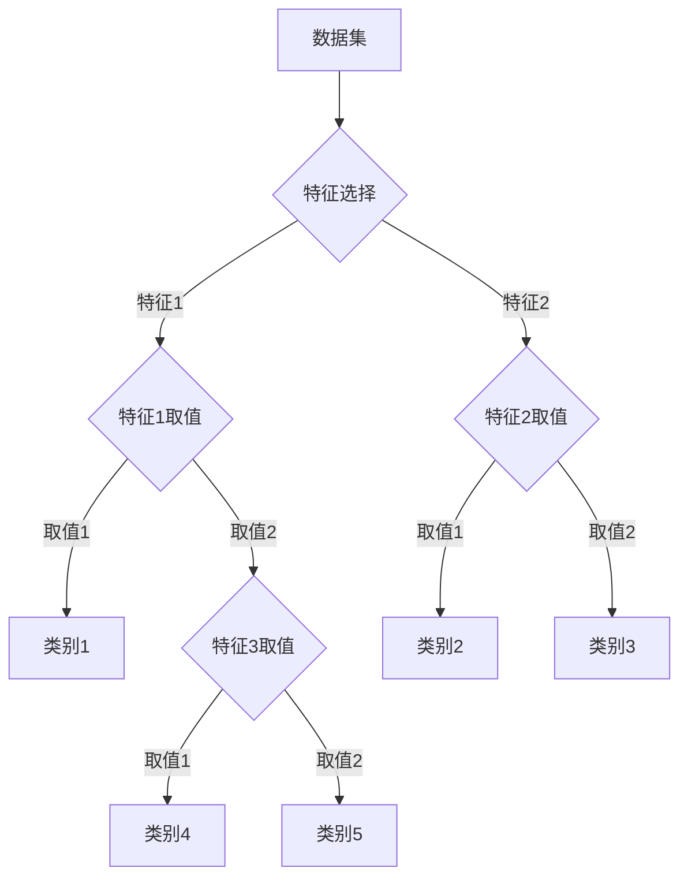

# 决策树分类与回归:探索两大核心应用

## 1. 背景介绍
### 1.1 决策树的起源与发展
#### 1.1.1 决策树的起源
#### 1.1.2 决策树的发展历程
#### 1.1.3 决策树在机器学习中的地位
### 1.2 决策树的优势与局限性
#### 1.2.1 决策树的优势
#### 1.2.2 决策树的局限性
#### 1.2.3 决策树与其他机器学习算法的比较

## 2. 核心概念与联系
### 2.1 决策树的基本概念
#### 2.1.1 决策树的定义
#### 2.1.2 决策树的组成部分
#### 2.1.3 决策树的分类与回归任务
### 2.2 决策树的核心算法
#### 2.2.1 ID3算法
#### 2.2.2 C4.5算法
#### 2.2.3 CART算法
### 2.3 决策树分类与回归的联系与区别
#### 2.3.1 分类与回归任务的定义
#### 2.3.2 决策树在分类与回归任务中的应用
#### 2.3.3 分类与回归决策树的区别

## 3. 核心算法原理具体操作步骤
### 3.1 决策树分类算法
#### 3.1.1 特征选择
#### 3.1.2 树的构建
#### 3.1.3 树的剪枝
### 3.2 决策树回归算法
#### 3.2.1 特征选择
#### 3.2.2 树的构建
#### 3.2.3 树的剪枝
### 3.3 决策树算法的优化技术
#### 3.3.1 集成学习
#### 3.3.2 随机森林
#### 3.3.3 梯度提升决策树(GBDT)

## 4. 数学模型和公式详细讲解举例说明
### 4.1 分类决策树的数学模型
#### 4.1.1 信息熵与信息增益
#### 4.1.2 基尼指数
#### 4.1.3 分类决策树模型的数学表示
### 4.2 回归决策树的数学模型
#### 4.2.1 均方差
#### 4.2.2 平均绝对误差
#### 4.2.3 回归决策树模型的数学表示
### 4.3 决策树模型的数学推导
#### 4.3.1 分类决策树的推导过程
#### 4.3.2 回归决策树的推导过程
#### 4.3.3 决策树模型的数学证明

## 5. 项目实践:代码实例和详细解释说明
### 5.1 分类决策树的Python实现
#### 5.1.1 数据预处理
#### 5.1.2 模型训练
#### 5.1.3 模型评估
### 5.2 回归决策树的Python实现
#### 5.2.1 数据预处理
#### 5.2.2 模型训练
#### 5.2.3 模型评估
### 5.3 决策树可视化与解释
#### 5.3.1 决策树可视化工具
#### 5.3.2 决策树的特征重要性
#### 5.3.3 决策树的可解释性

## 6. 实际应用场景
### 6.1 金融风险评估
#### 6.1.1 信用评分
#### 6.1.2 反欺诈
#### 6.1.3 客户流失预测
### 6.2 医疗诊断与预测
#### 6.2.1 疾病诊断
#### 6.2.2 药物反应预测
#### 6.2.3 医疗资源分配
### 6.3 自然语言处理
#### 6.3.1 文本分类
#### 6.3.2 情感分析
#### 6.3.3 语义角色标注

## 7. 工具和资源推荐
### 7.1 决策树的开源实现
#### 7.1.1 scikit-learn
#### 7.1.2 XGBoost
#### 7.1.3 LightGBM
### 7.2 决策树的可视化工具
#### 7.2.1 Graphviz
#### 7.2.2 dtreeviz
#### 7.2.3 sklearn-tree-plotting
### 7.3 决策树的学习资源
#### 7.3.1 在线课程
#### 7.3.2 书籍推荐
#### 7.3.3 研究论文

## 8. 总结:未来发展趋势与挑战
### 8.1 决策树的研究热点
#### 8.1.1 解释性机器学习
#### 8.1.2 在线学习与增量学习
#### 8.1.3 隐私保护与联邦学习
### 8.2 决策树面临的挑战
#### 8.2.1 高维数据的处理
#### 8.2.2 不平衡数据的处理
#### 8.2.3 模型的鲁棒性与泛化能力
### 8.3 决策树的未来发展方向
#### 8.3.1 深度决策树
#### 8.3.2 决策树与深度学习的结合
#### 8.3.3 决策树在新兴领域的应用

## 9. 附录:常见问题与解答
### 9.1 决策树的过拟合问题
#### 9.1.1 过拟合的原因
#### 9.1.2 过拟合的解决方法
#### 9.1.3 过拟合与欠拟合的平衡
### 9.2 决策树的缺失值处理
#### 9.2.1 缺失值的类型
#### 9.2.2 缺失值的处理方法
#### 9.2.3 缺失值对决策树性能的影响
### 9.3 决策树的参数调优
#### 9.3.1 树的深度
#### 9.3.2 叶子节点的最小样本数
#### 9.3.3 特征选择的标准

决策树是机器学习中一种简单而强大的监督学习算法,它可以用于分类和回归任务。决策树通过递归地将数据集划分为越来越小的子集,直到每个子集都属于同一类或达到某个停止条件。决策树的每个内部节点表示对某个特征的测试,每个分支代表该测试的一个可能结果,而每个叶子节点代表一个类别或一个预测值。

决策树的核心概念包括信息熵、信息增益、基尼指数等,这些概念用于衡量特征对数据集的划分能力。在构建决策树时,算法会选择能够最大化信息增益或最小化基尼指数的特征作为当前节点的划分特征。这个过程递归地进行,直到满足停止条件。

下面是一个简化的决策树分类过程的 Mermaid 流程图:



在分类任务中,决策树使用信息增益或基尼指数来选择最佳划分特征。以信息增益为例,它的计算公式为:

$$
Gain(D, A) = Entropy(D) - \sum_{v \in Values(A)} \frac{|D_v|}{|D|} Entropy(D_v)
$$

其中,$D$是数据集,$A$是特征,$Values(A)$是特征$A$的所有可能取值,$D_v$是特征$A$取值为$v$的样本子集。信息熵$Entropy(D)$的计算公式为:

$$
Entropy(D) = -\sum_{i=1}^{c} p_i \log_2 p_i
$$

其中,$c$是类别数,$p_i$是数据集$D$中属于类别$i$的样本比例。

在回归任务中,决策树通常使用均方差或平均绝对误差来选择最佳划分特征。以均方差为例,它的计算公式为:

$$
MSE = \frac{1}{N} \sum_{i=1}^{N} (y_i - \hat{y}_i)^2
$$

其中,$N$是样本数,$y_i$是第$i$个样本的真实值,$\hat{y}_i$是第$i$个样本的预测值。

下面是一个使用scikit-learn实现决策树分类的Python代码示例:

```python
from sklearn.datasets import load_iris
from sklearn.model_selection import train_test_split
from sklearn.tree import DecisionTreeClassifier
from sklearn.metrics import accuracy_score

# 加载鸢尾花数据集
iris = load_iris()
X, y = iris.data, iris.target

# 划分训练集和测试集
X_train, X_test, y_train, y_test = train_test_split(X, y, test_size=0.2, random_state=42)

# 创建决策树分类器
clf = DecisionTreeClassifier(criterion='gini', max_depth=3, random_state=42)

# 训练模型
clf.fit(X_train, y_train)

# 在测试集上进行预测
y_pred = clf.predict(X_test)

# 计算准确率
accuracy = accuracy_score(y_test, y_pred)
print(f"Accuracy: {accuracy:.2f}")
```

决策树在实际应用中有广泛的用途,如金融风险评估、医疗诊断、自然语言处理等。以金融风险评估为例,决策树可以用于信用评分、反欺诈和客户流失预测。通过分析客户的历史数据,如信用记录、交易行为、人口统计学信息等,决策树可以学习到区分高风险和低风险客户的规则,从而帮助金融机构做出更明智的决策。

决策树的优势在于模型简单直观,易于理解和解释。决策树可以处理数值型和类别型特征,对缺失值和异常值也有一定的鲁棒性。此外,决策树还可以通过集成学习方法(如随机森林和梯度提升决策树)进一步提高性能。

然而,决策树也存在一些局限性。决策树容易过拟合,特别是当树的深度过大时。此外,决策树对特征缩放和旋转敏感,因此需要对数据进行适当的预处理。决策树也难以直接处理高维数据和不平衡数据。

未来,决策树的研究热点可能集中在解释性机器学习、在线学习、隐私保护等方面。如何构建更加鲁棒、高效、可解释的决策树模型,如何利用决策树实现可信的人工智能,这些都是值得探索的问题。此外,决策树与深度学习的结合也是一个有前景的研究方向。

总之,决策树是一种简单而强大的机器学习算法,在分类和回归任务中都有广泛的应用。通过深入理解决策树的原理和技术,我们可以更好地利用这一工具解决实际问题,推动人工智能的发展。

作者：禅与计算机程序设计艺术 / Zen and the Art of Computer Programming