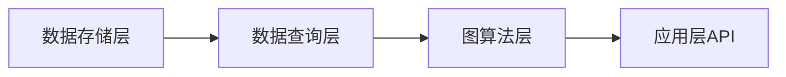

# 图数据库 原理与代码实例讲解

## 1. 背景介绍

### 1.1 图数据库的起源与发展
#### 1.1.1 图论的诞生
#### 1.1.2 图数据库的出现
#### 1.1.3 图数据库的发展历程

### 1.2 图数据库的特点与优势
#### 1.2.1 高性能的关联数据存储与查询
#### 1.2.2 灵活的数据模型
#### 1.2.3 适用于复杂关联网络场景

### 1.3 图数据库的应用领域
#### 1.3.1 社交网络分析
#### 1.3.2 知识图谱
#### 1.3.3 推荐系统
#### 1.3.4 欺诈检测

## 2. 核心概念与联系

### 2.1 Property Graph 属性图模型
#### 2.1.1 节点 Node
#### 2.1.2 关系 Relationship
#### 2.1.3 属性 Property
#### 2.1.4 标签 Label

### 2.2 RDF 资源描述框架
#### 2.2.1 三元组 Triple
#### 2.2.2 URI 统一资源标识符
#### 2.2.3 Literal 文本值
#### 2.2.4 Blank Node 空白节点

### 2.3 图数据库与关系型数据库、文档型数据库的区别
#### 2.3.1 数据模型差异
#### 2.3.2 查询方式差异
#### 2.3.3 适用场景差异

### 2.4 图数据库系统架构



## 3. 核心算法原理具体操作步骤

### 3.1 图的遍历算法
#### 3.1.1 广度优先搜索 BFS
#### 3.1.2 深度优先搜索 DFS

### 3.2 最短路径算法
#### 3.2.1 Dijkstra算法
#### 3.2.2 A*算法
#### 3.2.3 Floyd-Warshall算法

### 3.3 连通性算法
#### 3.3.1 强连通分量
#### 3.3.2 弱连通分量

### 3.4 社区发现算法
#### 3.4.1 Louvain算法
#### 3.4.2 LPA标签传播算法

### 3.5 中心性算法
#### 3.5.1 度中心性 Degree Centrality
#### 3.5.2 介数中心性 Betweenness Centrality
#### 3.5.3 接近中心性 Closeness Centrality
#### 3.5.4 特征向量中心性 Eigenvector Centrality

## 4. 数学模型和公式详细讲解举例说明

### 4.1 图的数学表示
#### 4.1.1 邻接矩阵
$$
A =
\begin{bmatrix}
0 & 1 & 0 \\
1 & 0 & 1\\
0 & 1 & 0
\end{bmatrix}
$$

#### 4.1.2 邻接表
```
0 -> 1
1 -> 0 -> 2
2 -> 1
```

### 4.2 最短路径算法的数学原理
#### 4.2.1 Dijkstra算法
设 $d_i$ 表示源点到顶点 $i$ 的最短路径长度，$w_{ij}$ 表示边 $(i,j)$ 的权重，算法步骤如下：

1. 初始化：$d_s=0$，其他 $d_i=\infty$
2. 找出未访问的顶点中 $d_j$ 最小的顶点 $j$，访问该顶点
3. 对 $j$ 的每个未访问过的邻接点 $k$，若 $d_j+w_{jk}<d_k$，则更新 $d_k=d_j+w_{jk}$
4. 重复2-3步骤，直到所有顶点都被访问

#### 4.2.2 Floyd-Warshall算法
设 $d_{ij}^k$ 表示从 $i$ 到 $j$ 的只以 $(1..k)$ 集合中的节点为中间节点的最短路径的长度，算法步骤如下：

$$
d_{ij}^k=
\begin{cases}
w_{ij} & 如果k=0 \\
min(d_{ij}^{k-1},d_{ik}^{k-1}+d_{kj}^{k-1}) & 如果k\geq1
\end{cases}
$$

### 4.3 PageRank算法的数学原理
设 $PR(u)$ 表示网页 $u$ 的PageRank值，$B_u$ 表示存在从 $u$ 到 $v$ 的链接的网页 $v$ 的集合，$N_v$ 表示网页 $v$ 的出链数，$d$ 为阻尼系数，则PageRank的计算公式为：

$$PR(u)=\frac{1-d}{N}+d\sum_{v\in B_u}\frac{PR(v)}{N_v}$$

其中 $N$ 为所有网页的总数。

## 5. 项目实践：代码实例和详细解释说明

### 5.1 使用Neo4j实现一个电影推荐系统
#### 5.1.1 数据建模
定义User、Movie两类节点，RATED、ACTED_IN、DIRECTED三类关系：

```
(:User)-[:RATED]->(:Movie)
(:Person)-[:ACTED_IN]->(:Movie)
(:Person)-[:DIRECTED]->(:Movie)
```

#### 5.1.2 数据导入
使用LOAD CSV语句批量导入数据：

```cypher
LOAD CSV WITH HEADERS FROM 'file:///movies.csv' AS row
MERGE (m:Movie {id:row.movieId, title:row.title})

LOAD CSV WITH HEADERS FROM 'file:///ratings.csv' AS row
MATCH (u:User {id:row.userId})
MATCH (m:Movie {id:row.movieId})
MERGE (u)-[:RATED {rating:toFloat(row.rating)}]->(m)
```

#### 5.1.3 相似度计算
计算两部电影m1、m2的相似度，找出对这两部电影都打分的用户，利用皮尔逊相关系数：

```cypher
MATCH (m1:Movie {title:"Movie1"})<-[r1:RATED]-(u:User)-[r2:RATED]->(m2:Movie {title:"Movie2"})
WITH m1,m2,collect({r1:r1.rating,r2:r2.rating}) AS ratings
WHERE size(ratings) > 10
RETURN m1.title,m2.title,
  gds.alpha.similarity.pearson(
    ratings,
    (x) => x.r1,
    (x) => x.r2
  ) AS similarity
```

#### 5.1.4 电影推荐
为用户u推荐和他喜欢的电影相似的电影：

```cypher
MATCH (u:User {id:123})-[r:RATED]->(m:Movie)
WHERE r.rating >= 4.0
WITH m
MATCH (m)-[s:SIMILARITY]-(rec:Movie)
WHERE s.score >= 0.7
RETURN rec.title AS recommendation
```

### 5.2 使用JanusGraph实现一个社交网络图
#### 5.2.1 创建图模式
定义顶点标签和边标签：

```java
mgmt = graph.openManagement()
person = mgmt.makeVertexLabel("person").make()
follows = mgmt.makeEdgeLabel("follows").multiplicity(MULTI).make()
mgmt.commit()
```

#### 5.2.2 添加顶点和边
```java
// 添加顶点
v1 = graph.addVertex(T.label, "person", "name", "Alice")
v2 = graph.addVertex(T.label, "person", "name", "Bob")

// 添加边
v1.addEdge("follows", v2)
```

#### 5.2.3 图遍历查询
使用Gremlin查询语言进行图遍历，例如查找Alice的跟随者的跟随者：

```groovy
g.V().has("person","name","Alice").
  out("follows").out("follows").
  values("name")
```

#### 5.2.4 计算中心性
使用JanusGraph的图算法计算度中心性：

```groovy
// 计算度中心性
degreeResult = graph.compute().
               degrees().
               of("person").
               degreeCentrality()
// 输出度中心性最高的前10名
degreeResult.top(10)
```

## 6. 实际应用场景

### 6.1 社交网络分析
利用图数据库分析社交网络结构，发现社区、意见领袖、传播路径等。

### 6.2 知识图谱
使用图数据库构建知识图谱，支持复杂的语义查询和关联分析。

### 6.3 推荐系统
利用图数据库实现基于关联关系的智能推荐系统，个性化推荐商品、内容等。

### 6.4 金融风控
使用图数据库进行反洗钱、反欺诈等风险关联分析。

## 7. 工具和资源推荐

### 7.1 图数据库产品
- Neo4j：最成熟的原生图数据库
- JanusGraph：可扩展的分布式图数据库
- ArangoDB：原生多模数据库
- TigerGraph：高性能分布式图数据库

### 7.2 图查询语言
- Cypher：Neo4j使用的声明式图查询语言
- Gremlin：Apache TinkerPop提供的图遍历语言

### 7.3 图可视化工具
- Neo4j Browser：Neo4j内置的浏览器
- Linkurious：基于Cypher的图可视化分析平台
- Gephi：通用的网络分析与可视化平台

### 7.4 图计算框架
- Spark GraphX：基于Spark的图计算框架
- GraphScope：阿里巴巴开源的高性能图计算引擎

## 8. 总结：未来发展趋势与挑战

### 8.1 图数据库的发展趋势
- 融合多种数据模型，发展多模图数据库
- 支持更大规模数据，提升分布式计算能力
- 与AI、机器学习深度结合，实现智能图分析

### 8.2 面临的挑战
- 缺乏统一的图数据标准和生态
- 图算法的高效并行化与分布式实现
- 超大规模图数据的存储与计算瓶颈
- 隐私安全问题

### 8.3 总结
图数据库以其强大的关联分析能力和灵活的数据模型，在众多领域展现出巨大的应用价值。随着技术的进一步发展和成熟，图数据库有望成为新一代数据管理与分析平台的核心支柱。

## 9. 附录：常见问题与解答

### 9.1 图数据库适合哪些场景？
答：图数据库适合处理高度关联的复杂数据，如社交网络、知识图谱、推荐系统等。

### 9.2 图数据库的查询性能如何？
答：对于关联查询，图数据库通常比关系型数据库和文档型数据库有更好的性能，但对于全表扫描等查询，则性能不如它们。

### 9.3 图数据库是否支持ACID事务？
答：像Neo4j这样的原生图数据库是支持ACID事务的，但一些多模数据库和分布式图数据库可能只提供最终一致性。

### 9.4 图数据库查询语言如何选择？
答：Cypher是一种声明式的模式匹配语言，入门简单；Gremlin则是基于图遍历过程的函数式语言，表达能力更强。可根据需求和生态进行选择。

作者：禅与计算机程序设计艺术 / Zen and the Art of Computer Programming