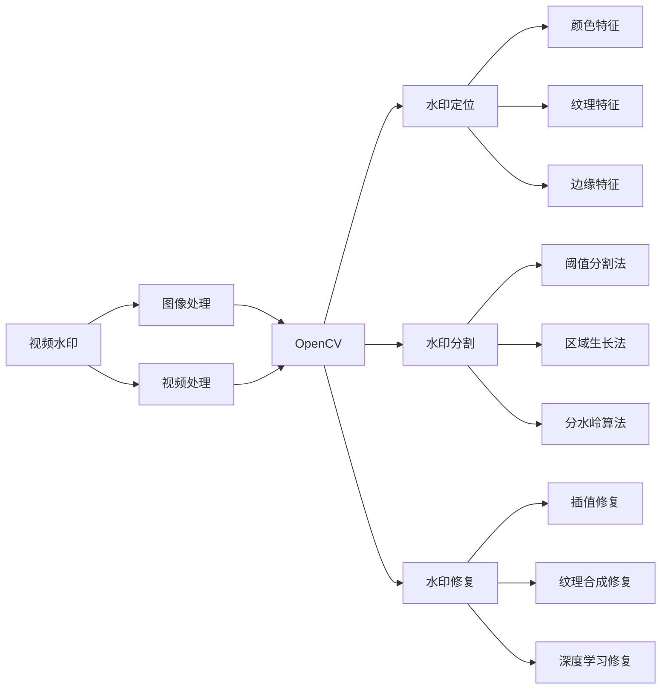

# 基于opencv实现视频去水印系统详细设计与具体代码实现

## 1. 背景介绍

随着短视频平台的兴起，视频水印已成为各大平台保护版权的重要手段。然而，在某些场景下，水印的存在会影响视频的美观性和完整性。因此，如何高效、准确地去除视频水印，成为了一个值得探讨的话题。本文将基于OpenCV库，详细介绍一种视频去水印系统的设计与实现。

### 1.1 视频水印的应用现状

#### 1.1.1 版权保护的需求

#### 1.1.2 水印对视频质量的影响

#### 1.1.3 去水印的实际应用场景

### 1.2 OpenCV简介

#### 1.2.1 OpenCV的基本功能

#### 1.2.2 OpenCV在图像处理领域的应用

#### 1.2.3 OpenCV的优势与局限性

## 2. 核心概念与联系

### 2.1 图像处理基础

#### 2.1.1 图像的数字化表示

#### 2.1.2 图像的基本属性

#### 2.1.3 常见的图像处理操作

### 2.2 视频处理基础

#### 2.2.1 视频的组成与编码

#### 2.2.2 视频帧的提取与处理

#### 2.2.3 视频的时间与空间特性

### 2.3 水印的分类与特点

#### 2.3.1 可见水印与不可见水印

#### 2.3.2 静态水印与动态水印

#### 2.3.3 水印的鲁棒性与安全性

## 3. 核心算法原理与具体操作步骤

### 3.1 水印区域的定位

#### 3.1.1 基于颜色特征的水印定位

#### 3.1.2 基于纹理特征的水印定位

#### 3.1.3 基于边缘特征的水印定位

### 3.2 水印区域的分割

#### 3.2.1 阈值分割法

#### 3.2.2 区域生长法

#### 3.2.3 分水岭算法

### 3.3 水印区域的修复

#### 3.3.1 基于插值的修复方法

#### 3.3.2 基于纹理合成的修复方法

#### 3.3.3 基于深度学习的修复方法

## 4. 数学模型和公式详细讲解举例说明

### 4.1 图像的数学表示

#### 4.1.1 灰度图像的数学表示

$$I(x,y) = f(x,y)$$

其中，$I(x,y)$表示图像在坐标$(x,y)$处的灰度值，$f(x,y)$为灰度函数。

#### 4.1.2 彩色图像的数学表示

彩色图像可以表示为三个独立的颜色通道：

$$I(x,y) = [R(x,y), G(x,y), B(x,y)]$$

其中，$R(x,y)$、$G(x,y)$和$B(x,y)$分别表示红、绿、蓝三个颜色通道的灰度值。

### 4.2 图像处理的数学基础

#### 4.2.1 卷积操作

卷积操作是图像处理中最基本的操作之一，其数学定义为：

$$(f * g)(x,y) = \sum_{i=-\infty}^{\infty} \sum_{j=-\infty}^{\infty} f(i,j) \cdot g(x-i,y-j)$$

其中，$f(x,y)$为原始图像，$g(x,y)$为卷积核。

#### 4.2.2 傅里叶变换

傅里叶变换可以将图像从空间域转换到频率域，其数学定义为：

$$F(u,v) = \int_{-\infty}^{\infty} \int_{-\infty}^{\infty} f(x,y) \cdot e^{-j2\pi(ux+vy)} dxdy$$

其中，$f(x,y)$为原始图像，$F(u,v)$为频率域表示。

### 4.3 水印算法的数学原理

#### 4.3.1 基于DCT的水印嵌入与提取

离散余弦变换（DCT）是一种常用的水印嵌入方法，其数学定义为：

$$F(u,v) = \frac{2}{\sqrt{MN}} C(u)C(v) \sum_{x=0}^{M-1} \sum_{y=0}^{N-1} f(x,y) \cos \frac{(2x+1)u\pi}{2M} \cos \frac{(2y+1)v\pi}{2N}$$

其中，$f(x,y)$为原始图像，$F(u,v)$为DCT系数，$C(u)$和$C(v)$为归一化系数。

#### 4.3.2 基于DWT的水印嵌入与提取

离散小波变换（DWT）是另一种常用的水印嵌入方法，其数学定义为：

$$W_{\phi}(j_0,m,n) = \frac{1}{\sqrt{MN}} \sum_{x=0}^{M-1} \sum_{y=0}^{N-1} f(x,y) \phi_{j_0,m,n}(x,y)$$

$$W_{\psi}^i(j,m,n) = \frac{1}{\sqrt{MN}} \sum_{x=0}^{M-1} \sum_{y=0}^{N-1} f(x,y) \psi_{j,m,n}^i(x,y)$$

其中，$f(x,y)$为原始图像，$W_{\phi}(j_0,m,n)$为低频近似系数，$W_{\psi}^i(j,m,n)$为高频细节系数，$\phi_{j_0,m,n}(x,y)$和$\psi_{j,m,n}^i(x,y)$分别为尺度函数和小波函数。

## 5. 项目实践：代码实例和详细解释说明

### 5.1 开发环境与工具

#### 5.1.1 Python与OpenCV的安装

#### 5.1.2 集成开发环境（IDE）的选择

#### 5.1.3 版本控制工具的使用

### 5.2 视频读取与帧提取

```python
import cv2

# 读取视频文件
video = cv2.VideoCapture("input_video.mp4")

# 循环读取视频帧
while True:
    ret, frame = video.read()
    if not ret:
        break

    # 对当前帧进行处理
    # ...

    # 显示处理后的帧
    cv2.imshow("Frame", frame)

    # 按下'q'键退出循环
    if cv2.waitKey(1) & 0xFF == ord('q'):
        break

# 释放资源
video.release()
cv2.destroyAllWindows()
```

### 5.3 水印区域的定位与分割

```python
import cv2
import numpy as np

# 读取带水印的图像
img = cv2.imread("watermarked_image.jpg")

# 转换为HSV颜色空间
hsv = cv2.cvtColor(img, cv2.COLOR_BGR2HSV)

# 定义水印颜色范围
lower_color = np.array([0, 0, 200])
upper_color = np.array([180, 30, 255])

# 根据颜色范围创建掩码
mask = cv2.inRange(hsv, lower_color, upper_color)

# 对掩码进行形态学操作，去除噪点
kernel = np.ones((5, 5), np.uint8)
mask = cv2.morphologyEx(mask, cv2.MORPH_OPEN, kernel)

# 查找掩码中的轮廓
contours, hierarchy = cv2.findContours(mask, cv2.RETR_EXTERNAL, cv2.CHAIN_APPROX_SIMPLE)

# 绘制轮廓并显示结果
cv2.drawContours(img, contours, -1, (0, 255, 0), 2)
cv2.imshow("Watermark Region", img)
cv2.waitKey(0)
cv2.destroyAllWindows()
```

### 5.4 水印区域的修复

```python
import cv2
import numpy as np

# 读取带水印的图像
img = cv2.imread("watermarked_image.jpg")

# 定义水印区域的掩码（假设已经获得）
mask = cv2.imread("watermark_mask.png", 0)

# 使用修复算法填充水印区域
dst = cv2.inpaint(img, mask, 3, cv2.INPAINT_TELEA)

# 显示修复后的图像
cv2.imshow("Restored Image", dst)
cv2.waitKey(0)
cv2.destroyAllWindows()
```

## 6. 实际应用场景

### 6.1 短视频平台的水印去除

#### 6.1.1 抖音水印去除

#### 6.1.2 快手水印去除

#### 6.1.3 微视水印去除

### 6.2 版权保护与内容审核

#### 6.2.1 视频版权保护中的水印应用

#### 6.2.2 内容审核中的水印检测与去除

### 6.3 视频编辑与特效制作

#### 6.3.1 视频剪辑中的水印处理

#### 6.3.2 特效合成中的水印去除

## 7. 工具和资源推荐

### 7.1 OpenCV官方文档与教程

#### 7.1.1 OpenCV官网

#### 7.1.2 OpenCV Python教程

#### 7.1.3 OpenCV C++教程

### 7.2 相关论文与研究成果

#### 7.2.1 视频水印技术综述

#### 7.2.2 基于深度学习的水印去除方法

#### 7.2.3 水印攻击与防御策略

### 7.3 开源项目与代码库

#### 7.3.1 OpenCV贡献者社区

#### 7.3.2 GitHub上的水印去除项目

#### 7.3.3 视频处理相关的Python库

## 8. 总结：未来发展趋势与挑战

### 8.1 视频水印技术的发展趋势

#### 8.1.1 水印算法的改进与创新

#### 8.1.2 水印嵌入与提取的实时性

#### 8.1.3 水印的适应性与鲁棒性

### 8.2 水印去除技术的挑战

#### 8.2.1 水印与原始内容的相似性

#### 8.2.2 水印攻击的多样性

#### 8.2.3 去水印算法的通用性

### 8.3 结合深度学习的发展方向

#### 8.3.1 基于深度学习的水印检测

#### 8.3.2 基于深度学习的水印去除

#### 8.3.3 端到端的水印处理框架

## 9. 附录：常见问题与解答

### 9.1 水印去除会侵犯版权吗？

### 9.2 视频水印的常见类型有哪些？

### 9.3 OpenCV的性能如何？

### 9.4 如何评估水印去除的效果？

### 9.5 视频水印去除的应用前景如何？

作者：禅与计算机程序设计艺术 / Zen and the Art of Computer Programming

## 核心概念与联系 Mermaid 流程图

