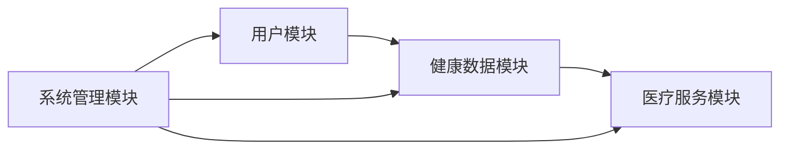

## 1.背景介绍

随着科技的飞速发展，互联网+医疗的模式越来越受到大家的关注。而作为一种轻量级的Java应用框架，SpringBoot因其简洁、快速、方便的特性，已经成为了开发这类系统的首选。本文将详细介绍如何基于SpringBoot开发一个社区智慧医疗系统。

## 2.核心概念与联系

在开始之前，我们先来了解一下社区智慧医疗系统的核心概念和各个模块之间的联系。

### 2.1 社区智慧医疗系统

社区智慧医疗系统是一个基于互联网的医疗服务系统，它通过收集和分析社区居民的健康数据，为社区居民提供个性化的健康管理和医疗服务。

### 2.2 SpringBoot

SpringBoot是一个基于Java的轻量级应用框架，它可以帮助开发者快速搭建和部署应用。SpringBoot提供了大量的starters，可以快速集成各种常用的框架和库，大大提高了开发效率。

### 2.3 核心模块关系

社区智慧医疗系统主要包括以下几个核心模块：用户模块、健康数据模块、医疗服务模块和系统管理模块。

- 用户模块：负责用户的注册、登录、个人信息管理等功能。
- 健康数据模块：负责收集和分析用户的健康数据，包括体检数据、病历数据等。
- 医疗服务模块：根据用户的健康数据，提供个性化的医疗服务，包括在线咨询、预约挂号、药品购买等。
- 系统管理模块：负责系统的日常运维和管理，包括数据备份、权限管理、日志管理等。



## 3.核心算法原理具体操作步骤

在社区智慧医疗系统中，我们使用一种基于用户健康数据的推荐算法，来为用户提供个性化的医疗服务。下面，我们将详细介绍这种推荐算法的具体操作步骤。

### 3.1 数据收集

首先，我们需要收集用户的健康数据。这些数据主要包括用户的体检数据、病历数据、生活习惯数据等。这些数据可以通过用户在使用系统时主动提供，也可以通过与其他医疗系统的接口对接，自动获取。

### 3.2 数据预处理

收集到的数据可能存在缺失值、异常值等问题，因此我们需要对数据进行预处理。这包括数据清洗、数据填充等操作。

### 3.3 数据分析

然后，我们会对预处理后的数据进行分析，提取出用户的健康特征。这包括用户的健康状况、疾病风险、生活习惯等。

### 3.4 服务推荐

最后，我们会根据用户的健康特征，推荐相应的医疗服务。这包括推荐适合用户的健康管理方案、医生、药品等。

## 4.数学模型和公式详细讲解举例说明

在服务推荐的过程中，我们使用了一种基于用户健康特征的推荐算法。下面，我们将详细讲解这种推荐算法的数学模型和公式。

假设我们有n个用户，m个服务，我们可以将这个问题看作是一个n*m的矩阵，其中每个元素代表了对应用户对对应服务的评分。我们的目标就是填充这个矩阵中的空白部分，预测用户对未使用过的服务的评分。

我们使用以下公式来预测用户u对服务i的评分：

$$
\hat{r}_{ui} = \mu + b_u + b_i + q_i^Tp_u
$$

其中，$\mu$是所有已知评分的平均值，$b_u$和$b_i$分别是用户偏差和服务偏差，$q_i$和$p_u$分别是服务i和用户u的特征向量。

我们的目标就是通过最小化以下损失函数来求解$b_u$、$b_i$、$q_i$和$p_u$：

$$
min_{b*,q*,p*} \sum_{(u,i)\in R} (r_{ui} - \hat{r}_{ui})^2 + \lambda(b_u^2 + b_i^2 + ||q_i||^2 + ||p_u||^2)
$$

其中，$R$是所有已知评分的集合，$\lambda$是正则化参数。

通过求解上述优化问题，我们可以得到每个用户对每个服务的预测评分，然后我们就可以根据这些预测评分为用户推荐服务了。

## 5.项目实践：代码实例和详细解释说明

在实际的项目实践中，我们使用SpringBoot框架来开发社区智慧医疗系统。下面，我们将通过一个简单的例子，来说明如何使用SpringBoot开发用户模块的注册功能。

首先，我们需要创建一个用户实体类，用来表示用户的数据模型。

```java
public class User {
  private String username;
  private String password;
  private String email;
  // getters and setters...
}
```

然后，我们需要创建一个用户服务类，用来处理用户的注册请求。

```java
@Service
public class UserService {
  @Autowired
  private UserRepository userRepository;

  public User register(User user) {
    // check if the username already exists
    if(userRepository.findByUsername(user.getUsername()) != null) {
      throw new RuntimeException("Username already exists.");
    }
    // save the user to the database
    return userRepository.save(user);
  }
}
```

最后，我们需要创建一个用户控制器类，用来处理用户的HTTP请求。

```java
@RestController
@RequestMapping("/users")
public class UserController {
  @Autowired
  private UserService userService;

  @PostMapping("/register")
  public User register(@RequestBody User user) {
    return userService.register(user);
  }
}
```

以上就是使用SpringBoot开发用户模块的注册功能的简单例子。在实际的项目中，我们还需要处理更多的细节，比如数据验证、错误处理、安全控制等。

## 6.实际应用场景

社区智慧医疗系统可以应用在很多场景中，比如社区医疗服务、家庭健康管理、老年人健康管理等。通过这个系统，用户可以方便地管理自己的健康数据，获取个性化的医疗服务，提高生活质量。

## 7.工具和资源推荐

在开发社区智慧医疗系统时，我们使用了以下工具和资源：

- SpringBoot：一个基于Java的轻量级应用框架，可以帮助开发者快速搭建和部署应用。
- MySQL：一个开源的关系型数据库，用来存储系统的数据。
- IntelliJ IDEA：一个强大的Java开发工具，提供了许多便捷的功能，比如代码提示、代码生成、代码重构等。
- Git：一个分布式版本控制系统，用来管理项目的源代码。
- Maven：一个Java项目管理工具，可以帮助开发者管理项目的构建、依赖、发布等。

## 8.总结：未来发展趋势与挑战

随着科技的发展和社会的进步，社区智慧医疗系统的应用将越来越广泛。然而，这也带来了一些挑战，比如数据安全、数据隐私、数据质量等。我们需要在保证服务质量的同时，解决这些问题，让社区智慧医疗系统真正地服务于社区，服务于人民。

## 9.附录：常见问题与解答

**Q: 社区智慧医疗系统可以做什么？**

A: 社区智慧医疗系统是一个基于互联网的医疗服务系统，它通过收集和分析社区居民的健康数据，为社区居民提供个性化的健康管理和医疗服务。

**Q: 社区智慧医疗系统的核心模块有哪些？**

A: 社区智慧医疗系统主要包括用户模块、健康数据模块、医疗服务模块和系统管理模块。

**Q: 如何使用SpringBoot开发社区智慧医疗系统？**

A: 我们可以使用SpringBoot框架来快速搭建和部署应用，然后根据社区智慧医疗系统的需求，开发相应的功能模块。

作者：禅与计算机程序设计艺术 / Zen and the Art of Computer Programming