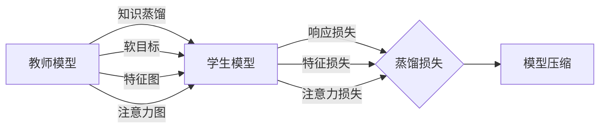

# 基于知识蒸馏的模型压缩性能评测

## 1. 背景介绍
### 1.1 深度学习模型的发展现状
#### 1.1.1 模型参数量和计算复杂度不断增加
#### 1.1.2 模型部署面临资源受限的挑战
#### 1.1.3 模型压缩技术应运而生
### 1.2 模型压缩技术概述
#### 1.2.1 模型剪枝
#### 1.2.2 低秩近似
#### 1.2.3 量化
#### 1.2.4 知识蒸馏
### 1.3 知识蒸馏的优势
#### 1.3.1 无需修改模型结构
#### 1.3.2 可应用于各种模型
#### 1.3.3 压缩效果显著

## 2. 核心概念与联系
### 2.1 知识的定义
#### 2.1.1 数据的概率分布
#### 2.1.2 特征的表示能力
### 2.2 知识蒸馏的原理
#### 2.2.1 教师模型与学生模型
#### 2.2.2 软目标与硬目标
#### 2.2.3 蒸馏损失函数
### 2.3 知识蒸馏与迁移学习的关系
#### 2.3.1 知识迁移
#### 2.3.2 领域自适应
### 2.4 知识蒸馏与模型集成的关系
#### 2.4.1 集成学习
#### 2.4.2 知识融合

## 3. 核心算法原理具体操作步骤
### 3.1 基于响应的知识蒸馏
#### 3.1.1 软化的预测概率分布
#### 3.1.2 温度参数的影响
#### 3.1.3 蒸馏目标函数
### 3.2 基于特征的知识蒸馏
#### 3.2.1 中间层特征图
#### 3.2.2 注意力机制
#### 3.2.3 互信息最大化
### 3.3 基于关系的知识蒸馏
#### 3.3.1 样本之间的相似度
#### 3.3.2 特征之间的相关性
### 3.4 多教师知识蒸馏
#### 3.4.1 教师模型的选择
#### 3.4.2 知识融合策略

## 4. 数学模型和公式详细讲解举例说明
### 4.1 响应蒸馏的数学模型
#### 4.1.1 软目标的计算
$$
q_i = \frac{exp(z_i/T)}{\sum_j exp(z_j/T)}
$$
其中$z_i$是教师模型的logits向量的第$i$个元素，$T$是温度参数。
#### 4.1.2 蒸馏损失函数
$$
L_{kd} = \alpha T^2\sum_i q_i log\frac{q_i}{p_i} + (1-\alpha)H(y,\sigma(z^s))
$$
其中$\alpha$是平衡因子，$p_i$是学生模型的软化预测概率，$H$是交叉熵损失，$y$是真实标签，$z^s$是学生模型的logits。
### 4.2 特征蒸馏的数学模型
#### 4.2.1 注意力转移
$$
L_{at} = \frac{1}{2}||A^t-A^s||_2^2
$$
其中$A^t$和$A^s$分别是教师模型和学生模型的注意力图。
#### 4.2.2 最大平均差异
$$
L_{mad} = \frac{1}{N}\sum_i ||\frac{f_i^t}{||f_i^t||_2} - \frac{f_i^s}{||f_i^s||_2}||_1
$$
其中$f_i^t$和$f_i^s$分别是教师模型和学生模型第$i$个样本的特征向量，$N$是样本数。

## 5. 项目实践：代码实例和详细解释说明
### 5.1 基于PyTorch的响应蒸馏实现
```python
import torch
import torch.nn as nn
import torch.nn.functional as F

def kd_loss(outputs, teacher_outputs, labels, T, alpha):
    kd_loss = nn.KLDivLoss()(F.log_softmax(outputs/T, dim=1),
                             F.softmax(teacher_outputs/T, dim=1)) * (alpha * T * T) + \
              F.cross_entropy(outputs, labels) * (1. - alpha)
    return kd_loss
```
其中`outputs`和`teacher_outputs`分别是学生模型和教师模型的输出logits，`labels`是真实标签，`T`是温度参数，`alpha`是平衡因子。

在训练过程中，使用该损失函数进行优化：
```python
optimizer.zero_grad()
loss = kd_loss(student_outputs, teacher_outputs, labels, T, alpha)
loss.backward()
optimizer.step()
```
### 5.2 基于TensorFlow的特征蒸馏实现
```python
import tensorflow as tf

def at_loss(teacher_attention_maps, student_attention_maps):
    return tf.reduce_mean(tf.square(teacher_attention_maps - student_attention_maps))

def mad_loss(teacher_features, student_features):
    teacher_features = tf.nn.l2_normalize(teacher_features, axis=-1)
    student_features = tf.nn.l2_normalize(student_features, axis=-1)
    return tf.reduce_mean(tf.abs(teacher_features - student_features))

teacher_attention_maps = teacher_model.get_attention_maps(images)
student_attention_maps = student_model.get_attention_maps(images)
loss = at_loss(teacher_attention_maps, student_attention_maps)

teacher_features = teacher_model.get_features(images)
student_features = student_model.get_features(images)
loss = mad_loss(teacher_features, student_features)
```
其中`teacher_model`和`student_model`分别是教师模型和学生模型，`images`是输入图像。`get_attention_maps`和`get_features`方法分别用于提取模型的注意力图和特征。

## 6. 实际应用场景
### 6.1 移动端部署
#### 6.1.1 模型压缩
#### 6.1.2 推理加速
### 6.2 嵌入式设备
#### 6.2.1 资源受限
#### 6.2.2 低功耗需求
### 6.3 云端服务
#### 6.3.1 降低服务器成本
#### 6.3.2 提高并发能力

## 7. 工具和资源推荐
### 7.1 模型压缩工具包
#### 7.1.1 PocketFlow
#### 7.1.2 DeepSpeed
#### 7.1.3 FastDeepIoT
### 7.2 知识蒸馏相关开源项目
#### 7.2.1 DistilBERT
#### 7.2.2 MobileBERT
#### 7.2.3 TinyBERT
### 7.3 相关论文与教程
#### 7.3.1 Distilling the Knowledge in a Neural Network
#### 7.3.2 Model Compression via Distillation and Quantization
#### 7.3.3 Knowledge Distillation: A Survey

## 8. 总结：未来发展趋势与挑战
### 8.1 知识蒸馏与联邦学习的结合
#### 8.1.1 解决数据隐私问题
#### 8.1.2 实现分布式模型压缩
### 8.2 跨模态知识蒸馏
#### 8.2.1 不同模态之间的知识迁移
#### 8.2.2 多模态联合压缩
### 8.3 自动化知识蒸馏
#### 8.3.1 教师模型的自动选择
#### 8.3.2 蒸馏超参数的自动搜索
### 8.4 模型安全与鲁棒性
#### 8.4.1 防止知识窃取
#### 8.4.2 提高模型的对抗鲁棒性

## 9. 附录：常见问题与解答
### 9.1 知识蒸馏和模型剪枝的区别是什么？
知识蒸馏是通过从大模型中提取知识来指导小模型学习，而模型剪枝是通过移除冗余和不重要的参数来压缩模型。两者可以结合使用，以获得更好的压缩效果。
### 9.2 温度参数T的作用是什么？
温度参数T用于控制教师模型输出分布的软化程度。T越高，分布越平滑，知识传递的信息量越大；T越低，分布越尖锐，知识传递的信息量越小。需要根据任务和数据集选择合适的T值。
### 9.3 知识蒸馏能否应用于非分类任务？
知识蒸馏不仅可以应用于分类任务，还可以应用于检测、分割、生成等各种任务。只要能够定义合适的蒸馏损失函数，就可以将知识从教师模型传递给学生模型。
### 9.4 如何选择合适的教师模型？
选择教师模型时，需要考虑以下因素：1）教师模型的性能要显著优于学生模型；2）教师模型的结构不宜过于复杂，以免蒸馏过程困难；3）教师模型与学生模型的差异不宜过大，以免知识难以传递。可以通过实验比较不同教师模型的蒸馏效果。



作者：禅与计算机程序设计艺术 / Zen and the Art of Computer Programming