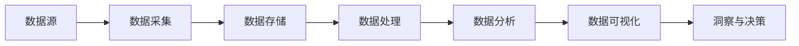

# 大数据 原理与代码实例讲解

## 1. 背景介绍
### 1.1 大数据时代的到来
#### 1.1.1 数据爆炸式增长
#### 1.1.2 数据类型多样化
#### 1.1.3 数据价值凸显
### 1.2 传统数据处理方式的局限
#### 1.2.1 数据量超出存储和计算能力
#### 1.2.2 数据复杂度超出处理能力
#### 1.2.3 实时性需求难以满足
### 1.3 大数据技术的兴起
#### 1.3.1 分布式存储
#### 1.3.2 分布式计算
#### 1.3.3 数据挖掘与机器学习

## 2. 核心概念与联系
### 2.1 大数据的特征
#### 2.1.1 Volume（大量）
#### 2.1.2 Variety（多样）  
#### 2.1.3 Velocity（高速）
#### 2.1.4 Veracity（真实）
#### 2.1.5 Value（价值）
### 2.2 大数据处理流程
#### 2.2.1 数据采集
#### 2.2.2 数据存储
#### 2.2.3 数据处理
#### 2.2.4 数据分析
#### 2.2.5 数据可视化
### 2.3 大数据技术生态
#### 2.3.1 Hadoop生态系统
#### 2.3.2 Spark生态系统
#### 2.3.3 其他大数据工具



## 3. 核心算法原理具体操作步骤
### 3.1 MapReduce
#### 3.1.1 Map阶段
#### 3.1.2 Shuffle阶段 
#### 3.1.3 Reduce阶段
### 3.2 PageRank
#### 3.2.1 初始化
#### 3.2.2 迭代计算
#### 3.2.3 收敛判断
### 3.3 协同过滤
#### 3.3.1 用户-物品矩阵
#### 3.3.2 相似度计算
#### 3.3.3 预测与推荐

## 4. 数学模型和公式详细讲解举例说明
### 4.1 TF-IDF
$$
TF(t,d) = \frac{f_{t,d}}{\sum_{t'\in d} f_{t',d}}
$$
$$
IDF(t,D) = \log \frac{N}{|\{d \in D: t \in d\}|}
$$
$$
TFIDF(t,d,D) = TF(t,d) \times IDF(t,D)
$$
### 4.2 余弦相似度
$$
\cos(\theta) = \frac{\mathbf{A} \cdot \mathbf{B}}{\|\mathbf{A}\| \|\mathbf{B}\|} = \frac{\sum_{i=1}^n A_i B_i}{\sqrt{\sum_{i=1}^n A_i^2} \sqrt{\sum_{i=1}^n B_i^2}}
$$
### 4.3 朴素贝叶斯
$$
P(C|F_1,\ldots,F_n) = \frac{P(C)P(F_1,\ldots,F_n|C)}{P(F_1,\ldots,F_n)}
$$

## 5. 项目实践：代码实例和详细解释说明
### 5.1 使用Hadoop进行WordCount
```java
public class WordCount {
    public static class TokenizerMapper extends Mapper<Object, Text, Text, IntWritable> {
        private final static IntWritable one = new IntWritable(1);
        private Text word = new Text();
        
        public void map(Object key, Text value, Context context) throws IOException, InterruptedException {
            StringTokenizer itr = new StringTokenizer(value.toString());
            while (itr.hasMoreTokens()) {
                word.set(itr.nextToken());
                context.write(word, one);
            }
        }
    }
    
    public static class IntSumReducer extends Reducer<Text,IntWritable,Text,IntWritable> {
        private IntWritable result = new IntWritable();
        
        public void reduce(Text key, Iterable<IntWritable> values, Context context) throws IOException, InterruptedException {
            int sum = 0;
            for (IntWritable val : values) {
                sum += val.get();
            }
            result.set(sum);
            context.write(key, result);
        }
    }
    
    public static void main(String[] args) throws Exception {
        Configuration conf = new Configuration();
        Job job = Job.getInstance(conf, "word count");
        job.setJarByClass(WordCount.class);
        job.setMapperClass(TokenizerMapper.class);
        job.setCombinerClass(IntSumReducer.class);
        job.setReducerClass(IntSumReducer.class);
        job.setOutputKeyClass(Text.class);
        job.setOutputValueClass(IntWritable.class);
        FileInputFormat.addInputPath(job, new Path(args[0]));
        FileOutputFormat.setOutputPath(job, new Path(args[1]));
        System.exit(job.waitForCompletion(true) ? 0 : 1);
    }
}
```

以上代码实现了经典的WordCount程序，主要步骤如下：
1. 自定义一个Mapper类TokenizerMapper，在map方法中对输入的文本进行分词，并将每个单词映射为<word, 1>的键值对。
2. 自定义一个Reducer类IntSumReducer，在reduce方法中对相同单词的计数值进行累加。
3. 在main方法中配置作业，指定Mapper、Combiner和Reducer类，设置输入输出路径，提交作业并等待执行完成。

### 5.2 使用Spark进行PageRank
```scala
val lines = sc.textFile("data/graph.txt") 
val links = lines.map{ s =>
  val parts = s.split("\s+")
  (parts(0), parts(1))
}.distinct().groupByKey().cache()

var ranks = links.mapValues(v => 1.0)

for (i <- 1 to 10) {
  val contribs = links.join(ranks).values.flatMap{ case (urls, rank) =>
    val size = urls.size
    urls.map(url => (url, rank / size))
  }
  ranks = contribs.reduceByKey(_ + _).mapValues(0.15 + 0.85 * _)
}

val output = ranks.collect()
output.foreach(tup => println(s"${tup._1} has rank: ${tup._2} ."))
```

以上代码使用Spark实现了PageRank算法，主要步骤如下：
1. 读取图数据，将每一行解析成 (FromNode, ToNode) 的形式。
2. 对图进行初始化，为每个节点赋予初始的PageRank值。
3. 迭代计算PageRank：
   - 对每个节点，将其PageRank值平均分配给出链节点。
   - 对入链节点的贡献值求和并乘以阻尼系数，再加上(1-阻尼系数)得到新的PageRank值。
4. 多轮迭代直到PageRank值收敛。
5. 输出每个节点的最终PageRank值。

## 6. 实际应用场景
### 6.1 推荐系统
#### 6.1.1 电商推荐
#### 6.1.2 内容推荐
#### 6.1.3 社交推荐
### 6.2 金融风控
#### 6.2.1 反欺诈
#### 6.2.2 信用评估
#### 6.2.3 异常检测
### 6.3 智慧城市
#### 6.3.1 交通预测
#### 6.3.2 城市规划
#### 6.3.3 公共安全

## 7. 工具和资源推荐
### 7.1 大数据处理平台
#### 7.1.1 Hadoop
#### 7.1.2 Spark
#### 7.1.3 Flink
### 7.2 数据存储
#### 7.2.1 HDFS
#### 7.2.2 HBase
#### 7.2.3 Cassandra  
### 7.3 资源与社区
#### 7.3.1 官方文档
#### 7.3.2 Github
#### 7.3.3 Stack Overflow

## 8. 总结：未来发展趋势与挑战
### 8.1 大数据与人工智能融合
#### 8.1.1 数据驱动的AI
#### 8.1.2 AI赋能大数据
### 8.2 实时大数据处理
#### 8.2.1 流式计算
#### 8.2.2 Kappa架构
### 8.3 大数据安全与隐私
#### 8.3.1 数据脱敏
#### 8.3.2 联邦学习
#### 8.3.3 区块链技术

## 9. 附录：常见问题与解答
### 9.1 如何选择合适的大数据框架？
根据数据量、处理实时性、生态成熟度等因素综合考虑。Hadoop适合离线批处理，Spark兼顾批处理和流处理，Flink专注实时流处理。
### 9.2 大数据学习路线是怎样的？
建议先学习Linux、Java/Scala等基础知识，再学习HDFS、MapReduce、Hive等Hadoop组件，进阶可学习Spark、Flink等框架，同时掌握SQL、数据仓库、机器学习等技能。
### 9.3 大数据处理面临哪些挑战？
数据的多样性和复杂性带来了存储和计算的挑战，对实时性和准确性要求高，数据隐私和安全也需要重视。未来大数据技术还需要与AI、5G、IoT等新技术深度融合。

作者：禅与计算机程序设计艺术 / Zen and the Art of Computer Programming