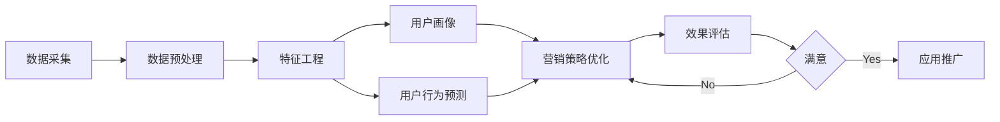

# 大数据下的精准营销策略研究

## 1. 背景介绍
### 1.1 大数据时代的到来
### 1.2 精准营销的重要性
### 1.3 大数据与精准营销的结合

## 2. 核心概念与联系
### 2.1 大数据的定义与特征
#### 2.1.1 大数据的4V特征
#### 2.1.2 大数据的价值
### 2.2 精准营销的内涵
#### 2.2.1 精准营销的定义
#### 2.2.2 精准营销的优势
### 2.3 大数据与精准营销的关系
#### 2.3.1 大数据为精准营销提供数据基础
#### 2.3.2 大数据技术赋能精准营销

## 3. 核心算法原理具体操作步骤
### 3.1 用户画像构建
#### 3.1.1 数据采集与预处理
#### 3.1.2 特征工程
#### 3.1.3 用户画像模型构建
### 3.2 用户行为预测
#### 3.2.1 数据准备
#### 3.2.2 特征选择
#### 3.2.3 模型训练与评估
### 3.3 营销策略优化
#### 3.3.1 A/B测试
#### 3.3.2 强化学习
#### 3.3.3 多臂老虎机算法

## 4. 数学模型和公式详细讲解举例说明
### 4.1 协同过滤推荐
#### 4.1.1 基于用户的协同过滤
$$
r_{ui} = \frac{\sum_{v \in N(u)}sim(u,v)r_{vi}}{\sum_{v \in N(u)}|sim(u,v)|}
$$
#### 4.1.2 基于物品的协同过滤
$$
r_{ui} = \frac{\sum_{j \in S(i)}sim(i,j)r_{uj}}{\sum_{j \in S(i)}|sim(i,j)|}
$$
### 4.2 逻辑回归
$$
P(y=1|x) = \frac{1}{1+e^{-(\beta_0+\beta_1x_1+...+\beta_nx_n)}}
$$

### 4.3 决策树
#### 4.3.1 信息增益
$$
Gain(D,a) = Ent(D) - \sum_{v=1}^{V}\frac{|D^v|}{|D|}Ent(D^v)
$$
#### 4.3.2 基尼指数
$$
Gini(D) = 1 - \sum_{k=1}^{|y|}(\frac{|C_k|}{|D|})^2
$$

## 5. 项目实践：代码实例和详细解释说明
### 5.1 用户画像构建实例
```python
# 数据预处理
def preprocess_data(data):
    # 缺失值处理
    data.fillna(0, inplace=True)
    # 数据归一化
    scaler = MinMaxScaler()
    data = scaler.fit_transform(data)
    return data

# 特征工程
def feature_engineering(data):
    # 提取时间特征
    data['hour'] = data['timestamp'].dt.hour
    data['weekday'] = data['timestamp'].dt.weekday
    # 交叉组合特征
    data['category_price'] = data['category'] + '_' + data['price_level']
    return data

# 用户画像模型
def build_user_profile(data):
    # 聚类分析
    kmeans = KMeans(n_clusters=5)
    user_clusters = kmeans.fit_predict(data)
    # 关联规则挖掘
    frequent_itemsets = apriori(data, min_support=0.01, use_colnames=True)
    rules = association_rules(frequent_itemsets, metric="lift", min_threshold=1)
    # 用户画像结果
    user_profiles = pd.concat([data, pd.Series(user_clusters)], axis=1)
    user_profiles.columns = ['feature_1', 'feature_2', ..., 'cluster']
    return user_profiles, rules
```

### 5.2 用户行为预测实例
```python
# 特征选择
def feature_selection(X, y):
    # 过滤式特征选择
    selector = SelectKBest(chi2, k=10)
    X_new = selector.fit_transform(X, y)
    selected_features = X.columns[selector.get_support()].tolist()
    return X_new, selected_features

# 模型训练与评估
def train_eval_model(X, y):
    # 数据集划分
    X_train, X_test, y_train, y_test = train_test_split(X, y, test_size=0.2)
    # 模型训练
    model = LogisticRegression()
    model.fit(X_train, y_train)
    # 模型评估
    y_pred = model.predict(X_test)
    accuracy = accuracy_score(y_test, y_pred)
    precision = precision_score(y_test, y_pred)
    recall = recall_score(y_test, y_pred)
    return model, accuracy, precision, recall
```

### 5.3 营销策略优化实例
```python
# A/B测试
def ab_test(data, strategy_a, strategy_b):
    # 随机分组
    group_a = data.sample(frac=0.5)
    group_b = data.drop(group_a.index)
    # 应用不同策略
    result_a = apply_strategy(group_a, strategy_a)
    result_b = apply_strategy(group_b, strategy_b)
    # 效果对比
    metric_a = compute_metric(result_a)
    metric_b = compute_metric(result_b)
    if metric_a > metric_b:
        return strategy_a
    else:
        return strategy_b

# 多臂老虎机算法
def multi_armed_bandit(strategies, num_rounds):
    num_strategies = len(strategies)
    rewards = [0] * num_strategies
    counts = [0] * num_strategies
    for _ in range(num_rounds):
        # 选择策略
        if random.random() < 0.1:  # 探索
            strategy = random.randint(0, num_strategies - 1)
        else:  # 利用
            strategy = rewards.index(max(rewards))
        # 应用策略并更新
        reward = apply_strategy(strategy)
        rewards[strategy] = (rewards[strategy] * counts[strategy] + reward) / (counts[strategy] + 1)
        counts[strategy] += 1
    best_strategy = rewards.index(max(rewards))
    return strategies[best_strategy]
```

## 6. 实际应用场景
### 6.1 电商平台的个性化推荐
### 6.2 社交媒体的精准广告投放
### 6.3 金融领域的风险控制
### 6.4 医疗健康的精准医疗

## 7. 工具和资源推荐
### 7.1 大数据处理框架
#### 7.1.1 Hadoop
#### 7.1.2 Spark
#### 7.1.3 Flink
### 7.2 数据分析与挖掘库
#### 7.2.1 Pandas
#### 7.2.2 Scikit-learn
#### 7.2.3 TensorFlow
### 7.3 数据可视化工具
#### 7.3.1 Matplotlib
#### 7.3.2 Seaborn
#### 7.3.3 Plotly

## 8. 总结：未来发展趋势与挑战
### 8.1 个性化与隐私保护的平衡
### 8.2 实时性与准确性的权衡
### 8.3 跨平台数据整合与分析
### 8.4 AI技术的深度应用

## 9. 附录：常见问题与解答
### 9.1 如何评估精准营销的效果？
### 9.2 大数据分析与传统数据分析的区别？
### 9.3 如何处理大数据分析中的数据质量问题？
### 9.4 大数据时代对企业营销有哪些挑战？



大数据时代的到来为企业的精准营销提供了前所未有的机遇。海量的用户行为数据蕴藏着深度洞察用户需求、提升营销效率的巨大价值。通过先进的大数据处理框架和数据挖掘算法，企业能够从原始数据中提取有价值的特征，构建全面立体的用户画像，深入分析用户的行为模式和偏好特征，进而实现个性化推荐、精准广告投放等营销策略的优化。

然而，大数据背景下的精准营销也面临着诸多挑战。海量异构数据的实时处理、数据安全与隐私保护、跨平台数据整合等都对企业的数据治理能力和算法模型提出了更高的要求。未来，人工智能技术的不断发展将为精准营销赋能，但如何在个性化服务与隐私保护之间寻求平衡，将是一个长期而复杂的课题。

总之，大数据与精准营销的结合是营销领域的必然趋势。企业需要与时俱进，加强大数据基础设施建设，提升数据分析与挖掘能力，深化对用户需求的理解，才能在激烈的市场竞争中占据优势地位。相信通过产学研各界的共同努力，大数据驱动的精准营销一定能迎来更加广阔的发展前景。

作者：禅与计算机程序设计艺术 / Zen and the Art of Computer Programming