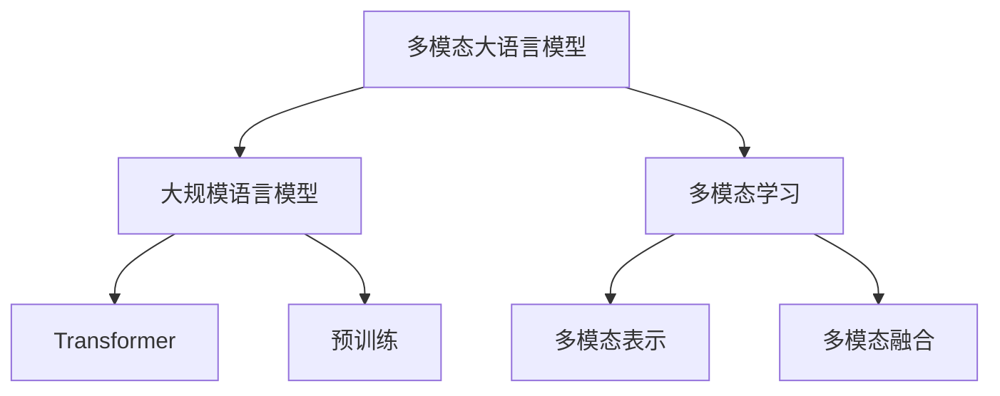

# 大规模语言模型从理论到实践 多模态大语言模型

## 1. 背景介绍
### 1.1 大规模语言模型的发展历程
#### 1.1.1 早期的语言模型
#### 1.1.2 Transformer的出现
#### 1.1.3 预训练语言模型的崛起
### 1.2 多模态大语言模型的兴起
#### 1.2.1 多模态数据的爆炸式增长
#### 1.2.2 多模态任务的广泛应用
#### 1.2.3 多模态大语言模型的优势

## 2. 核心概念与联系
### 2.1 大规模语言模型
#### 2.1.1 定义与特点
#### 2.1.2 训练方法
#### 2.1.3 应用场景
### 2.2 多模态学习
#### 2.2.1 定义与分类
#### 2.2.2 多模态表示学习
#### 2.2.3 多模态融合方法
### 2.3 多模态大语言模型
#### 2.3.1 定义与架构
#### 2.3.2 与单模态语言模型的区别
#### 2.3.3 与传统多模态模型的区别



## 3. 核心算法原理与具体操作步骤
### 3.1 多模态预训练
#### 3.1.1 掩码语言模型
#### 3.1.2 图像-文本匹配
#### 3.1.3 多模态对比学习
### 3.2 多模态融合
#### 3.2.1 早期融合
#### 3.2.2 晚期融合
#### 3.2.3 交互式融合
### 3.3 多模态推理
#### 3.3.1 多模态问答
#### 3.3.2 图像描述生成
#### 3.3.3 视觉对话

## 4. 数学模型和公式详细讲解举例说明
### 4.1 多模态Transformer
#### 4.1.1 自注意力机制
$Attention(Q,K,V) = softmax(\frac{QK^T}{\sqrt{d_k}})V$
#### 4.1.2 多头注意力
$MultiHead(Q,K,V) = Concat(head_1,...,head_h)W^O$
#### 4.1.3 前馈神经网络
$FFN(x) = max(0, xW_1 + b_1)W_2 + b_2$
### 4.2 对比学习
#### 4.2.1 InfoNCE损失
$$L_{InfoNCE} = -\mathbb{E}_{(x,y)\sim p(x,y)}\left[\log \frac{e^{f(x,y)}}{e^{f(x,y)} + \sum_{y'\sim p(y)}e^{f(x,y')}}\right]$$
#### 4.2.2 对比语言-图像预训练(CLIP)
$$L_{CLIP} = -\mathbb{E}_{(x,y)\sim p(x,y)}\left[\log \frac{e^{f(x,y)/\tau}}{\sum_{y'\sim p(y)}e^{f(x,y')/\tau}}\right]$$

### 4.3 知识蒸馏
#### 4.3.1 软目标蒸馏
$$L_{KD} = \sum_i p_i\log q_i$$
#### 4.3.2 注意力蒸馏
$$L_{Attn} = \sum_l\sum_i\sum_j (A^S_{l,i,j} - A^T_{l,i,j})^2$$

## 5. 项目实践：代码实例和详细解释说明
### 5.1 数据准备
#### 5.1.1 图像-文本对数据集
#### 5.1.2 数据预处理与增强
### 5.2 模型训练
#### 5.2.1 多模态预训练
```python
# 定义多模态Transformer
model = MultimodalTransformer(...)

# 定义优化器和损失函数
optimizer = AdamW(model.parameters(), lr=1e-4)
criterion = nn.CrossEntropyLoss()

# 训练循环
for epoch in range(num_epochs):
    for batch in dataloader:
        imgs, texts = batch
        outputs = model(imgs, texts)
        loss = criterion(outputs, targets)

        optimizer.zero_grad()
        loss.backward()
        optimizer.step()
```
#### 5.2.2 下游任务微调
```python
# 定义下游任务模型
downstream_model = DownstreamModel(pretrained_model)

# 定义优化器和损失函数
optimizer = AdamW(downstream_model.parameters(), lr=1e-4)
criterion = nn.CrossEntropyLoss()

# 训练循环
for epoch in range(num_epochs):
    for batch in dataloader:
        imgs, texts = batch
        outputs = downstream_model(imgs, texts)
        loss = criterion(outputs, targets)

        optimizer.zero_grad()
        loss.backward()
        optimizer.step()
```
### 5.3 模型评估与推理
#### 5.3.1 评估指标
#### 5.3.2 推理示例
```python
# 加载训练好的模型
model = MultimodalTransformer(...)
model.load_state_dict(torch.load('model.pth'))

# 准备输入数据
img = preprocess_img(img_path)
text = preprocess_text(text_input)

# 模型推理
with torch.no_grad():
    output = model(img, text)

# 解释模型输出
print(postprocess_output(output))
```

## 6. 实际应用场景
### 6.1 智能搜索与推荐
#### 6.1.1 多模态检索
#### 6.1.2 个性化推荐
### 6.2 智能问答与对话
#### 6.2.1 多模态问答
#### 6.2.2 视觉对话系统
### 6.3 内容生成与创作
#### 6.3.1 图像描述生成
#### 6.3.2 视觉故事创作

## 7. 工具和资源推荐
### 7.1 开源工具包
#### 7.1.1 Hugging Face Transformers
#### 7.1.2 OpenAI CLIP
#### 7.1.3 LXMERT
### 7.2 预训练模型
#### 7.2.1 BERT
#### 7.2.2 ViT
#### 7.2.3 CLIP
### 7.3 数据集
#### 7.3.1 MS COCO
#### 7.3.2 Visual Genome
#### 7.3.3 VQA

## 8. 总结：未来发展趋势与挑战
### 8.1 多模态大语言模型的发展趋势
#### 8.1.1 更大规模的预训练模型
#### 8.1.2 更多模态的融合
#### 8.1.3 更广泛的应用场景
### 8.2 面临的挑战
#### 8.2.1 模态间的语义鸿沟
#### 8.2.2 计算和存储资源的限制
#### 8.2.3 可解释性和公平性问题

## 9. 附录：常见问题与解答
### 9.1 多模态大语言模型与单模态语言模型有何区别？
多模态大语言模型能够同时处理文本和图像等不同模态的信息，学习它们之间的关联和对齐。而单模态语言模型只能处理文本数据。多模态模型能够更全面地理解和生成跨模态的内容。

### 9.2 多模态大语言模型的训练需要什么样的数据？
训练多模态大语言模型通常需要大规模的图像-文本对数据，例如图像描述、问答等。这些数据应该涵盖广泛的领域和话题，以确保模型能够学习到丰富的视觉-语言对应关系。同时，数据的质量和多样性也很关键。

### 9.3 多模态大语言模型在实际应用中还存在哪些局限性？
尽管多模态大语言模型取得了令人印象深刻的成果，但在实际应用中仍然存在一些局限性。例如，模型的泛化能力有待提高，对于一些小样本或者零样本的场景，模型的表现可能会下降。此外，模型的可解释性和可控性也是亟待解决的问题。

### 9.4 多模态大语言模型未来的研究方向有哪些？
未来的研究方向包括但不限于：探索更高效的多模态对齐方法，设计更强大的跨模态推理机制，开发更轻量化的多模态模型，提高模型的可解释性和可控性，将多模态大语言模型应用到更广泛的实际场景中，如医疗、教育、金融等领域。

作者：禅与计算机程序设计艺术 / Zen and the Art of Computer Programming