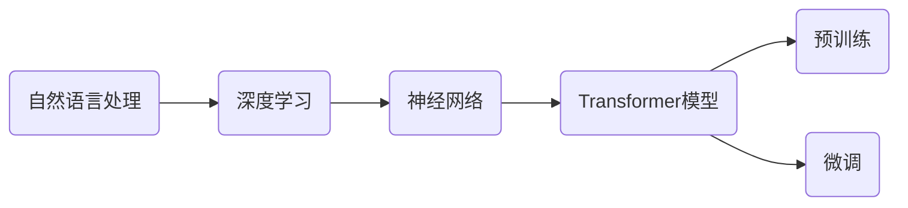

## 1.背景介绍

在过去的几年中，人工智能领域的研究者们已经取得了显著的进展，尤其是在大规模语言模型（Large Scale Language Model，简称LSLM）的研究上。从GPT-2到GPT-3，再到最近的GPT-Neo，我们看到了大规模语言模型的能力在不断提升。这些模型的出现，不仅改变了我们处理自然语言的方式，更是为整个人工智能领域带来了新的思考。

## 2.核心概念与联系

大规模语言模型是一种利用深度学习技术，通过学习大量文本数据，来理解和生成人类语言的模型。这种模型的核心概念包括：

- **自然语言处理（NLP）**：这是一种计算机科学领域和人工智能领域的交叉学科，目标是让计算机能够理解、处理和生成人类语言。

- **深度学习**：这是一种机器学习的方法，通过模拟人脑神经网络的结构和功能，让计算机自我学习和理解数据。

- **神经网络**：这是深度学习的基础，是一种模拟人脑神经元连接的计算模型。

- **Transformer模型**：这是一种特殊的神经网络模型，由Google在2017年提出，用于处理序列数据，特别适合处理自然语言任务。

- **预训练和微调**：这是大规模语言模型训练的两个阶段。预训练阶段，模型在大量无标签的文本数据上进行自我学习；微调阶段，模型在特定任务的标签数据上进行学习。

这些概念之间的联系，可以通过下面的Mermaid流程图进行展示：



## 3.核心算法原理具体操作步骤

大规模语言模型的训练主要分为预训练和微调两个阶段。

### 3.1 预训练

在预训练阶段，模型会在大量无标签的文本数据上进行自我学习。这个过程中，模型会尝试学习语言的基本规则，包括语法、句法和词义等。模型的目标是，给定一个句子中的部分词，能够预测出剩下的词。

预训练阶段的主要步骤包括：

1. **数据准备**：收集大量无标签的文本数据，如维基百科、新闻文章、网络论坛等。

2. **模型初始化**：初始化一个Transformer模型。模型的大小（即模型中的参数数量）会影响模型的学习能力。

3. **自我学习**：模型在文本数据上进行自我学习。具体来说，模型会接收到一个句子中的部分词，然后尝试预测出剩下的词。

### 3.2 微调

在微调阶段，模型会在特定任务的标签数据上进行学习。这个过程中，模型会学习如何将预训练阶段学到的语言知识，应用到特定的任务上，如文本分类、情感分析、问答系统等。

微调阶段的主要步骤包括：

1. **数据准备**：收集特定任务的标签数据。

2. **模型微调**：模型在标签数据上进行学习。具体来说，模型会接收到一个输入（如一个句子或一个问题），然后尝试预测出一个输出（如一个类别标签或一个答案）。

## 4.数学模型和公式详细讲解举例说明

在大规模语言模型中，最核心的数学模型就是Transformer模型。下面，我们将详细讲解Transformer模型的数学原理。

### 4.1 Transformer模型

Transformer模型是由Google在2017年提出的一种新型神经网络模型，特别适合处理序列数据。Transformer模型的核心是自注意力机制（Self-Attention Mechanism），这种机制能够让模型在处理一个词时，考虑到句子中所有词的信息。

Transformer模型的数学公式如下：

设$x_i$是输入序列中的第$i$个词的词嵌入，$h_i$是该词的隐藏状态，$y_i$是模型对第$i$个词的输出。那么，我们有：

$$
h_i = \text{Attention}(Q_i, K, V)
$$

其中，$Q_i$、$K$和$V$分别是查询（Query）、键（Key）和值（Value），它们是通过线性变换得到的：

$$
Q_i = W_Q x_i
$$

$$
K = W_K X
$$

$$
V = W_V X
$$

其中，$W_Q$、$W_K$和$W_V$是模型的参数，$X$是输入序列的词嵌入。

Attention函数的定义如下：

$$
\text{Attention}(Q, K, V) = \text{softmax}\left(\frac{QK^T}{\sqrt{d_k}}\right)V
$$

其中，$d_k$是键的维度，$\sqrt{d_k}$是为了让梯度更稳定。

通过这种方式，Transformer模型可以在处理一个词时，考虑到句子中所有词的信息。

## 5.项目实践：代码实例和详细解释说明

在Python中，我们可以使用Hugging Face的Transformers库，来训练和使用大规模语言模型。下面，我们将展示一个使用GPT-2模型进行文本生成的例子。

首先，我们需要安装Transformers库：

```python
pip install transformers
```

然后，我们可以加载预训练的GPT-2模型和词表：

```python
from transformers import GPT2LMHeadModel, GPT2Tokenizer

tokenizer = GPT2Tokenizer.from_pretrained('gpt2')
model = GPT2LMHeadModel.from_pretrained('gpt2')
```

接着，我们可以使用模型来生成文本：

```python
input_text = "Once upon a time"
input_ids = tokenizer.encode(input_text, return_tensors='pt')

output = model.generate(input_ids, max_length=100, temperature=0.7, do_sample=True)

output_text = tokenizer.decode(output[0], skip_special_tokens=True)
print(output_text)
```

在这个例子中，`input_text`是模型的输入，`output_text`是模型的输出。我们可以看到，GPT-2模型能够根据输入的文本，生成连贯、有意义的文本。

## 6.实际应用场景

大规模语言模型在实际中有很多应用场景，包括：

- **文本生成**：如生成新闻文章、小说、诗歌等。

- **文本分类**：如情感分析、垃圾邮件检测等。

- **问答系统**：如智能客服、在线教育等。

- **机器翻译**：如英语到中文、中文到英语等。

- **语音识别**：如将语音转化为文本。

## 7.工具和资源推荐

如果你对大规模语言模型感兴趣，下面的工具和资源可能会对你有帮助：

- **Hugging Face的Transformers库**：这是一个非常强大的库，包含了很多预训练的大规模语言模型，如GPT-2、GPT-3、BERT等。

- **Google的BERT GitHub仓库**：这个仓库包含了BERT模型的代码和预训练模型。

- **The Illustrated Transformer**：这是一个非常好的Transformer模型的教程，通过图片和例子，让你更好地理解Transformer模型。

## 8.总结：未来发展趋势与挑战

大规模语言模型是人工智能领域的一个重要研究方向，未来有很大的发展潜力。然而，也面临一些挑战，包括：

- **训练成本**：大规模语言模型需要大量的计算资源和数据来训练，这对很多研究者和公司来说是一个挑战。

- **模型理解**：虽然大规模语言模型能够生成高质量的文本，但我们往往很难理解模型的内部工作原理。

- **模型公平性**：大规模语言模型可能会从训练数据中学习到偏见，这是一个需要我们关注的问题。

## 9.附录：常见问题与解答

**Q: 大规模语言模型和小规模语言模型有什么区别？**

A: 大规模语言模型和小规模语言模型的主要区别在于模型的大小，即模型中的参数数量。大规模语言模型有更多的参数，因此能够学习到更复杂的语言规则，生成的文本质量也更高。

**Q: 如何评价大规模语言模型的质量？**

A: 评价大规模语言模型的质量，通常会使用一些自动评价指标，如困惑度（Perplexity）、BLEU分数等。此外，也可以通过人工评价来评估模型的质量。

**Q: 大规模语言模型的训练需要多久？**

A: 大规模语言模型的训练时间取决于很多因素，如模型的大小、训练数据的大小、计算资源等。一般来说，训练一个大规模语言模型可能需要几天到几周的时间。

作者：禅与计算机程序设计艺术 / Zen and the Art of Computer Programming