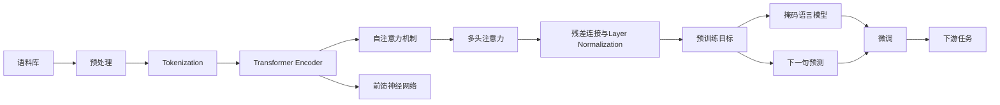

# 大语言模型原理与工程实践：工具设计

## 1. 背景介绍
### 1.1 大语言模型的发展历程
#### 1.1.1 早期的语言模型
#### 1.1.2 神经网络语言模型的兴起
#### 1.1.3 Transformer 架构的革新

### 1.2 大语言模型的应用现状
#### 1.2.1 自然语言处理领域的应用
#### 1.2.2 知识图谱构建与问答系统
#### 1.2.3 文本生成与创作辅助

### 1.3 大语言模型面临的挑战
#### 1.3.1 计算资源与训练效率
#### 1.3.2 模型的可解释性与可控性
#### 1.3.3 数据隐私与伦理考量

## 2. 核心概念与联系
### 2.1 语言模型的定义与分类
#### 2.1.1 统计语言模型
#### 2.1.2 神经网络语言模型
#### 2.1.3 大语言模型的特点

### 2.2 Transformer 架构与注意力机制
#### 2.2.1 Transformer 的基本结构
#### 2.2.2 自注意力机制的原理
#### 2.2.3 多头注意力与位置编码

### 2.3 预训练与微调策略
#### 2.3.1 无监督预训练的意义
#### 2.3.2 掩码语言模型与下一句预测
#### 2.3.3 任务特定的微调方法



## 3. 核心算法原理具体操作步骤
### 3.1 Transformer Encoder 的前向传播
#### 3.1.1 输入嵌入与位置编码
#### 3.1.2 自注意力计算过程
#### 3.1.3 前馈神经网络与残差连接

### 3.2 掩码语言模型的训练
#### 3.2.1 动态掩码策略
#### 3.2.2 损失函数与优化器选择
#### 3.2.3 学习率调度与梯度裁剪

### 3.3 下一句预测的训练
#### 3.3.1 正负样本的构建方法
#### 3.3.2 二分类损失函数
#### 3.3.3 与掩码语言模型的联合训练

## 4. 数学模型和公式详细讲解举例说明
### 4.1 自注意力机制的数学表示
#### 4.1.1 查询、键、值的计算
$$Attention(Q,K,V) = softmax(\frac{QK^T}{\sqrt{d_k}})V$$
其中，$Q$, $K$, $V$ 分别表示查询、键、值矩阵，$d_k$ 为键向量的维度。

#### 4.1.2 掩码操作的数学表示
$$Mask(x) = \begin{cases}
x & \text{if } mask = 1 \\
-\infty & \text{if } mask = 0
\end{cases}$$

#### 4.1.3 多头注意力的数学表示
$$MultiHead(Q,K,V) = Concat(head_1, ..., head_h)W^O$$
其中，$head_i = Attention(QW_i^Q, KW_i^K, VW_i^V)$，$W_i^Q$, $W_i^K$, $W_i^V$, $W^O$ 为可学习的权重矩阵。

### 4.2 前馈神经网络的数学表示
#### 4.2.1 全连接层与激活函数
$$FFN(x) = max(0, xW_1 + b_1)W_2 + b_2$$
其中，$W_1$, $W_2$, $b_1$, $b_2$ 为可学习的权重矩阵和偏置向量。

#### 4.2.2 残差连接与Layer Normalization
$$x = LayerNorm(x + Sublayer(x))$$
其中，$Sublayer(x)$ 表示子层（自注意力或前馈神经网络），$LayerNorm$ 为层归一化操作。

### 4.3 损失函数与优化算法
#### 4.3.1 掩码语言模型的损失函数
$$L_{MLM} = -\sum_{i=1}^{N} m_i \log p(w_i|w_{1:i-1}, w_{i+1:N})$$
其中，$m_i$ 为掩码指示变量，$p(w_i|w_{1:i-1}, w_{i+1:N})$ 为给定上下文预测被掩码词的概率。

#### 4.3.2 下一句预测的损失函数
$$L_{NSP} = -\log p(y|s_1, s_2)$$
其中，$y$ 为二元标签，表示 $s_2$ 是否为 $s_1$ 的下一句，$p(y|s_1, s_2)$ 为给定句子对预测标签的概率。

#### 4.3.3 AdamW 优化器
$$m_t = \beta_1 m_{t-1} + (1 - \beta_1) g_t$$
$$v_t = \beta_2 v_{t-1} + (1 - \beta_2) g_t^2$$
$$\hat{m}_t = \frac{m_t}{1 - \beta_1^t}$$
$$\hat{v}_t = \frac{v_t}{1 - \beta_2^t}$$
$$\theta_t = \theta_{t-1} - \frac{\eta}{\sqrt{\hat{v}_t} + \epsilon} (\hat{m}_t + \lambda \theta_{t-1})$$
其中，$m_t$, $v_t$ 分别为一阶矩和二阶矩估计，$\beta_1$, $\beta_2$ 为衰减率，$\eta$ 为学习率，$\lambda$ 为权重衰减系数，$\epsilon$ 为平滑项。

## 5. 项目实践：代码实例和详细解释说明
### 5.1 数据预处理与词元化
```python
import torch
from transformers import BertTokenizer

# 加载预训练的词元化器
tokenizer = BertTokenizer.from_pretrained('bert-base-uncased')

# 对输入文本进行词元化
text = "This is an example sentence."
tokens = tokenizer.tokenize(text)
input_ids = tokenizer.convert_tokens_to_ids(tokens)

# 添加特殊词元 [CLS] 和 [SEP]
input_ids = [tokenizer.cls_token_id] + input_ids + [tokenizer.sep_token_id]

# 转换为 PyTorch 张量
input_ids = torch.tensor([input_ids])
```

### 5.2 构建 Transformer Encoder
```python
import torch
import torch.nn as nn

class TransformerEncoder(nn.Module):
    def __init__(self, d_model, nhead, dim_feedforward, num_layers, dropout=0.1):
        super(TransformerEncoder, self).__init__()
        encoder_layer = nn.TransformerEncoderLayer(d_model, nhead, dim_feedforward, dropout)
        self.encoder = nn.TransformerEncoder(encoder_layer, num_layers)

    def forward(self, src, src_mask=None, src_key_padding_mask=None):
        return self.encoder(src, src_mask, src_key_padding_mask)

# 实例化 Transformer Encoder
d_model = 512
nhead = 8
dim_feedforward = 2048
num_layers = 6
model = TransformerEncoder(d_model, nhead, dim_feedforward, num_layers)
```

### 5.3 预训练与微调
```python
import torch
from transformers import BertForMaskedLM, AdamW

# 加载预训练的 BERT 模型
model = BertForMaskedLM.from_pretrained('bert-base-uncased')

# 准备优化器
optimizer = AdamW(model.parameters(), lr=1e-4)

# 模型微调
for epoch in range(num_epochs):
    for batch in dataloader:
        input_ids, attention_mask, labels = batch
        outputs = model(input_ids, attention_mask=attention_mask, labels=labels)
        loss = outputs.loss
        loss.backward()
        optimizer.step()
        optimizer.zero_grad()
```

## 6. 实际应用场景
### 6.1 文本分类
#### 6.1.1 情感分析
#### 6.1.2 主题分类
#### 6.1.3 意图识别

### 6.2 命名实体识别
#### 6.2.1 人名、地名、组织机构名识别
#### 6.2.2 医学实体识别
#### 6.2.3 法律实体识别

### 6.3 问答系统
#### 6.3.1 阅读理解式问答
#### 6.3.2 知识库问答
#### 6.3.3 对话系统中的问答

### 6.4 文本生成
#### 6.4.1 摘要生成
#### 6.4.2 故事生成
#### 6.4.3 对联生成

## 7. 工具和资源推荐
### 7.1 开源工具包
#### 7.1.1 Transformers (Hugging Face)
#### 7.1.2 Fairseq (Facebook)
#### 7.1.3 OpenNMT (Harvard NLP)

### 7.2 预训练模型
#### 7.2.1 BERT (Google)
#### 7.2.2 GPT 系列 (OpenAI)
#### 7.2.3 XLNet (Google & CMU)

### 7.3 数据集
#### 7.3.1 Wikipedia
#### 7.3.2 BookCorpus
#### 7.3.3 Common Crawl

### 7.4 计算资源
#### 7.4.1 Google Colab
#### 7.4.2 AWS EC2
#### 7.4.3 NVIDIA GPU Cloud

## 8. 总结：未来发展趋势与挑战
### 8.1 模型架构的改进
#### 8.1.1 更深、更宽的网络结构
#### 8.1.2 稀疏注意力机制
#### 8.1.3 知识增强型语言模型

### 8.2 训练策略的优化
#### 8.2.1 更大规模的无监督预训练
#### 8.2.2 多任务联合训练
#### 8.2.3 对抗训练与数据增强

### 8.3 可解释性与可控性
#### 8.3.1 注意力可视化与分析
#### 8.3.2 基于规则的输出控制
#### 8.3.3 因果关系建模

### 8.4 多模态语言模型
#### 8.4.1 文本-图像预训练模型
#### 8.4.2 文本-语音预训练模型
#### 8.4.3 多模态知识表示与推理

## 9. 附录：常见问题与解答
### 9.1 如何选择合适的预训练模型？
### 9.2 微调时需要注意哪些超参数？
### 9.3 如何处理输入文本过长的问题？
### 9.4 预训练语料的质量对模型性能有何影响？
### 9.5 如何平衡模型的泛化能力与任务特定性能？

作者：禅与计算机程序设计艺术 / Zen and the Art of Computer Programming