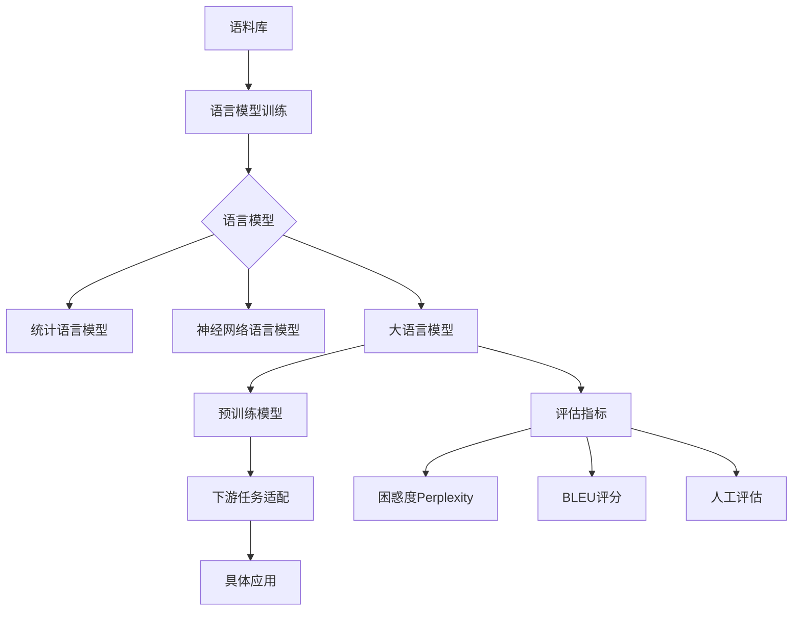

# 大语言模型原理基础与前沿 评估语言模型

## 1.背景介绍
### 1.1 大语言模型的发展历程
#### 1.1.1 早期的语言模型
#### 1.1.2 神经网络语言模型的兴起
#### 1.1.3 Transformer的革命性突破
### 1.2 大语言模型的应用现状
#### 1.2.1 自然语言处理领域的广泛应用
#### 1.2.2 跨领域应用的拓展
#### 1.2.3 大语言模型的局限性
### 1.3 评估语言模型的重要性
#### 1.3.1 评估指标的多样性
#### 1.3.2 评估方法的选择
#### 1.3.3 评估结果的解释与应用

## 2.核心概念与联系
### 2.1 语言模型的定义与分类
#### 2.1.1 统计语言模型
#### 2.1.2 神经网络语言模型
#### 2.1.3 大语言模型
### 2.2 语言模型的评估指标
#### 2.2.1 困惑度(Perplexity)
#### 2.2.2 BLEU评分
#### 2.2.3 人工评估
### 2.3 语言模型与下游任务的关系
#### 2.3.1 语言模型作为预训练模型
#### 2.3.2 语言模型与具体任务的适配
#### 2.3.3 语言模型的迁移学习能力



## 3.核心算法原理具体操作步骤
### 3.1 统计语言模型算法
#### 3.1.1 N-gram模型
#### 3.1.2 平滑技术
#### 3.1.3 回退模型
### 3.2 神经网络语言模型算法
#### 3.2.1 NNLM
#### 3.2.2 RNNLM
#### 3.2.3 LSTM/GRU
### 3.3 Transformer语言模型
#### 3.3.1 自注意力机制
#### 3.3.2 位置编码
#### 3.3.3 多头注意力
### 3.4 预训练与微调
#### 3.4.1 无监督预训练
#### 3.4.2 有监督微调
#### 3.4.3 提示学习(Prompt Learning)

## 4.数学模型和公式详细讲解举例说明
### 4.1 统计语言模型的数学表示
#### 4.1.1 联合概率与条件概率
#### 4.1.2 马尔可夫假设
#### 4.1.3 N-gram模型的概率计算
### 4.2 神经网络语言模型的数学原理
#### 4.2.1 词嵌入(Word Embedding)
#### 4.2.2 前馈神经网络
#### 4.2.3 循环神经网络
### 4.3 Transformer的数学原理
#### 4.3.1 自注意力机制的数学表示
#### 4.3.2 位置编码的数学表示
#### 4.3.3 前馈网络的数学表示

以下是Transformer中自注意力机制的核心公式：

$$
Attention(Q,K,V) = softmax(\frac{QK^T}{\sqrt{d_k}})V
$$

其中，$Q$是查询矩阵，$K$是键矩阵，$V$是值矩阵，$d_k$是键向量的维度。这个公式体现了自注意力机制如何计算不同位置之间的相关性，并根据相关性对值向量进行加权求和。

### 4.4 评估指标的数学定义
#### 4.4.1 困惑度的数学定义
#### 4.4.2 BLEU评分的数学定义
#### 4.4.3 其他评估指标的数学定义

## 5.项目实践：代码实例和详细解释说明
### 5.1 使用PyTorch实现语言模型
#### 5.1.1 数据预处理
#### 5.1.2 模型定义
#### 5.1.3 训练与评估
### 5.2 使用TensorFlow实现语言模型
#### 5.2.1 数据预处理
#### 5.2.2 模型定义
#### 5.2.3 训练与评估
### 5.3 使用Hugging Face库进行语言模型的预训练与微调
#### 5.3.1 加载预训练模型
#### 5.3.2 数据准备
#### 5.3.3 模型微调与评估

以下是使用PyTorch实现一个简单的LSTM语言模型的核心代码：

```python
import torch
import torch.nn as nn

class LanguageModel(nn.Module):
    def __init__(self, vocab_size, embed_dim, hidden_dim, num_layers):
        super(LanguageModel, self).__init__()
        self.embed = nn.Embedding(vocab_size, embed_dim)
        self.lstm = nn.LSTM(embed_dim, hidden_dim, num_layers, batch_first=True)
        self.linear = nn.Linear(hidden_dim, vocab_size)

    def forward(self, x, h):
        x = self.embed(x)
        out, (h, c) = self.lstm(x, h)
        out = self.linear(out)
        return out, (h, c)
```

这段代码定义了一个基于LSTM的语言模型，包括词嵌入层、LSTM层和线性输出层。forward方法定义了前向传播的过程，输入词序列x和初始隐藏状态h，输出预测的词概率分布和更新后的隐藏状态。

## 6.实际应用场景
### 6.1 机器翻译中的应用
#### 6.1.1 基于语言模型的翻译模型
#### 6.1.2 多语言翻译模型
#### 6.1.3 无监督机器翻译
### 6.2 对话系统中的应用
#### 6.2.1 基于语言模型的对话生成
#### 6.2.2 个性化对话生成
#### 6.2.3 对话一致性控制
### 6.3 文本摘要中的应用
#### 6.3.1 抽取式摘要
#### 6.3.2 生成式摘要
#### 6.3.3 摘要的可控生成
### 6.4 其他应用场景
#### 6.4.1 语音识别中的语言模型
#### 6.4.2 情感分析中的语言模型
#### 6.4.3 知识图谱中的语言模型

## 7.工具和资源推荐
### 7.1 开源工具库
#### 7.1.1 PyTorch/TensorFlow
#### 7.1.2 Hugging Face Transformers
#### 7.1.3 OpenAI GPT系列模型
### 7.2 预训练模型资源
#### 7.2.1 BERT系列模型
#### 7.2.2 GPT系列模型
#### 7.2.3 XLNet等其他预训练模型
### 7.3 评估数据集与工具
#### 7.3.1 WikiText/PTB等语言模型数据集
#### 7.3.2 GLUE/SuperGLUE等评估基准
#### 7.3.3 评估工具与脚本

## 8.总结：未来发展趋势与挑战
### 8.1 大语言模型的发展趋势
#### 8.1.1 模型规模的持续增长
#### 8.1.2 多模态语言模型的兴起
#### 8.1.3 语言模型的可解释性研究
### 8.2 语言模型面临的挑战
#### 8.2.1 数据偏差与公平性问题
#### 8.2.2 隐私与安全问题
#### 8.2.3 计算资源与环境成本问题
### 8.3 语言模型评估的未来方向
#### 8.3.1 更全面的评估体系构建
#### 8.3.2 人机交互式评估方法探索
#### 8.3.3 评估指标的创新与改进

## 9.附录：常见问题与解答
### 9.1 如何选择合适的语言模型？
### 9.2 如何处理语言模型生成的有害内容？
### 9.3 语言模型能否真正理解自然语言？
### 9.4 语言模型在垂直领域的应用有哪些注意事项？
### 9.5 如何权衡语言模型的性能与效率？

语言模型是自然语言处理领域的重要基础，其发展与应用一直备受关注。从早期的统计语言模型，到神经网络语言模型的兴起，再到当前大规模预训练语言模型的广泛应用，语言模型技术不断突破，推动着自然语言处理的进步。

评估语言模型的性能对于语言模型的研究与应用至关重要。从传统的困惑度指标，到针对具体任务的评估方法，再到当前的人工评估与交互式评估，评估体系不断完善，以更全面地反映语言模型的能力。

语言模型在机器翻译、对话系统、文本摘要等领域得到了广泛应用，极大地提升了这些任务的性能。同时，语言模型技术也在不断拓展，向多模态、可控、可解释的方向发展，以满足更多场景的需求。

然而，语言模型的发展也面临着诸多挑战，如数据偏差、隐私安全、计算资源等问题。这需要研究者与开发者在技术创新的同时，兼顾伦理、公平、可持续性等因素。

展望未来，语言模型技术仍将不断发展，模型规模将持续增长，多模态语言模型、可解释语言模型等新方向值得期待。与此同时，构建更全面的评估体系，探索人机交互式评估，创新评估指标等，也将是语言模型评估的重要研究方向。

总之，语言模型是自然语言处理的重要基石，其发展与应用将持续推动人机交互的进步。把握语言模型技术的前沿动态，探索语言模型评估的有效方法，对于自然语言处理的研究者与开发者而言，至关重要。

作者：禅与计算机程序设计艺术 / Zen and the Art of Computer Programming