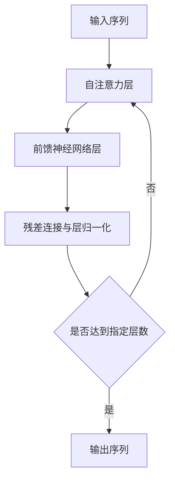

# 大语言模型原理基础与前沿 高效注意力

## 1.背景介绍
### 1.1 大语言模型的发展历程
#### 1.1.1 早期的语言模型
#### 1.1.2 神经网络语言模型的兴起
#### 1.1.3 Transformer的出现与发展
### 1.2 注意力机制在大语言模型中的重要性
#### 1.2.1 注意力机制的基本原理
#### 1.2.2 注意力机制在大语言模型中的应用
#### 1.2.3 高效注意力的研究意义
### 1.3 高效注意力的研究现状
#### 1.3.1 稀疏注意力机制
#### 1.3.2 低秩近似注意力机制
#### 1.3.3 其他高效注意力方法

## 2.核心概念与联系
### 2.1 注意力机制
#### 2.1.1 注意力的定义与原理
#### 2.1.2 注意力的数学表示
#### 2.1.3 注意力的类型
### 2.2 自注意力机制
#### 2.2.1 自注意力的定义与原理
#### 2.2.2 自注意力的数学表示
#### 2.2.3 自注意力在Transformer中的应用
### 2.3 高效注意力
#### 2.3.1 高效注意力的定义
#### 2.3.2 高效注意力与传统注意力的区别
#### 2.3.3 高效注意力的研究意义

## 3.核心算法原理具体操作步骤
### 3.1 稀疏注意力机制
#### 3.1.1 局部敏感哈希注意力(LSH Attention)
#### 3.1.2 改进的稀疏注意力(Improved Sparse Attention)
#### 3.1.3 长程注意力(Longformer)
### 3.2 低秩近似注意力机制
#### 3.2.1 线性注意力(Linear Attention)
#### 3.2.2 Linformer
#### 3.2.3 Performer
### 3.3 其他高效注意力方法
#### 3.3.1 Reformer
#### 3.3.2 Routing Transformer
#### 3.3.3 Sinkhorn Attention

## 4.数学模型和公式详细讲解举例说明
### 4.1 注意力机制的数学模型
#### 4.1.1 注意力的数学定义
#### 4.1.2 注意力的计算过程
#### 4.1.3 注意力的矩阵表示
### 4.2 自注意力机制的数学模型
#### 4.2.1 自注意力的数学定义
#### 4.2.2 自注意力的计算过程
#### 4.2.3 多头自注意力机制
### 4.3 高效注意力的数学模型
#### 4.3.1 稀疏注意力的数学模型
#### 4.3.2 低秩近似注意力的数学模型
#### 4.3.3 其他高效注意力方法的数学模型

## 5.项目实践：代码实例和详细解释说明
### 5.1 Transformer中的自注意力机制实现
#### 5.1.1 Transformer的整体架构
#### 5.1.2 自注意力机制的PyTorch实现
#### 5.1.3 多头自注意力机制的PyTorch实现
### 5.2 稀疏注意力机制的实现
#### 5.2.1 局部敏感哈希注意力(LSH Attention)的PyTorch实现
#### 5.2.2 改进的稀疏注意力(Improved Sparse Attention)的PyTorch实现
#### 5.2.3 长程注意力(Longformer)的PyTorch实现
### 5.3 低秩近似注意力机制的实现
#### 5.3.1 线性注意力(Linear Attention)的PyTorch实现
#### 5.3.2 Linformer的PyTorch实现
#### 5.3.3 Performer的PyTorch实现

## 6.实际应用场景
### 6.1 大规模语言模型预训练
#### 6.1.1 高效注意力在GPT-3中的应用
#### 6.1.2 高效注意力在T5中的应用
#### 6.1.3 高效注意力在BERT中的应用
### 6.2 长文本建模与生成
#### 6.2.1 高效注意力在文本摘要中的应用
#### 6.2.2 高效注意力在对话生成中的应用
#### 6.2.3 高效注意力在故事生成中的应用
### 6.3 其他应用场景
#### 6.3.1 高效注意力在图像字幕生成中的应用
#### 6.3.2 高效注意力在语音识别中的应用
#### 6.3.3 高效注意力在机器翻译中的应用

## 7.工具和资源推荐
### 7.1 开源工具包
#### 7.1.1 Hugging Face Transformers
#### 7.1.2 Fairseq
#### 7.1.3 OpenNMT
### 7.2 预训练模型
#### 7.2.1 BERT
#### 7.2.2 GPT-2
#### 7.2.3 T5
### 7.3 学习资源
#### 7.3.1 相关论文列表
#### 7.3.2 在线教程与课程
#### 7.3.3 博客与社区

## 8.总结：未来发展趋势与挑战
### 8.1 高效注意力的研究趋势
#### 8.1.1 更高效的注意力机制设计
#### 8.1.2 注意力机制与其他技术的结合
#### 8.1.3 注意力机制在其他领域的应用
### 8.2 大语言模型面临的挑战
#### 8.2.1 模型的可解释性与可控性
#### 8.2.2 模型的公平性与偏见
#### 8.2.3 模型的计算效率与可扩展性
### 8.3 未来研究方向
#### 8.3.1 注意力机制的理论基础研究
#### 8.3.2 注意力机制与认知科学的结合
#### 8.3.3 注意力机制在多模态学习中的应用

## 9.附录：常见问题与解答
### 9.1 注意力机制与RNN、CNN的区别是什么？
### 9.2 自注意力机制为什么能够捕捉长距离依赖关系？
### 9.3 高效注意力机制是如何降低计算复杂度的？
### 9.4 稀疏注意力和低秩近似注意力的主要区别是什么？
### 9.5 如何选择适合自己任务的高效注意力机制？

大语言模型自从Transformer的出现以来,其性能不断刷新记录,在各种自然语言处理任务上取得了巨大的成功。Transformer的核心在于其自注意力机制,能够有效地捕捉输入序列中的长距离依赖关系。然而,传统的自注意力机制在处理长序列时,其计算复杂度会随着序列长度的平方而增长,这限制了Transformer在处理长文本时的效率。

为了解决这一问题,研究者们提出了各种高效注意力机制,旨在降低注意力计算的复杂度,同时尽可能地保持模型的性能。本文将全面介绍大语言模型中的高效注意力机制,从其基本原理出发,详细讲解几种主流的高效注意力方法,包括稀疏注意力、低秩近似注意力等。同时,本文还将通过数学模型和代码实例,深入剖析这些方法的实现细节。

在讨论高效注意力之前,我们首先回顾一下传统的注意力机制。给定一个长度为$n$的输入序列$X \in \mathbb{R}^{n \times d}$,注意力机制可以表示为:

$$
\text{Attention}(Q, K, V) = \text{softmax}(\frac{QK^T}{\sqrt{d_k}})V
$$

其中,$Q$,$K$,$V$分别表示查询、键、值矩阵,$d_k$为键向量的维度。这一过程可以解释为,对于每个查询向量,通过与所有键向量的相似度计算得到注意力权重,然后用这些权重对值向量进行加权求和,得到最终的注意力输出。

传统的注意力机制需要计算$QK^T$,其计算复杂度为$O(n^2d_k)$。为了降低复杂度,稀疏注意力机制引入了稀疏性,即每个查询向量只与部分键向量进行相似度计算。以局部敏感哈希注意力(LSH Attention)为例,其核心思想是将键向量划分为多个桶,每个查询向量只与同一桶中的键向量计算相似度。设桶的个数为$n_b$,则LSH Attention的复杂度为$O(n n_b d_k)$。

另一类高效注意力机制是基于低秩近似的方法。这些方法通过对注意力矩阵进行低秩分解,将复杂度降低到$O(n d_k r)$,其中$r$为近似矩阵的秩。以线性注意力(Linear Attention)为例,其将$QK^T$分解为$\phi(Q)\phi(K)^T$,其中$\phi(\cdot)$为一个线性变换:

$$
\phi(X) = XW_{\phi}, \quad W_{\phi} \in \mathbb{R}^{d \times r}
$$

通过引入线性变换,线性注意力将原始的注意力计算转化为两个矩阵乘法,大大降低了计算复杂度。

除了上述两类主流方法外,还有一些其他的高效注意力机制,如Reformer中的局部敏感哈希注意力和可逆残差层设计,Routing Transformer中的k-means聚类动态路由机制等。这些方法从不同角度对注意力机制进行了改进和优化。

高效注意力机制在大规模语言模型预训练和长文本建模等任务中得到了广泛应用。以GPT-3为例,其使用了稀疏注意力机制,在保持模型性能的同时,大大降低了训练和推理的计算开销。而在文本摘要、对话生成等任务中,研究者们也尝试引入高效注意力机制,以提高模型处理长文本的能力。

展望未来,高效注意力机制仍然是大语言模型研究的一个重要方向。一方面,研究者们将继续探索更高效、更精准的注意力机制设计。另一方面,高效注意力机制与知识蒸馏、模型压缩等技术的结合,也有望进一步提升模型的效率。同时,随着大语言模型在各领域的应用不断深入,其可解释性、公平性等问题也日益受到关注。这些都将是未来大语言模型研究需要重点关注的问题。

作者：禅与计算机程序设计艺术 / Zen and the Art of Computer Programming