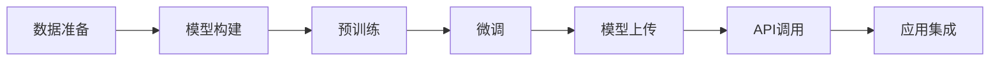

# 大语言模型应用指南：GPTs与GPT商店

## 1. 背景介绍
### 1.1 大语言模型的兴起
### 1.2 GPT模型的发展历程
### 1.3 GPT模型的应用现状

## 2. 核心概念与联系
### 2.1 大语言模型的定义与特点
#### 2.1.1 定义
#### 2.1.2 特点
### 2.2 GPT模型的原理
#### 2.2.1 Transformer架构
#### 2.2.2 预训练与微调
### 2.3 GPT商店的概念与作用
#### 2.3.1 GPT商店的定义
#### 2.3.2 GPT商店的优势

## 3. 核心算法原理具体操作步骤
### 3.1 GPT模型的训练流程
#### 3.1.1 数据准备
#### 3.1.2 模型构建
#### 3.1.3 预训练
#### 3.1.4 微调
### 3.2 GPT模型的推理过程
#### 3.2.1 输入处理
#### 3.2.2 模型前向传播
#### 3.2.3 输出解码
### 3.3 GPT商店的部署与使用
#### 3.3.1 模型上传与管理
#### 3.3.2 API调用与集成



## 4. 数学模型和公式详细讲解举例说明
### 4.1 Transformer的数学原理
#### 4.1.1 自注意力机制
$Attention(Q,K,V) = softmax(\frac{QK^T}{\sqrt{d_k}})V$
#### 4.1.2 多头注意力
$$MultiHead(Q,K,V) = Concat(head_1, ..., head_h)W^O$$
$$head_i = Attention(QW_i^Q, KW_i^K, VW_i^V)$$
### 4.2 GPT模型的损失函数
$L(X) = -\sum_{i=1}^{n} \log P(x_i|x_1, ..., x_{i-1}; \theta)$

## 5. 项目实践：代码实例和详细解释说明
### 5.1 使用Hugging Face的Transformers库训练GPT模型
```python
from transformers import GPT2LMHeadModel, GPT2Tokenizer, TextDataset, DataCollatorForLanguageModeling, Trainer, TrainingArguments

# 加载预训练模型和分词器
model = GPT2LMHeadModel.from_pretrained('gpt2')
tokenizer = GPT2Tokenizer.from_pretrained('gpt2')

# 准备数据集
train_dataset = TextDataset(
    tokenizer=tokenizer,
    file_path="train.txt",
    block_size=128
)

data_collator = DataCollatorForLanguageModeling(
    tokenizer=tokenizer, mlm=False
)

# 设置训练参数
training_args = TrainingArguments(
    output_dir="./results",
    num_train_epochs=3,
    per_device_train_batch_size=4,
    save_steps=10_000,
    save_total_limit=2,
    prediction_loss_only=True,
)

# 开始训练
trainer = Trainer(
    model=model,
    args=training_args,
    data_collator=data_collator,
    train_dataset=train_dataset,
)

trainer.train()
```

以上代码展示了如何使用Hugging Face的Transformers库来训练GPT模型。首先加载预训练的GPT-2模型和分词器，然后准备训练数据集。接着设置训练参数，包括训练轮数、批大小、保存步数等。最后创建Trainer对象并开始训练。

### 5.2 使用GPT商店的API进行推理
```python
import requests

API_URL = "https://api.gptstore.com/v1/models/gpt-3.5-turbo/completions"
API_KEY = "your_api_key"

prompt = "请用Python写一个快速排序算法"

headers = {
    "Content-Type": "application/json",
    "Authorization": f"Bearer {API_KEY}"
}

data = {
    "prompt": prompt,
    "max_tokens": 100,
    "temperature": 0.7
}

response = requests.post(API_URL, headers=headers, json=data)

if response.status_code == 200:
    result = response.json()["choices"][0]["text"]
    print(result)
else:
    print(f"请求失败，状态码: {response.status_code}")
```

以上代码展示了如何使用GPT商店提供的API进行推理。首先设置API的URL和密钥，然后准备推理的输入prompt。接着设置请求头和请求数据，包括prompt、最大生成长度、采样温度等参数。最后发送POST请求，如果请求成功，则解析并输出生成的结果。

## 6. 实际应用场景
### 6.1 智能客服
### 6.2 内容生成
### 6.3 代码辅助
### 6.4 语言翻译
### 6.5 知识问答

## 7. 工具和资源推荐
### 7.1 开源框架与库
#### 7.1.1 Hugging Face Transformers
#### 7.1.2 OpenAI GPT
#### 7.1.3 DeepSpeed
### 7.2 预训练模型
#### 7.2.1 GPT-2
#### 7.2.2 GPT-3
#### 7.2.3 ChatGPT
### 7.3 GPT商店平台
#### 7.3.1 OpenAI API
#### 7.3.2 Azure OpenAI Service
#### 7.3.3 Google Cloud AI Platform

## 8. 总结：未来发展趋势与挑战
### 8.1 大语言模型的发展趋势
#### 8.1.1 模型规模不断增大
#### 8.1.2 训练数据更加多样化
#### 8.1.3 多模态融合
### 8.2 GPT商店的未来展望
#### 8.2.1 更多垂直领域的模型
#### 8.2.2 更加灵活的定价策略
#### 8.2.3 更友好的开发者生态
### 8.3 面临的挑战与问题
#### 8.3.1 计算资源需求高
#### 8.3.2 数据隐私与安全
#### 8.3.3 模型偏差与伦理问题

## 9. 附录：常见问题与解答
### 9.1 如何选择合适的GPT模型？
### 9.2 GPT模型的训练需要哪些硬件资源？
### 9.3 使用GPT商店的费用如何计算？
### 9.4 如何避免GPT模型生成有害或偏见的内容？
### 9.5 GPT模型能否完全替代人工？

大语言模型，尤其是GPT系列模型的出现，为自然语言处理领域带来了革命性的变化。GPT模型以其强大的语言理解和生成能力，在各个领域得到了广泛应用。而GPT商店的兴起，则进一步降低了开发者使用GPT模型的门槛，使得更多的个人和企业能够便捷地接入并使用GPT模型的能力。

本文从GPT模型的原理出发，详细介绍了其核心架构Transformer和训练流程，并通过数学公式和代码实例深入讲解了其工作原理。同时，本文还介绍了GPT商店的概念和使用方法，帮助读者快速上手GPT模型的应用开发。

在实际应用方面，本文列举了智能客服、内容生成、代码辅助等多个场景，展示了GPT模型的广泛应用前景。此外，本文还推荐了多个开源框架、预训练模型和GPT商店平台，为读者提供了丰富的工具和资源支持。

展望未来，大语言模型的发展趋势是模型规模不断增大、训练数据更加多样化以及与其他模态的融合。而GPT商店也将迎来更多垂直领域的模型、更灵活的定价策略和更加友好的开发者生态。当然，大语言模型的发展也面临着计算资源需求高、数据隐私与安全以及模型偏差等挑战和问题，需要业界共同努力加以解决。

总之，GPT模型和GPT商店为自然语言处理领域带来了新的机遇和挑战。作为开发者，我们应该积极拥抱这一技术浪潮，利用好GPT模型和GPT商店提供的能力，不断探索和创新，推动人工智能技术在各个领域的应用和发展。

作者：禅与计算机程序设计艺术 / Zen and the Art of Computer Programming