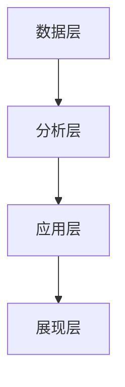

# 数字化审计:审计管理的智能化变革

## 1. 背景介绍

### 1.1 审计行业面临的挑战
#### 1.1.1 数据量激增
#### 1.1.2 业务复杂性提高
#### 1.1.3 审计效率和质量要求提升

### 1.2 数字化转型的必要性
#### 1.2.1 提高审计效率
#### 1.2.2 增强审计质量
#### 1.2.3 适应业务发展需求

### 1.3 数字化审计的发展现状
#### 1.3.1 国内外研究进展
#### 1.3.2 行业应用案例
#### 1.3.3 存在的问题和不足

## 2. 核心概念与联系

### 2.1 数字化审计的定义
#### 2.1.1 内涵与外延
#### 2.1.2 与传统审计的区别

### 2.2 数字化审计的关键技术
#### 2.2.1 大数据分析
#### 2.2.2 人工智能
#### 2.2.3 区块链
#### 2.2.4 云计算

### 2.3 数字化审计的架构


## 3. 核心算法原理具体操作步骤

### 3.1 异常检测算法
#### 3.1.1 统计学方法
#### 3.1.2 机器学习方法
#### 3.1.3 深度学习方法

### 3.2 关联分析算法
#### 3.2.1 Apriori算法
#### 3.2.2 FP-Growth算法
#### 3.2.3 关联规则挖掘

### 3.3 聚类分析算法
#### 3.3.1 K-Means算法
#### 3.3.2 DBSCAN算法
#### 3.3.3 层次聚类算法

## 4. 数学模型和公式详细讲解举例说明

### 4.1 异常检测模型
#### 4.1.1 高斯分布模型
$$ P(x) = \frac{1}{\sqrt{2\pi}\sigma}e^{-\frac{(x-\mu)^2}{2\sigma^2}} $$
其中，$\mu$ 为均值，$\sigma$ 为标准差。

#### 4.1.2 马氏距离模型
$$ D_M(x) = \sqrt{(x-\mu)^T\Sigma^{-1}(x-\mu)} $$
其中，$\mu$ 为均值向量，$\Sigma$ 为协方差矩阵。

### 4.2 关联分析模型
#### 4.2.1 支持度
$$ Support(A \Rightarrow B) = P(A \cup B) $$

#### 4.2.2 置信度
$$ Confidence(A \Rightarrow B) = P(B|A) = \frac{Support(A \cup B)}{Support(A)} $$

### 4.3 聚类分析模型
#### 4.3.1 K-Means目标函数
$$ J = \sum_{i=1}^k\sum_{x \in C_i} ||x-\mu_i||^2 $$
其中，$\mu_i$ 为第 $i$ 个簇的中心点。

## 5. 项目实践：代码实例和详细解释说明

### 5.1 异常检测代码实例
```python
from sklearn.ensemble import IsolationForest

# 训练异常检测模型
model = IsolationForest(n_estimators=100, contamination=0.1)
model.fit(X_train)

# 预测异常分数
anomaly_scores = model.decision_function(X_test)
```
IsolationForest 是一种基于树的异常检测算法，通过构建多棵孤立树来判断样本的异常程度。contamination 参数指定了异常样本的比例。

### 5.2 关联分析代码实例
```python
from mlxtend.frequent_patterns import apriori
from mlxtend.frequent_patterns import association_rules

# 生成频繁项集
frequent_itemsets = apriori(df, min_support=0.01, use_colnames=True)

# 生成关联规则
rules = association_rules(frequent_itemsets, metric="lift", min_threshold=1)
```
apriori 函数用于生成频繁项集，min_support 指定最小支持度阈值。association_rules 函数基于频繁项集生成关联规则，metric 指定评估指标，min_threshold 指定最小阈值。

### 5.3 聚类分析代码实例
```python
from sklearn.cluster import KMeans

# 训练K-Means模型
kmeans = KMeans(n_clusters=3, random_state=42)
kmeans.fit(X)

# 预测聚类标签
labels = kmeans.predict(X)
```
KMeans 是一种常用的聚类算法，n_clusters 指定聚类数量，random_state 指定随机种子以保证结果可复现。

## 6. 实际应用场景

### 6.1 财务报表审计
#### 6.1.1 异常交易检测
#### 6.1.2 舞弊风险评估
#### 6.1.3 会计分录聚类

### 6.2 内部控制审计
#### 6.2.1 权限矩阵分析
#### 6.2.2 流程合规检查
#### 6.2.3 控制薄弱点识别

### 6.3 风险导向审计
#### 6.3.1 风险评估模型
#### 6.3.2 关键控制点监控
#### 6.3.3 持续审计机制

## 7. 工具和资源推荐

### 7.1 开源工具
#### 7.1.1 Python数据分析库：Pandas、Numpy
#### 7.1.2 机器学习库：Scikit-learn、TensorFlow
#### 7.1.3 可视化库：Matplotlib、Seaborn

### 7.2 商业软件
#### 7.2.1 审计管理系统
#### 7.2.2 数据分析平台
#### 7.2.3 可视化报表工具

### 7.3 学习资源
#### 7.3.1 在线课程平台
#### 7.3.2 技术博客和论坛
#### 7.3.3 行业会议和培训

## 8. 总结：未来发展趋势与挑战

### 8.1 发展趋势
#### 8.1.1 审计流程智能化
#### 8.1.2 实时监控与预警
#### 8.1.3 数据驱动决策

### 8.2 面临的挑战
#### 8.2.1 数据质量和安全
#### 8.2.2 算法模型的解释性
#### 8.2.3 专业人才培养

### 8.3 展望
数字化审计代表了审计行业发展的必然趋势，融合大数据、人工智能等前沿技术，有望极大提升审计工作的效率和质量，更好地服务于企业经营管理和风险防控。未来随着技术的进一步发展和成熟，数字化审计必将推动审计行业实现智能化、精细化管理的变革。

## 9. 附录：常见问题与解答

### 9.1 数字化审计对审计人员的技能要求有哪些变化？
数字化审计要求审计人员具备数据分析、统计建模等技术能力，同时还需要对业务有深入理解，能够综合运用多种技能发现和解决问题。

### 9.2 数字化审计是否会取代传统审计方法？
数字化审计是对传统审计方法的补充和提升，并非完全取代。在实际工作中，需要结合具体情况，合理选择和运用不同的审计手段。

### 9.3 如何评估数字化审计项目的实施效果？
可以从审计效率、审计质量、问题发现数量等维度，设置量化指标，持续跟踪和评估数字化审计项目的实施效果，并根据反馈优化改进。

作者：禅与计算机程序设计艺术 / Zen and the Art of Computer Programming