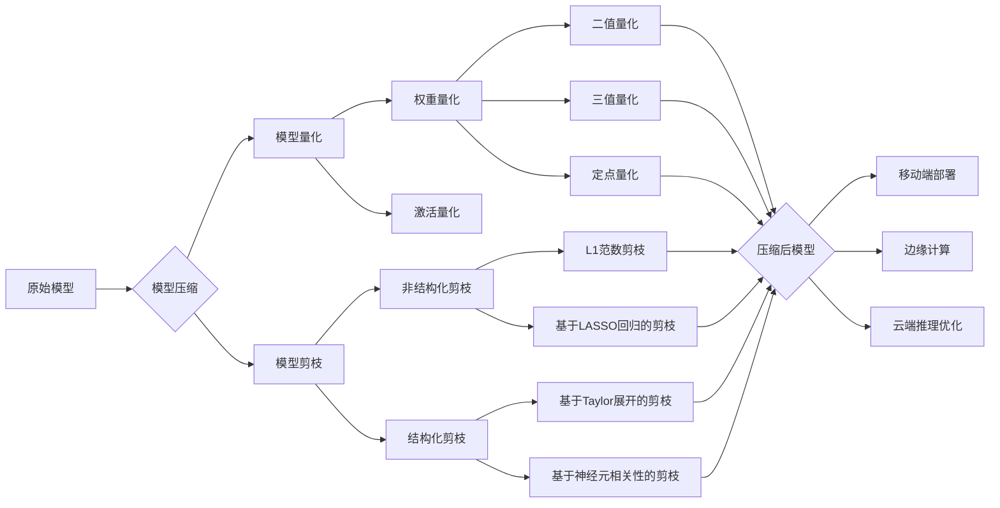

# 模型量化与剪枝原理与代码实战案例讲解

## 1. 背景介绍
### 1.1 模型量化与剪枝的必要性
#### 1.1.1 模型压缩的需求
#### 1.1.2 模型部署的限制
#### 1.1.3 计算资源的瓶颈
### 1.2 模型量化与剪枝的发展历程
#### 1.2.1 早期的探索阶段
#### 1.2.2 深度学习时代的进展
#### 1.2.3 当前的研究热点

## 2. 核心概念与联系
### 2.1 模型量化
#### 2.1.1 定义与原理
#### 2.1.2 量化方法分类
#### 2.1.3 量化的优缺点
### 2.2 模型剪枝
#### 2.2.1 定义与原理
#### 2.2.2 剪枝方法分类
#### 2.2.3 剪枝的优缺点
### 2.3 量化与剪枝的关系
#### 2.3.1 联系：模型压缩的两种途径
#### 2.3.2 区别：粒度与操作对象
#### 2.3.3 结合：联合压缩的可能性

## 3. 核心算法原理具体操作步骤
### 3.1 模型量化算法
#### 3.1.1 二值量化(BinaryConnect)
#### 3.1.2 三值量化(Ternary Weight Networks)
#### 3.1.3 8位定点量化(Quantization and Training of Neural Networks for Efficient Integer-Arithmetic-Only Inference)
### 3.2 模型剪枝算法
#### 3.2.1 非结构化剪枝(Sparse Pruning)
#### 3.2.2 结构化剪枝(Structured Pruning)
#### 3.2.3 基于重要性评估的剪枝(Importance-based Pruning)

## 4. 数学模型和公式详细讲解举例说明
### 4.1 模型量化的数学原理
#### 4.1.1 权重量化
权重量化将浮点权重映射到离散值。以三值量化为例，权重 $W$ 被量化为 $\{-1, 0, 1\}$，量化过程可表示为：

$$
\begin{equation}
\begin{split}
\hat{W} & = \alpha \cdot \text{sign}(W) \\
\alpha & = \frac{1}{n}\sum_{i=1}^{n} |W_i|
\end{split}
\end{equation}
$$

其中 $\hat{W}$ 为量化后的权重，$\alpha$ 为缩放因子，$\text{sign}(\cdot)$ 为符号函数。

#### 4.1.2 激活量化
对特征图进行量化，常用均匀量化，将激活值均匀映射到有限个量化级别。设激活值范围为 $[a, b]$，量化级别为 $2^k$，量化过程为：

$$
\begin{equation}
\begin{split}
\Delta & = \frac{b-a}{2^k-1} \\
\text{quant}(x) & = \text{round}(\frac{x-a}{\Delta}) \\
\text{dequant}(x) & = a + x \cdot \Delta
\end{split}
\end{equation}
$$

其中 $\Delta$ 为量化步长，$\text{quant}(\cdot)$ 为量化函数，$\text{dequant}(\cdot)$ 为反量化函数。

### 4.2 模型剪枝的数学原理
#### 4.2.1 基于 $L_1$ 范数的剪枝
$L_1$ 范数可作为稀疏诱导项，在目标函数中加入权重的 $L_1$ 正则化，使部分权重趋于0。目标函数如下：

$$
\mathcal{L} = \mathcal{L}_0(\mathbf{W}) + \lambda \sum_{l=1}^{L} \Vert \mathbf{W}^{(l)} \Vert_1
$$

其中 $\mathcal{L}_0$ 为原始的损失函数，$\lambda$ 为正则化系数，$\mathbf{W}^{(l)}$ 为第 $l$ 层的权重。

#### 4.2.2 基于 Taylor 展开的剪枝
利用 Taylor 展开估计剪枝每个权重对网络损失函数的影响，剪枝对损失影响小的权重。假设剪枝第 $l$ 层第 $i$ 个权重 $W_i^{(l)}$，损失变化量为：

$$
\Delta \mathcal{L}(W_i^{(l)}) = (W_i^{(l)})^2 \cdot g_i^{(l)}
$$

其中 $g_i^{(l)}$ 为损失函数对 $W_i^{(l)}$ 的二阶偏导数。$\Delta \mathcal{L}(W_i^{(l)})$ 越小表明剪枝 $W_i^{(l)}$ 对网络影响越小。

## 5. 项目实践：代码实例和详细解释说明
### 5.1 模型量化代码实例
以下是一个PyTorch实现的三值量化示例：

```python
import torch
import torch.nn as nn

class TernaryQuantize(torch.autograd.Function):
    @staticmethod
    def forward(ctx, input):
        ctx.save_for_backward(input)
        out = torch.sign(input)
        out[out == 0] = 1
        return out

    @staticmethod
    def backward(ctx, grad_output):
        input, = ctx.saved_tensors
        grad_input = grad_output.clone()
        grad_input[input.abs() > 1] = 0
        return grad_input

def ternary_quantize(x):
    return TernaryQuantize.apply(x)

class TernaryLinear(nn.Module):
    def __init__(self, in_features, out_features):
        super().__init__()
        self.linear = nn.Linear(in_features, out_features)

    def forward(self, x):
        w = ternary_quantize(self.linear.weight)
        return nn.functional.linear(x, w)
```

这里定义了一个`TernaryQuantize`函数，在前向传播时将权重量化为三值 $\{-1, 0, 1\}$，在反向传播时对梯度进行修改，避免量化导致的梯度消失。然后定义了一个`TernaryLinear`层，在前向传播时对线性层的权重进行三值量化。

### 5.2 模型剪枝代码实例
以下是一个PyTorch实现的基于$L_1$范数的剪枝示例：

```python
import torch
import torch.nn as nn

def prune_by_threshold(model, threshold):
    for name, module in model.named_modules():
        if isinstance(module, nn.Linear) or isinstance(module, nn.Conv2d):
            mask = module.weight.data.abs() > threshold
            module.weight.data *= mask
            module.weight.data[module.weight.data == 0] = 1e-5

def prune_model(model, pruning_perc):
    threshold = np.percentile(np.abs(get_weights(model)), pruning_perc)
    prune_by_threshold(model, threshold)

def get_weights(model):
    weights = []
    for name, module in model.named_modules():
        if isinstance(module, nn.Linear) or isinstance(module, nn.Conv2d):
            weights.append(module.weight.data.cpu().numpy().flatten())
    return np.concatenate(weights)
```

这里定义了`prune_by_threshold`函数，根据给定的阈值对模型权重进行剪枝，小于阈值的权重被置零。`prune_model`函数根据剪枝率确定阈值，然后调用`prune_by_threshold`进行剪枝。`get_weights`函数获取模型所有权重并拼接成一个向量，用于确定剪枝阈值。

## 6. 实际应用场景
### 6.1 移动端部署
#### 6.1.1 智能手机应用
#### 6.1.2 嵌入式设备
### 6.2 边缘计算
#### 6.2.1 物联网设备
#### 6.2.2 智能家居
### 6.3 云端推理优化
#### 6.3.1 降低服务器成本
#### 6.3.2 提高并发处理能力

## 7. 工具和资源推荐
### 7.1 量化工具
#### 7.1.1 TensorFlow Lite
#### 7.1.2 NVIDIA TensorRT
#### 7.1.3 Intel OpenVINO
### 7.2 剪枝工具
#### 7.2.1 TensorFlow Model Optimization Toolkit
#### 7.2.2 PyTorch Pruning Tutorial
#### 7.2.3 Distiller
### 7.3 相关资源
#### 7.3.1 论文与综述
#### 7.3.2 开源项目
#### 7.3.3 教程与课程

## 8. 总结：未来发展趋势与挑战
### 8.1 未来发展趋势
#### 8.1.1 量化方法的细粒度与灵活性提升
#### 8.1.2 剪枝方法的自适应性增强
#### 8.1.3 量化与剪枝联合优化
### 8.2 面临的挑战
#### 8.2.1 压缩与精度的平衡
#### 8.2.2 硬件友好型压缩方法设计
#### 8.2.3 压缩后模型的鲁棒性

## 9. 附录：常见问题与解答
### 9.1 量化会导致精度下降吗？
### 9.2 剪枝后的稀疏模型如何加速？
### 9.3 压缩后的模型在不同硬件上是否需要重新训练？
### 9.4 如何选择量化和剪枝的超参数？



模型量化与剪枝作为深度学习模型压缩的两大利器，在降低模型存储和计算开销的同时，力求保持模型性能。本文从背景意义、核心原理、实践案例等方面对这两类方法进行了系统梳理。未来，量化与剪枝技术还需在压缩率和精度的权衡、硬件友好型设计、压缩模型鲁棒性等方面取得进一步突破。可以预见，模型压缩将助力深度学习技术在更广阔的应用场景中发挥价值。

作者：禅与计算机程序设计艺术 / Zen and the Art of Computer Programming