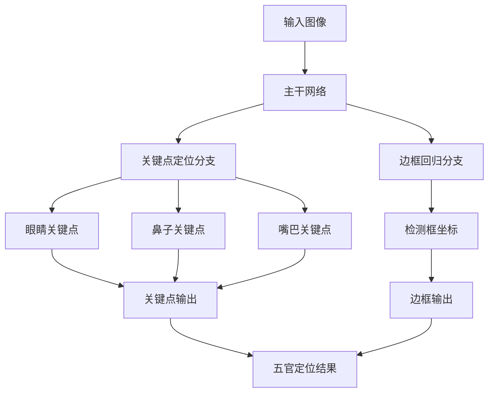

# 深度学习五官的识别系统详细设计与具体代码实现

## 1. 背景介绍
### 1.1 人脸识别技术概述
### 1.2 五官识别的重要性
### 1.3 深度学习在五官识别中的应用

## 2. 核心概念与联系
### 2.1 卷积神经网络(CNN)
#### 2.1.1 卷积层
#### 2.1.2 池化层 
#### 2.1.3 全连接层
### 2.2 关键点检测
#### 2.2.1 眼睛关键点
#### 2.2.2 鼻子关键点
#### 2.2.3 嘴巴关键点
### 2.3 区域建议网络(RPN)
### 2.4 损失函数设计

## 3. 核心算法原理具体操作步骤
### 3.1 数据预处理
#### 3.1.1 人脸检测与对齐
#### 3.1.2 关键点标注
#### 3.1.3 数据增强
### 3.2 网络结构设计
#### 3.2.1 主干网络选择
#### 3.2.2 关键点定位分支
#### 3.2.3 边框回归分支  
### 3.3 训练过程
#### 3.3.1 损失函数计算
#### 3.3.2 参数更新
#### 3.3.3 模型评估

## 4. 数学模型和公式详细讲解举例说明
### 4.1 卷积操作
$$ y(i,j) = \sum_{m}\sum_{n}f(m,n)x(i-m, j-n) $$
### 4.2 池化操作
$$ y(i,j) = \max_{m,n}x(i+m, j+n) $$
### 4.3 交叉熵损失
$$ L = -\sum_{i}^{N}y_i\log(\hat{y_i}) $$
### 4.4 smooth L1损失
$$
 L=\left\{
\begin{aligned}
0.5(x_i-y_i)^2 & & if |x_i-y_i|<1 \
|x_i-y_i|-0.5 & & otherwise
\end{aligned}
\right.
$$

## 5. 项目实践：代码实例和详细解释说明
### 5.1 数据准备
```python
# 人脸检测
detector = dlib.get_frontal_face_detector()
# 关键点检测模型
predictor = dlib.shape_predictor("shape_predictor_68_face_landmarks.dat")

# 读取图像
img = cv2.imread("face.jpg")
# 转灰度图
gray = cv2.cvtColor(src=img, code=cv2.COLOR_BGR2GRAY)
# 人脸检测
faces = detector(gray)

# 对每个检测到的人脸进行关键点定位
for face in faces:
    # 人脸对齐
    aligned_face = dlib.get_face_chip(img, face, size=256)
    # 关键点检测
    landmarks = predictor(aligned_face, face) 
    # 保存关键点坐标
    landmarks_list = [(p.x, p.y) for p in landmarks.parts()]
```

### 5.2 模型构建
```python
def create_model(input_shape):
    # 主干网络
    backbone = MobileNetV2(input_shape=input_shape, include_top=False)
    x = backbone.output
    
    # 关键点定位分支
    x1 = Conv2D(128, kernel_size=3, activation="relu")(x)
    x1 = Conv2D(64, kernel_size=3, activation="relu")(x1)
    x1 = Flatten()(x1)
    x1 = Dense(128, activation="relu")(x1)
    landmarks_output = Dense(136, activation=None, name="landmark")(x1)
    
    # 边框回归分支
    x2 = Conv2D(128, kernel_size=3, activation="relu")(x)  
    x2 = Conv2D(64, kernel_size=3, activation="relu")(x2)
    x2 = Flatten()(x2)
    x2 = Dense(128, activation="relu")(x2)
    bounding_box_output = Dense(4, activation=None, name="bounding_box")(x2)

    return Model(inputs=backbone.input, outputs=[landmarks_output, bounding_box_output])
```

### 5.3 模型训练
```python
model = create_model(input_shape=(256,256,3))

# 定义损失函数
losses = {
    "landmark": tf.keras.losses.MSE,
    "bounding_box": tf.keras.losses.Huber()
}

# 定义损失权重
loss_weights = {
    "landmark": 1.0, 
    "bounding_box": 0.5
}

# 编译模型
model.compile(optimizer='adam', loss=losses, loss_weights=loss_weights)

# 训练模型
history = model.fit(
    train_generator,
    steps_per_epoch=100,
    epochs=50,
    validation_data=val_generator,
    validation_steps=50
)
```

## 6. 实际应用场景
### 6.1 人脸识别与验证
### 6.2 表情识别
### 6.3 虚拟化妆与整容
### 6.4 人脸动画生成

## 7. 工具和资源推荐
### 7.1 开源数据集
- 300-W
- AFLW
- WFLW
### 7.2 开源框架
- Dlib
- OpenCV
- TensorFlow/Keras
- PyTorch
### 7.3 预训练模型
- Dlib shape_predictor_68_face_landmarks.dat
- FAN(Face Alignment Network)

## 8. 总结：未来发展趋势与挑战
### 8.1 三维人脸重建
### 8.2 小样本学习
### 8.3 多模态融合
### 8.4 隐私与安全

## 9. 附录：常见问题与解答
### 9.1 如何提高五官识别的精度？
### 9.2 如何减小模型计算量？
### 9.3 如何应对遮挡、大姿态等复杂场景？
### 9.4 如何权衡速度与精度的平衡？



五官识别是人脸识别领域的一个重要分支,旨在精确定位人脸图像中的眼睛、鼻子、嘴巴等关键部位。传统的五官定位方法主要基于模板匹配、形状约束等,难以应对光照、表情、姿态等因素的干扰。近年来,深度学习技术的兴起为五官识别带来了新的突破,卷积神经网络能够从大量数据中自动学习到鲁棒的五官特征表示,再结合关键点回归、边框检测等任务,实现端到端的五官定位。

一个典型的深度学习五官识别系统如上图所示,主要包含三个部分:主干网络、关键点定位分支和边框回归分支。主干网络负责提取图像的高层语义特征,常见的选择有VGG、ResNet、MobileNet等。关键点定位分支在主干网络输出的特征图上预测每个关键点的坐标位置,通过全卷积的结构实现特征图到关键点热力图的映射。边框回归分支预测五官区域的边界框坐标,为后续的关键点检测提供先验位置信息。整个网络采用多任务联合训练的方式,同时优化关键点误差与边框误差,从而获得更加准确的五官定位结果。

在训练过程中,我们需要准备大量的人脸图像数据,并标注每张图像中21个关键点(每只眼睛6个、鼻子9个)的坐标位置和五官边界框。数据增强技术如随机裁剪、翻转等能够有效扩充训练集,提高模型的泛化能力。损失函数的设计是另一个关键,关键点定位采用平均误差,边框回归采用smooth L1误差,再加上两个任务的权重系数,构成多任务损失函数。

五官识别技术已经在人脸识别、表情分析、人脸动画等领域得到了广泛应用,但仍然存在眼镜遮挡、大姿态、小样本等挑战。未来,三维人脸重建、小样本学习、多模态融合等方向值得进一步探索,同时也要重视相关技术带来的隐私安全问题。

作者：禅与计算机程序设计艺术 / Zen and the Art of Computer Programming