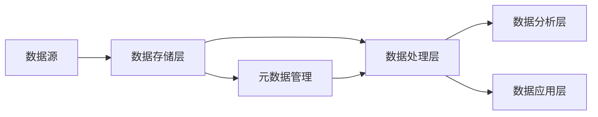

# 第八章：数据湖代码实例讲解

## 1. 背景介绍
### 1.1 数据湖的兴起
在当今大数据时代,企业需要处理和分析海量的数据。传统的数据仓库架构已经无法满足快速增长的数据量和多样化的数据类型。数据湖(Data Lake)作为一种新兴的数据架构,应运而生。
### 1.2 数据湖的优势
与数据仓库相比,数据湖具有以下优势:
- 支持存储结构化、半结构化和非结构化数据
- 数据存储成本低,可以存储原始格式数据
- 数据处理灵活,支持批处理、流处理、交互式分析等
- 易于扩展,可以存储海量数据

## 2. 核心概念与联系
### 2.1 数据湖的定义
数据湖是一个存储海量原始数据的集中式存储库,数据可以是结构化、半结构化或非结构化的。它允许你在需要时存储所有数据,并在以后根据需要进行处理和分析。
### 2.2 数据湖与数据仓库的区别
- 数据湖存储原始格式数据,数据仓库存储高度结构化和聚合的数据
- 数据湖支持多种数据处理方式,数据仓库主要支持批处理
- 数据湖侧重数据的存储,数据仓库侧重数据的分析
### 2.3 数据湖的核心组件
一个典型的数据湖架构包括以下核心组件:
- 数据存储:用于存储原始数据,如HDFS、对象存储等
- 元数据管理:管理数据的元数据信息,如Hive Metastore等
- 数据处理:对数据进行处理和分析,如Spark、Hive等
- 数据治理:对数据进行管理和控制,保证数据质量和安全

### 2.4 数据湖架构图
下面是一个简单的数据湖架构图:



## 3. 核心算法原理具体操作步骤
数据湖涉及的核心算法主要包括数据采集、数据存储、数据处理和数据分析等。下面以Spark为例,讲解数据处理的核心算法原理。
### 3.1 Spark的RDD编程模型
Spark的核心数据结构是弹性分布式数据集(RDD),它是一个分布式的内存抽象,表示一个不可变、可分区、里面的元素可并行计算的集合。RDD支持两种操作:转换(transformation)和行动(action)。
- 转换操作:接收一个RDD并返回一个新的RDD,如map、filter等
- 行动操作:对RDD计算出一个结果,并把结果返回到Driver程序或写入外部系统,如reduce、collect等
### 3.2 Spark的数据处理流程
Spark的数据处理流程如下:
1. 创建RDD:从外部数据源(如HDFS)创建输入RDD
2. 转换RDD:通过一系列转换操作(如map、filter)转换RDD,形成转换后的新RDD
3. 执行行动操作:对最终的RDD执行行动操作(如reduce),触发实际计算并得到结果
4. 结果输出:将计算结果返回给Driver程序或写入外部系统

## 4. 数学模型和公式详细讲解举例说明
数据湖中的数据处理涉及大量的数学模型和算法,如机器学习、统计分析等。下面以线性回归为例,讲解其数学模型和公式。
### 4.1 线性回归模型
线性回归是一种常用的机器学习算法,用于建模因变量y和自变量x之间的线性关系。其数学模型为:

$$y=w^Tx+b$$

其中,$w$是权重向量,$b$是偏置项。
### 4.2 损失函数
为了找到最优的模型参数,需要最小化损失函数。常用的损失函数是均方误差(MSE):

$$J(w,b)=\frac{1}{m}\sum_{i=1}^m(f_{w,b}(x^{(i)})-y^{(i)})^2$$

其中,$m$是样本数量,$f_{w,b}(x)$是模型预测值。
### 4.3 梯度下降法
梯度下降法是一种优化算法,通过不断迭代更新模型参数,使损失函数最小化。参数更新公式为:

$$w:=w-\alpha\frac{\partial}{\partial w}J(w,b)$$
$$b:=b-\alpha\frac{\partial}{\partial b}J(w,b)$$

其中,$\alpha$是学习率。

## 5. 项目实践：代码实例和详细解释说明
下面以Spark为例,给出数据湖的代码实例。
### 5.1 数据采集
从HDFS读取数据创建RDD:
```scala
val rdd = sc.textFile("hdfs://path/to/data")
```
### 5.2 数据处理
使用map转换操作处理RDD:
```scala
val rdd2 = rdd.map(line => line.split(","))
             .map(arr => (arr(0), arr(1).toInt))
```
### 5.3 数据分析
使用reduce行动操作分析RDD:
```scala
val result = rdd2.reduceByKey(_ + _)
```
### 5.4 结果输出
将结果保存到HDFS:
```scala
result.saveAsTextFile("hdfs://path/to/output")
```

## 6. 实际应用场景
数据湖在很多领域都有广泛应用,如:
- 金融风控:存储交易、用户等各类数据,实时检测异常交易
- 电商推荐:存储用户行为、商品等数据,实时生成用户画像和商品推荐
- 物联网:存储传感器采集的海量时序数据,实时分析设备状态
- 医疗健康:存储医疗影像、病历等数据,进行疾病诊断和预测

## 7. 工具和资源推荐
构建数据湖需要用到很多大数据工具和框架,主要包括:
- 数据存储:HDFS、AWS S3、Ceph等
- 数据处理:Spark、Flink、Hive等
- 元数据管理:Hive Metastore、Atlas等
- 数据可视化:Superset、Redash等

推荐学习资源:
- 《Spark大数据处理:技术、应用与性能优化》
- 《数据湖架构》
- Cloudera官网的数据湖文档

## 8. 总结：未来发展趋势与挑战
### 8.1 发展趋势
- 湖仓一体化:数据湖与数据仓库逐渐融合,形成统一的数据架构
- AI驱动:数据湖将成为AI的数据基础设施,为机器学习和深度学习提供海量数据
- 云原生:数据湖将与云计算进一步融合,采用云原生架构,提高弹性和扩展性
### 8.2 面临的挑战
- 数据治理:如何对数据湖中的海量数据进行有效管理和控制
- 数据质量:如何保证数据湖中数据的准确性、完整性和一致性
- 元数据管理:如何对数据湖的元数据进行采集、存储和管理
- 性能优化:如何提高数据湖的数据处理和分析性能

## 9. 附录：常见问题与解答
### Q1: 数据湖适合存储哪些类型的数据?
A1: 数据湖可以存储各种类型的数据,包括结构化数据(如数据库表)、半结构化数据(如XML、JSON)和非结构化数据(如图片、视频等)。
### Q2: 数据湖如何保证数据安全?
A2: 可以采用以下措施保证数据湖的安全:
- 身份验证和访问控制,如Kerberos、Ranger等
- 数据加密,对存储和传输的数据进行加密
- 数据脱敏,对敏感数据进行脱敏处理
- 安全审计,对用户访问行为进行记录和审计
### Q3: 数据湖如何与数据仓库集成?
A3: 可以采用以下方式实现数据湖与数据仓库的集成:
- 数据传输:将数据从数据湖导入数据仓库进行分析
- 统一元数据:使用统一的元数据管理工具对数据湖和数据仓库的元数据进行管理
- 数据虚拟化:通过数据虚拟化工具实现数据湖和数据仓库的虚拟集成

作者：禅与计算机程序设计艺术 / Zen and the Art of Computer Programming