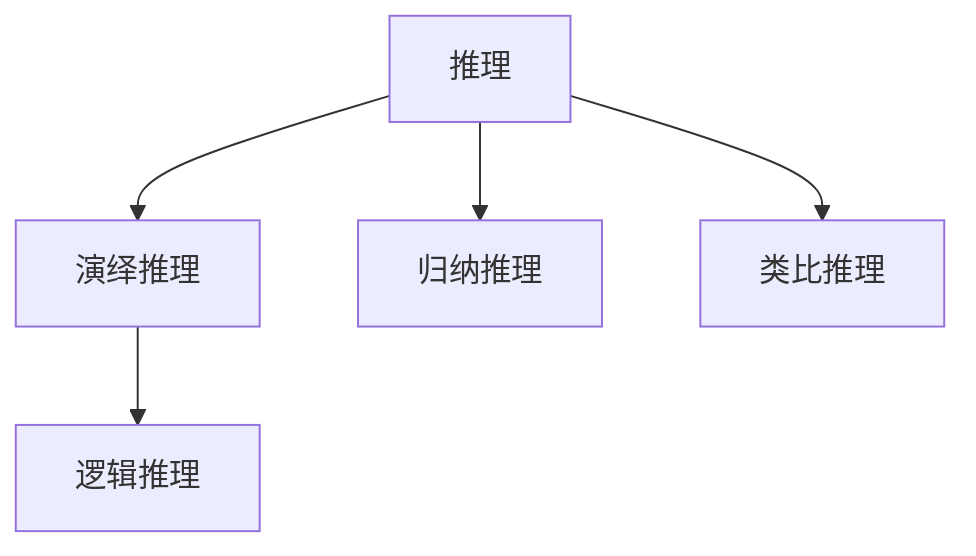
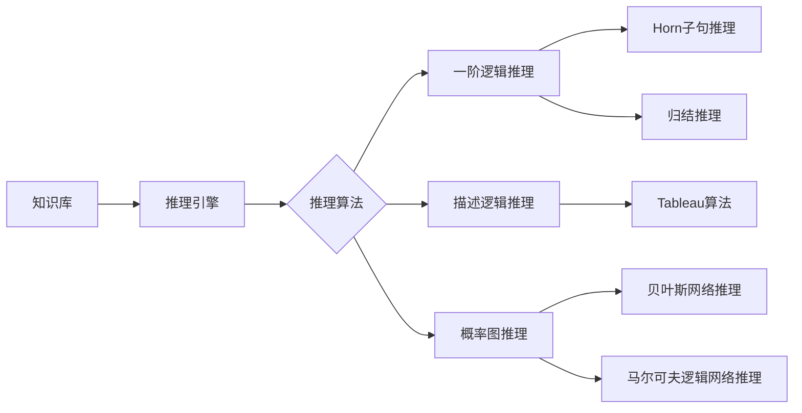

# 聊天机器人中的推理和逻辑推理能力

## 1. 背景介绍
### 1.1 聊天机器人的发展历程
#### 1.1.1 早期聊天机器人
#### 1.1.2 基于规则的聊天机器人
#### 1.1.3 基于机器学习的聊天机器人
### 1.2 聊天机器人中推理和逻辑推理的重要性
#### 1.2.1 提升聊天机器人的智能化水平
#### 1.2.2 增强用户体验和交互质量
#### 1.2.3 拓展聊天机器人的应用领域

## 2. 核心概念与联系
### 2.1 推理的定义和分类
#### 2.1.1 演绎推理
#### 2.1.2 归纳推理
#### 2.1.3 类比推理
### 2.2 逻辑推理的定义和特点
#### 2.2.1 逻辑推理的基本原理
#### 2.2.2 逻辑推理的形式化表示
#### 2.2.3 逻辑推理在聊天机器人中的应用
### 2.3 推理与逻辑推理的关系
#### 2.3.1 逻辑推理是推理的一种特殊形式
#### 2.3.2 推理和逻辑推理在聊天机器人中的协同作用



## 3. 核心算法原理具体操作步骤
### 3.1 基于一阶逻辑的推理算法
#### 3.1.1 一阶逻辑的基本概念
#### 3.1.2 基于一阶逻辑的推理规则
#### 3.1.3 基于一阶逻辑的推理算法步骤
### 3.2 基于描述逻辑的推理算法
#### 3.2.1 描述逻辑的基本概念
#### 3.2.2 基于描述逻辑的推理规则
#### 3.2.3 基于描述逻辑的推理算法步骤
### 3.3 基于概率图模型的推理算法
#### 3.3.1 概率图模型的基本概念
#### 3.3.2 基于贝叶斯网络的推理算法
#### 3.3.3 基于马尔可夫逻辑网络的推理算法



## 4. 数学模型和公式详细讲解举例说明
### 4.1 一阶逻辑的数学模型
#### 4.1.1 一阶逻辑的语法和语义
#### 4.1.2 一阶逻辑的推理规则和证明方法
### 4.2 描述逻辑的数学模型
#### 4.2.1 描述逻辑的语法和语义
#### 4.2.2 描述逻辑的推理规则和复杂度分析
### 4.3 概率图模型的数学基础
#### 4.3.1 概率论和图论基础
#### 4.3.2 贝叶斯网络的数学定义和推理公式
#### 4.3.3 马尔可夫逻辑网络的数学定义和推理公式

一阶逻辑中的推理规则包括：

- 假言推理（Modus Ponens）：$A, A \rightarrow B \vdash B$
- 假言否定（Modus Tollens）：$\neg B, A \rightarrow B \vdash \neg A$
- 析取三段论（Disjunctive Syllogism）：$A \vee B, \neg A \vdash B$
- 合取引入（Conjunction Introduction）：$A, B \vdash A \wedge B$

贝叶斯网络的联合概率分布公式：

$$
P(X_1, X_2, ..., X_n) = \prod_{i=1}^{n} P(X_i | Parents(X_i))
$$

其中，$Parents(X_i)$ 表示节点 $X_i$ 的父节点集合。

## 5. 项目实践：代码实例和详细解释说明
### 5.1 基于Prolog的一阶逻辑推理实现
#### 5.1.1 Prolog语言简介
#### 5.1.2 Prolog中的一阶逻辑表示和推理
#### 5.1.3 Prolog推理实例代码解析
### 5.2 基于OWL的描述逻辑推理实现
#### 5.2.1 OWL语言简介
#### 5.2.2 OWL中的描述逻辑表示和推理
#### 5.2.3 OWL推理实例代码解析
### 5.3 基于Python的概率图推理实现
#### 5.3.1 Python中的概率图模型库介绍
#### 5.3.2 贝叶斯网络推理实例代码解析
#### 5.3.3 马尔可夫逻辑网络推理实例代码解析

以下是一个简单的Prolog推理实例：

```prolog
% 知识库
parent(john, mary).
parent(john, tom).
parent(mary, alice).
parent(tom, bob).

% 规则
grandparent(X, Z) :- parent(X, Y), parent(Y, Z).

% 查询
?- grandparent(john, alice).
```

上述代码中，我们定义了父母关系的事实，并给出了祖父母关系的规则定义。当我们查询 `grandparent(john, alice)` 时，Prolog会根据知识库和规则进行推理，得出 `john` 是 `alice` 的祖父这一结论。

## 6. 实际应用场景
### 6.1 智能客服聊天机器人
#### 6.1.1 客户意图理解和问题解答
#### 6.1.2 个性化服务推荐
### 6.2 医疗诊断辅助系统
#### 6.2.1 病情分析和诊断推理
#### 6.2.2 治疗方案推荐
### 6.3 法律咨询聊天机器人
#### 6.3.1 法律知识库构建
#### 6.3.2 案例分析和法律推理

## 7. 工具和资源推荐
### 7.1 知识表示和推理工具
#### 7.1.1 Protégé
#### 7.1.2 Pellet
#### 7.1.3 Jena
### 7.2 自然语言处理工具
#### 7.2.1 Stanford CoreNLP
#### 7.2.2 spaCy
#### 7.2.3 NLTK
### 7.3 机器学习和深度学习框架
#### 7.3.1 TensorFlow
#### 7.3.2 PyTorch
#### 7.3.3 Scikit-learn

## 8. 总结：未来发展趋势与挑战
### 8.1 聊天机器人推理能力的提升
#### 8.1.1 知识图谱与推理的结合
#### 8.1.2 深度学习与符号推理的融合
### 8.2 聊天机器人的人性化和情感化
#### 8.2.1 个性化对话生成
#### 8.2.2 情感识别和表达
### 8.3 聊天机器人的安全性和伦理问题
#### 8.3.1 隐私保护和数据安全
#### 8.3.2 伦理决策和价值观

## 9. 附录：常见问题与解答
### 9.1 如何构建聊天机器人的知识库？
### 9.2 如何评估聊天机器人的推理能力？
### 9.3 聊天机器人推理过程中的常见错误和解决方法
### 9.4 如何平衡聊天机器人的推理效率和准确性？
### 9.5 聊天机器人推理能力的局限性和改进方向

推理和逻辑推理是聊天机器人实现智能化的关键能力之一。通过引入一阶逻辑、描述逻辑、概率图模型等推理方法，聊天机器人可以在知识库的基础上进行推理，回答用户的问题，提供个性化服务。未来，聊天机器人的推理能力将不断提升，融合知识图谱、深度学习等技术，实现更加人性化和智能化的对话交互。同时，我们也需要关注聊天机器人在安全性和伦理方面的挑战，确保其健康、可控地发展。

作者：禅与计算机程序设计艺术 / Zen and the Art of Computer Programming