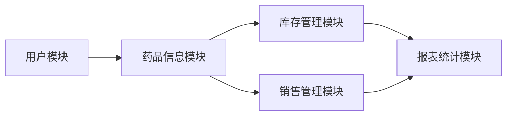

## 1.背景介绍
随着医药行业的发展，药品销售系统的作用越来越大。它能帮助药店进行药品的进销存管理，提高药品的流通效率，减少药品的浪费，保证药品的安全使用。本文将详细介绍药品销售系统的设计和具体代码实现。

## 2.核心概念与联系
药品销售系统主要由以下几个模块构成：用户模块、药品信息模块、库存管理模块、销售管理模块、报表统计模块。这些模块之间的联系如下：

- 用户模块：负责用户的注册、登录、权限管理等功能。
- 药品信息模块：负责药品信息的录入、查询、修改和删除。
- 库存管理模块：负责药品的入库、出库、库存查询和库存预警。
- 销售管理模块：负责药品的销售、退货和销售查询。
- 报表统计模块：负责对药品销售和库存情况进行统计分析。



## 3.核心算法原理具体操作步骤
药品销售系统的核心算法主要包括药品信息管理、库存管理和销售管理。下面将详细介绍这三个部分的操作步骤。

### 3.1 药品信息管理
药品信息管理主要包括药品信息的录入、查询、修改和删除。

- 录入：输入药品的名称、类别、生产厂家、价格等信息，将这些信息保存到数据库中。
- 查询：输入药品的名称或者类别，系统将从数据库中检索出相应的药品信息。
- 修改：选择需要修改的药品信息，输入新的信息，系统将更新数据库中的数据。
- 删除：选择需要删除的药品信息，系统将从数据库中删除这些信息。

### 3.2 库存管理
库存管理主要包括药品的入库、出库、库存查询和库存预警。

- 入库：输入药品的名称和入库数量，系统将更新数据库中的库存信息。
- 出库：输入药品的名称和出库数量，系统将更新数据库中的库存信息。
- 库存查询：输入药品的名称，系统将从数据库中检索出该药品的库存信息。
- 库存预警：系统将定期检查库存信息，如果某种药品的库存量低于预设的阈值，系统将发出预警。

### 3.3 销售管理
销售管理主要包括药品的销售、退货和销售查询。

- 销售：输入药品的名称和销售数量，系统将更新数据库中的库存信息和销售记录。
- 退货：输入药品的名称和退货数量，系统将更新数据库中的库存信息和销售记录。
- 销售查询：输入药品的名称，系统将从数据库中检索出该药品的销售记录。

## 4.数学模型和公式详细讲解举例说明
药品销售系统中的一些操作可以用数学模型和公式来描述。例如，库存管理中的库存预警可以用以下的公式来描述：

$$
预警标志 = \begin{cases}
1, & \text{如果}\ 库存量 < 预设阈值 \
0, & \text{如果}\ 库存量 \geq 预设阈值
\end{cases}
$$

其中，$预警标志$表示是否需要发出库存预警，$库存量$表示某种药品的当前库存量，$预设阈值$表示预设的库存预警阈值。

## 5.项目实践：代码实例和详细解释说明
下面将通过一个简单的例子来说明如何实现药品销售系统的核心功能。这个例子主要使用Python语言和SQLite数据库。

### 5.1 创建数据库
首先，我们需要创建一个数据库来存储药品的信息和库存情况。我们可以使用SQLite的`CREATE TABLE`语句来创建数据库表。

```python
import sqlite3

# 连接到SQLite数据库
# 数据库文件是test.db
# 如果文件不存在，会自动在当前目录创建
conn = sqlite3.connect('test.db')

# 创建一个Cursor
cursor = conn.cursor()

# 执行一条SQL语句，创建药品表
cursor.execute('create table medicine (id varchar(20) primary key, name varchar(20), stock int)')

# 关闭Cursor
cursor.close()

# 提交事务
conn.commit()

# 关闭Connection
conn.close()
```

### 5.2 药品信息管理
我们可以使用SQLite的`INSERT INTO`、`SELECT`、`UPDATE`和`DELETE FROM`语句来实现药品信息的录入、查询、修改和删除。

```python
# 药品信息录入
def add_medicine(id, name, stock):
    conn = sqlite3.connect('test.db')
    cursor = conn.cursor()
    cursor.execute('insert into medicine (id, name, stock) values (?, ?, ?)', (id, name, stock))
    cursor.close()
    conn.commit()
    conn.close()

# 药品信息查询
def query_medicine(name):
    conn = sqlite3.connect('test.db')
    cursor = conn.cursor()
    cursor.execute('select * from medicine where name=?', (name,))
    results = cursor.fetchall()
    cursor.close()
    conn.close()
    return results

# 药品信息修改
def update_medicine(id, name, stock):
    conn = sqlite3.connect('test.db')
    cursor = conn.cursor()
    cursor.execute('update medicine set name=?, stock=? where id=?', (name, stock, id))
    cursor.close()
    conn.commit()
    conn.close()

# 药品信息删除
def delete_medicine(id):
    conn = sqlite3.connect('test.db')
    cursor = conn.cursor()
    cursor.execute('delete from medicine where id=?', (id,))
    cursor.close()
    conn.commit()
    conn.close()
```

## 6.实际应用场景
药品销售系统可以广泛应用于各种类型的药店，包括连锁药店、独立药店、医院药房等。它可以帮助药店进行药品的进销存管理，提高药品的流通效率，减少药品的浪费，保证药品的安全使用。

## 7.工具和资源推荐
- Python：是一种解释型、面向对象、动态数据类型的高级程序设计语言。Python是一种易于学习也非常强大的编程语言，它有一个巨大而广泛的标准库。
- SQLite：是一款轻型的数据库，是遵守ACID的关系型数据库管理系统，它包含在一个相对小的C库中。它是D.RichardHipp建立的公有领域项目。它的设计目标是嵌入式的，而且现在已经在很多嵌入式产品中使用了它，它占用资源非常的低，在嵌入式设备中，可能只需要几百K的内存就够了。

## 8.总结：未来发展趋势与挑战
随着医药行业的发展，药品销售系统的作用越来越大。未来，药品销售系统将更加智能，能够自动分析药品的销售情况，预测药品的销售趋势，提供更加精准的库存预警。同时，药品销售系统也将面临更大的挑战，如何处理大量的药品信息，如何保证系统的稳定性和安全性，将是未来需要解决的重要问题。

## 9.附录：常见问题与解答
Q: 如何处理药品的过期问题？
A: 我们可以在药品信息中添加药品的生产日期和有效期，系统定期检查药品的有效期，如果药品即将过期，系统将发出预警。

Q: 如何处理药品的批次问题？
A: 我们可以在药品信息中添加药品的批次信息，每次药品入库时，都要输入药品的批次信息。销售药品时，系统会按照先进先出的原则，优先销售早期入库的药品。

Q: 如何处理药品的价格变动问题？
A: 我们可以在药品信息中添加药品的价格信息，每次药品入库时，都要输入药品的价格信息。销售药品时，系统会按照药品的入库价格进行销售。

作者：禅与计算机程序设计艺术 / Zen and the Art of Computer Programming
