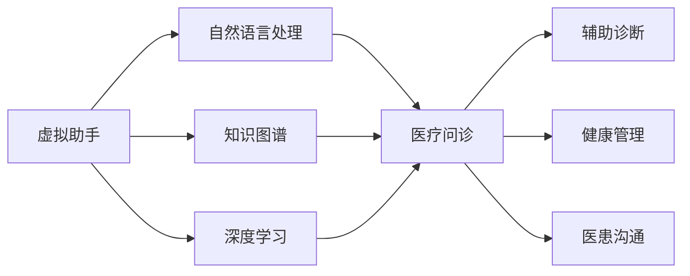

# 虚拟助手走进诊室：AI赋能医疗问诊

## 1. 背景介绍

### 1.1 医疗资源紧张的现状
#### 1.1.1 医患比例失衡
#### 1.1.2 医疗资源分布不均
#### 1.1.3 就医效率有待提高

### 1.2 人工智能在医疗领域的应用前景
#### 1.2.1 AI辅助诊断的优势
#### 1.2.2 AI赋能医疗的发展趋势
#### 1.2.3 虚拟助手在医疗问诊中的应用潜力

## 2. 核心概念与联系

### 2.1 虚拟助手的定义与特点
#### 2.1.1 虚拟助手的概念
#### 2.1.2 虚拟助手的关键技术
#### 2.1.3 虚拟助手的优势

### 2.2 医疗问诊的流程与挑战
#### 2.2.1 传统医疗问诊流程
#### 2.2.2 医疗问诊面临的挑战
#### 2.2.3 虚拟助手在医疗问诊中的应用价值

### 2.3 虚拟助手与医疗问诊的融合
#### 2.3.1 虚拟助手在医疗问诊中的角色定位
#### 2.3.2 虚拟助手与医生的协作模式
#### 2.3.3 虚拟助手赋能医疗问诊的关键因素

## 3. 核心算法原理具体操作步骤

### 3.1 自然语言处理算法
#### 3.1.1 文本预处理
#### 3.1.2 命名实体识别
#### 3.1.3 关系抽取
#### 3.1.4 意图识别与槽位填充

### 3.2 知识图谱构建与应用
#### 3.2.1 医疗知识图谱的构建流程
#### 3.2.2 知识图谱的存储与查询
#### 3.2.3 基于知识图谱的推理与决策

### 3.3 深度学习模型
#### 3.3.1 卷积神经网络（CNN）
#### 3.3.2 循环神经网络（RNN）
#### 3.3.3 注意力机制（Attention）
#### 3.3.4 预训练语言模型（BERT等）

## 4. 数学模型和公式详细讲解举例说明

### 4.1 文本相似度计算
#### 4.1.1 余弦相似度
$similarity(A,B) = \frac{A \cdot B}{||A|| \times ||B||}$
#### 4.1.2 编辑距离
#### 4.1.3 Word2Vec词向量

### 4.2 命名实体识别模型
#### 4.2.1 隐马尔可夫模型（HMM）
#### 4.2.2 条件随机场（CRF）
$P(y|x) = \frac{1}{Z(x)} \exp(\sum_{i,k} \lambda_k f_k(y_{i-1}, y_i, x, i))$

### 4.3 知识图谱嵌入
#### 4.3.1 TransE模型
$f_r(h,t) = ||h + r - t||$
#### 4.3.2 TransR模型
#### 4.3.3 TransD模型

## 5. 项目实践：代码实例和详细解释说明

### 5.1 医疗领域语料的收集与处理
#### 5.1.1 数据爬取与清洗
#### 5.1.2 数据标注与增强
#### 5.1.3 特征工程

### 5.2 基于深度学习的医疗实体识别
#### 5.2.1 BiLSTM-CRF模型搭建
#### 5.2.2 模型训练与评估
#### 5.2.3 实体识别结果应用

### 5.3 医疗知识图谱的构建与应用
#### 5.3.1 知识抽取与融合
#### 5.3.2 知识存储与检索
#### 5.3.3 基于知识图谱的问答系统

### 5.4 虚拟助手与医生协作平台的开发
#### 5.4.1 系统架构设计
#### 5.4.2 前后端开发
#### 5.4.3 人机交互优化

## 6. 实际应用场景

### 6.1 常见疾病的智能问诊
#### 6.1.1 感冒发烧
#### 6.1.2 胃肠道疾病
#### 6.1.3 皮肤病

### 6.2 慢性病管理
#### 6.2.1 糖尿病
#### 6.2.2 高血压
#### 6.2.3 心脏病

### 6.3 术前术后指导
#### 6.3.1 手术准备
#### 6.3.2 术后恢复
#### 6.3.3 并发症监测

## 7. 工具和资源推荐

### 7.1 开源工具包
#### 7.1.1 自然语言处理工具包（NLTK、SpaCy等）
#### 7.1.2 机器学习框架（TensorFlow、PyTorch等）
#### 7.1.3 知识图谱构建工具（Neo4j、OpenKE等）

### 7.2 医疗领域数据集
#### 7.2.1 MIMIC-III临床数据集
#### 7.2.2 中文医学知识图谱CMeKG
#### 7.2.3 中文医疗对话数据集

### 7.3 相关学习资源
#### 7.3.1 在线课程
#### 7.3.2 学术论文
#### 7.3.3 技术博客

## 8. 总结：未来发展趋势与挑战

### 8.1 虚拟助手在医疗领域的发展趋势
#### 8.1.1 个性化医疗服务
#### 8.1.2 远程医疗支持
#### 8.1.3 医疗大数据分析

### 8.2 面临的挑战与对策
#### 8.2.1 数据隐私与安全
#### 8.2.2 医疗知识的更新迭代
#### 8.2.3 人机协作模式的优化

### 8.3 展望未来
#### 8.3.1 虚拟助手与医疗行业的深度融合
#### 8.3.2 AI赋能下的医疗服务升级
#### 8.3.3 构建智慧医疗新生态

## 9. 附录：常见问题与解答

### 9.1 虚拟助手能否取代医生？
### 9.2 虚拟助手给出的诊断结果是否可靠？
### 9.3 患者隐私如何保障？
### 9.4 虚拟助手对医患沟通有何影响？
### 9.5 如何权衡虚拟助手的使用成本与收益？

作者：禅与计算机程序设计艺术 / Zen and the Art of Computer Programming