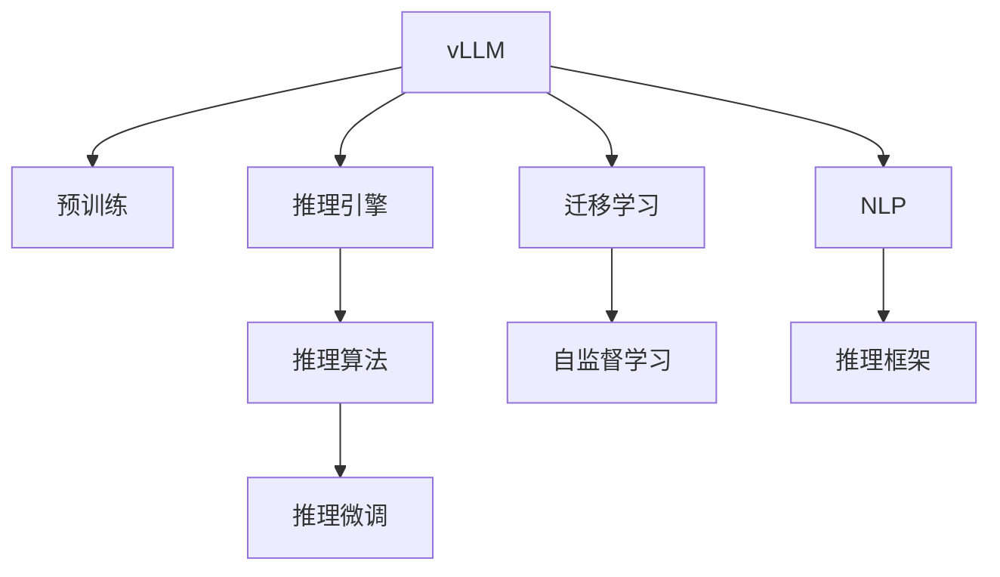

                 

# 大规模语言模型从理论到实践 vLLM推理框架实践

> 关键词：vLLM,推理框架,推理引擎,大规模语言模型,自监督学习,迁移学习,自然语言处理,NLP

## 1. 背景介绍

### 1.1 问题由来

随着深度学习技术的发展，大规模语言模型（vLLM，vast Language Language Model）在自然语言处理（NLP）领域取得了显著的突破。vLLM模型通过在大规模无标签文本数据上预训练，学习到丰富的语言知识和语义表示，具备强大的语言理解和生成能力。然而，尽管vLLM在预训练阶段获得了广泛的知识，但在特定领域应用时，这些知识未必完全适用于该领域，需要进行微调以提高性能。因此，如何高效地利用vLLM在特定任务上的推理能力，成为当前NLP研究的重要方向。

### 1.2 问题核心关键点

vLLM推理框架的核心在于如何将vLLM应用于下游任务，同时兼顾模型的推理效率和效果。关键点包括：

- 选择合适的vLLM作为推理引擎。
- 设计有效的推理算法和数据格式。
- 平衡推理效果和计算资源的使用。
- 设计合理的推理微调策略。

### 1.3 问题研究意义

vLLM推理框架的研究具有以下重要意义：

1. 提升vLLM的实际应用价值。将vLLM应用于特定任务，可以充分发挥其知识积累和语义理解能力，提升模型的实用性和适应性。
2. 优化推理效率。通过推理框架的设计，可以在保持vLLM性能的同时，降低推理计算成本。
3. 降低开发门槛。推理框架简化了vLLM的应用流程，使得更多开发者可以轻松地使用vLLM进行任务开发。
4. 促进NLP技术的产业化应用。推理框架为vLLM在实际场景中的部署提供了标准化和模块化的解决方案，加速NLP技术的落地。

## 2. 核心概念与联系

### 2.1 核心概念概述

为更好地理解vLLM推理框架，本节将介绍几个密切相关的核心概念：

- vLLM（大规模语言模型）：指在大规模无标签文本数据上进行预训练，学习到广泛语言知识和语义表示的语言模型。vLLM通常具有数十亿甚至数百亿参数，如GPT-3、BERT等。

- 推理引擎（Inference Engine）：用于执行推理计算的工具，将模型输入映射到模型输出的过程。推理引擎的性能直接影响推理速度和准确性。

- 迁移学习（Transfer Learning）：指将一个领域学习到的知识，迁移应用到另一个不同但相关的领域的学习范式。vLLM推理框架即是一种典型的迁移学习方式。

- 自监督学习（Self-Supervised Learning）：利用大量未标注数据进行学习，无需手动标注，通过自回归、掩码预测等任务进行预训练。

- 自然语言处理（NLP）：涉及语言理解、生成、推理等任务的计算技术，旨在模拟人类语言智能。

这些核心概念之间的逻辑关系可以通过以下Mermaid流程图来展示：



这个流程图展示了大语言模型的核心概念及其之间的关系：

1. vLLM通过自监督学习进行预训练，学习到语言知识的通用表示。
2. 推理引擎负责执行推理计算，将输入映射到输出。
3. 推理算法设计推理流程，确保推理的准确性和效率。
4. 推理微调优化推理效果，提升模型在特定任务上的性能。
5. 迁移学习连接vLLM与下游任务的桥梁，通过微调实现知识迁移。
6. 自监督学习利用未标注数据进行预训练，无需手动标注。
7. NLP是vLLM的应用领域，涉及语言理解和生成。
8. 推理框架集成了vLLM和推理引擎，提供高效推理的解决方案。

这些概念共同构成了vLLM推理框架的完整体系，使其能够在各种场景下发挥强大的语言理解和生成能力。

## 3. 核心算法原理 & 具体操作步骤
### 3.1 算法原理概述

vLLM推理框架的本质是通过迁移学习将vLLM应用于特定下游任务，同时在推理过程中对模型进行微调，以提高推理效果。其核心思想是：

1. 利用vLLM预训练得到的语言知识，对下游任务进行推理。
2. 通过微调优化推理过程中的某些层，提升模型在特定任务上的表现。

形式化地，假设vLLM模型为 $M_{\theta}$，其中 $\theta$ 为预训练得到的模型参数。给定下游任务 $T$ 的推理输入 $x$，推理目标为 $y$，则推理框架的目标是最小化目标函数 $L(y,\hat{y})$，其中 $\hat{y} = M_{\theta}(x)$ 为模型推理得到的输出。

### 3.2 算法步骤详解

基于vLLM的推理框架一般包括以下几个关键步骤：

**Step 1: 准备预训练模型和推理数据集**

- 选择合适的vLLM作为推理引擎，如GPT、BERT等。
- 准备下游任务 $T$ 的推理输入数据集 $D=\{x_i\}_{i=1}^N$，其中 $x_i$ 表示推理输入。

**Step 2: 推理引擎设计**

- 根据任务类型，选择合适的推理引擎，如自回归模型、解码器模型等。
- 设计推理引擎的前向计算过程，将推理输入 $x$ 转换为模型输出 $\hat{y}$。

**Step 3: 推理微调策略设计**

- 选择合适的微调策略，如固定预训练层、微调顶层等。
- 设计微调目标函数，如交叉熵损失、MSE损失等。
- 选择适当的正则化技术，如L2正则、Dropout等。

**Step 4: 推理微调训练**

- 将推理输入数据集 $D$ 分批次输入推理引擎，进行前向计算。
- 根据微调策略，选择需要微调的参数进行反向传播更新。
- 周期性在验证集上评估模型性能，根据性能指标决定是否触发Early Stopping。
- 重复上述步骤直至满足预设的迭代轮数或Early Stopping条件。

**Step 5: 推理结果输出**

- 在测试集上评估微调后模型的推理效果，对比微调前后的精度提升。
- 使用微调后的模型对新样本进行推理，生成推理结果。

以上是vLLM推理框架的一般流程。在实际应用中，还需要针对具体任务的特点，对推理框架的各个环节进行优化设计，如改进推理引擎、设计更合理的微调目标函数、引入更多的正则化技术等，以进一步提升模型性能。

### 3.3 算法优缺点

基于vLLM的推理框架具有以下优点：

1. 简单高效。只需准备少量推理输入数据，即可对预训练模型进行快速适配，获得较大的性能提升。
2. 通用适用。适用于各种NLP推理任务，如文本分类、问答、翻译、摘要等，设计简单的推理引擎即可实现推理。
3. 参数高效。利用参数高效微调技术，在固定大部分预训练参数的情况下，仍可取得不错的推理效果。
4. 效果显著。在学术界和工业界的诸多推理任务上，基于推理框架的方法已经刷新了最先进的性能指标。

同时，该框架也存在一定的局限性：

1. 推理计算资源消耗较大。推理框架通常需要较高的计算资源，特别是在大规模推理数据集上。
2. 推理过程容易过拟合。推理框架中的微调过程需要大量数据，容易出现过拟合现象。
3. 推理结果缺乏可解释性。vLLM推理框架的推理过程较复杂，难以对其输出进行解释和调试。
4. 推理模型泛化能力有限。当前推理框架中的微调过程主要依赖于下游任务的数据，对于不同领域的任务可能效果不同。

尽管存在这些局限性，但就目前而言，基于vLLM的推理框架仍是大规模语言模型应用的最主流范式。未来相关研究的重点在于如何进一步降低推理计算成本，提高模型的泛化能力，同时兼顾可解释性和伦理安全性等因素。

### 3.4 算法应用领域

基于vLLM的推理框架在NLP领域已经得到了广泛的应用，覆盖了几乎所有常见任务，例如：

- 文本分类：如情感分析、主题分类、意图识别等。利用推理框架将vLLM应用于文本分类任务，可以提升分类的准确性和效率。
- 命名实体识别：识别文本中的人名、地名、机构名等特定实体。推理框架可以设计高效的推理引擎，快速识别实体边界和类型。
- 关系抽取：从文本中抽取实体之间的语义关系。推理框架可以通过微调优化模型，学习实体-关系三元组。
- 问答系统：对自然语言问题给出答案。推理框架将问题-答案对作为推理输入，训练模型学习匹配答案。
- 机器翻译：将源语言文本翻译成目标语言。推理框架可以设计高效的解码器，进行高效的翻译推理。
- 文本摘要：将长文本压缩成简短摘要。推理框架可以设计高效的编码器，提取文本要点。
- 对话系统：使机器能够与人自然对话。推理框架可以设计高效的对话引擎，实现多轮对话的推理和生成。

除了上述这些经典任务外，vLLM推理框架还被创新性地应用到更多场景中，如可控文本生成、常识推理、代码生成、数据增强等，为NLP技术带来了全新的突破。随着预训练模型和推理框架的不断进步，相信vLLM推理框架将在更广阔的应用领域大放异彩。

## 4. 数学模型和公式 & 详细讲解  
### 4.1 数学模型构建

本节将使用数学语言对基于vLLM的推理框架进行更加严格的刻画。

记推理框架的推理引擎为 $M_{\theta}$，其中 $\theta$ 为推理引擎的参数。假设推理任务 $T$ 的推理输入为 $x$，推理目标为 $y$，则推理目标函数为：

$$
L(y,\hat{y}) = \frac{1}{N}\sum_{i=1}^N (y_i - \hat{y}_i)^2
$$

其中 $y_i$ 为第 $i$ 个样本的真实标签，$\hat{y}_i$ 为推理引擎在输入 $x_i$ 上的输出。

推理框架的目标是最小化目标函数 $L(y,\hat{y})$，即找到最优参数：

$$
\theta^* = \mathop{\arg\min}_{\theta} L(y,\hat{y})
$$

在实践中，我们通常使用基于梯度的优化算法（如SGD、Adam等）来近似求解上述最优化问题。设 $\eta$ 为学习率，$\lambda$ 为正则化系数，则参数的更新公式为：

$$
\theta \leftarrow \theta - \eta \nabla_{\theta}L(y,\hat{y}) - \eta\lambda\theta
$$

其中 $\nabla_{\theta}L(y,\hat{y})$ 为损失函数对参数 $\theta$ 的梯度，可通过反向传播算法高效计算。

### 4.2 公式推导过程

以下我们以文本分类任务为例，推导交叉熵损失函数及其梯度的计算公式。

假设推理框架的推理引擎为线性分类器 $M_{\theta}(x) = \theta^T x$，其中 $x$ 为输入向量，$\theta$ 为分类器权重。真实标签 $y \in \{0,1\}$。则二分类交叉熵损失函数定义为：

$$
L(M_{\theta}(x),y) = -[y\log \hat{y} + (1-y)\log (1-\hat{y})]
$$

将其代入目标函数，得：

$$
L(y,\hat{y}) = -\frac{1}{N}\sum_{i=1}^N [y_i\log \hat{y}_i+(1-y_i)\log(1-\hat{y}_i)]
$$

根据链式法则，目标函数对参数 $\theta_k$ 的梯度为：

$$
\frac{\partial L(y,\hat{y})}{\partial \theta_k} = -\frac{1}{N}\sum_{i=1}^N (\frac{y_i}{\hat{y}_i}-\frac{1-y_i}{1-\hat{y}_i}) x_i
$$

其中 $x_i$ 为第 $i$ 个样本的输入向量。

在得到目标函数的梯度后，即可带入参数更新公式，完成模型的迭代优化。重复上述过程直至收敛，最终得到适应下游任务的最优模型参数 $\theta^*$。

## 5. 项目实践：代码实例和详细解释说明
### 5.1 开发环境搭建

在进行vLLM推理框架实践前，我们需要准备好开发环境。以下是使用Python进行PyTorch开发的环境配置流程：

1. 安装Anaconda：从官网下载并安装Anaconda，用于创建独立的Python环境。

2. 创建并激活虚拟环境：
```bash
conda create -n pytorch-env python=3.8 
conda activate pytorch-env
```

3. 安装PyTorch：根据CUDA版本，从官网获取对应的安装命令。例如：
```bash
conda install pytorch torchvision torchaudio cudatoolkit=11.1 -c pytorch -c conda-forge
```

4. 安装Transformers库：
```bash
pip install transformers
```

5. 安装各类工具包：
```bash
pip install numpy pandas scikit-learn matplotlib tqdm jupyter notebook ipython
```

完成上述步骤后，即可在`pytorch-env`环境中开始推理框架实践。

### 5.2 源代码详细实现

下面我以文本分类任务为例，给出使用Transformers库对BERT模型进行推理的PyTorch代码实现。

首先，定义文本分类任务的数据处理函数：

```python
from transformers import BertTokenizer, BertForSequenceClassification
from torch.utils.data import Dataset
import torch

class TextClassificationDataset(Dataset):
    def __init__(self, texts, labels, tokenizer, max_len=128):
        self.texts = texts
        self.labels = labels
        self.tokenizer = tokenizer
        self.max_len = max_len
        
    def __len__(self):
        return len(self.texts)
    
    def __getitem__(self, item):
        text = self.texts[item]
        label = self.labels[item]
        
        encoding = self.tokenizer(text, return_tensors='pt', max_length=self.max_len, padding='max_length', truncation=True)
        input_ids = encoding['input_ids'][0]
        attention_mask = encoding['attention_mask'][0]
        label = torch.tensor(label, dtype=torch.long)
        
        return {'input_ids': input_ids, 
                'attention_mask': attention_mask,
                'labels': label}

# 加载BERT预训练模型和 tokenizer
model = BertForSequenceClassification.from_pretrained('bert-base-cased', num_labels=2)
tokenizer = BertTokenizer.from_pretrained('bert-base-cased')
```

然后，定义推理引擎和优化器：

```python
from transformers import AdamW

optimizer = AdamW(model.parameters(), lr=2e-5)
```

接着，定义推理和评估函数：

```python
from torch.utils.data import DataLoader
from tqdm import tqdm
from sklearn.metrics import classification_report

device = torch.device('cuda') if torch.cuda.is_available() else torch.device('cpu')
model.to(device)

def infer_epoch(model, dataset, batch_size, optimizer):
    dataloader = DataLoader(dataset, batch_size=batch_size, shuffle=False)
    model.eval()
    epoch_loss = 0
    for batch in tqdm(dataloader, desc='Inferencing'):
        input_ids = batch['input_ids'].to(device)
        attention_mask = batch['attention_mask'].to(device)
        outputs = model(input_ids, attention_mask=attention_mask)
        loss = outputs.loss
        epoch_loss += loss.item()
        loss.backward()
        optimizer.step()
    return epoch_loss / len(dataloader)

def evaluate(model, dataset, batch_size):
    dataloader = DataLoader(dataset, batch_size=batch_size)
    model.eval()
    preds, labels = [], []
    with torch.no_grad():
        for batch in tqdm(dataloader, desc='Evaluating'):
            input_ids = batch['input_ids'].to(device)
            attention_mask = batch['attention_mask'].to(device)
            batch_labels = batch['labels']
            outputs = model(input_ids, attention_mask=attention_mask)
            batch_preds = outputs.logits.argmax(dim=2).to('cpu').tolist()
            batch_labels = batch_labels.to('cpu').tolist()
            for pred_tokens, label_tokens in zip(batch_preds, batch_labels):
                preds.append(pred_tokens[:len(label_tokens)])
                labels.append(label_tokens)
                
    print(classification_report(labels, preds))
```

最后，启动推理流程并在测试集上评估：

```python
epochs = 5
batch_size = 16

for epoch in range(epochs):
    loss = infer_epoch(model, train_dataset, batch_size, optimizer)
    print(f"Epoch {epoch+1}, infer loss: {loss:.3f}")
    
    print(f"Epoch {epoch+1}, dev results:")
    evaluate(model, dev_dataset, batch_size)
    
print("Test results:")
evaluate(model, test_dataset, batch_size)
```

以上就是使用PyTorch对BERT进行文本分类任务推理的完整代码实现。可以看到，得益于Transformers库的强大封装，我们可以用相对简洁的代码完成BERT模型的加载和推理。

### 5.3 代码解读与分析

让我们再详细解读一下关键代码的实现细节：

**TextClassificationDataset类**：
- `__init__`方法：初始化文本、标签、分词器等关键组件。
- `__len__`方法：返回数据集的样本数量。
- `__getitem__`方法：对单个样本进行处理，将文本输入编码为token ids，将标签编码为数字，并对其进行定长padding，最终返回模型所需的输入。

**tokenizer和model**：
- `tokenizer`：BERT的tokenizer，用于对输入文本进行分词和编码。
- `model`：BERT的分类器，用于将输入编码后的向量映射到类别概率。

**infer_epoch和evaluate函数**：
- `infer_epoch`函数：对数据以批为单位进行迭代，在每个批次上前向计算损失并反向传播更新模型参数。
- `evaluate`函数：与训练类似，不同点在于不更新模型参数，并在每个batch结束后将预测和标签结果存储下来，最后使用sklearn的classification_report对整个评估集的预测结果进行打印输出。

**训练流程**：
- 定义总的epoch数和batch size，开始循环迭代
- 每个epoch内，先在训练集上进行推理，输出平均loss
- 在验证集上评估，输出分类指标
- 所有epoch结束后，在测试集上评估，给出最终推理结果

可以看到，PyTorch配合Transformers库使得BERT推理的代码实现变得简洁高效。开发者可以将更多精力放在数据处理、模型改进等高层逻辑上，而不必过多关注底层的实现细节。

当然，工业级的系统实现还需考虑更多因素，如模型的保存和部署、超参数的自动搜索、更灵活的任务适配层等。但核心的推理框架基本与此类似。

## 6. 实际应用场景
### 6.1 智能客服系统

基于vLLM推理框架的对话技术，可以广泛应用于智能客服系统的构建。传统客服往往需要配备大量人力，高峰期响应缓慢，且一致性和专业性难以保证。而使用推理框架的对话模型，可以7x24小时不间断服务，快速响应客户咨询，用自然流畅的语言解答各类常见问题。

在技术实现上，可以收集企业内部的历史客服对话记录，将问题和最佳答复构建成监督数据，在此基础上对预训练对话模型进行推理。推理后的对话模型能够自动理解用户意图，匹配最合适的答案模板进行回复。对于客户提出的新问题，还可以接入检索系统实时搜索相关内容，动态组织生成回答。如此构建的智能客服系统，能大幅提升客户咨询体验和问题解决效率。

### 6.2 金融舆情监测

金融机构需要实时监测市场舆论动向，以便及时应对负面信息传播，规避金融风险。传统的人工监测方式成本高、效率低，难以应对网络时代海量信息爆发的挑战。基于vLLM推理框架的文本分类和情感分析技术，为金融舆情监测提供了新的解决方案。

具体而言，可以收集金融领域相关的新闻、报道、评论等文本数据，并对其进行主题标注和情感标注。在此基础上对预训练语言模型进行推理，使其能够自动判断文本属于何种主题，情感倾向是正面、中性还是负面。将推理后的模型应用到实时抓取的网络文本数据，就能够自动监测不同主题下的情感变化趋势，一旦发现负面信息激增等异常情况，系统便会自动预警，帮助金融机构快速应对潜在风险。

### 6.3 个性化推荐系统

当前的推荐系统往往只依赖用户的历史行为数据进行物品推荐，无法深入理解用户的真实兴趣偏好。基于vLLM推理框架的个性化推荐系统可以更好地挖掘用户行为背后的语义信息，从而提供更精准、多样的推荐内容。

在实践中，可以收集用户浏览、点击、评论、分享等行为数据，提取和用户交互的物品标题、描述、标签等文本内容。将文本内容作为模型输入，用户的后续行为（如是否点击、购买等）作为监督信号，在此基础上对预训练语言模型进行推理。推理后的模型能够从文本内容中准确把握用户的兴趣点。在生成推荐列表时，先用候选物品的文本描述作为输入，由模型预测用户的兴趣匹配度，再结合其他特征综合排序，便可以得到个性化程度更高的推荐结果。

### 6.4 未来应用展望

随着vLLM推理框架的发展，其在更多领域的应用前景广阔。

在智慧医疗领域，基于推理框架的医疗问答、病历分析、药物研发等应用将提升医疗服务的智能化水平，辅助医生诊疗，加速新药开发进程。

在智能教育领域，推理框架可应用于作业批改、学情分析、知识推荐等方面，因材施教，促进教育公平，提高教学质量。

在智慧城市治理中，推理框架可应用于城市事件监测、舆情分析、应急指挥等环节，提高城市管理的自动化和智能化水平，构建更安全、高效的未来城市。

此外，在企业生产、社会治理、文娱传媒等众多领域，基于vLLM推理框架的人工智能应用也将不断涌现，为经济社会发展注入新的动力。相信随着技术的日益成熟，vLLM推理框架必将在更广阔的应用领域大放异彩。

## 7. 工具和资源推荐
### 7.1 学习资源推荐

为了帮助开发者系统掌握vLLM推理框架的理论基础和实践技巧，这里推荐一些优质的学习资源：

1. 《Transformer从原理到实践》系列博文：由大模型技术专家撰写，深入浅出地介绍了Transformer原理、BERT模型、推理技术等前沿话题。

2. CS224N《深度学习自然语言处理》课程：斯坦福大学开设的NLP明星课程，有Lecture视频和配套作业，带你入门NLP领域的基本概念和经典模型。

3. 《Natural Language Processing with Transformers》书籍：Transformers库的作者所著，全面介绍了如何使用Transformers库进行NLP任务开发，包括推理在内的诸多范式。

4. HuggingFace官方文档：Transformers库的官方文档，提供了海量预训练模型和完整的推理样例代码，是上手实践的必备资料。

5. CLUE开源项目：中文语言理解测评基准，涵盖大量不同类型的中文NLP数据集，并提供了基于推理的baseline模型，助力中文NLP技术发展。

通过对这些资源的学习实践，相信你一定能够快速掌握vLLM推理框架的精髓，并用于解决实际的NLP问题。
###  7.2 开发工具推荐

高效的开发离不开优秀的工具支持。以下是几款用于vLLM推理框架开发的常用工具：

1. PyTorch：基于Python的开源深度学习框架，灵活动态的计算图，适合快速迭代研究。大部分预训练语言模型都有PyTorch版本的实现。

2. TensorFlow：由Google主导开发的开源深度学习框架，生产部署方便，适合大规模工程应用。同样有丰富的预训练语言模型资源。

3. Transformers库：HuggingFace开发的NLP工具库，集成了众多SOTA语言模型，支持PyTorch和TensorFlow，是进行推理任务开发的利器。

4. Weights & Biases：模型训练的实验跟踪工具，可以记录和可视化模型训练过程中的各项指标，方便对比和调优。与主流深度学习框架无缝集成。

5. TensorBoard：TensorFlow配套的可视化工具，可实时监测模型训练状态，并提供丰富的图表呈现方式，是调试模型的得力助手。

6. Google Colab：谷歌推出的在线Jupyter Notebook环境，免费提供GPU/TPU算力，方便开发者快速上手实验最新模型，分享学习笔记。

合理利用这些工具，可以显著提升vLLM推理框架的开发效率，加快创新迭代的步伐。

### 7.3 相关论文推荐

vLLM推理框架的研究源于学界的持续研究。以下是几篇奠基性的相关论文，推荐阅读：

1. Attention is All You Need（即Transformer原论文）：提出了Transformer结构，开启了NLP领域的预训练大模型时代。

2. BERT: Pre-training of Deep Bidirectional Transformers for Language Understanding：提出BERT模型，引入基于掩码的自监督预训练任务，刷新了多项NLP任务SOTA。

3. Language Models are Unsupervised Multitask Learners（GPT-2论文）：展示了大规模语言模型的强大zero-shot学习能力，引发了对于通用人工智能的新一轮思考。

4. Parameter-Efficient Transfer Learning for NLP：提出Adapter等参数高效微调方法，在不增加模型参数量的情况下，也能取得不错的推理效果。

5. AdaLoRA: Adaptive Low-Rank Adaptation for Parameter-Efficient Fine-Tuning：使用自适应低秩适应的推理方法，在参数效率和推理精度之间取得了新的平衡。

6. Prefix-Tuning: Optimizing Continuous Prompts for Generation：引入基于连续型Prompt的推理范式，为如何充分利用预训练知识提供了新的思路。

这些论文代表了大语言模型推理技术的发展脉络。通过学习这些前沿成果，可以帮助研究者把握学科前进方向，激发更多的创新灵感。

## 8. 总结：未来发展趋势与挑战

### 8.1 总结

本文对基于vLLM的推理框架进行了全面系统的介绍。首先阐述了vLLM和推理框架的研究背景和意义，明确了推理框架在拓展vLLM应用、提升下游任务性能方面的独特价值。其次，从原理到实践，详细讲解了推理框架的数学原理和关键步骤，给出了推理任务开发的完整代码实例。同时，本文还广泛探讨了推理框架在智能客服、金融舆情、个性化推荐等多个行业领域的应用前景，展示了推理范式的巨大潜力。此外，本文精选了推理框架的学习资源，力求为读者提供全方位的技术指引。

通过本文的系统梳理，可以看到，基于vLLM的推理框架正在成为大规模语言模型应用的重要范式，极大地拓展了vLLM的应用边界，催生了更多的落地场景。受益于大规模语料的预训练，推理框架在保持vLLM性能的同时，能够更灵活地适配下游任务，提升模型的实用性和适应性。未来，伴随推理框架的不断演进，vLLM推理框架必将在更广阔的应用领域大放异彩。

### 8.2 未来发展趋势

展望未来，vLLM推理框架将呈现以下几个发展趋势：

1. 模型规模持续增大。随着算力成本的下降和数据规模的扩张，预训练语言模型的参数量还将持续增长。超大规模语言模型蕴含的丰富语言知识，有望支撑更加复杂多变的下游任务推理。

2. 推理方法日趋多样。除了传统的自回归模型，未来会涌现更多高效的推理算法，如Transformer-XL、StructBERT等，在保证推理效果的同时，降低推理计算成本。

3. 持续学习成为常态。随着数据分布的不断变化，推理框架也需要持续学习新知识以保持性能。如何在不遗忘原有知识的同时，高效吸收新样本信息，将成为重要的研究课题。

4. 标注样本需求降低。受启发于提示学习(Prompt-based Learning)的思路，未来的推理框架将更好地利用大模型的语言理解能力，通过更加巧妙的任务描述，在更少的标注样本上也能实现理想的推理效果。

5. 推理结果缺乏可解释性。当前推理框架的推理过程较复杂，难以对其输出进行解释和调试。如何赋予推理模型更强的可解释性，将是亟待攻克的难题。

6. 推理模型泛化能力有限。当前推理框架中的微调过程主要依赖于下游任务的数据，对于不同领域的任务可能效果不同。如何提升推理模型的泛化能力，成为重要的研究方向。

尽管存在这些局限性，但就目前而言，基于vLLM的推理框架仍是大规模语言模型应用的最主流范式。未来相关研究的重点在于如何进一步降低推理计算成本，提高模型的泛化能力，同时兼顾可解释性和伦理安全性等因素。

### 8.3 面临的挑战

尽管vLLM推理框架已经取得了瞩目成就，但在迈向更加智能化、普适化应用的过程中，它仍面临着诸多挑战：

1. 推理计算资源消耗较大。推理框架通常需要较高的计算资源，特别是在大规模推理数据集上。
2. 推理过程容易过拟合。推理框架中的微调过程需要大量数据，容易出现过拟合现象。
3. 推理结果缺乏可解释性。vLLM推理框架的推理过程较复杂，难以对其输出进行解释和调试。
4. 推理模型泛化能力有限。当前推理框架中的微调过程主要依赖于下游任务的数据，对于不同领域的任务可能效果不同。

尽管存在这些局限性，但就目前而言，基于vLLM的推理框架仍是大规模语言模型应用的最主流范式。未来相关研究的重点在于如何进一步降低推理计算成本，提高模型的泛化能力，同时兼顾可解释性和伦理安全性等因素。

### 8.4 研究展望

面对vLLM推理框架所面临的种种挑战，未来的研究需要在以下几个方面寻求新的突破：

1. 探索无监督和半监督推理方法。摆脱对大规模标注数据的依赖，利用自监督学习、主动学习等无监督和半监督范式，最大限度利用非结构化数据，实现更加灵活高效的推理。

2. 研究参数高效和计算高效的推理范式。开发更加参数高效的推理方法，在固定大部分预训练参数的情况下，仍可取得不错的推理效果。同时优化推理模型的计算图，减少前向传播和反向传播的资源消耗，实现更加轻量级、实时性的部署。

3. 融合因果和对比学习范式。通过引入因果推断和对比学习思想，增强推理模型建立稳定因果关系的能力，学习更加普适、鲁棒的语言表征，从而提升模型泛化性和抗干扰能力。

4. 引入更多先验知识。将符号化的先验知识，如知识图谱、逻辑规则等，与神经网络模型进行巧妙融合，引导推理过程学习更准确、合理的语言模型。同时加强不同模态数据的整合，实现视觉、语音等多模态信息与文本信息的协同建模。

5. 结合因果分析和博弈论工具。将因果分析方法引入推理模型，识别出模型决策的关键特征，增强输出解释的因果性和逻辑性。借助博弈论工具刻画人机交互过程，主动探索并规避模型的脆弱点，提高系统稳定性。

6. 纳入伦理道德约束。在推理框架的目标函数中引入伦理导向的评估指标，过滤和惩罚有偏见、有害的输出倾向。同时加强人工干预和审核，建立模型行为的监管机制，确保输出符合人类价值观和伦理道德。

这些研究方向的探索，必将引领vLLM推理框架技术迈向更高的台阶，为构建安全、可靠、可解释、可控的智能系统铺平道路。面向未来，vLLM推理框架还需要与其他人工智能技术进行更深入的融合，如知识表示、因果推理、强化学习等，多路径协同发力，共同推动自然语言理解和智能交互系统的进步。只有勇于创新、敢于突破，才能不断拓展语言模型的边界，让智能技术更好地造福人类社会。

## 9. 附录：常见问题与解答

**Q1：vLLM推理框架是否适用于所有NLP任务？**

A: 基于vLLM的推理框架在大多数NLP任务上都能取得不错的效果，特别是对于数据量较小的任务。但对于一些特定领域的任务，如医学、法律等，仅仅依靠通用语料预训练的模型可能难以很好地适应。此时需要在特定领域语料上进一步预训练，再进行推理。此外，对于一些需要时效性、个性化很强的任务，如对话、推荐等，推理框架也需要针对性的改进优化。

**Q2：推理框架中如何选择微调策略？**

A: 微调策略的选择应根据具体任务的特点进行调整。通常可以采用以下策略：

1. 固定预训练层：保留vLLM的大部分预训练层，只微调顶层，减少需优化的参数量。
2. 微调顶层：仅微调vLLM的顶层，以快速适应新任务。
3. 微调所有层：全量微调vLLM的参数，适用于数据量充足、计算资源丰富的任务。
4. 参数高效微调：如使用Adapter等方法，只微调部分参数，保证推理效果的同时减少计算成本。

应根据任务数据量、计算资源和微调效果进行综合权衡，选择最合适的微调策略。

**Q3：推理框架中如何选择推理引擎？**

A: 推理引擎的选择应考虑以下因素：

1. 任务类型：不同类型的任务适合不同的推理引擎，如自回归模型适用于生成任务，解码器模型适用于分类任务。
2. 计算资源：推理引擎的计算复杂度应与计算资源相匹配，避免资源浪费或过度使用。
3. 推理效率：推理引擎的推理速度和准确性应满足任务要求，避免推理过程中出现瓶颈。
4. 微调策略：推理引擎的前向计算过程应与微调策略相兼容，确保推理过程的可控性和高效性。

应根据任务特点和计算资源进行选择，综合考虑推理引擎的适用性和性能。

**Q4：推理框架中的微调过程需要注意哪些问题？**

A: 微调过程应注意以下问题：

1. 学习率选择：应选择较小的学习率，避免破坏预训练权重。通常使用warmup策略，从小的学习率逐步过渡到预设值。
2. 正则化技术：应使用L2正则、Dropout、Early Stopping等正则化技术，防止模型过拟合。
3. 数据增强：应通过回译、近义替换等方式扩充训练集，提高模型泛化能力。
4. 对抗训练：应引入对抗样本，提高模型鲁棒性。
5. 对抗测试：应进行对抗测试，评估模型对对抗样本的鲁棒性。
6. 参数高效微调：应选择参数高效的方法，如Adapter、LoRA等，减少计算资源消耗。

应综合考虑以上因素，确保微调过程的稳定性和效果。

**Q5：推理框架中的推理引擎设计需要注意哪些问题？**

A: 推理引擎的设计应注意以下问题：

1. 推理过程：应设计高效的推理过程，保证推理速度和准确性。
2. 计算图优化：应优化计算图，减少前向传播和反向传播的资源消耗，提高推理效率。
3. 推理微调：应设计合理的推理微调策略，优化推理效果。
4. 模型裁剪：应裁剪不必要层和参数，减小模型尺寸，加快推理速度。
5. 量化加速：应将浮点模型转为定点模型，压缩存储空间，提高计算效率。
6. 推理缓存：应实现推理缓存，提高推理速度和降低计算成本。

应根据任务特点和计算资源进行设计，确保推理引擎的性能和效率。

总之，vLLM推理框架为大规模语言模型的应用提供了高效、灵活的解决方案，推动了NLP技术的落地应用。未来，随着vLLM推理框架的不断发展，其在更多领域的应用前景广阔，将为人工智能技术的发展注入新的动力。

