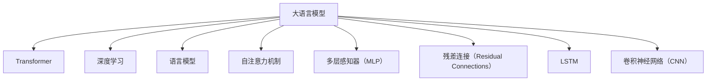

                 

# 大规模语言模型从理论到实践 大语言模型的发展历程

大语言模型（Large Language Models，LLMs）的崛起，标志着人工智能领域的一个里程碑。从最初简单的语言模型到今天的GPT-3和GPT-4，大语言模型已经从理论研究到实际应用，取得了前所未有的突破。本文将从理论到实践，全面系统地回顾大语言模型的发展历程，探讨其核心概念、算法原理和应用领域，同时展望未来发展趋势和面临的挑战。

## 1. 背景介绍

### 1.1 问题由来

大语言模型的起源可以追溯到20世纪80年代和90年代的语言模型研究。最初的目的是为了理解人类语言的本质，尤其是在自然语言处理（NLP）领域。这些模型主要是基于统计语言模型的，如n-gram模型和隐马尔可夫模型（HMM），它们通过统计语言数据中的规律，对语言进行建模。

然而，这些简单的模型面临的挑战是，它们无法捕捉到语言的深层结构和语义信息。为了克服这些问题，研究人员开始探索更复杂的模型结构，如递归神经网络（RNN）和卷积神经网络（CNN），但它们仍然难以处理长距离依赖和高维度特征。

### 1.2 问题核心关键点

大语言模型研究的核心关键点在于如何构建一个能够捕捉语言深层结构、语义信息和语法规律的模型。早期的研究表明，基于神经网络的模型（尤其是深度神经网络）在语言处理任务上表现优异。特别是在机器翻译、文本分类、信息抽取等任务中，深度学习模型逐渐取代了传统的统计模型。

但即便如此，传统的神经网络模型在处理长序列数据时，仍面临梯度消失和梯度爆炸的问题，尤其是在处理长文本时。因此，研究人员开始探索更深的层次和更大的规模的模型，以期更好地理解和处理自然语言。

## 2. 核心概念与联系

### 2.1 核心概念概述

大语言模型通常是指通过大规模无标签或少量有标签的数据训练得到的深度神经网络模型。这些模型能够捕捉语言的深层结构和语义信息，并具备强大的泛化能力。它们在NLP领域取得了显著的进展，被广泛应用于文本生成、机器翻译、问答系统、信息抽取等任务。

主要的大语言模型架构包括：
- Transformer：谷歌在2017年提出的自注意力机制，能够处理长序列数据。
- 深度学习：基于神经网络架构的模型，在NLP任务上表现优异。
- 语言模型：通过统计语言数据，对语言进行建模的模型。

### 2.2 核心概念原理和架构的 Mermaid 流程图



## 3. 核心算法原理 & 具体操作步骤

### 3.1 算法原理概述

大语言模型的核心算法原理主要基于深度学习，特别是基于Transformer架构的神经网络模型。Transformer使用自注意力机制，能够高效地处理长序列数据，并且具有较好的泛化能力。

大语言模型的训练通常分为两个阶段：预训练和微调。预训练是在大规模无标签数据上进行的，目的是让模型学习语言的深层结构和语义信息。微调则是在特定任务的数据集上进行，目的是让模型适应具体任务的要求。

### 3.2 算法步骤详解

预训练过程主要包括以下几个步骤：
1. 数据准备：收集大规模无标签数据，如维基百科、互联网新闻等。
2. 模型构建：使用深度学习框架，如TensorFlow或PyTorch，构建Transformer模型。
3. 训练过程：使用GPU或TPU等硬件加速器，在大量数据上对模型进行训练，通常使用自监督学习任务，如掩码语言模型（Masked Language Model，MLM）。
4. 模型保存：保存训练好的模型，以便后续的微调使用。

微调过程主要包括以下几个步骤：
1. 数据准备：收集特定任务的有标签数据。
2. 模型选择：选择合适的预训练模型作为初始化参数。
3. 任务适配：在预训练模型的基础上，添加任务特定的输出层和损失函数。
4. 训练过程：使用优化算法，如Adam或SGD，在少量标注数据上对模型进行微调。
5. 模型评估：在验证集上评估微调后的模型性能。
6. 模型部署：将微调好的模型集成到实际应用中。

### 3.3 算法优缺点

大语言模型的优点包括：
1. 强大的泛化能力：通过预训练，模型能够捕捉语言的深层结构和语义信息，具有较强的泛化能力。
2. 高效的处理长序列数据：Transformer模型使用自注意力机制，能够高效地处理长序列数据。
3. 灵活的微调：通过微调，模型可以适应特定任务的要求，获得更好的性能。

大语言模型的缺点包括：
1. 数据需求高：预训练和微调需要大量的数据，成本较高。
2. 计算资源需求高：训练和推理大模型需要高性能的计算资源。
3. 解释性不足：大模型通常被视为“黑盒”，难以解释其内部工作机制。

### 3.4 算法应用领域

大语言模型已经在多个NLP任务中取得了显著进展，主要应用领域包括：
1. 机器翻译：通过微调，模型能够将一种语言翻译成另一种语言。
2. 问答系统：通过微调，模型能够回答问题。
3. 文本生成：通过微调，模型能够生成自然语言文本。
4. 信息抽取：通过微调，模型能够从文本中抽取实体和关系。
5. 文本分类：通过微调，模型能够对文本进行分类。

## 4. 数学模型和公式 & 详细讲解 & 举例说明

### 4.1 数学模型构建

大语言模型的数学模型通常包括以下几个部分：
1. 输入层：将输入文本转换为模型能够处理的形式。
2. 编码器：对输入文本进行编码，生成文本表示。
3. 解码器：根据编码器生成的文本表示，生成输出文本。
4. 输出层：将解码器生成的文本转换为最终输出形式。

以BERT为例，其数学模型可以表示为：
$$
h = \text{BERT}(x) = \text{MLP}(\text{CLS}(x))
$$
其中，$x$为输入文本，$h$为模型生成的文本表示，$\text{MLP}$为多层感知器，$\text{CLS}$为特殊标记，用于表示整个文本。

### 4.2 公式推导过程

BERT模型的预训练过程主要使用掩码语言模型（MLM）任务。MLM任务的公式可以表示为：
$$
L = -\sum_{i=1}^n \sum_{j=1}^n \log P(w_i \mid w_{<i})
$$
其中，$w$表示输入文本，$P(w_i \mid w_{<i})$表示在已知前$i-1$个词的情况下，第$i$个词的概率分布。

在微调过程中，我们通常使用交叉熵损失函数来衡量模型输出与真实标签之间的差异。例如，对于二分类任务，交叉熵损失函数可以表示为：
$$
L = -\frac{1}{N} \sum_{i=1}^N [y_i \log P(y_i) + (1-y_i) \log (1-P(y_i))]
$$
其中，$y$表示真实标签，$P(y_i)$表示模型对标签$y_i$的概率估计。

### 4.3 案例分析与讲解

以机器翻译为例，大语言模型的微调过程如下：
1. 准备机器翻译数据集，包括源语言文本和目标语言文本。
2. 选择合适的预训练模型，如BERT或GPT-2。
3. 在预训练模型的基础上，添加机器翻译的输出层和损失函数。
4. 使用优化算法，如Adam或SGD，在机器翻译数据集上进行微调。
5. 在验证集上评估微调后的模型性能，并进行必要的调整。
6. 在测试集上测试微调后的模型性能，并进行部署。

## 5. 项目实践：代码实例和详细解释说明

### 5.1 开发环境搭建

1. 安装Python：从官网下载并安装Python 3.8或更高版本。
2. 安装TensorFlow或PyTorch：使用pip安装，如：
   ```
   pip install tensorflow
   ```
   或
   ```
   pip install torch
   ```
3. 安装BERT模型：使用huggingface库，如：
   ```
   pip install transformers
   ```

### 5.2 源代码详细实现

```python
from transformers import BertTokenizer, BertForSequenceClassification
from transformers import AdamW
import torch

tokenizer = BertTokenizer.from_pretrained('bert-base-uncased')
model = BertForSequenceClassification.from_pretrained('bert-base-uncased', num_labels=2)
optimizer = AdamW(model.parameters(), lr=2e-5)

def train_epoch(model, tokenizer, data_loader, optimizer):
    model.train()
    total_loss = 0
    for batch in data_loader:
        input_ids = batch['input_ids'].to(device)
        attention_mask = batch['attention_mask'].to(device)
        labels = batch['labels'].to(device)
        model.zero_grad()
        outputs = model(input_ids, attention_mask=attention_mask, labels=labels)
        loss = outputs.loss
        total_loss += loss.item()
        loss.backward()
        optimizer.step()
    return total_loss / len(data_loader)

def evaluate(model, tokenizer, data_loader):
    model.eval()
    total_correct = 0
    total_examples = 0
    for batch in data_loader:
        input_ids = batch['input_ids'].to(device)
        attention_mask = batch['attention_mask'].to(device)
        labels = batch['labels'].to(device)
        outputs = model(input_ids, attention_mask=attention_mask)
        predictions = torch.argmax(outputs.logits, dim=1)
        total_correct += (predictions == labels).sum().item()
        total_examples += labels.size(0)
    return total_correct / total_examples

# 使用微调后的模型进行推理
def predict(model, tokenizer, text):
    inputs = tokenizer.encode(text, return_tensors='pt')
    with torch.no_grad():
        outputs = model(**inputs)
        predictions = torch.argmax(outputs.logits, dim=1)
    return predictions

# 测试微调后的模型性能
data_loader = DataLoader(train_dataset, batch_size=16)
for epoch in range(epochs):
    train_loss = train_epoch(model, tokenizer, data_loader, optimizer)
    print(f'Epoch {epoch+1}, train loss: {train_loss:.3f}')
    dev_correct = evaluate(model, tokenizer, dev_loader)
    print(f'Epoch {epoch+1}, dev accuracy: {dev_correct:.3f}')
```

### 5.3 代码解读与分析

以上代码实现了BERT模型的微调过程。首先，我们定义了BERT的tokenizer和模型，然后设置优化算法和超参数。在`train_epoch`函数中，我们对模型进行前向传播和反向传播，并计算损失函数。在`evaluate`函数中，我们计算模型在验证集上的准确率。最后，我们使用微调后的模型对输入文本进行推理，得到预测结果。

## 6. 实际应用场景

### 6.1 智能客服系统

智能客服系统通过大语言模型，能够提供7x24小时不间断的服务，处理大量的客户咨询。通过微调，模型可以学习到不同场景下的客户意图和常用回复，从而实现更自然的交互。

### 6.2 金融舆情监测

金融舆情监测通过微调，可以实时监测市场舆论动向，帮助金融机构及时应对负面信息，避免金融风险。微调后的模型能够自动识别新闻、报道和评论中的关键信息，并进行情感分析。

### 6.3 个性化推荐系统

个性化推荐系统通过微调，可以更好地理解用户的兴趣偏好，并提供个性化的推荐内容。通过微调，模型可以学习到用户行为背后的语义信息，并结合其他特征进行排序。

### 6.4 未来应用展望

未来，大语言模型将在更多领域得到应用，为人类社会带来深刻变革。例如，在医疗、教育、智慧城市等领域，大语言模型将帮助人类更好地理解和管理复杂的信息。

## 7. 工具和资源推荐

### 7.1 学习资源推荐

1. 《深度学习》课程（Deep Learning Specialization）：由吴恩达教授主讲，涵盖深度学习的基础和前沿技术。
2. 《自然语言处理综述》（Survey on Natural Language Processing）：综述了NLP领域的研究进展和技术应用。
3. 《大语言模型》（Large Language Models）：介绍大语言模型的理论、算法和应用。
4. HuggingFace官方文档：提供Transformer库的详细文档和示例代码。

### 7.2 开发工具推荐

1. TensorFlow：开源的深度学习框架，支持分布式训练和大规模模型训练。
2. PyTorch：灵活的深度学习框架，支持动态计算图和GPU加速。
3. Weights & Biases：实验跟踪工具，记录和可视化模型训练过程。
4. TensorBoard：可视化工具，用于实时监测模型训练状态。

### 7.3 相关论文推荐

1. Attention is All You Need（Transformer原论文）：提出Transformer架构，开启了大语言模型的时代。
2. BERT: Pre-training of Deep Bidirectional Transformers for Language Understanding：提出BERT模型，使用了掩码语言模型任务进行预训练。
3. How to Train Your BERT for Sequence Classification：介绍如何在BERT模型上进行序列分类任务的微调。

## 8. 总结：未来发展趋势与挑战

### 8.1 总结

大语言模型从简单的语言模型到今天的GPT-3和GPT-4，经历了多个阶段的演进。从理论到实践，大语言模型在多个NLP任务中取得了显著的进展，被广泛应用于智能客服、金融舆情监测、个性化推荐系统等领域。

### 8.2 未来发展趋势

未来，大语言模型的发展趋势包括：
1. 更大规模的模型：随着计算资源和数据规模的扩大，大语言模型的参数量将继续增加，模型的性能也将进一步提升。
2. 更高效的微调方法：新的微调方法将更加高效，减少对标注数据的依赖，提高模型的泛化能力。
3. 跨领域迁移：大语言模型将具备更强的跨领域迁移能力，应用于更多领域和任务。
4. 多模态融合：大语言模型将与视觉、语音等模态信息进行融合，提升模型的综合能力。
5. 更加通用和可解释：大语言模型将变得更加通用和可解释，满足更多实际应用的需求。

### 8.3 面临的挑战

大语言模型在实际应用中也面临诸多挑战：
1. 计算资源需求高：训练和推理大模型需要高性能的计算资源，成本较高。
2. 数据依赖高：微调模型需要大量标注数据，获取成本高。
3. 模型解释性不足：大语言模型通常被视为“黑盒”，难以解释其内部工作机制。
4. 鲁棒性不足：模型在处理新数据时容易出现泛化性能下降的情况。
5. 道德和伦理问题：模型可能学习到有害信息和偏见，需要严格控制。

### 8.4 研究展望

未来，大语言模型的研究将集中在以下几个方面：
1. 更加高效的训练和推理算法。
2. 跨模态信息融合技术。
3. 更加通用和可解释的模型。
4. 降低对数据和计算资源的依赖。
5. 解决道德和伦理问题，提升模型可信度。

总之，大语言模型从理论到实践的演进，为NLP领域带来了革命性的突破。未来，随着技术的不断进步和应用场景的扩展，大语言模型必将在更多领域发挥更大的作用，为人类社会带来更多的便利和智慧。

## 9. 附录：常见问题与解答

**Q1: 什么是大语言模型？**

A: 大语言模型是一种基于深度学习的神经网络模型，通过大规模无标签或少量有标签的数据进行预训练，能够捕捉语言的深层结构和语义信息，并在特定任务上进行微调，获得优异的性能。

**Q2: 大语言模型的主要架构是什么？**

A: 大语言模型的主要架构包括输入层、编码器、解码器和输出层。其中，Transformer架构是一种高效的自注意力机制，能够处理长序列数据。

**Q3: 大语言模型的预训练和微调过程分别是什么？**

A: 大语言模型的预训练过程通常使用自监督学习任务，如掩码语言模型（MLM）和语言建模（LM）任务。微调过程是在特定任务的数据集上进行，添加任务特定的输出层和损失函数，使用优化算法对模型进行训练，使其适应具体任务的要求。

**Q4: 大语言模型的优缺点是什么？**

A: 大语言模型的优点包括强大的泛化能力、高效处理长序列数据、灵活的微调等。缺点包括计算资源需求高、数据依赖高、模型解释性不足等。

**Q5: 大语言模型未来有哪些应用前景？**

A: 大语言模型未来将在更多领域得到应用，如智能客服、金融舆情监测、个性化推荐系统等。同时，随着技术的发展，大语言模型将具备更强的跨领域迁移能力和跨模态信息融合能力，提升模型的综合性能。

**Q6: 大语言模型面临的挑战有哪些？**

A: 大语言模型面临的挑战包括计算资源需求高、数据依赖高、模型解释性不足、鲁棒性不足、道德和伦理问题等。

总之，大语言模型从理论到实践的发展历程，展示了其在NLP领域的巨大潜力。未来，随着技术的不断进步和应用场景的扩展，大语言模型必将在更多领域发挥更大的作用，为人类社会带来更多的便利和智慧。

