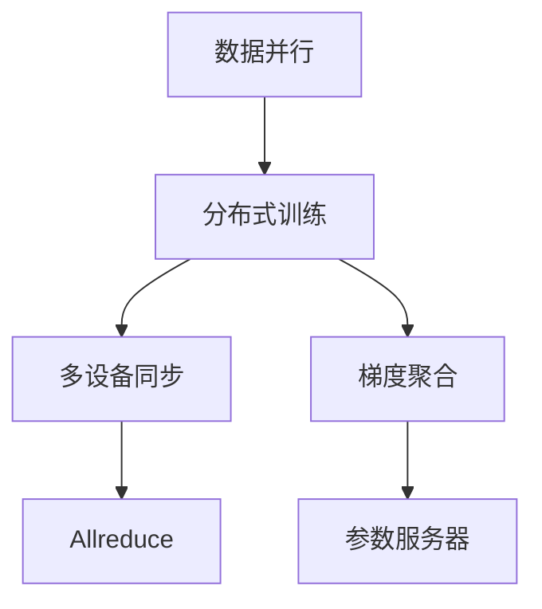

                 

# 大规模语言模型从理论到实践 数据并行

> 关键词：大规模语言模型,数据并行,分布式训练,深度学习,自然语言处理(NLP)

## 1. 背景介绍

### 1.1 问题由来
近年来，随着深度学习技术的飞速发展，大规模语言模型在大规模无标签文本语料上进行预训练，已经成为推动自然语言处理(Natural Language Processing, NLP)领域突破的重要引擎。以BERT、GPT-3、T5等为代表的大规模语言模型，在多个NLP任务上取得了卓越的性能，广泛应用于机器翻译、文本分类、问答系统等诸多领域。

然而，这些大规模语言模型往往需要巨大的计算资源，训练时间可达数天甚至数周。因此，如何在不增加过多硬件投入的前提下，加速大语言模型的训练，是一个亟需解决的实际问题。数据并行（Data Parallelism）技术为大规模语言模型的训练提供了新的思路，通过并行化处理，可以显著提高训练效率，加速模型的迭代和优化。

### 1.2 问题核心关键点
数据并行技术的核心在于将大规模的数据集分割成若干小批次，在多个计算节点上同时并行计算，使得模型可以更快地迭代学习。数据并行训练的主要优势包括：
- 提高训练速度：多批次并行计算能够大大缩短训练时间。
- 提高模型泛化能力：多批次的数据能够提高模型的泛化能力和泛化效果。
- 降低硬件成本：多个批次并行训练，可以更高效地利用计算资源，减少单批次计算硬件开销。

数据并行训练的具体方法主要包括两种：同步更新和异步更新。在同步更新中，所有计算节点按照统一的步长进行更新；在异步更新中，每个节点自行更新，不考虑其他节点状态。

## 2. 核心概念与联系

### 2.1 核心概念概述

为更好地理解数据并行在大规模语言模型中的应用，本节将介绍几个密切相关的核心概念：

- 数据并行（Data Parallelism）：将大规模数据集分成若干批次，在多个计算节点上同时并行计算的一种并行计算技术。
- 分布式训练（Distributed Training）：在多台计算节点上，通过数据并行、模型并行等方式，实现大规模深度学习模型训练的并行化处理。
- 梯度聚合（Gradient Aggregation）：在分布式训练中，将各节点计算出的梯度进行聚合，更新全模型参数。
- 多设备同步（Allreduce）：一种高效的梯度聚合方式，通过多个设备之间的通信，实现梯度向量的求和，减少通信开销。
- 参数服务器（Parameter Server）：在分布式训练中，集中存储并更新模型参数，减少各节点间的通信量。

这些核心概念之间的逻辑关系可以通过以下Mermaid流程图来展示：



这个流程图展示了大规模语言模型中数据并行技术的基本架构：

1. 数据并行将大规模数据集分成多个批次，在多个计算节点上同时并行计算。
2. 分布式训练通过数据并行和多设备同步等方式，实现模型参数的并行更新。
3. Allreduce 和 参数服务器技术则提供了高效梯度聚合的方式，确保各节点更新模型的同步性。

这些核心概念共同构成了大规模语言模型中数据并行技术的核心框架，使得大模型能够在分布式环境中高效运行，提升训练速度和模型泛化能力。

## 3. 核心算法原理 & 具体操作步骤
### 3.1 算法原理概述

数据并行在大规模语言模型的训练中，主要通过将数据集并行化处理，使得不同计算节点能够同时计算不同批次的数据，从而加速模型的迭代更新。具体而言，数据并行训练的过程可以分为以下几个步骤：

1. 将训练集 $D$ 分成若干批次 $\{D_1, D_2, ..., D_k\}$，每个批次的大小一般为 $N/M$，其中 $M$ 为每个节点的内存大小。
2. 在每个计算节点上，对每个批次数据 $D_i$ 进行前向传播和反向传播，计算损失函数 $L_i$ 和梯度 $G_i$。
3. 对各节点的梯度 $G_i$ 进行聚合，计算全模型梯度 $G_{total}$。
4. 根据聚合后的全模型梯度 $G_{total}$ 更新模型参数 $\theta$。

### 3.2 算法步骤详解

以下以一个具体的例子，详细讲解数据并行在大规模语言模型中的应用过程：

假设我们有一个大规模语言模型 $M_{\theta}$，需要在大规模文本数据集上进行训练。数据集 $D$ 被分为多个批次 $\{D_1, D_2, ..., D_k\}$，每个批次大小为 $N/M$。训练过程中，每个计算节点使用 $M$ 的内存大小，对批次数据 $D_i$ 进行前向传播和反向传播计算，得到损失函数 $L_i$ 和梯度 $G_i$。

具体步骤如下：

1. **数据分批次**：将大规模数据集 $D$ 分成多个批次 $\{D_1, D_2, ..., D_k\}$，每个批次大小为 $N/M$。
2. **节点并行计算**：在多个计算节点上，同时对各批次数据 $D_i$ 进行前向传播和反向传播计算，得到梯度 $G_i$。
3. **梯度聚合**：使用Allreduce等方法，将各节点的梯度 $G_i$ 进行聚合，得到全模型梯度 $G_{total}$。
4. **更新模型参数**：根据全模型梯度 $G_{total}$ 更新模型参数 $\theta$。

### 3.3 算法优缺点

数据并行在大规模语言模型的训练中具有以下优点：
1. 提高训练速度：多个批次并行计算能够显著缩短训练时间。
2. 提高模型泛化能力：多批次的数据能够提高模型的泛化能力和泛化效果。
3. 降低硬件成本：多个批次并行训练，可以更高效地利用计算资源，减少单批次计算硬件开销。

然而，数据并行也存在一些缺点：
1. 通信开销：节点间通信会带来一定的通信开销，影响整体训练速度。
2. 同步问题：多个节点需要保持同步，可能存在一定的同步开销。
3. 参数不均衡：由于不同节点计算的数据批次大小可能不同，可能导致参数更新不均衡。

### 3.4 算法应用领域

数据并行在大规模语言模型中的应用非常广泛，主要体现在以下几个方面：

1. 大规模文本分类：在文本分类任务中，数据并行能够显著提高模型训练速度，提高模型泛化能力。例如，在大规模电影评论分类任务中，使用数据并行可以显著提高模型精度。
2. 机器翻译：在机器翻译任务中，数据并行能够提高模型训练速度，提高翻译质量。例如，使用数据并行可以在短时间内训练出高质量的机器翻译模型。
3. 语音识别：在语音识别任务中，数据并行能够提高模型训练速度，提高识别准确率。例如，在基于深度学习的大规模语音识别系统中，使用数据并行可以显著提高识别性能。
4. 自然语言生成：在自然语言生成任务中，数据并行能够提高模型训练速度，生成更流畅的自然语言文本。例如，在大规模新闻摘要生成任务中，使用数据并行可以显著提高生成文本的质量。

除了上述这些应用场景，数据并行还广泛应用于图像识别、视频处理等视觉和语音任务中，成为推动大规模深度学习技术发展的重要手段。

## 4. 数学模型和公式 & 详细讲解  
### 4.1 数学模型构建

数据并行在大规模语言模型中的应用，可以从数学角度进行更加严格的刻画。

记大规模语言模型为 $M_{\theta}:\mathcal{X} \rightarrow \mathcal{Y}$，其中 $\mathcal{X}$ 为输入空间，$\mathcal{Y}$ 为输出空间，$\theta$ 为模型参数。假设训练集 $D=\{(x_i,y_i)\}_{i=1}^N$，其中 $x_i$ 为输入，$y_i$ 为标签。

数据并行训练的目标是最小化经验风险，即：

$$
\min_{\theta} \frac{1}{N} \sum_{i=1}^N \ell(M_{\theta}(x_i),y_i)
$$

其中 $\ell$ 为损失函数，可以是交叉熵损失、均方误差损失等。

在数据并行训练中，将数据集 $D$ 分成若干批次 $\{D_1, D_2, ..., D_k\}$，每个批次大小为 $N/M$。假设在每个计算节点上进行 $m$ 次迭代，每个节点的计算结果为 $G_i^t = \nabla_{\theta} \ell(M_{\theta}(x_i^t),y_i^t)$，其中 $t$ 表示迭代次数，$x_i^t$ 和 $y_i^t$ 表示节点 $i$ 在第 $t$ 次迭代中使用的数据和标签。

### 4.2 公式推导过程

以下我们将对数据并行的数学模型进行详细推导：

在每个计算节点上，对每个批次数据 $D_i$ 进行前向传播和反向传播计算，得到梯度 $G_i$。假设 $k$ 个计算节点并行训练，每个节点的计算结果为 $G_i^t = \nabla_{\theta} \ell(M_{\theta}(x_i^t),y_i^t)$。

数据并行训练中，将所有节点的梯度进行聚合，得到全模型梯度 $G_{total}$。假设 $G_{total} = \sum_{i=1}^k G_i^t$。

更新模型参数时，使用梯度下降等优化算法，例如 Adam 或 SGD。假设学习率为 $\eta$，更新公式为：

$$
\theta \leftarrow \theta - \eta \frac{1}{k} G_{total}
$$

其中 $G_{total}$ 为全模型梯度，通过聚合各节点梯度得到。

### 4.3 案例分析与讲解

以大规模文本分类为例，详细分析数据并行在大规模语言模型中的应用过程。

假设有一个大规模文本分类任务，需要将电影评论分为正面和负面两类。训练集 $D$ 被分成若干批次 $\{D_1, D_2, ..., D_k\}$，每个批次大小为 $N/M$。在每个计算节点上，对每个批次数据 $D_i$ 进行前向传播和反向传播计算，得到梯度 $G_i^t = \nabla_{\theta} \ell(M_{\theta}(x_i^t),y_i^t)$。

将所有节点的梯度进行聚合，得到全模型梯度 $G_{total}$。假设 $G_{total} = \sum_{i=1}^k G_i^t$。

使用梯度下降等优化算法，更新模型参数 $\theta$，更新公式为：

$$
\theta \leftarrow \theta - \eta \frac{1}{k} G_{total}
$$

其中 $G_{total}$ 为全模型梯度，通过聚合各节点梯度得到。

## 5. 项目实践：代码实例和详细解释说明
### 5.1 开发环境搭建

在进行数据并行实践前，我们需要准备好开发环境。以下是使用Python进行PyTorch开发的环境配置流程：

1. 安装Anaconda：从官网下载并安装Anaconda，用于创建独立的Python环境。

2. 创建并激活虚拟环境：
```bash
conda create -n pytorch-env python=3.8 
conda activate pytorch-env
```

3. 安装PyTorch：根据CUDA版本，从官网获取对应的安装命令。例如：
```bash
conda install pytorch torchvision torchaudio cudatoolkit=11.1 -c pytorch -c conda-forge
```

4. 安装相关的分布式训练库：
```bash
pip install torch-distributed
pip install torchvision
pip install torchtext
```

5. 安装各类工具包：
```bash
pip install numpy pandas scikit-learn matplotlib tqdm jupyter notebook ipython
```

完成上述步骤后，即可在`pytorch-env`环境中开始数据并行实践。

### 5.2 源代码详细实现

下面我们以大规模文本分类任务为例，给出使用PyTorch和DistributedDataParallel进行数据并行的代码实现。

```python
import torch
import torch.nn as nn
import torch.optim as optim
from torch.distributed import DistributedDataParallel as DDP

class TextClassifier(nn.Module):
    def __init__(self):
        super(TextClassifier, self).__init__()
        self.emb = nn.Embedding(10000, 300)
        self.lin1 = nn.Linear(300, 256)
        self.lin2 = nn.Linear(256, 2)

    def forward(self, x):
        emb = self.emb(x)
        x = F.relu(self.lin1(emb))
        x = self.lin2(x)
        return x

def train_epoch(model, data_loader, optimizer):
    model.train()
    loss = 0
    for data, target in data_loader:
        data = data.to(device)
        target = target.to(device)
        optimizer.zero_grad()
        output = model(data)
        loss += nn.CrossEntropyLoss()(output, target).to(device)
        loss.backward()
        optimizer.step()
        loss /= len(data_loader.dataset)

def evaluate(model, data_loader):
    model.eval()
    loss = 0
    correct = 0
    with torch.no_grad():
        for data, target in data_loader:
            data = data.to(device)
            target = target.to(device)
            output = model(data)
            loss += nn.CrossEntropyLoss()(output, target).to(device)
            _, pred = torch.max(output, 1)
            correct += (pred == target).sum().item()
    return loss, correct

# 设置参数
world_size = 4
batch_size = 64
lr = 0.001
num_epochs = 10

# 初始化模型和优化器
model = TextClassifier().to(device)
optimizer = optim.Adam(model.parameters(), lr=lr)

# 初始化DistributedDataParallel
model = DDP(model)

# 准备数据
train_dataset = ...
train_loader = DataLoader(train_dataset, batch_size=batch_size, shuffle=True)

# 开始训练
device = torch.device("cuda" if torch.cuda.is_available() else "cpu")
for epoch in range(num_epochs):
    train_epoch(model, train_loader, optimizer)
    evaluate(model, train_loader)

# 保存模型
torch.save(model.state_dict(), 'model.pt')
```

以上代码展示了如何使用PyTorch和DistributedDataParallel（DDP）进行数据并行训练。

**TextClassifier类**：
- 定义了一个简单的文本分类模型，包括嵌入层、线性层等。
- `forward`方法：对输入数据进行前向传播计算。

**train_epoch和evaluate函数**：
- `train_epoch`函数：对模型进行前向传播和反向传播，计算损失函数，更新模型参数。
- `evaluate`函数：对模型进行前向传播，计算损失函数，统计分类准确率。

**初始化DistributedDataParallel**：
- 使用DDP将模型并行化处理，将模型参数分散到多个计算节点上，使得每个节点都能够独立地更新模型参数。

**数据准备**：
- 准备训练数据集，划分训练批次。

**开始训练**：
- 初始化模型和优化器。
- 将模型初始化并行化处理，使用DDP进行数据并行训练。
- 对模型进行前向传播和反向传播，计算损失函数，更新模型参数。

**保存模型**：
- 在训练结束后，保存模型参数。

以上代码实现了简单的数据并行训练过程，通过使用DistributedDataParallel，可以显著提高模型训练速度，同时保持模型参数的同步更新。

### 5.3 代码解读与分析

让我们再详细解读一下关键代码的实现细节：

**TextClassifier类**：
- 定义了一个简单的文本分类模型，包括嵌入层、线性层等。
- `forward`方法：对输入数据进行前向传播计算。

**train_epoch和evaluate函数**：
- `train_epoch`函数：对模型进行前向传播和反向传播，计算损失函数，更新模型参数。
- `evaluate`函数：对模型进行前向传播，计算损失函数，统计分类准确率。

**初始化DistributedDataParallel**：
- 使用DDP将模型并行化处理，将模型参数分散到多个计算节点上，使得每个节点都能够独立地更新模型参数。

**数据准备**：
- 准备训练数据集，划分训练批次。

**开始训练**：
- 初始化模型和优化器。
- 将模型初始化并行化处理，使用DDP进行数据并行训练。
- 对模型进行前向传播和反向传播，计算损失函数，更新模型参数。

**保存模型**：
- 在训练结束后，保存模型参数。

可以看到，PyTorch和DistributedDataParallel使得数据并行训练的实现变得简单高效。开发者可以将更多精力放在模型设计和数据处理上，而不必过多关注底层的并行实现细节。

当然，在实际应用中，还需要考虑更多因素，如分布式训练框架的选择、计算资源的分配、网络的通信效率等。但核心的数据并行思想是相通的，即通过并行化计算，提高训练效率和模型泛化能力。

## 6. 实际应用场景
### 6.1 智慧医疗

在智慧医疗领域，数据并行技术被广泛应用于大规模医疗数据处理和分析。例如，在大规模电子病历数据分析中，数据并行可以显著提高模型训练速度，降低计算成本，提高分析效率。

具体而言，可以使用数据并行技术对电子病历数据进行标注和预处理，将大规模医疗数据集分成多个批次，在多个计算节点上进行并行计算。同时，使用多任务学习等技术，将不同医疗任务进行联合训练，提升模型的泛化能力。

### 6.2 智能制造

在智能制造领域，数据并行技术被广泛应用于大规模工业数据分析和预测。例如，在工业设备故障预测中，数据并行可以显著提高模型训练速度，提高预测准确率。

具体而言，可以使用数据并行技术对工业设备数据进行标注和预处理，将大规模工业数据集分成多个批次，在多个计算节点上进行并行计算。同时，使用多模态学习等技术，将不同传感器数据进行联合训练，提升模型的泛化能力。

### 6.3 智慧城市

在智慧城市领域，数据并行技术被广泛应用于大规模城市数据处理和分析。例如，在大规模城市交通数据分析中，数据并行可以显著提高模型训练速度，降低计算成本，提高分析效率。

具体而言，可以使用数据并行技术对城市交通数据进行标注和预处理，将大规模城市数据集分成多个批次，在多个计算节点上进行并行计算。同时，使用多模态学习等技术，将不同交通数据进行联合训练，提升模型的泛化能力。

### 6.4 未来应用展望

随着数据并行技术的不断演进，未来其在深度学习和大规模语言模型中的应用将更加广泛。具体而言，未来可能的发展方向包括：

1. 多设备同步技术：通过优化通信协议和调度策略，进一步降低通信开销，提高数据并行训练的效率。
2. 异步并行技术：通过引入异步并行技术，进一步提高数据并行训练的并发度，提升训练速度。
3 参数优化技术：通过优化模型参数分布，进一步提高数据并行训练的收敛速度和精度。
4. 分布式训练框架：通过引入更高效的分布式训练框架，如TensorFlow、PyTorch等，进一步提高数据并行训练的灵活性和扩展性。

未来，数据并行技术将在大规模语言模型的训练中发挥更大的作用，推动深度学习技术的普及和应用，为各行各业带来更多的技术红利。

## 7. 工具和资源推荐
### 7.1 学习资源推荐

为了帮助开发者系统掌握数据并行在大规模语言模型中的应用，这里推荐一些优质的学习资源：

1. 《深度学习入门：基于Python的理论与实现》书籍：详细介绍了深度学习的基本理论和实践方法，包括数据并行等重要技术。
2. CS231n《卷积神经网络》课程：斯坦福大学开设的计算机视觉课程，详细介绍了大规模深度学习模型的训练方法，包括数据并行等技术。
3. CS224n《神经网络的语言表示》课程：斯坦福大学开设的自然语言处理课程，详细介绍了大规模语言模型和数据并行的训练方法。
4. DeepLearning.AI的深度学习专业课程：提供系统深入的深度学习课程，包括数据并行等技术。
5. PyTorch官方文档：PyTorch官方文档提供了丰富的教程和样例代码，详细介绍了如何使用PyTorch进行数据并行训练。

通过对这些资源的学习实践，相信你一定能够系统掌握数据并行在大规模语言模型中的应用，并用于解决实际的深度学习问题。

### 7.2 开发工具推荐

高效的开发离不开优秀的工具支持。以下是几款用于数据并行训练开发的常用工具：

1. PyTorch：基于Python的开源深度学习框架，灵活动态的计算图，适合快速迭代研究。大部分预训练语言模型都有PyTorch版本的实现。
2. TensorFlow：由Google主导开发的开源深度学习框架，生产部署方便，适合大规模工程应用。同样有丰富的预训练语言模型资源。
3. Transformers库：HuggingFace开发的NLP工具库，集成了众多SOTA语言模型，支持PyTorch和TensorFlow，是进行数据并行训练开发的利器。
4. DDP（DistributedDataParallel）：PyTorch提供的分布式训练框架，支持数据并行和多设备同步，非常适合大规模语言模型的训练。
5. MPI（Message Passing Interface）：一种标准化的消息传递接口，用于多节点之间的通信，适用于大规模分布式训练。

合理利用这些工具，可以显著提升数据并行训练的开发效率，加快创新迭代的步伐。

### 7.3 相关论文推荐

数据并行在大规模语言模型中的应用源于学界的持续研究。以下是几篇奠基性的相关论文，推荐阅读：

1. Parameter Server for Distributed Deep Learning（DPSGD）：提出了参数服务器（Parameter Server）技术，支持大规模深度学习模型的分布式训练。
2. Hogwild!：提出异步并行训练（Asynchronous Training）技术，通过无锁并行计算，提升数据并行训练的效率。
3. Model Parallelism for Deep Learning（MPDNN）：提出模型并行技术，将大规模模型拆分为多个子模型，支持多节点并行训练。
4. PyTorch和PyTorch Distributed：提供了基于PyTorch的数据并行训练框架，支持分布式训练、多设备同步等技术。
5. TensorFlow和TensorFlow-Distributed：提供了基于TensorFlow的数据并行训练框架，支持分布式训练、多设备同步等技术。

这些论文代表了大规模语言模型数据并行技术的发展脉络。通过学习这些前沿成果，可以帮助研究者把握学科前进方向，激发更多的创新灵感。

## 8. 总结：未来发展趋势与挑战
### 8.1 总结

本文对数据并行在大规模语言模型中的应用进行了全面系统的介绍。首先阐述了数据并行技术的基本原理和架构，明确了数据并行在提升模型训练速度和泛化能力方面的独特价值。其次，从原理到实践，详细讲解了数据并行训练的数学模型和关键步骤，给出了数据并行训练的代码实例。同时，本文还广泛探讨了数据并行技术在智慧医疗、智能制造、智慧城市等多个领域的应用前景，展示了数据并行技术的巨大潜力。

通过本文的系统梳理，可以看到，数据并行技术在大规模语言模型的训练中发挥了重要的作用，成为推动深度学习技术普及和应用的重要手段。未来，随着数据并行技术的不断演进，其在深度学习和大规模语言模型中的应用将更加广泛，为各行各业带来更多的技术红利。

### 8.2 未来发展趋势

展望未来，数据并行技术将呈现以下几个发展趋势：

1. 异步并行技术的普及：随着异步并行技术的发展，未来数据并行训练将更加高效，进一步提高训练速度和模型泛化能力。
2. 参数优化技术的提升：通过优化模型参数分布，未来数据并行训练将更加稳定，进一步提高训练速度和模型精度。
3 分布式训练框架的优化：通过优化分布式训练框架，未来数据并行训练将更加灵活，进一步提高训练效率和可扩展性。

### 8.3 面临的挑战

尽管数据并行技术在大规模语言模型中的应用取得了显著进展，但在实际应用中仍面临诸多挑战：

1. 通信开销：节点间通信会带来一定的通信开销，影响整体训练速度。
2. 同步问题：多个节点需要保持同步，可能存在一定的同步开销。
3 参数不均衡：由于不同节点计算的数据批次大小可能不同，可能导致参数更新不均衡。
4 可扩展性：随着数据集规模的增大，数据并行训练的可扩展性将面临挑战。

### 8.4 研究展望

未来的研究需要在以下几个方面寻求新的突破：

1. 优化通信协议：通过优化通信协议和调度策略，进一步降低通信开销，提高数据并行训练的效率。
2 引入异步并行技术：通过引入异步并行技术，进一步提高数据并行训练的并发度，提升训练速度。
3 优化模型参数：通过优化模型参数分布，进一步提高数据并行训练的收敛速度和精度。
4 引入多设备同步技术：通过优化多设备同步策略，进一步提高数据并行训练的稳定性。

这些研究方向的探索，将引领数据并行技术迈向更高的台阶，为大规模语言模型的训练提供更高效、更稳定的支持。

## 9. 附录：常见问题与解答

**Q1：数据并行和模型并行有什么区别？**

A: 数据并行和模型并行是两种不同的并行训练方式。数据并行将大规模数据集分成多个批次，在多个计算节点上同时并行计算，使得模型可以更快地迭代学习。模型并行将大规模模型拆分为多个子模型，在多个计算节点上并行计算，支持多节点并行训练。

**Q2：数据并行和参数服务器有什么关系？**

A: 数据并行和参数服务器是两种常见的分布式训练技术。数据并行将大规模数据集分成多个批次，在多个计算节点上同时并行计算，使得模型可以更快地迭代学习。参数服务器则用于集中存储和更新模型参数，减少各节点间的通信量。两者常常结合使用，通过参数服务器集中存储和更新模型参数，并通过数据并行在多个节点上同时计算，进一步提高训练效率和模型泛化能力。

**Q3：数据并行训练需要哪些硬件支持？**

A: 数据并行训练需要高性能的计算设备，如GPU、TPU等。同时，还需要具备网络通信设施，以便在节点之间传递数据和模型参数。此外，还需要考虑存储设施，用于存储大规模数据集和模型参数。

**Q4：数据并行训练的优化策略有哪些？**

A: 数据并行训练的优化策略包括：
1. 通信优化：通过优化通信协议和调度策略，降低通信开销，提高训练速度。
2. 模型优化：通过优化模型结构，提高模型训练速度和精度。
3 参数优化：通过优化模型参数分布，进一步提高数据并行训练的收敛速度和精度。

这些优化策略需要根据具体应用场景进行灵活选择和组合，以进一步提升数据并行训练的效率和性能。

**Q5：数据并行训练适用于哪些应用场景？**

A: 数据并行训练适用于大规模深度学习模型的训练，如大规模文本分类、机器翻译、自然语言生成等任务。此外，数据并行训练还适用于图像识别、视频处理等视觉和语音任务，成为推动大规模深度学习技术发展的重要手段。

总之，数据并行技术在大规模语言模型中的应用前景广阔，需要结合实际应用场景进行优化和改进，以进一步提升模型训练效率和性能。

