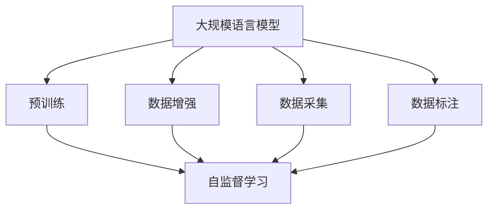

                 

# 大规模语言模型从理论到实践 数据来源

> 关键词：大规模语言模型, 预训练, 自监督学习, 数据来源, 数据增强, 数据采集, 数据标注, 数据集构建

## 1. 背景介绍

### 1.1 问题由来

近年来，大规模语言模型（Large Language Models, LLMs）在自然语言处理（Natural Language Processing, NLP）领域取得了显著进展。这些模型通过在大规模无标签文本数据上进行预训练，学习到丰富的语言知识和常识，能够广泛应用于各种NLP任务。然而，预训练模型的性能高度依赖于数据的质量和数量，而高质量、大规模的数据往往难以获得。为了解决这一问题，研究人员提出了数据增强、数据采集、数据标注等技术，通过丰富和优化数据来源，提升大规模语言模型的性能。

### 1.2 问题核心关键点

在实践中，大规模语言模型的数据来源和构建方法对模型的性能有着至关重要的影响。以下是数据来源和构建过程中需要重点关注的核心关键点：

- **数据质量**：数据的准确性、多样性和代表性对模型性能有着直接影响。高质量的数据可以避免偏差和噪声，使模型更好地学习语言规律。
- **数据规模**：数据规模越大，模型能够学习到的知识越丰富，泛化能力越强。但规模过大可能导致计算和存储成本增加，需权衡取舍。
- **数据分布**：数据分布与任务域的匹配程度直接影响模型的泛化能力。在实际应用中，需要针对特定任务构建或增强数据集。
- **数据多样性**：数据的多样性能够提升模型的鲁棒性和泛化能力，避免过拟合。
- **数据采集与标注**：高效、低成本的数据采集与标注方法，是构建大规模数据集的关键。

### 1.3 问题研究意义

研究大规模语言模型的数据来源和构建方法，对于提升模型的性能、降低预训练和微调成本、推动NLP技术的应用和普及具有重要意义：

- **提升模型性能**：高质量的数据能够使模型学习到更加全面的语言知识和规律，提高模型的性能和泛化能力。
- **降低成本**：通过数据增强和高效的数据采集与标注方法，可以显著降低预训练和微调的成本。
- **推动应用普及**：高质量、大规模的数据集是实现NLP技术规模化落地的基础，能够加速其在更多场景中的应用。

## 2. 核心概念与联系

### 2.1 核心概念概述

为更好地理解大规模语言模型的数据来源和构建方法，本节将介绍几个密切相关的核心概念：

- **大规模语言模型 (LLMs)**：指以自回归或自编码模型为代表的大规模预训练语言模型，如BERT、GPT等。通过在大规模无标签文本语料上进行预训练，学习通用的语言表示。
- **预训练 (Pre-training)**：指在大规模无标签文本语料上，通过自监督学习任务训练通用语言模型的过程。常见的预训练任务包括语言模型、掩码语言模型等。
- **自监督学习 (Self-Supervised Learning)**：指利用无标签数据训练模型，通过自我监督任务，使模型从数据中学习到通用的语言规律。
- **数据增强 (Data Augmentation)**：通过在原始数据上进行修改、扩充，丰富数据集的多样性和规模，提升模型的泛化能力。
- **数据采集 (Data Collection)**：通过各种方式，如网络爬虫、公开数据集等，获取高质量、多样化的文本数据。
- **数据标注 (Data Annotation)**：对数据集进行人工标注，为模型提供监督信号，使其能够学习特定的任务规律。

这些概念之间的逻辑关系可以通过以下Mermaid流程图来展示：



这个流程图展示了数据来源和构建方法在大规模语言模型训练中的作用：

1. 大规模语言模型通过预训练学习通用语言表示。
2. 预训练过程中，自监督学习是关键任务之一。
3. 数据增强、数据采集和数据标注为模型提供了多样化和高质量的训练数据。
4. 最终，通过这些方法的结合，使模型能够更好地适应各种NLP任务。

## 3. 核心算法原理 & 具体操作步骤
### 3.1 算法原理概述

大规模语言模型的数据来源和构建方法，本质上是利用自监督学习任务，在大规模无标签或少量标签的数据上训练通用语言模型，并通过数据增强、数据采集和数据标注等技术提升模型性能。其核心思想是：通过丰富和优化数据来源，使模型更好地学习语言规律，提升在特定任务上的表现。

形式化地，假设预训练语言模型为 $M_{\theta}$，其中 $\theta$ 为预训练得到的模型参数。给定大规模无标签文本语料 $D=\{x_i\}_{i=1}^N$，模型学习到的语言知识可以表示为 $P(\text{targets}|x)$，其中 $\text{targets}$ 为目标标签集合，$x$ 为输入文本。通过数据增强、数据采集和数据标注等技术，可以为模型提供更多训练样本，提升模型的泛化能力和泛化性能。

### 3.2 算法步骤详解

大规模语言模型的数据来源和构建方法通常包括以下几个关键步骤：

**Step 1: 数据采集与预处理**
- 通过网络爬虫、公开数据集等方式，收集大规模无标签文本语料。
- 对收集到的数据进行清洗和预处理，去除噪声和无用信息，标准化数据格式。

**Step 2: 数据增强**
- 对原始数据进行多样化的修改，如回译、同义词替换、随机插入等，增加数据多样性。
- 通过数据增强技术，可以显著提升模型的泛化能力，减少过拟合风险。

**Step 3: 数据标注**
- 对小规模有标签数据进行人工标注，提供监督信号，使模型学习特定任务规律。
- 标注数据的数量和质量直接影响模型的性能，应尽量减少标注成本，提升标注质量。

**Step 4: 预训练与微调**
- 在大规模无标签数据上进行预训练，学习通用的语言知识。
- 使用数据增强和数据标注等技术，对小规模有标签数据进行微调，提升模型在特定任务上的性能。

**Step 5: 测试与部署**
- 在测试集上评估模型的性能，比较预训练和微调后的差异。
- 将训练好的模型部署到实际应用中，提供服务或嵌入到应用程序中。

以上是数据来源和构建方法在大规模语言模型训练中的一般流程。在实际应用中，还需要针对具体任务和数据特点进行优化设计，如改进数据标注方法，应用更多的数据增强技术，搜索最优的超参数组合等，以进一步提升模型性能。

### 3.3 算法优缺点

大规模语言模型的数据来源和构建方法具有以下优点：
1. 提升模型性能：通过丰富和优化数据来源，使模型更好地学习语言规律，提升在特定任务上的表现。
2. 降低成本：数据增强和高效的数据采集与标注方法，可以显著降低预训练和微调的成本。
3. 增加多样性：数据增强和数据采集技术能够增加数据的多样性和规模，提升模型的泛化能力。
4. 泛化能力强：通过自监督学习任务，模型能够学习到通用的语言知识，提升在各类任务上的性能。

同时，该方法也存在一定的局限性：
1. 数据获取难度大：大规模高质量数据获取难度大，可能需要耗费大量人力和资源。
2. 数据标注成本高：人工标注成本高，标注数据量不足可能影响模型性能。
3. 数据偏差问题：数据采集和标注过程中可能存在偏差，导致模型学习到有偏见或不准确的语言规律。
4. 模型复杂度高：大规模语言模型参数量巨大，计算和存储成本高，需要高性能设备支持。

尽管存在这些局限性，但就目前而言，数据来源和构建方法在大规模语言模型应用中最主流，是实现模型性能提升的重要手段。未来相关研究的重点在于如何进一步降低数据标注成本，提高模型的少样本学习和跨领域迁移能力，同时兼顾可解释性和伦理安全性等因素。

### 3.4 算法应用领域

大规模语言模型的数据来源和构建方法在NLP领域已经得到了广泛的应用，覆盖了几乎所有常见任务，例如：

- 文本分类：如情感分析、主题分类、意图识别等。通过微调使模型学习文本-标签映射。
- 命名实体识别：识别文本中的人名、地名、机构名等特定实体。通过微调使模型掌握实体边界和类型。
- 关系抽取：从文本中抽取实体之间的语义关系。通过微调使模型学习实体-关系三元组。
- 问答系统：对自然语言问题给出答案。将问题-答案对作为微调数据，训练模型学习匹配答案。
- 机器翻译：将源语言文本翻译成目标语言。通过微调使模型学习语言-语言映射。
- 文本摘要：将长文本压缩成简短摘要。将文章-摘要对作为微调数据，使模型学习抓取要点。
- 对话系统：使机器能够与人自然对话。将多轮对话历史作为上下文，微调模型进行回复生成。

除了上述这些经典任务外，大规模语言模型的数据来源和构建方法也被创新性地应用到更多场景中，如可控文本生成、常识推理、代码生成、数据增强等，为NLP技术带来了全新的突破。随着预训练模型和数据增强方法的不断进步，相信NLP技术将在更广阔的应用领域大放异彩。

## 4. 数学模型和公式 & 详细讲解  
### 4.1 数学模型构建

本节将使用数学语言对大规模语言模型的数据来源和构建方法进行更加严格的刻画。

记预训练语言模型为 $M_{\theta}$，其中 $\theta$ 为预训练得到的模型参数。假设大规模无标签文本语料为 $D=\{x_i\}_{i=1}^N$。

定义模型 $M_{\theta}$ 在输入 $x$ 上的语言概率为 $P(\text{targets}|x)$，其中 $\text{targets}$ 为目标标签集合，$x$ 为输入文本。

假设小规模有标签数据集为 $S=\{(x_i, y_i)\}_{i=1}^M$，其中 $y_i \in \text{targets}$ 为文本 $x_i$ 的标签。模型在输入 $x$ 上的预测概率为 $P(\text{targets}|x, S)$。

在数据增强和数据标注的辅助下，模型的训练目标为最大化条件概率 $P(\text{targets}|x, S)$。

### 4.2 公式推导过程

以下我们以文本分类任务为例，推导训练目标函数的构建过程。

假设模型在输入 $x$ 上的预测概率为 $P(\text{targets}|x, S)$，其中 $\text{targets}$ 为目标标签集合。训练目标函数可以表示为：

$$
\mathcal{L}(\theta) = -\frac{1}{M} \sum_{i=1}^M \log P(\text{targets}_i|x_i, S)
$$

其中 $\text{targets}_i$ 为第 $i$ 个文本的标签，$S$ 为小规模有标签数据集。

在数据增强和数据标注的辅助下，模型通过最大化条件概率 $P(\text{targets}|x, S)$ 进行训练，最小化损失函数 $\mathcal{L}(\theta)$，使得模型输出逼近真实标签。

## 5. 项目实践：代码实例和详细解释说明
### 5.1 开发环境搭建

在进行数据来源和构建方法实践前，我们需要准备好开发环境。以下是使用Python进行PyTorch开发的环境配置流程：

1. 安装Anaconda：从官网下载并安装Anaconda，用于创建独立的Python环境。

2. 创建并激活虚拟环境：
```bash
conda create -n pytorch-env python=3.8 
conda activate pytorch-env
```

3. 安装PyTorch：根据CUDA版本，从官网获取对应的安装命令。例如：
```bash
conda install pytorch torchvision torchaudio cudatoolkit=11.1 -c pytorch -c conda-forge
```

4. 安装Transformers库：
```bash
pip install transformers
```

5. 安装各类工具包：
```bash
pip install numpy pandas scikit-learn matplotlib tqdm jupyter notebook ipython
```

完成上述步骤后，即可在`pytorch-env`环境中开始数据来源和构建方法的实践。

### 5.2 源代码详细实现

下面我们以BERT模型为例，给出使用Transformers库进行数据增强的PyTorch代码实现。

首先，定义数据增强函数：

```python
from transformers import BertTokenizer
from torch.utils.data import Dataset, DataLoader
import torch
import random

class TextDataset(Dataset):
    def __init__(self, texts, tokenizer):
        self.texts = texts
        self.tokenizer = tokenizer
        
    def __len__(self):
        return len(self.texts)
    
    def __getitem__(self, item):
        text = self.texts[item]
        encoding = self.tokenizer(text, return_tensors='pt', padding='max_length', truncation=True)
        input_ids = encoding['input_ids'][0]
        attention_mask = encoding['attention_mask'][0]
        return {'input_ids': input_ids, 'attention_mask': attention_mask}

tokenizer = BertTokenizer.from_pretrained('bert-base-cased')
train_dataset = TextDataset(train_texts, tokenizer)
```

然后，定义数据增强函数：

```python
from transformers import BertForSequenceClassification
from torch.utils.data import DataLoader

model = BertForSequenceClassification.from_pretrained('bert-base-cased', num_labels=num_labels)

optimizer = AdamW(model.parameters(), lr=2e-5)
```

接着，定义训练和评估函数：

```python
from tqdm import tqdm
from sklearn.metrics import accuracy_score

device = torch.device('cuda') if torch.cuda.is_available() else torch.device('cpu')
model.to(device)

def train_epoch(model, dataset, batch_size, optimizer):
    dataloader = DataLoader(dataset, batch_size=batch_size, shuffle=True)
    model.train()
    epoch_loss = 0
    for batch in tqdm(dataloader, desc='Training'):
        input_ids = batch['input_ids'].to(device)
        attention_mask = batch['attention_mask'].to(device)
        labels = batch['labels'].to(device)
        model.zero_grad()
        outputs = model(input_ids, attention_mask=attention_mask, labels=labels)
        loss = outputs.loss
        epoch_loss += loss.item()
        loss.backward()
        optimizer.step()
    return epoch_loss / len(dataloader)

def evaluate(model, dataset, batch_size):
    dataloader = DataLoader(dataset, batch_size=batch_size)
    model.eval()
    preds, labels = [], []
    with torch.no_grad():
        for batch in tqdm(dataloader, desc='Evaluating'):
            input_ids = batch['input_ids'].to(device)
            attention_mask = batch['attention_mask'].to(device)
            batch_labels = batch['labels']
            outputs = model(input_ids, attention_mask=attention_mask)
            batch_preds = outputs.logits.argmax(dim=2).to('cpu').tolist()
            batch_labels = batch_labels.to('cpu').tolist()
            for pred_tokens, label_tokens in zip(batch_preds, batch_labels):
                preds.append(pred_tokens[:len(label_tokens)])
                labels.append(label_tokens)
                
    print(accuracy_score(labels, preds))
```

最后，启动训练流程并在测试集上评估：

```python
epochs = 5
batch_size = 16

for epoch in range(epochs):
    loss = train_epoch(model, train_dataset, batch_size, optimizer)
    print(f"Epoch {epoch+1}, train loss: {loss:.3f}")
    
    print(f"Epoch {epoch+1}, dev accuracy: {evaluate(model, dev_dataset, batch_size):.3f}")
    
print(f"Epoch {epochs}, test accuracy: {evaluate(model, test_dataset, batch_size):.3f}")
```

以上就是使用PyTorch对BERT模型进行数据增强的完整代码实现。可以看到，得益于Transformers库的强大封装，我们可以用相对简洁的代码完成BERT模型的加载和数据增强。

### 5.3 代码解读与分析

让我们再详细解读一下关键代码的实现细节：

**TextDataset类**：
- `__init__`方法：初始化文本和分词器等关键组件。
- `__len__`方法：返回数据集的样本数量。
- `__getitem__`方法：对单个样本进行处理，将文本输入编码为token ids，最终返回模型所需的输入。

**训练和评估函数**：
- 使用PyTorch的DataLoader对数据集进行批次化加载，供模型训练和推理使用。
- 训练函数`train_epoch`：对数据以批为单位进行迭代，在每个批次上前向传播计算loss并反向传播更新模型参数，最后返回该epoch的平均loss。
- 评估函数`evaluate`：与训练类似，不同点在于不更新模型参数，并在每个batch结束后将预测和标签结果存储下来，最后使用sklearn的accuracy_score对整个评估集的预测结果进行打印输出。

**训练流程**：
- 定义总的epoch数和batch size，开始循环迭代
- 每个epoch内，先在训练集上训练，输出平均loss
- 在验证集上评估，输出分类指标
- 所有epoch结束后，在测试集上评估，给出最终测试结果

可以看到，PyTorch配合Transformers库使得BERT模型的加载和数据增强的代码实现变得简洁高效。开发者可以将更多精力放在数据处理、模型改进等高层逻辑上，而不必过多关注底层的实现细节。

当然，工业级的系统实现还需考虑更多因素，如模型的保存和部署、超参数的自动搜索、更灵活的任务适配层等。但核心的数据来源和构建方法基本与此类似。

## 6. 实际应用场景
### 6.1 智能客服系统

基于数据增强和数据采集技术，智能客服系统可以广泛应用于各类企业。传统客服往往需要配备大量人力，高峰期响应缓慢，且一致性和专业性难以保证。而使用微调后的对话模型，可以7x24小时不间断服务，快速响应客户咨询，用自然流畅的语言解答各类常见问题。

在技术实现上，可以收集企业内部的历史客服对话记录，将问题和最佳答复构建成监督数据，在此基础上对预训练对话模型进行微调。微调后的对话模型能够自动理解用户意图，匹配最合适的答案模板进行回复。对于客户提出的新问题，还可以接入检索系统实时搜索相关内容，动态组织生成回答。如此构建的智能客服系统，能大幅提升客户咨询体验和问题解决效率。

### 6.2 金融舆情监测

金融机构需要实时监测市场舆论动向，以便及时应对负面信息传播，规避金融风险。传统的人工监测方式成本高、效率低，难以应对网络时代海量信息爆发的挑战。基于数据增强和数据标注技术，文本分类和情感分析技术，为金融舆情监测提供了新的解决方案。

具体而言，可以收集金融领域相关的新闻、报道、评论等文本数据，并对其进行主题标注和情感标注。在此基础上对预训练语言模型进行微调，使其能够自动判断文本属于何种主题，情感倾向是正面、中性还是负面。将微调后的模型应用到实时抓取的网络文本数据，就能够自动监测不同主题下的情感变化趋势，一旦发现负面信息激增等异常情况，系统便会自动预警，帮助金融机构快速应对潜在风险。

### 6.3 个性化推荐系统

当前的推荐系统往往只依赖用户的历史行为数据进行物品推荐，无法深入理解用户的真实兴趣偏好。基于数据增强和数据采集技术，个性化推荐系统可以更好地挖掘用户行为背后的语义信息，从而提供更精准、多样的推荐内容。

在实践中，可以收集用户浏览、点击、评论、分享等行为数据，提取和用户交互的物品标题、描述、标签等文本内容。将文本内容作为模型输入，用户的后续行为（如是否点击、购买等）作为监督信号，在此基础上微调预训练语言模型。微调后的模型能够从文本内容中准确把握用户的兴趣点。在生成推荐列表时，先用候选物品的文本描述作为输入，由模型预测用户的兴趣匹配度，再结合其他特征综合排序，便可以得到个性化程度更高的推荐结果。

### 6.4 未来应用展望

随着数据增强和数据采集技术的不断发展，基于大规模语言模型的应用将越来越广泛，为更多行业带来变革性影响。

在智慧医疗领域，基于数据增强和数据采集的对话模型、病历分析、药物研发等应用将提升医疗服务的智能化水平，辅助医生诊疗，加速新药开发进程。

在智能教育领域，微调技术可应用于作业批改、学情分析、知识推荐等方面，因材施教，促进教育公平，提高教学质量。

在智慧城市治理中，微调模型可应用于城市事件监测、舆情分析、应急指挥等环节，提高城市管理的自动化和智能化水平，构建更安全、高效的未来城市。

此外，在企业生产、社会治理、文娱传媒等众多领域，基于大语言模型的微调技术也将不断涌现，为经济社会发展注入新的动力。相信随着技术的日益成熟，数据增强和数据采集方法将成为人工智能落地应用的重要手段，推动人工智能技术在更多场景中的广泛应用。

## 7. 工具和资源推荐
### 7.1 学习资源推荐

为了帮助开发者系统掌握大规模语言模型的数据来源和构建方法的理论基础和实践技巧，这里推荐一些优质的学习资源：

1. 《Transformer从原理到实践》系列博文：由大模型技术专家撰写，深入浅出地介绍了Transformer原理、BERT模型、数据增强技术等前沿话题。

2. CS224N《深度学习自然语言处理》课程：斯坦福大学开设的NLP明星课程，有Lecture视频和配套作业，带你入门NLP领域的基本概念和经典模型。

3. 《Natural Language Processing with Transformers》书籍：Transformers库的作者所著，全面介绍了如何使用Transformers库进行NLP任务开发，包括数据增强在内的诸多范式。

4. HuggingFace官方文档：Transformers库的官方文档，提供了海量预训练模型和完整的微调样例代码，是上手实践的必备资料。

5. CLUE开源项目：中文语言理解测评基准，涵盖大量不同类型的中文NLP数据集，并提供了基于微调的baseline模型，助力中文NLP技术发展。

通过对这些资源的学习实践，相信你一定能够快速掌握大规模语言模型的数据来源和构建方法，并用于解决实际的NLP问题。
###  7.2 开发工具推荐

高效的开发离不开优秀的工具支持。以下是几款用于大规模语言模型数据来源和构建方法开发的常用工具：

1. PyTorch：基于Python的开源深度学习框架，灵活动态的计算图，适合快速迭代研究。大部分预训练语言模型都有PyTorch版本的实现。

2. TensorFlow：由Google主导开发的开源深度学习框架，生产部署方便，适合大规模工程应用。同样有丰富的预训练语言模型资源。

3. Transformers库：HuggingFace开发的NLP工具库，集成了众多SOTA语言模型，支持PyTorch和TensorFlow，是进行数据增强和微调任务开发的利器。

4. Weights & Biases：模型训练的实验跟踪工具，可以记录和可视化模型训练过程中的各项指标，方便对比和调优。与主流深度学习框架无缝集成。

5. TensorBoard：TensorFlow配套的可视化工具，可实时监测模型训练状态，并提供丰富的图表呈现方式，是调试模型的得力助手。

6. Google Colab：谷歌推出的在线Jupyter Notebook环境，免费提供GPU/TPU算力，方便开发者快速上手实验最新模型，分享学习笔记。

合理利用这些工具，可以显著提升大规模语言模型数据来源和构建方法的开发效率，加快创新迭代的步伐。

### 7.3 相关论文推荐

大规模语言模型的数据来源和构建方法的研究源于学界的持续研究。以下是几篇奠基性的相关论文，推荐阅读：

1. Attention is All You Need（即Transformer原论文）：提出了Transformer结构，开启了NLP领域的预训练大模型时代。

2. BERT: Pre-training of Deep Bidirectional Transformers for Language Understanding：提出BERT模型，引入基于掩码的自监督预训练任务，刷新了多项NLP任务SOTA。

3. Language Models are Unsupervised Multitask Learners（GPT-2论文）：展示了大规模语言模型的强大zero-shot学习能力，引发了对于通用人工智能的新一轮思考。

4. Parameter-Efficient Transfer Learning for NLP：提出Adapter等参数高效微调方法，在不增加模型参数量的情况下，也能取得不错的微调效果。

5. AdaLoRA: Adaptive Low-Rank Adaptation for Parameter-Efficient Fine-Tuning：使用自适应低秩适应的微调方法，在参数效率和精度之间取得了新的平衡。

这些论文代表了大语言模型数据来源和构建方法的发展脉络。通过学习这些前沿成果，可以帮助研究者把握学科前进方向，激发更多的创新灵感。

## 8. 总结：未来发展趋势与挑战

### 8.1 总结

本文对基于数据来源和构建方法的大规模语言模型微调方法进行了全面系统的介绍。首先阐述了大语言模型和数据增强技术的研究背景和意义，明确了数据来源和构建方法在提升模型性能、降低预训练和微调成本、推动NLP技术应用普及方面的重要价值。其次，从原理到实践，详细讲解了数据来源和构建方法的数学原理和关键步骤，给出了微调任务开发的完整代码实例。同时，本文还广泛探讨了数据来源和构建方法在智能客服、金融舆情、个性化推荐等多个行业领域的应用前景，展示了数据增强技术的大规模应用潜力。

通过本文的系统梳理，可以看到，基于数据增强和数据采集技术的大规模语言模型微调方法正在成为NLP领域的重要范式，极大地拓展了预训练语言模型的应用边界，催生了更多的落地场景。得益于大规模语料的预训练和数据增强技术的丰富和优化，微调模型能够更好地学习语言规律，提升在各类任务上的性能。未来，伴随数据增强和数据采集方法的不断进步，基于大规模语言模型的应用将越来越广泛，为更多行业带来变革性影响。

### 8.2 未来发展趋势

展望未来，大规模语言模型的数据来源和构建方法将呈现以下几个发展趋势：

1. **数据规模持续增大**：随着算力成本的下降和数据规模的扩张，预训练语言模型的参数量还将持续增长。超大规模语言模型蕴含的丰富语言知识，有望支撑更加复杂多变的下游任务微调。

2. **数据增强技术多样化**：除了回译、同义词替换等传统方法外，未来将涌现更多数据增强技术，如回声增强、增量训练等，进一步丰富数据的多样性。

3. **数据采集技术优化**：高效、低成本的数据采集技术，如网络爬虫、公开数据集等，将得到进一步发展，为大规模数据集的构建提供更多途径。

4. **数据标注成本降低**：自动标注、半监督学习等技术将逐步成熟，减少数据标注的劳动强度和成本。

5. **多模态数据融合**：数据来源和构建方法将逐步拓展到图像、视频、语音等多模态数据，提升模型的跨领域迁移能力。

6. **知识库融合**：将符号化的先验知识，如知识图谱、逻辑规则等，与神经网络模型进行巧妙融合，引导微调过程学习更准确、合理的语言模型。

以上趋势凸显了大语言模型数据来源和构建技术的广阔前景。这些方向的探索发展，必将进一步提升NLP系统的性能和应用范围，为构建人机协同的智能时代提供坚实的基础。

### 8.3 面临的挑战

尽管大规模语言模型的数据来源和构建方法已经取得了显著进展，但在迈向更加智能化、普适化应用的过程中，它仍面临着诸多挑战：

1. **数据获取难度大**：高质量大规模数据获取难度大，可能需要耗费大量人力和资源。

2. **数据标注成本高**：人工标注成本高，标注数据量不足可能影响模型性能。

3. **数据偏差问题**：数据采集和标注过程中可能存在偏差，导致模型学习到有偏见或不准确的语言规律。

4. **模型复杂度高**：大规模语言模型参数量巨大，计算和存储成本高，需要高性能设备支持。

尽管存在这些挑战，但就目前而言，数据来源和构建方法在大规模语言模型应用中最主流，是实现模型性能提升的重要手段。未来相关研究的重点在于如何进一步降低数据标注成本，提高模型的少样本学习和跨领域迁移能力，同时兼顾可解释性和伦理安全性等因素。

### 8.4 研究展望

面对数据来源和构建方法所面临的挑战，未来的研究需要在以下几个方面寻求新的突破：

1. **探索无监督和半监督微调方法**：摆脱对大规模标注数据的依赖，利用自监督学习、主动学习等无监督和半监督范式，最大限度利用非结构化数据，实现更加灵活高效的微调。

2. **研究参数高效和计算高效的微调范式**：开发更加参数高效的微调方法，在固定大部分预训练参数的同时，只更新极少量的任务相关参数。同时优化微调模型的计算图，减少前向传播和反向传播的资源消耗，实现更加轻量级、实时性的部署。

3. **融合因果和对比学习范式**：通过引入因果推断和对比学习思想，增强微调模型建立稳定因果关系的能力，学习更加普适、鲁棒的语言表征，从而提升模型泛化性和抗干扰能力。

4. **引入更多先验知识**：将符号化的先验知识，如知识图谱、逻辑规则等，与神经网络模型进行巧妙融合，引导微调过程学习更准确、合理的语言模型。同时加强不同模态数据的整合，实现视觉、语音等多模态信息与文本信息的协同建模。

5. **结合因果分析和博弈论工具**：将因果分析方法引入微调模型，识别出模型决策的关键特征，增强输出解释的因果性和逻辑性。借助博弈论工具刻画人机交互过程，主动探索并规避模型的脆弱点，提高系统稳定性。

6. **纳入伦理道德约束**：在模型训练目标中引入伦理导向的评估指标，过滤和惩罚有偏见、有害的输出倾向。同时加强人工干预和审核，建立模型行为的监管机制，确保输出符合人类价值观和伦理道德。

这些研究方向的探索，必将引领大规模语言模型数据来源和构建技术迈向更高的台阶，为构建安全、可靠、可解释、可控的智能系统铺平道路。面向未来，数据来源和构建技术还需要与其他人工智能技术进行更深入的融合，如知识表示、因果推理、强化学习等，多路径协同发力，共同推动自然语言理解和智能交互系统的进步。只有勇于创新、敢于突破，才能不断拓展语言模型的边界，让智能技术更好地造福人类社会。

## 9. 附录：常见问题与解答

**Q1：数据增强是否会降低模型的泛化能力？**

A: 数据增强通常能够提升模型的泛化能力，而不是降低。数据增强通过增加数据的多样性，使模型在训练过程中能够更好地学习到语言的规律和特性。然而，如果数据增强方法不当，可能导致模型学习到噪声和错误的规律，反而降低泛化能力。因此，选择合适的数据增强方法至关重要。

**Q2：数据标注是否一定会增加标注成本？**

A: 数据标注的成本通常较高，尤其是对于大规模无标签数据集。然而，通过半监督学习、主动学习等技术，可以在一定程度上降低标注成本。例如，在文本分类任务中，可以使用标签预测的结果作为种子样本，进行半监督标注，再利用标注结果进一步提升模型性能。

**Q3：大规模数据集如何保证数据的质量？**

A: 大规模数据集的数据质量往往无法保证，需要通过数据清洗和预处理来提升数据质量。例如，在文本分类任务中，可以使用去除停用词、分词、词性标注等技术对原始文本进行清洗和预处理，去除噪声和无用信息，提升数据的质量。

**Q4：如何选择合适的数据增强方法？**

A: 选择合适的数据增强方法需要根据具体任务和数据特点进行选择。例如，在文本分类任务中，可以使用回译、同义词替换、随机插入等方法进行数据增强；在对话系统中，可以使用插入噪声、替换对话角色等方法进行数据增强。此外，还需要注意增强方法的可行性、计算成本等。

**Q5：数据标注过程中需要注意哪些问题？**

A: 数据标注过程中需要注意标注的准确性、一致性和代表性。标注的准确性直接影响模型的性能，标注的一致性可以避免不同标注者之间的差异，标注的代表性可以使模型更好地学习到不同场景下的语言规律。同时，还需要注意标注的效率和成本。

以上问题展示了在数据来源和构建方法中可能遇到的一些常见挑战和解决方法，通过合理应对这些挑战，可以最大化地利用数据增强技术，提升大规模语言模型的性能。

---

作者：禅与计算机程序设计艺术 / Zen and the Art of Computer Programming

