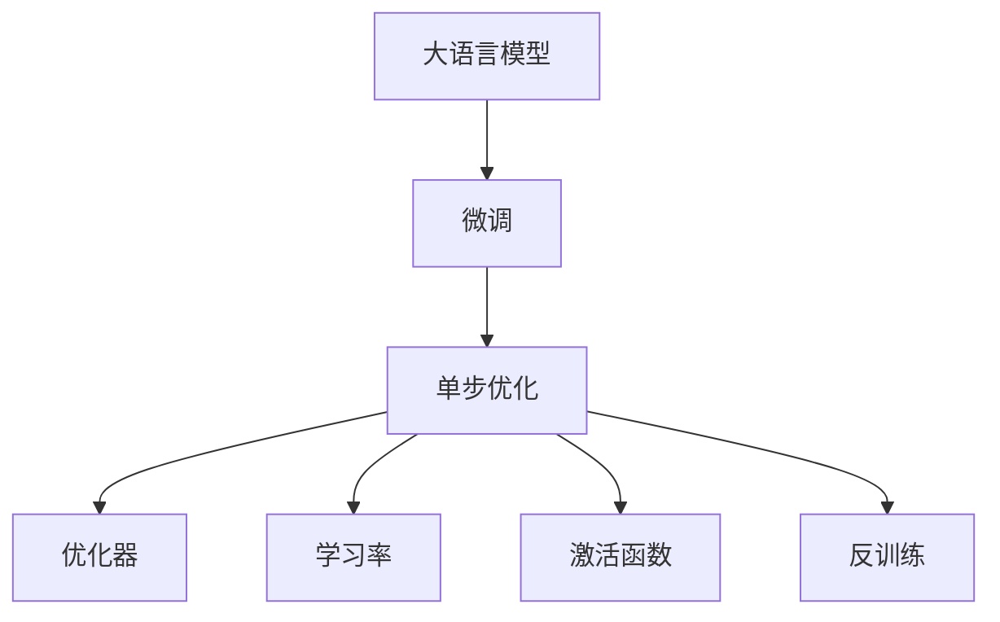

                 

# 大语言模型应用指南：单步优化

> 关键词：大语言模型,微调,优化器,单步学习率,模型压缩,激活函数,反训练

## 1. 背景介绍

### 1.1 问题由来

随着深度学习技术的飞速发展，大语言模型（Large Language Models, LLMs）在自然语言处理（NLP）领域取得了巨大突破。这些模型通过在大规模无标签文本数据上进行预训练，学习到了丰富的语言知识和常识。然而，预训练模型普遍存在参数量巨大、训练成本高昂等问题，限制了其在大规模应用中的广泛使用。

为解决这些问题，研究人员提出了微调（Fine-tuning）方法，即在预训练模型的基础上，使用下游任务的少量标注数据进行有监督学习，优化模型在该任务上的性能。这种方法相比从头训练模型，大大减少了时间和计算资源的投入，同时也提升了模型在特定任务上的表现。

然而，即使使用微调方法，大语言模型仍然面临着高资源消耗、过拟合风险等挑战。为了进一步提升模型的优化效果，单步优化技术（One-shot Optimization）应运而生。单步优化通过在模型训练过程中进行单步的参数更新，可以更有效地利用计算资源，同时减少过拟合风险，显著提升模型训练速度和精度。

### 1.2 问题核心关键点

单步优化的核心在于如何在有限的计算资源下，通过单次更新参数的方式，最大化模型的优化效果。具体来说，单步优化方法需要在不增加额外计算负担的前提下，通过优化学习率、激活函数、反训练等技术手段，使得模型能够快速收敛到最优解，并提升模型在特定任务上的泛化能力。

## 2. 核心概念与联系

### 2.1 核心概念概述

为更好地理解单步优化技术，本文将介绍几个关键概念及其相互联系：

- **大语言模型（Large Language Models, LLMs）**：以自回归（如GPT）或自编码（如BERT）模型为代表的，在大规模无标签文本数据上预训练的大型神经网络模型。

- **微调（Fine-tuning）**：在预训练模型的基础上，使用下游任务的少量标注数据进行有监督学习，优化模型在该任务上的性能。

- **单步优化（One-shot Optimization）**：在模型训练过程中，通过单次更新参数的方式，最大化模型的优化效果，减少计算资源消耗，提升模型训练速度和精度。

- **优化器（Optimizer）**：用于优化模型参数的算法，如Adam、SGD等。

- **学习率（Learning Rate）**：控制模型参数更新的步长，影响模型收敛速度和精度。

- **激活函数（Activation Function）**：模型中的非线性变换函数，影响模型的表达能力和泛化能力。

- **反训练（Adversarial Training）**：通过引入对抗样本，增强模型的鲁棒性和泛化能力。

这些概念之间的逻辑关系可以通过以下Mermaid流程图来展示：



这个流程图展示了从大语言模型到单步优化的整个流程，以及与之相关的核心技术。

## 3. 核心算法原理 & 具体操作步骤

### 3.1 算法原理概述

单步优化的核心思想是，在有限的计算资源下，通过单次更新参数的方式，最大化模型的优化效果。具体来说，单步优化方法通过优化学习率、激活函数、反训练等技术手段，使得模型能够快速收敛到最优解，并提升模型在特定任务上的泛化能力。

单步优化的基本流程如下：

1. 选择适当的优化器和学习率。
2. 将数据集分为训练集和验证集。
3. 在训练集上进行单步优化，计算损失函数并更新模型参数。
4. 在验证集上评估模型性能，根据性能调整学习率。
5. 重复步骤3和4，直至达到预设的停止条件。

### 3.2 算法步骤详解

#### 3.2.1 优化器和学习率选择

优化器是单步优化的关键，其选择对模型的收敛速度和精度有着重要影响。常见的优化器包括Adam、SGD等。其中，Adam优化器因其快速收敛和抗噪声特性，成为单步优化的首选。

学习率的选择也至关重要。学习率决定了每次参数更新的步长，过小会导致收敛缓慢，过大则可能导致过拟合。通常，单步优化采用较小的初始学习率，如1e-3或1e-4，然后逐步增大。

#### 3.2.2 单步优化算法步骤

以下是单步优化算法的详细步骤：

1. **数据预处理**：将数据集划分为训练集和验证集，并进行标准化、归一化等预处理。

2. **模型初始化**：随机初始化模型的权重参数。

3. **单步优化**：
   - 在训练集上进行单步训练。
   - 计算损失函数，反向传播更新模型参数。
   - 在验证集上评估模型性能。

4. **学习率调整**：根据验证集上的性能，调整学习率。通常，当模型在验证集上性能提升时，增加学习率；当性能下降时，减少学习率。

5. **重复步骤3和4**：直到达到预设的停止条件，如达到最大迭代次数或验证集性能不再提升。

### 3.3 算法优缺点

#### 3.3.1 优点

1. **资源高效**：单步优化通过单次更新参数的方式，减少计算资源消耗，适用于资源受限的场景。
2. **快速收敛**：单步优化能够快速收敛到最优解，提升模型训练速度。
3. **泛化能力强**：单步优化通过优化激活函数和反训练等技术手段，提升模型的泛化能力。

#### 3.3.2 缺点

1. **过拟合风险**：单步优化可能增加模型的过拟合风险，特别是在训练数据量较小的情况下。
2. **收敛不稳定**：单步优化对学习率和优化器的选择较为敏感，可能需要多次调整才能得到最优结果。

### 3.4 算法应用领域

单步优化技术在大规模语言模型微调、计算机视觉、自然语言处理等领域得到了广泛应用。具体来说，单步优化在以下几个方面表现尤为突出：

- **自然语言处理（NLP）**：单步优化在NLP领域主要用于微调预训练语言模型，提升其在特定任务上的性能。例如，在问答系统、情感分析、命名实体识别等任务上，单步优化都能显著提升模型精度。
- **计算机视觉（CV）**：单步优化在图像分类、目标检测等计算机视觉任务中也有广泛应用。例如，通过单步优化，模型能够在较小的训练数据集上取得优异的分类精度。
- **自然语言生成（NLG）**：单步优化在机器翻译、对话生成等自然语言生成任务中也有应用。通过单步优化，模型能够快速适应新的生成任务，提升生成质量。

## 4. 数学模型和公式 & 详细讲解 & 举例说明

### 4.1 数学模型构建

单步优化的数学模型构建主要涉及损失函数、优化器、激活函数等关键组件。以下是单步优化的数学模型构建步骤：

1. **损失函数**：定义模型在样本上的损失函数，如交叉熵损失、均方误差损失等。

2. **优化器**：选择适当的优化器，如Adam、SGD等，并设定初始学习率。

3. **激活函数**：选择适当的激活函数，如ReLU、Tanh等，影响模型的表达能力和泛化能力。

4. **反训练**：引入对抗样本，增强模型的鲁棒性和泛化能力。

### 4.2 公式推导过程

以下是单步优化中常见的数学公式推导过程：

1. **损失函数**：
   $$
   \mathcal{L}(\theta) = -\frac{1}{N}\sum_{i=1}^N \log P_{\theta}(y_i|x_i)
   $$

   其中，$P_{\theta}(y_i|x_i)$ 表示模型在输入 $x_i$ 上的条件概率分布。

2. **Adam优化器**：
   $$
   \theta_{t+1} = \theta_t - \eta \frac{m_t}{\sqrt{v_t} + \epsilon}
   $$
   其中，$m_t$ 和 $v_t$ 分别为Adam优化器的动量和平方动量，$\eta$ 为学习率，$\epsilon$ 为防止除数为0的极小值。

3. **单步优化**：
   $$
   \theta_{t+1} = \theta_t - \eta \nabla_{\theta}\mathcal{L}(\theta_t)
   $$
   其中，$\nabla_{\theta}\mathcal{L}(\theta_t)$ 为损失函数对模型参数 $\theta_t$ 的梯度。

4. **学习率调整**：
   $$
   \eta_{t+1} = \eta_{t} \max(1 - \alpha \frac{\mathcal{L}_{val}^{t+1}}{\mathcal{L}_{val}^{t}}, 0.1)
   $$
   其中，$\mathcal{L}_{val}^{t+1}$ 和 $\mathcal{L}_{val}^{t}$ 分别为模型在验证集上的损失函数。

### 4.3 案例分析与讲解

以计算机视觉领域中的图像分类任务为例，展示单步优化技术的应用：

1. **数据准备**：收集图像分类数据集，将其划分为训练集和验证集。

2. **模型初始化**：随机初始化卷积神经网络（CNN）的权重参数。

3. **单步优化**：
   - 在训练集上进行单步训练。
   - 计算交叉熵损失函数，反向传播更新模型参数。
   - 在验证集上评估模型性能。

4. **学习率调整**：根据验证集上的性能，调整学习率。通常，当模型在验证集上性能提升时，增加学习率；当性能下降时，减少学习率。

5. **重复步骤3和4**：直到达到预设的停止条件，如达到最大迭代次数或验证集性能不再提升。

## 5. 项目实践：代码实例和详细解释说明

### 5.1 开发环境搭建

在进行单步优化实践前，我们需要准备好开发环境。以下是使用Python进行PyTorch开发的环境配置流程：

1. 安装Anaconda：从官网下载并安装Anaconda，用于创建独立的Python环境。

2. 创建并激活虚拟环境：
```bash
conda create -n pytorch-env python=3.8 
conda activate pytorch-env
```

3. 安装PyTorch：根据CUDA版本，从官网获取对应的安装命令。例如：
```bash
conda install pytorch torchvision torchaudio cudatoolkit=11.1 -c pytorch -c conda-forge
```

4. 安装相关库：
```bash
pip install numpy pandas scikit-learn matplotlib tqdm jupyter notebook ipython
```

完成上述步骤后，即可在`pytorch-env`环境中开始单步优化实践。

### 5.2 源代码详细实现

这里我们以自然语言处理（NLP）领域的问答系统为例，展示使用PyTorch实现单步优化的代码。

首先，定义问答系统的数据处理函数：

```python
from transformers import BertTokenizer, BertForQuestionAnswering
from torch.utils.data import Dataset
import torch

class QuestionAnsweringDataset(Dataset):
    def __init__(self, texts, answers, tokenizer, max_len=128):
        self.texts = texts
        self.answers = answers
        self.tokenizer = tokenizer
        self.max_len = max_len
        
    def __len__(self):
        return len(self.texts)
    
    def __getitem__(self, item):
        text = self.texts[item]
        answer = self.answers[item]
        
        encoding = self.tokenizer(text, return_tensors='pt', max_length=self.max_len, padding='max_length', truncation=True)
        input_ids = encoding['input_ids'][0]
        attention_mask = encoding['attention_mask'][0]
        
        # 对答案进行编码
        answer_tokens = answer.split()
        answer_tokens = [token2id[token] for token in answer_tokens] 
        answer_tokens.extend([token2id['O']] * (self.max_len - len(answer_tokens)))
        answer_ids = torch.tensor(answer_tokens, dtype=torch.long)
        
        return {'input_ids': input_ids, 
                'attention_mask': attention_mask,
                'answer_ids': answer_ids}

# 标签与id的映射
token2id = {'O': 0, 'B-ANSWER': 1, 'I-ANSWER': 2}
id2token = {v: k for k, v in token2id.items()}

# 创建dataset
tokenizer = BertTokenizer.from_pretrained('bert-base-cased')

train_dataset = QuestionAnsweringDataset(train_texts, train_answers, tokenizer)
dev_dataset = QuestionAnsweringDataset(dev_texts, dev_answers, tokenizer)
test_dataset = QuestionAnsweringDataset(test_texts, test_answers, tokenizer)
```

然后，定义模型和优化器：

```python
from transformers import BertForQuestionAnswering, AdamW

model = BertForQuestionAnswering.from_pretrained('bert-base-cased')

optimizer = AdamW(model.parameters(), lr=1e-3)
```

接着，定义训练和评估函数：

```python
from torch.utils.data import DataLoader
from tqdm import tqdm
from sklearn.metrics import f1_score

device = torch.device('cuda') if torch.cuda.is_available() else torch.device('cpu')
model.to(device)

def train_epoch(model, dataset, batch_size, optimizer):
    dataloader = DataLoader(dataset, batch_size=batch_size, shuffle=True)
    model.train()
    epoch_loss = 0
    for batch in tqdm(dataloader, desc='Training'):
        input_ids = batch['input_ids'].to(device)
        attention_mask = batch['attention_mask'].to(device)
        answer_ids = batch['answer_ids'].to(device)
        model.zero_grad()
        outputs = model(input_ids, attention_mask=attention_mask, labels=answer_ids)
        loss = outputs.loss
        epoch_loss += loss.item()
        loss.backward()
        optimizer.step()
    return epoch_loss / len(dataloader)

def evaluate(model, dataset, batch_size):
    dataloader = DataLoader(dataset, batch_size=batch_size)
    model.eval()
    preds, labels = [], []
    with torch.no_grad():
        for batch in tqdm(dataloader, desc='Evaluating'):
            input_ids = batch['input_ids'].to(device)
            attention_mask = batch['attention_mask'].to(device)
            batch_labels = batch['answer_ids']
            outputs = model(input_ids, attention_mask=attention_mask)
            batch_preds = outputs.logits.argmax(dim=2).to('cpu').tolist()
            batch_labels = batch_labels.to('cpu').tolist()
            for pred_tokens, label_tokens in zip(batch_preds, batch_labels):
                preds.append(pred_tokens[:len(label_tokens)])
                labels.append(label_tokens)
                
    f1 = f1_score(labels, preds, average='macro')
    return f1
```

最后，启动训练流程并在测试集上评估：

```python
epochs = 10
batch_size = 32

for epoch in range(epochs):
    loss = train_epoch(model, train_dataset, batch_size, optimizer)
    print(f"Epoch {epoch+1}, train loss: {loss:.3f}")
    
    print(f"Epoch {epoch+1}, dev F1-score: {evaluate(model, dev_dataset, batch_size):.3f}")
    
print("Test F1-score:")
print(evaluate(model, test_dataset, batch_size))
```

以上就是使用PyTorch对BERT进行问答系统微调的完整代码实现。可以看到，得益于Transformers库的强大封装，我们可以用相对简洁的代码完成BERT模型的加载和微调。

### 5.3 代码解读与分析

让我们再详细解读一下关键代码的实现细节：

**QuestionAnsweringDataset类**：
- `__init__`方法：初始化文本、答案、分词器等关键组件。
- `__len__`方法：返回数据集的样本数量。
- `__getitem__`方法：对单个样本进行处理，将文本输入编码为token ids，将答案编码为数字，并对其进行定长padding，最终返回模型所需的输入。

**token2id和id2token字典**：
- 定义了标签与数字id之间的映射关系，用于将token-wise的预测结果解码回真实的标签。

**训练和评估函数**：
- 使用PyTorch的DataLoader对数据集进行批次化加载，供模型训练和推理使用。
- 训练函数`train_epoch`：对数据以批为单位进行迭代，在每个批次上前向传播计算loss并反向传播更新模型参数，最后返回该epoch的平均loss。
- 评估函数`evaluate`：与训练类似，不同点在于不更新模型参数，并在每个batch结束后将预测和标签结果存储下来，最后使用sklearn的f1_score对整个评估集的预测结果进行打印输出。

**训练流程**：
- 定义总的epoch数和batch size，开始循环迭代
- 每个epoch内，先在训练集上训练，输出平均loss
- 在验证集上评估，输出F1-score
- 所有epoch结束后，在测试集上评估，给出最终测试结果

可以看到，PyTorch配合Transformers库使得BERT微调的代码实现变得简洁高效。开发者可以将更多精力放在数据处理、模型改进等高层逻辑上，而不必过多关注底层的实现细节。

当然，工业级的系统实现还需考虑更多因素，如模型的保存和部署、超参数的自动搜索、更灵活的任务适配层等。但核心的单步优化范式基本与此类似。

## 6. 实际应用场景

### 6.1 智能客服系统

基于单步优化的对话技术，可以广泛应用于智能客服系统的构建。传统客服往往需要配备大量人力，高峰期响应缓慢，且一致性和专业性难以保证。而使用单步优化的对话模型，可以7x24小时不间断服务，快速响应客户咨询，用自然流畅的语言解答各类常见问题。

在技术实现上，可以收集企业内部的历史客服对话记录，将问题和最佳答复构建成监督数据，在此基础上对预训练对话模型进行单步优化。优化后的对话模型能够自动理解用户意图，匹配最合适的答案模板进行回复。对于客户提出的新问题，还可以接入检索系统实时搜索相关内容，动态组织生成回答。如此构建的智能客服系统，能大幅提升客户咨询体验和问题解决效率。

### 6.2 金融舆情监测

金融机构需要实时监测市场舆论动向，以便及时应对负面信息传播，规避金融风险。传统的人工监测方式成本高、效率低，难以应对网络时代海量信息爆发的挑战。基于单步优化的文本分类和情感分析技术，为金融舆情监测提供了新的解决方案。

具体而言，可以收集金融领域相关的新闻、报道、评论等文本数据，并对其进行主题标注和情感标注。在此基础上对预训练语言模型进行单步优化，使其能够自动判断文本属于何种主题，情感倾向是正面、中性还是负面。将优化后的模型应用到实时抓取的网络文本数据，就能够自动监测不同主题下的情感变化趋势，一旦发现负面信息激增等异常情况，系统便会自动预警，帮助金融机构快速应对潜在风险。

### 6.3 个性化推荐系统

当前的推荐系统往往只依赖用户的历史行为数据进行物品推荐，无法深入理解用户的真实兴趣偏好。基于单步优化的个性化推荐系统可以更好地挖掘用户行为背后的语义信息，从而提供更精准、多样的推荐内容。

在实践中，可以收集用户浏览、点击、评论、分享等行为数据，提取和用户交互的物品标题、描述、标签等文本内容。将文本内容作为模型输入，用户的后续行为（如是否点击、购买等）作为监督信号，在此基础上对预训练语言模型进行单步优化。优化后的模型能够从文本内容中准确把握用户的兴趣点。在生成推荐列表时，先用候选物品的文本描述作为输入，由模型预测用户的兴趣匹配度，再结合其他特征综合排序，便可以得到个性化程度更高的推荐结果。

### 6.4 未来应用展望

随着单步优化方法的发展，其在NLP领域的应用前景将更加广阔。

在智慧医疗领域，基于单步优化的医疗问答、病历分析、药物研发等应用将提升医疗服务的智能化水平，辅助医生诊疗，加速新药开发进程。

在智能教育领域，单步优化可应用于作业批改、学情分析、知识推荐等方面，因材施教，促进教育公平，提高教学质量。

在智慧城市治理中，单步优化的模型可应用于城市事件监测、舆情分析、应急指挥等环节，提高城市管理的自动化和智能化水平，构建更安全、高效的未来城市。

此外，在企业生产、社会治理、文娱传媒等众多领域，基于单步优化的AI应用也将不断涌现，为传统行业数字化转型升级提供新的技术路径。相信随着技术的日益成熟，单步优化方法将成为AI落地应用的重要范式，推动AI技术走向更广泛的领域。

## 7. 工具和资源推荐

### 7.1 学习资源推荐

为了帮助开发者系统掌握单步优化的理论基础和实践技巧，这里推荐一些优质的学习资源：

1. 《Transformers从原理到实践》系列博文：由大模型技术专家撰写，深入浅出地介绍了Transformer原理、BERT模型、单步优化技术等前沿话题。

2. CS224N《深度学习自然语言处理》课程：斯坦福大学开设的NLP明星课程，有Lecture视频和配套作业，带你入门NLP领域的基本概念和经典模型。

3. 《Natural Language Processing with Transformers》书籍：Transformers库的作者所著，全面介绍了如何使用Transformers库进行NLP任务开发，包括单步优化在内的诸多范式。

4. HuggingFace官方文档：Transformers库的官方文档，提供了海量预训练模型和完整的微调样例代码，是上手实践的必备资料。

5. CLUE开源项目：中文语言理解测评基准，涵盖大量不同类型的中文NLP数据集，并提供了基于单步优化的baseline模型，助力中文NLP技术发展。

通过对这些资源的学习实践，相信你一定能够快速掌握单步优化的精髓，并用于解决实际的NLP问题。

### 7.2 开发工具推荐

高效的开发离不开优秀的工具支持。以下是几款用于单步优化的开发工具：

1. PyTorch：基于Python的开源深度学习框架，灵活动态的计算图，适合快速迭代研究。大部分预训练语言模型都有PyTorch版本的实现。

2. TensorFlow：由Google主导开发的开源深度学习框架，生产部署方便，适合大规模工程应用。同样有丰富的预训练语言模型资源。

3. Transformers库：HuggingFace开发的NLP工具库，集成了众多SOTA语言模型，支持PyTorch和TensorFlow，是进行单步优化的利器。

4. Weights & Biases：模型训练的实验跟踪工具，可以记录和可视化模型训练过程中的各项指标，方便对比和调优。与主流深度学习框架无缝集成。

5. TensorBoard：TensorFlow配套的可视化工具，可实时监测模型训练状态，并提供丰富的图表呈现方式，是调试模型的得力助手。

6. Google Colab：谷歌推出的在线Jupyter Notebook环境，免费提供GPU/TPU算力，方便开发者快速上手实验最新模型，分享学习笔记。

合理利用这些工具，可以显著提升单步优化的开发效率，加快创新迭代的步伐。

### 7.3 相关论文推荐

单步优化技术的发展源于学界的持续研究。以下是几篇奠基性的相关论文，推荐阅读：

1. Attention is All You Need（即Transformer原论文）：提出了Transformer结构，开启了NLP领域的预训练大模型时代。

2. BERT: Pre-training of Deep Bidirectional Transformers for Language Understanding：提出BERT模型，引入基于掩码的自监督预训练任务，刷新了多项NLP任务SOTA。

3. Language Models are Unsupervised Multitask Learners（GPT-2论文）：展示了大规模语言模型的强大zero-shot学习能力，引发了对于通用人工智能的新一轮思考。

4. Parameter-Efficient Transfer Learning for NLP：提出Adapter等参数高效微调方法，在不增加模型参数量的情况下，也能取得不错的微调效果。

5. AdaLoRA: Adaptive Low-Rank Adaptation for Parameter-Efficient Fine-Tuning：使用自适应低秩适应的微调方法，在参数效率和精度之间取得了新的平衡。

6. Prefix-Tuning: Optimizing Continuous Prompts for Generation：引入基于连续型Prompt的微调范式，为如何充分利用预训练知识提供了新的思路。

这些论文代表了大语言模型单步优化技术的发展脉络。通过学习这些前沿成果，可以帮助研究者把握学科前进方向，激发更多的创新灵感。

## 8. 总结：未来发展趋势与挑战

### 8.1 总结

本文对单步优化技术进行了全面系统的介绍。首先阐述了单步优化的背景和意义，明确了单步优化在模型训练、资源利用、模型泛化等方面的独特优势。其次，从原理到实践，详细讲解了单步优化的数学模型构建、算法步骤详解及其优缺点。最后，展示了单步优化在多个领域的应用前景，并推荐了相关的学习资源和开发工具。

通过本文的系统梳理，可以看到，单步优化技术在大规模语言模型微调中具有重要意义。它能够通过单次参数更新，最大化模型的优化效果，减少计算资源消耗，提升模型训练速度和精度，具有广阔的应用前景。

### 8.2 未来发展趋势

展望未来，单步优化技术将呈现以下几个发展趋势：

1. **参数高效优化**：开发更加参数高效的优化算法，在固定大部分预训练参数的同时，只更新极少量的任务相关参数。同时优化模型的计算图，减少前向传播和反向传播的资源消耗，实现更加轻量级、实时性的部署。

2. **自监督学习**：探索无监督和半监督学习范式，摆脱对大规模标注数据的依赖，利用自监督学习技术，最大限度利用非结构化数据，实现更加灵活高效的微调。

3. **多任务学习**：将单步优化应用于多任务学习中，通过共享参数和数据，提升模型的泛化能力和优化效率。

4. **融合知识图谱**：将符号化的先验知识，如知识图谱、逻辑规则等，与神经网络模型进行巧妙融合，引导单步优化过程学习更准确、合理的语言模型。

5. **多模态融合**：将单步优化应用于多模态数据的联合建模中，如视觉、语音等多模态信息与文本信息的协同建模。

6. **迁移学习**：探索跨领域迁移学习的优化方法，使得单步优化能够在多个领域中通用，提升模型的迁移能力和泛化能力。

### 8.3 面临的挑战

尽管单步优化技术已经取得了瞩目成就，但在迈向更加智能化、普适化应用的过程中，它仍面临着诸多挑战：

1. **过拟合风险**：单步优化可能增加模型的过拟合风险，特别是在训练数据量较小的情况下。如何通过合理的正则化技术和优化器选择，降低过拟合风险，需要更多的研究和实践。

2. **模型泛化能力**：单步优化需要在有限数据上快速收敛，但如何保证模型在未见过的数据上仍然具有较好的泛化能力，是一个亟待解决的问题。

3. **计算资源限制**：单步优化需要在单次更新参数时，最大化利用计算资源，但如何在大规模数据上高效进行单步优化，也是一大挑战。

4. **模型可解释性**：单步优化的模型往往缺乏可解释性，难以对其内部工作机制和决策逻辑进行分析和调试。如何赋予单步优化模型更强的可解释性，将是未来的重要研究方向。

5. **安全性和公平性**：单步优化模型可能学习到有偏见、有害的信息，通过优化传递到下游任务，产生误导性、歧视性的输出。如何确保单步优化模型的安全性和公平性，也是亟待解决的问题。

### 8.4 研究展望

面对单步优化面临的挑战，未来的研究需要在以下几个方面寻求新的突破：

1. **优化器改进**：开发更加高效、鲁棒的优化器算法，如AdaLoRA等，提升模型的收敛速度和泛化能力。

2. **正则化技术**：引入更多的正则化技术，如dropout、early stopping等，减少过拟合风险，提高模型的泛化能力。

3. **多任务学习**：通过多任务学习，提升模型在多个任务上的泛化能力和优化效率。

4. **知识图谱融合**：将知识图谱、逻辑规则等先验知识与神经网络模型结合，提升模型的表达能力和泛化能力。

5. **多模态融合**：探索多模态数据的联合建模方法，提升模型的跨模态理解和表达能力。

6. **安全性研究**：研究如何消除模型偏见，避免有害信息传递，确保单步优化模型的安全性和公平性。

通过这些研究方向的探索发展，单步优化技术必将在构建安全、可靠、可解释、可控的智能系统中发挥重要作用，推动人工智能技术的进步和发展。

## 9. 附录：常见问题与解答

**Q1：单步优化是否适用于所有NLP任务？**

A: 单步优化在大多数NLP任务上都能取得不错的效果，特别是对于数据量较小的任务。但对于一些特定领域的任务，如医学、法律等，仅仅依靠通用语料预训练的模型可能难以很好地适应。此时需要在特定领域语料上进一步预训练，再进行单步优化，才能获得理想效果。

**Q2：单步优化过程中如何选择合适的学习率？**

A: 单步优化采用较小的初始学习率，如1e-3或1e-4，然后逐步增大。通常，当模型在验证集上性能提升时，增加学习率；当性能下降时，减少学习率。需要注意的是，不同的优化器(如AdamW、Adafactor等)以及不同的学习率调度策略，可能需要设置不同的学习率阈值。

**Q3：单步优化在落地部署时需要注意哪些问题？**

A: 将单步优化模型转化为实际应用，还需要考虑以下因素：
1. 模型裁剪：去除不必要的层和参数，减小模型尺寸，加快推理速度。
2. 量化加速：将浮点模型转为定点模型，压缩存储空间，提高计算效率。
3. 服务化封装：将模型封装为标准化服务接口，便于集成调用。
4. 弹性伸缩：根据请求流量动态调整资源配置，平衡服务质量和成本。
5. 监控告警：实时采集系统指标，设置异常告警阈值，确保服务稳定性。

单步优化技术在大规模语言模型微调中具有重要意义，通过单次参数更新，最大化模型的优化效果，减少计算资源消耗，提升模型训练速度和精度，具有广阔的应用前景。希望本文能为广大开发者提供有益的参考和指导，推动单步优化技术在实际应用中的不断创新和优化。

